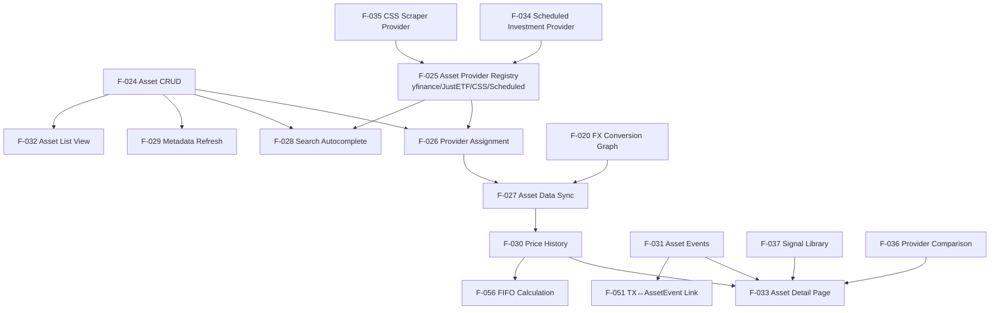

# Asset Feature Connections

> Dependencies and relationships between Asset domain features.
> See [[connections/dependency-graph]] for the full project view.

---

## Dependency Graph

---

## Key Dependency Chains

- **Price chain**: F-024 (create asset) → F-026 (assign provider) → F-027 (sync) → F-030 (stored) → F-033 (displayed)
- **Event chain**: F-027 sync run → provider emits events → F-031 stored → displayed as markers in F-033 chart → linked to transactions via F-051
- **Search-to-create**: F-028 (search providers in parallel) → auto-fills F-024 create form + auto-suggests F-026 provider assignment
- **Scheduled investment**: F-034 is both an asset type AND a provider — it generates synthetic price series from a schedule definition

---

## Cross-Layer Handoffs

| Backend | Interface | Frontend |
|---------|-----------|----------|
| [[F-025]] Provider list | `GET /api/v1/assets/provider/list` | [[F-026]] Provider Assignment Section |
| [[F-025]] Provider search | `GET /api/v1/assets/provider/search` | [[F-028]] Search Autocomplete |
| [[F-024]] Asset CRUD | `GET/POST/PATCH/DELETE /api/v1/assets` | [[F-032]] List, [[F-033]] Detail |
| [[F-027]] Sync | `POST /api/v1/assets/{id}/sync` | [[F-033]] Detail page sync button |
| [[F-029]] Metadata refresh | `POST /api/v1/assets/{id}/metadata/refresh` | [[F-033]] Detail page |
| [[F-030]] Price history | `GET /api/v1/assets/{id}/prices` | [[F-033]] Chart data |
| [[F-031]] Events | `GET /api/v1/assets/{id}/events` | [[F-033]] Event markers |
| [[F-036]] Provider comparison | `GET /api/v1/assets/{id}/provider/compare` | [[F-036]] Comparison modal |

---

## Provider Registry — Auto-Discovery

All asset providers use the **Provider Registry Pattern** ([[F-059]]): decorated with `@register_provider(AssetProviderRegistry)`, auto-discovered at startup, no manual registration needed. `params_schema` property drives dynamic forms in [[F-026]].

| Provider | Code | Has search | Has params_schema |
|----------|------|-----------|------------------|
| yfinance | `yahoo_finance` | ✅ | ❌ |
| JustETF | `justetf` | ✅ | ❌ |
| CSS Scraper | `css_scraper` | ❌ | ✅ (url, css_selector, currency) |
| Scheduled Investment | `scheduled_investment` | ❌ | ✅ (complex schedule schema) |
| mockprov | `mockprov` | ✅ | ❌ (test only, hidden from UI) |

---

## mkdocs Coverage

| Feature | mkdocs page |
|---------|------------|
| [[F-024]] Asset CRUD | `mkdocs_src/docs/user/assets/index.en.md` ✅ |
| [[F-024]] Create/Edit | `mkdocs_src/docs/user/assets/create-edit.en.md` ✅ |
| [[F-025]] Providers | `mkdocs_src/docs/user/assets/providers/` ✅ |
| [[F-033]] Detail | `mkdocs_src/docs/user/assets/detail/` (partial) |
| [[F-026]]-[[F-031]], [[F-034]]-[[F-036]] | ❌ Not yet documented |

## Key source files

| Role | Path |
|------|------|
| Asset API | `backend/app/api/v1/assets.py` |
| Asset service / abstract base | `backend/app/services/asset_source.py` |
| DB model (Asset, PriceHistory, AssetEvent) | `backend/app/db/models.py` |
| Asset pages | `frontend/src/routes/(app)/assets/` |
| Asset components | `frontend/src/lib/components/assets/` |
| mkdocs | `mkdocs_src/docs/developer/backend/assets/architecture.md` |
