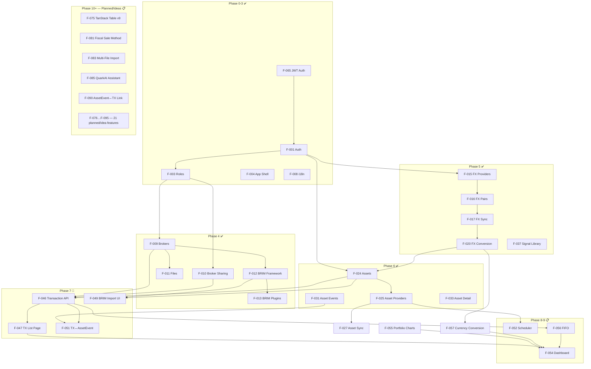

# Dependency Graph — Full Project

> Cross-domain view of feature dependencies. Shows which features must exist before others can be built.
> Read [[features/registry]] for feature descriptions.
> Last updated: 2026-05-13
> F-075–F-095 range (21 planned/idea features) is now tracked in the registry. Inverse `enables:` links from their dependencies have been populated.

---

## Top-Level Phase Dependencies



---

## Critical Dependency Chains

### Auth → Everything
`F-065 JWT` → `F-001 Auth` → `F-003 Roles` → all domain features

All API endpoints are auth-protected. Role (admin/user) gates admin features.
Broker sharing role (Owner/Editor/Viewer) gates transaction write access.

### FX → Assets → Transactions → Dashboard
```
F-015 FX Providers → F-016 FX Pairs → F-017 Sync → F-020 Conversion Graph
                                                         ↓
F-024 Asset CRUD → F-025 Providers → F-027 Sync → F-030 Price History
                                                         ↓
F-046 Transaction API → F-056 FIFO → F-058 ROI → F-054 Dashboard
```

### BRIM → Transactions
```
F-012 BRIM Framework → F-013 Plugins → F-049 BRIM Import UI
                                            ↓
                    F-046 TX API (commit) → F-047 TX List Page
```

### Asset Events cross-dependency
```
F-031 Asset Events ←─── Phase 6 (DIVIDEND, SPLIT recorded)
         ↓
F-051 TX↔AssetEvent Link ─── Phase 7 (link transactions to events)
         ↓
F-054 Dashboard (accurate income tracking)
```

---

## Cross-Layer Handoffs (Backend → Frontend)

| Backend Feature | Interface | Frontend Feature |
|----------------|-----------|-----------------|
| [[F-015]] FX Providers | `GET /api/v1/fx/providers` | [[F-016]] FX Pair Add Modal |
| [[F-017]] FX Rate Sync | `POST /api/v1/fx/sync` | [[F-021]] FX List → sync button |
| [[F-020]] FX Conversion | `GET /api/v1/fx/conversion-route` | [[F-057]] used in Asset prices |
| [[F-025]] Asset Providers | `GET /api/v1/assets/provider/list` | [[F-026]] Provider Assignment form |
| [[F-027]] Asset Sync | `POST /api/v1/assets/{id}/sync` | [[F-033]] Asset Detail → sync |
| [[F-031]] Asset Events | `GET /api/v1/assets/{id}/events` | [[F-033]] Event markers on chart |
| [[F-046]] TX Bulk API | `POST /api/v1/transactions/bulk` | [[F-048]] Staging Modal commit |
| [[F-013]] BRIM Plugins | `POST /api/v1/brokers/import/files/{id}/parse` | [[F-049]] BRIM Import UI |
| [[F-056]] FIFO | (embedded in portfolio endpoint) | [[F-054]] Dashboard KPI |
| [[F-052]] Scheduler | `GET/POST /api/v1/settings/global` | [[F-053]] Scheduler Settings UI |

## Key source files

| Role | Path |
|------|------|
| Feature registry | `LibreFolio_devWiki/wiki/features/registry.md` |
| All API endpoints | `backend/app/api/v1/` |
| All services | `backend/app/services/` |
| All frontend routes | `frontend/src/routes/(app)/` |
