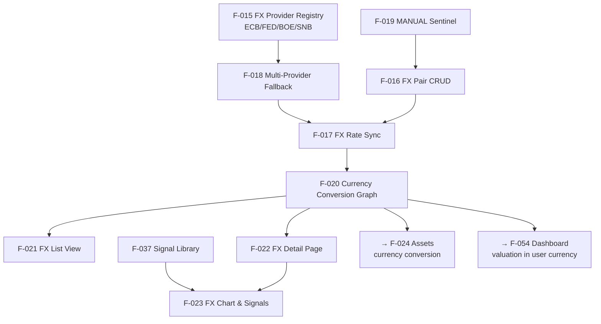

# FX Feature Connections

> Dependencies and relationships between FX domain features.
> See [[connections/dependency-graph]] for the full project view.

---

## Dependency Graph

---

## Key Dependency Chains

- **Rate availability chain**: F-015 → F-018 → F-017 → F-020 → (all currency conversions in app)
- **MANUAL sentinel chain**: Adding a pair with no real provider → F-019 auto-inserts MANUAL (priority 999). Adding a real provider → F-019 auto-removes MANUAL.
- **Triangulation**: If EUR/USD and USD/JPY exist, EUR/JPY can be computed via F-020 without a direct pair.

---

## Cross-Layer Handoffs

| Backend | Interface | Frontend |
|---------|-----------|----------|
| [[F-015]] Provider list | `GET /api/v1/fx/providers` | [[F-016]] Add pair modal (provider selector) |
| [[F-016]] Pair CRUD | `GET/POST/DELETE /api/v1/fx/pairs` | [[F-021]] FX List, [[F-022]] FX Detail |
| [[F-017]] Sync trigger | `POST /api/v1/fx/sync` | [[F-021]] Sync button |
| [[F-018]] Fallback logic | (transparent, server-side) | [[F-017]] transparently improves reliability |
| [[F-019]] MANUAL sentinel | (auto-managed, hidden from API list) | n/a — invisible to UI |
| [[F-020]] Conversion route | `GET /api/v1/fx/conversion-route/{base}/{quote}` | [[F-022]] Detail page shows route |
| [[F-023]] Chart data | `GET /api/v1/fx/pairs/{id}/history` | [[F-022]] rate history chart |

---

## mkdocs Coverage

| Feature | mkdocs page |
|---------|------------|
| [[F-016]] FX Pair CRUD | `mkdocs_src/docs/user/fx/add-pair.en.md` ✅ |
| [[F-017]] FX Rate Sync | `mkdocs_src/docs/user/fx/sync.en.md` ✅ |
| [[F-021]] FX List View | `mkdocs_src/docs/user/fx/index.en.md` ✅ |
| [[F-023]] Chart Settings | `mkdocs_src/docs/user/fx/chart-settings.en.md` ✅ |
| [[F-022]] FX Detail | `mkdocs_src/docs/user/fx/detail/` (partial) |
| [[F-015]], [[F-018]], [[F-019]], [[F-020]] | ❌ Not yet documented |

---

## Notable Design Decisions

- **Why MANUAL is a sentinel and not a real provider**: see [[decisions/manual-fx-sentinel]]
- **Why FX rates are stored per-day (one record/day)**: same policy as asset prices — see [[concepts/daily-point-policy]]
- **Why conversion uses a graph not direct pairs**: triangulation avoids combinatorial explosion — see [[F-020]]

## Key source files

| Role | Path |
|------|------|
| FX API | `backend/app/api/v1/fx.py` |
| FX service / abstract base | `backend/app/services/fx.py` |
| FX providers | `backend/app/services/fx_providers/` |
| DB model (FxRate, FxConversionRoute) | `backend/app/db/models.py` |
| FX pages | `frontend/src/routes/(app)/fx/` |
| FX components | `frontend/src/lib/components/fx/` |
| mkdocs | `mkdocs_src/docs/developer/backend/fx/architecture.md` |
