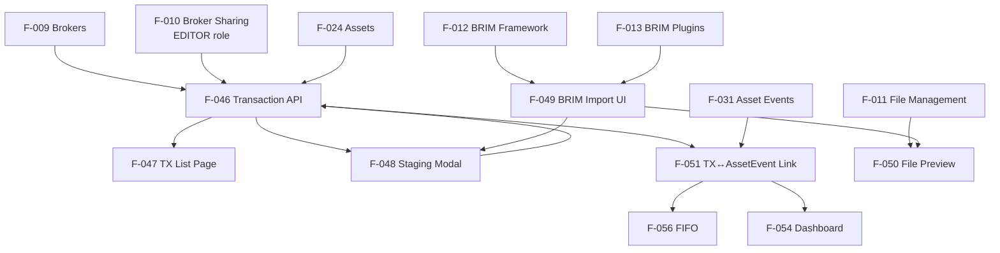

# Transaction Feature Connections

> Status: Phase 7 — in progress (Part 1✅, Part 2✅, Part 3–5 TODO)
> See [[connections/dependency-graph]] for the full project view.

---

## Dependency Graph

---

## Phase 7 Gap Analysis (from plan)

| # | Gap | Status | Blocking |
|---|-----|--------|---------|
| 1 | `Transaction ↔ AssetEvent` link absent | F-051 planned | Smart assistant, income tracking |
| 2 | Access control for GET/PATCH/DELETE not broker-filtered | F-046 in-progress | Security |
| 3 | BRIM no `plugin_version` for cache invalidation | F-013 planned | Re-parse detection |
| 4 | Frontend `/transactions` is placeholder | F-047 in-progress | User-facing |
| 5 | No unified Staging Area | F-048 planned | Core UX |
| 6 | BRIM no metadata UI for preview columns | F-013 planned | F-049 dynamic rendering |
| 7 | Bulk TX not atomic per-broker | F-046 planned | Data integrity |

---

## Cross-Layer Handoffs

| Backend | Interface | Frontend |
|---------|-----------|----------|
| [[F-046]] TX Bulk API | `POST /api/v1/transactions/bulk` | [[F-048]] Staging Modal commit |
| [[F-046]] TX List | `GET /api/v1/transactions` | [[F-047]] Transaction List Page |
| [[F-013]] BRIM parse | `POST /api/v1/brokers/import/files/{id}/parse` | [[F-049]] BRIM Import UI |
| [[F-013]] Last parse cache | `GET /api/v1/brokers/import/files/{id}/last-parse` | [[F-049]] Re-open Staging |
| [[F-050]] File preview | `GET /api/v1/uploads/{id}/preview` (planned) | [[F-050]] Inline preview |
| [[F-051]] Event link | embedded in TX response | [[F-047]] event indicators |

---

## Transaction Types (from V1 design, still current)

| Type | Quantity effect | Cash effect |
|------|---------------|-------------|
| `BUY` | ↑ | ↓ (BUY_SPEND) |
| `SELL` | ↓ | ↑ (SALE_PROCEEDS) |
| `DIVIDEND` | — | ↑ |
| `INTEREST` | — | ↑ |
| `TRANSFER_IN` / `TRANSFER_OUT` | ↑/↓ | — |
| `FEE` / `TAX` | — | ↓ |
| `SPLIT` | adjusted | — |

---

## Notes

- **Cash movements are auto-generated** from transactions that impact cash (not a separate user action)
- **FIFO** ([[F-056]]) requires accurate transaction history to compute cost basis on-demand
- **Phase 7 deliberately excludes** fiscal regimes (FIFO/LIFO/PMC), cash split, over-sell protection — deferred to Phase 8+

## Key source files

| Role | Path |
|------|------|
| Transaction API | `backend/app/api/v1/transactions.py` |
| Transaction service | `backend/app/services/transaction_service.py` |
| DB model (Transaction) | `backend/app/db/models.py` |
| Transaction pages | `frontend/src/routes/(app)/transactions/` |
| BRIM abstract base | `backend/app/services/brim_provider.py` |
