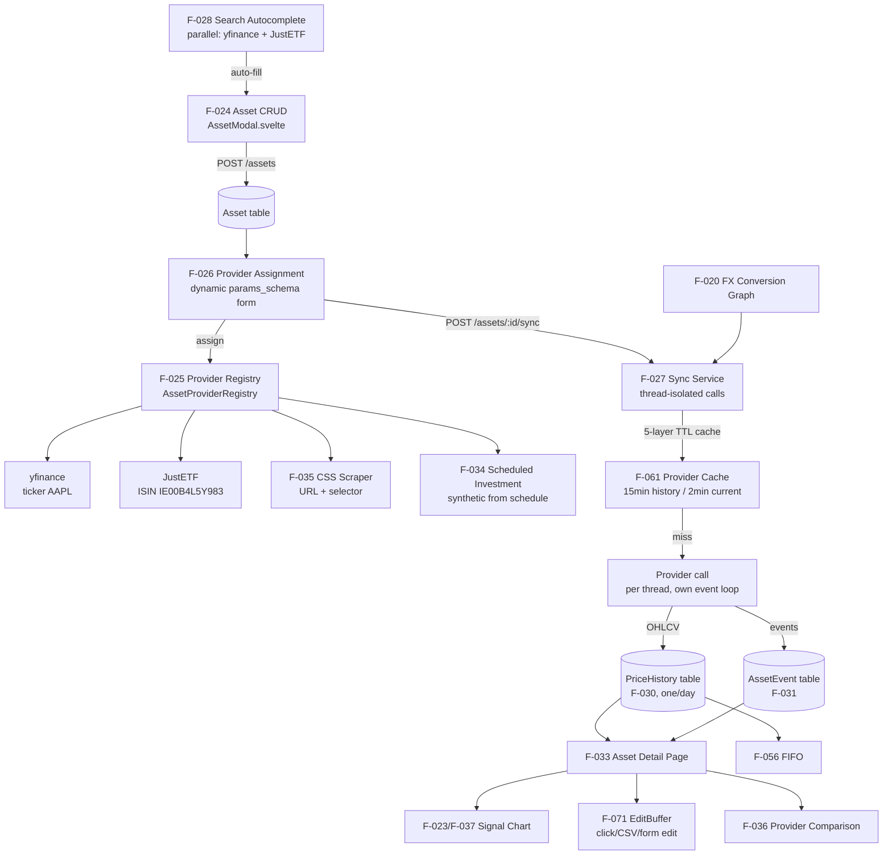

# Domain: ASSETS

> LibreFolio's financial instrument catalog — track any asset across a dozen types, fetch prices from multiple providers, and analyse performance with charts and technical signals.

## What it does

An asset in LibreFolio is a financial instrument: a stock, ETF, bond, crypto, commodity, fund, or structured product. Users create assets by searching a multi-provider autocomplete (yfinance and JustETF searched in parallel) that auto-fills the name, currency, type, and sector — or by entering details manually. Once created, a data provider is assigned: yfinance (ticker-based), JustETF (ISIN-based), CSS Scraper (arbitrary web page), or Scheduled Investment (for loans and structured products with predefined payment schedules). The provider assignment form is dynamically rendered from each provider's `params_schema` — no hardcoded UI for each provider type.

Price sync fetches OHLCV data (open, high, low, close, volume) and stores it one record per day. The 5-layer cache system prevents redundant provider calls: a 15-minute cache for history fetches, a 2-minute cache for current price (supporting frontend polling without hammering providers), and separate caches for metadata and search results. Thread isolation ensures sync calls never block the FastAPI event loop — each provider call runs in a dedicated thread with its own event loop, allowing providers to use synchronous I/O libraries directly.

The asset detail page is the richest view in LibreFolio: a full price history chart with the complete signal overlay system (EMA, RSI, MACD, Bollinger, FX pair comparison, asset comparison, benchmarks, measure tool), an inline data editor for adding/correcting prices and events via click, CSV, or form, a provider comparison modal showing differences between provider data and stored data, and a metadata refresh button. Asset events — dividends, splits, interest payments — are displayed as markers on the chart and will be linked to transactions once Phase 7's event-transaction link is complete.

## Feature cluster

| Code | Feature | Layer | Role in domain | Status |
|------|---------|-------|----------------|--------|
| [[F-024]] | Asset CRUD | fullstack | core — create/list/edit/delete assets | implemented |
| [[F-025]] | Asset Provider Registry (yfinance, JustETF, CSS Scraper, Scheduled Investment) | backend | core — auto-discovered provider plugins | implemented |
| [[F-026]] | Asset Provider Assignment (dynamic params form) | fullstack | core — assign provider with dynamic config form | implemented |
| [[F-027]] | Asset Data Sync (price fetch from providers) | fullstack | core — fetch and store OHLCV from providers | implemented |
| [[F-028]] | Asset Search Autocomplete (multi-provider parallel) | frontend | support — parallel search across providers in add modal | implemented |
| [[F-029]] | Asset Metadata Refresh | fullstack | support — re-fetch name, sector, currency from provider | implemented |
| [[F-030]] | Asset Price History (OHLCV store/query) | backend | core — daily OHLCV storage and range query | implemented |
| [[F-031]] | Asset Events (DIVIDEND, SPLIT, INTEREST, etc.) | fullstack | core — event markers linked to price history | implemented |
| [[F-032]] | Asset List View (dual view: card + table) | frontend | display — card grid + DataTable, toggle persisted | implemented |
| [[F-033]] | Asset Detail Page (chart, signals, editor) | frontend | display — full chart + signals + inline editor | implemented |
| [[F-034]] | Scheduled Investment Provider (synthetic yield) | backend | support — loan/structured product price synthesis | implemented |
| [[F-035]] | CSS Scraper Provider (arbitrary web scraping) | backend | support — scrapes any web page for a price | implemented |
| [[F-036]] | Provider Comparison Modal (diff provider vs DB) | frontend | support — shows diff between provider data and stored data | implemented |

## Architecture at a glance

## Key decisions that shaped this domain

- [[decisions/provider-registry-decision]] — `@register_provider` decorator means adding a new data source is a single-file operation; no manual configuration or startup registration needed.
- [[decisions/scheduled-investment-redesign]] — the Scheduled Investment provider was redesigned as a **pure deterministic engine** with no DB access: given a schedule definition, it computes the full synthetic price series on demand. This eliminated a class of stale-data bugs from the earlier design.
- [[decisions/three-phase-pipeline]] — bulk sync operations use a PREPARE→FETCH→PERSIST pattern with per-task sessions to avoid the "transaction is closed" SQLAlchemy error that occurs when concurrent tasks share an async session.
- [[decisions/data-editor-unification]] — the inline data editor was unified into a generic `DataEditor` component set shared by both the FX and Asset detail pages, eliminating duplicated logic for click-to-edit, CSV import, and bulk save.
- [[decisions/price-currency-hard-reject]] — Phase 7 Part 3: hard-400 on any price-currency mismatch in `upsert_prices_bulk`; HTTP 409 on `Asset.currency` PATCH while price/event history exists.
- [[decisions/policy-d-currency-wipe]] — when the user accepts the 409, currency change is destructive: prices + events wiped symmetrically, transactions preserved with `asset_event_id = NULL`. Pre-confirm snapshots via [[entities/backup-router]] (`/api/v1/backup/asset/{id}/{prices,events}`).

## Known problems / limitations

- [[problems/asset-sync-transaction-closed]] — bulk asset sync previously failed with "This transaction is closed" under concurrent commits on a shared session; resolved by per-task session isolation (three-phase pipeline).
- [[problems/asset-list-500-provider-input-type]] — asset list endpoint returned 500 when an asset had `ProviderInputType.AUTO_GENERATED`; resolved by correcting the enum mapping in `FAinfoResponse`.
- [[problems/asset-currency-mismatch]] — asset price currency may differ from `Asset.currency` (e.g. a EUR-denominated ETF with prices returned in USD by yfinance); per-row currency column added in 2026-04 (still present as forensic canary), now superseded at the API contract level by [[decisions/price-currency-hard-reject]].
- [[problems/assets-wipe-error-attr-mismatch]] — Policy D wipe handlers used non-existent `e.code` attribute; fixed in G-batch6 (one residual occurrence flagged).
- [[problems/babel-currency-symbol-echo]] — `normalize_currency` echoed unknown garbage via babel; fixed via strict pycountry lookup in G-batch7.

## What comes next

- [[F-051]] Transaction ↔ AssetEvent Link — Phase 7: link `AssetEvent` records (dividends, splits) to `Transaction` records for accurate income tracking.
- [[F-029]] Metadata Refresh — already implemented but not yet documented; mkdocs page planned.
- [[F-036]] Provider Comparison Modal — already implemented; mkdocs page planned.
- [[F-094]] Sync Date Range Dialog — let users choose the historical range when syncing.
- [[F-095]] Asset Delete — Transaction Count Link — show transaction count before delete confirmation.
- [[F-096]] Scheduled Investment — Decoupled Frequencies + Anchor Day — idea for finer-grained schedule control.

## Source files

| Role | Path |
|------|------|
| Primary mkdocs | `mkdocs_src/docs/developer/backend/assets/architecture.md` |
| Asset events mkdocs | `mkdocs_src/docs/developer/backend/assets/events.md` |
| Database pricing mkdocs | `mkdocs_src/docs/developer/architecture/database/assets_pricing.md` |
| User assets docs | `mkdocs_src/docs/user/assets/` |
| Scheduled investment docs | `mkdocs_src/docs/developer/backend/assets/provider_scheduled_investment.md` |
| Asset API | `backend/app/api/v1/assets.py` |
| Asset service + abstract base | `backend/app/services/asset_source.py` |
| Asset providers | `backend/app/services/asset_source_providers/` |
| DB models (Asset, PriceHistory, AssetEvent) | `backend/app/db/models.py` |
| Asset pages | `frontend/src/routes/(app)/assets/` |
| Asset components | `frontend/src/lib/components/assets/` |
