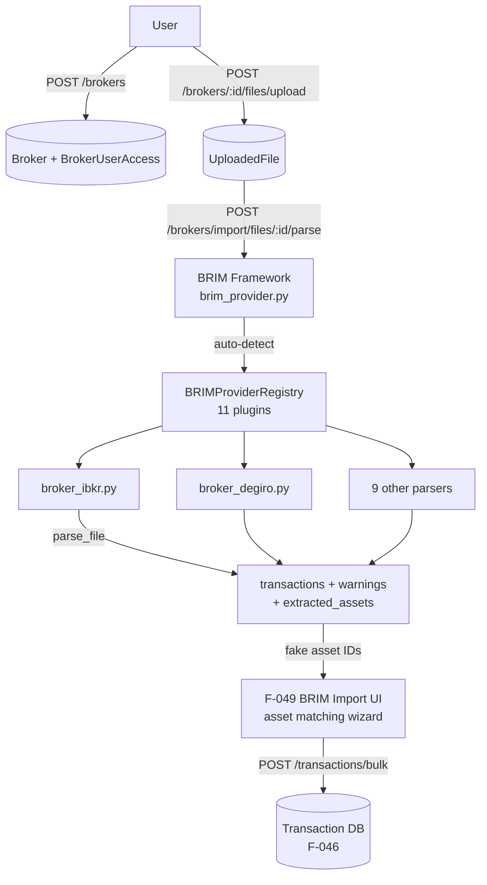

# Domain: BROKERS

> The data-entry gateway — how users represent their brokerage accounts and get historical trading data into LibreFolio.

## What it does

A broker in LibreFolio is not just a label; it is the top-level container for everything transactional. Users create brokers to represent their real accounts (e.g. "IBKR Main", "Degiro Personal"), optionally upload a custom icon, and then populate those brokers with transaction history — either by manually entering transactions (future Phase 7 UI) or by importing broker export files through the BRIM pipeline.

Access to a broker can be shared with other users in three tiers: Owner (full control, can delete), Editor (can add transactions and upload files), and Viewer (read-only). This model supports household portfolios and advisory relationships: a financial advisor can have Editor access to a client's broker, a spouse can have Viewer access. The sharing model is managed entirely within this domain; the AUTH domain only provides the user identities.

File management is the bridge between the broker and the BRIM import pipeline. Users upload CSV or XLSX reports exported from their broker platforms. The system stores these files associated with the broker, allows preview and deletion, and feeds them into the BRIM parser. The BRIM framework auto-detects which of 11 broker-specific plugins should handle each file, parses the transactions and extracted asset hints, and presents them in a staging area where users review and confirm before committing to the database.

## Feature cluster

| Code | Feature | Layer | Role in domain | Status |
|------|---------|-------|----------------|--------|
| [[F-009]] | Broker CRUD | fullstack | core — create/list/edit/delete broker accounts | implemented |
| [[F-010]] | Broker Sharing (Owner/Editor/Viewer roles) | fullstack | core — multi-user access control per broker | implemented |
| [[F-011]] | File Management (upload/list/delete broker reports) | fullstack | core — file store for import reports | implemented |
| [[F-012]] | BRIM Framework (broker report import pipeline) | fullstack | core — abstract pipeline: detect→parse→stage→commit | implemented |
| [[F-013]] | BRIM Plugins (11 broker parsers) | backend | core — concrete parsers for each broker format | implemented |
| [[F-014]] | Image Upload & Crop (broker icon) | fullstack | support — custom icon per broker | implemented |

## Architecture at a glance

## Key decisions that shaped this domain

- [[decisions/brim-fake-asset-id]] — BRIM plugins emit **negative integer fake asset IDs** during parsing; the frontend maps these to real assets via the matching wizard before committing. This two-phase approach decouples parsing from the asset catalog, allowing import of transactions for assets that haven't been created yet.
- [[decisions/brim-broker-scoped]] — BRIM file uploads were moved to broker scope (from a global uploads endpoint) to enforce access control correctly: only users with at least Editor role on a broker can upload files for it.

## Known problems / limitations

No open problems in the implemented features.

Pending gaps (Phase 7, see [[connections/transactions-connections]]):
- F-013: plugins lack `plugin_version` tracking for cache invalidation — if a plugin is updated, previously parsed files are not automatically re-parsed.
- F-049 BRIM Import UI: asset matching wizard is in-progress; the metadata preview columns are not yet dynamically driven by plugin metadata.
- F-050 File Preview System: planned — inline preview of uploaded files (image, CSV, text) before parsing.

## What comes next

- [[F-048]] Staging Modal — manual `create-many`/`edit-many` modes done (Phase 7 Part 4); BRIM `create-brim` mode arriving in Part 5.
- [[F-049]] BRIM Import UI — the asset matching wizard (in-progress in Phase 7).
- [[F-050]] File Preview System — inline preview panel for uploaded broker report files.
- [[F-083]] Multi-File Multi-Broker Import — batch-import multiple files from multiple brokers in one workflow.

## Source files

| Role | Path |
|------|------|
| Primary mkdocs | `mkdocs_src/docs/developer/backend/brim/architecture.md` |
| BRIM plugin guide | `mkdocs_src/docs/developer/architecture/patterns/brim_plugin_guide.md` |
| User brokers docs | `mkdocs_src/docs/user/brokers/index.en.md` |
| Broker sharing docs | `mkdocs_src/docs/user/brokers/sharing.en.md` |
| Files docs | `mkdocs_src/docs/user/files/index.en.md` |
| Broker API | `backend/app/api/v1/brokers.py` |
| Broker service | `backend/app/services/broker_service.py` |
| BRIM abstract base | `backend/app/services/brim_provider.py` |
| BRIM plugins | `backend/app/services/brim_providers/` |
| File upload API | `backend/app/api/v1/uploads.py` |
| DB models (Broker, BrokerUserAccess) | `backend/app/db/models.py` |
