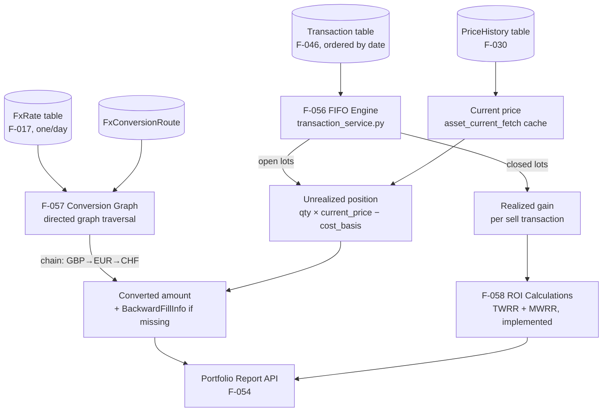

# Domain: CALCULATIONS

> The financial arithmetic engine — FIFO cost matching, cross-currency triangulation, and return-on-investment computation, all running in the backend so the frontend is always just displaying results.

## What it does

Every number that matters in a portfolio tracker — cost basis, unrealized gain, realized gain, return percentage — is computed here, in the backend, on demand, without being persisted. This is a deliberate architectural choice: financial calculations that depend on mutable inputs (transaction history, exchange rates, current prices) must be recomputed when those inputs change, not read from a stale cache.

FIFO at Runtime (F-056) is the core algorithm. Given a chronologically ordered list of transactions for an asset, FIFO maintains a queue of open lots (each lot has a quantity and a cost basis from a BUY or equivalent transaction). When a SELL occurs, it consumes lots from the front of the queue, computing realized gain as the difference between sale proceeds and the consumed lots' cost basis. The remaining open lots form the unrealized position. This runs in O(N) per asset per query — fast enough for real-time response at the scale of individual portfolios.

Currency Conversion (F-057) uses the triangulation graph built by the FX domain. When converting GBP→CHF and no direct pair exists, the system traverses the configured-pairs graph to find a path (e.g., GBP→EUR→CHF) and chains the rate multiplications. The `BackwardFillInfo` mechanism handles missing rates on non-trading days: the system returns the most recent prior rate and annotates the response so the frontend can display a "rate from {date}" notice.

ROI Calculations (F-058) implement **TWRR** (Time-Weighted Rate of Return) and **MWRR** (Money-Weighted Rate of Return / XIRR via Newton-Raphson) — see [[concepts/twrr-mwrr-algorithms]]. The FIFO/WAC engine provides the realized/unrealized breakdown and cash-flow timing; the ROI layer (`roi_utils.py`) aggregates these into the two headline percentage figures shown on the Dashboard KPI cards.

## Feature cluster

| Code | Feature | Layer | Role in domain | Status |
|------|---------|-------|----------------|--------|
| [[F-056]] | FIFO at Runtime (on-demand cost basis) | backend | core — lot matching, realized/unrealized P&L computation | implemented |
| [[F-057]] | Currency Conversion (triangulation via FX graph) | backend | core — multi-hop cross-currency conversion | implemented |
| [[F-058]] | ROI Calculations (TWRR + MWRR) | backend | core — portfolio return percentage computation | implemented |

## Architecture at a glance

## Key decisions that shaped this domain

- [[decisions/fifo-runtime-decision]] — FIFO lots are **never persisted**. The decision record covers the analysis of the alternative (caching lots in the DB): rejected because retroactive transaction edits (fixing a BRIM import error) would require cascading invalidation across cached lot states. Runtime recalculation is simpler and correct by construction.
- **Backend-only calculations** (see [[concepts/backend-only-calculations]]) — all F-056, F-057, F-058 logic lives exclusively in the backend. The frontend receives pre-computed values (NAV in user currency, P&L numbers, ROI percentages) and renders them. This prevents divergence between the display and the truth, and allows any future client (mobile app, API consumer) to get consistent results.
- **FIFO-first, fiscal method selection deferred** — Phase 7 ships FIFO only. LIFO, PMC (Prezzo Medio di Carico / Average Cost), and SelectID are deferred to Phase 8+ via [[F-081]]. The API response includes a `method` field from the start so clients can label which method was used.

## Known problems / limitations

No open problems. F-056, F-057, and F-058 are all implemented and correct. The FX conversion handles missing rates via `BackwardFillInfo` (returns the most recent prior rate with annotation). F-058 (TWRR/MWRR) is fully wired into the Dashboard via the unified `/portfolio/report` endpoint (see [[concepts/portfolio-report-unified]]).

## What comes next

- [[F-081]] Fiscal Sale Method — allow users to choose FIFO / LIFO / PMC / SelectID per fiscal jurisdiction. This will be an additive change to F-056, not a rewrite.
- [[F-091]] Multi-Worker Cache Server — if the deployment model moves to multiple hosts, the in-process cache (currently `theine` per-process) would need a Redis backend. The abstraction in `cache_utils.py` makes this a provider-swap change.

## Source files

| Role | Path |
|------|------|
| FIFO engine | `backend/app/services/transaction_service.py` |
| Currency conversion | `backend/app/services/fx.py` |
| FX conversion API | `backend/app/api/v1/fx.py` |
| ROI utilities (TWRR/MWRR) | `backend/app/utils/roi_utils.py` |
| DB models (Transaction, FxRate, FxConversionRoute) | `backend/app/db/models.py` |
| Currency graph store (frontend) | `frontend/src/lib/stores/currencyGraphStore.ts` |
| FIFO decision | `LibreFolio_devWiki/wiki/decisions/fifo-runtime-decision.md` |
