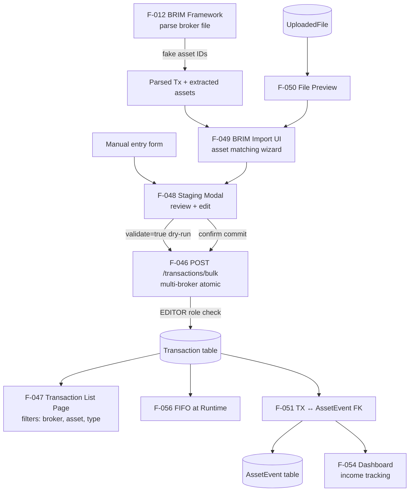

# Domain: TRANSACTIONS

> The ledger layer — every financial event (purchase, sale, dividend, fee) recorded as an immutable transaction, enabling FIFO cost-basis and portfolio-level analytics.

## What it does

Transactions are the financial heart of LibreFolio. A transaction records a financial event: a BUY (quantity purchased, price paid, fees), a SELL (quantity sold, proceeds), a DIVIDEND (cash received), an INTEREST payment, a FEE, a TAX, a TRANSFER (in or out), a SPLIT (quantity adjustment), or OTHER. Each transaction belongs to a broker and references an asset. The combination of transaction history, price history, and FX rates is what makes portfolio analytics (cost basis, realized gain, unrealized gain, ROI) possible.

The backend model and bulk API ([[F-046]]) were implemented in Phase 7. The bulk API (`POST /transactions/bulk`) is **multi-broker atomic**: all transactions across any number of brokers in a single call succeed or fail together, with a `validate=true` dry-run mode for previewing without committing. This cross-broker atomicity was required by the DEFERRABLE FK constraint on `link_uuid → related_transaction_id` (TRANSFER pairs can span brokers). Access control is enforced at the API level: GET/PATCH/DELETE are filtered to transactions belonging to brokers the user has access to; creating transactions requires EDITOR role.

The primary user-facing flow for entering transactions is through the BRIM pipeline: upload a broker export file, the system parses it with the appropriate plugin, the user reviews the extracted transactions in a staging area (F-049, in-progress), resolves any unknown assets via the matching wizard, and commits. The staging modal (F-048, in-progress) now supports manual transaction entry (`create-many`/`edit-many`); BRIM mode (`create-brim`) arrives in Part 5. The transaction list page (F-047, implemented in Phase 7 Part 4) provides a DataTable view with client-side filters (multi-enum, currency-stack sliders, date pickers) and always-pair-adjacent rendering for TRANSFER/FX_CONVERSION pairs.

## Feature cluster

| Code | Feature | Layer | Role in domain | Status |
|------|---------|-------|----------------|--------|
| [[F-046]] | Transaction Model & Bulk API | backend | core — data model + multi-broker atomic bulk create with dry-run | implemented |
| [[F-047]] | Transaction List Page (DataTable + filters) | frontend | display — client-side filtered DataTable, always-pair-adjacent rendering | implemented |
| [[F-048]] | Staging Modal (unified manual entry + BRIM output) | frontend | core — manual `create-many`/`edit-many` done; BRIM `create-brim` in Part 5 | in-progress |
| [[F-049]] | BRIM Import UI (asset matching wizard, bulk commit) | frontend | core — wizard to match extracted assets + commit | in-progress |
| [[F-050]] | File Preview System (image/text/table/md/code) | fullstack | support — inline preview of uploaded broker report files | planned |
| [[F-051]] | Transaction ↔ AssetEvent Link | backend | support — FK between transactions and asset events + suggest endpoint | implemented |

## Architecture at a glance

## Key decisions that shaped this domain

- **FIFO at runtime** (see [[decisions/fifo-runtime-decision]] and [[features/F-056]]) — cost basis is computed on demand, never stored. This decision was made to support retroactive edits: correcting a BRIM import error (wrong price, wrong quantity) immediately corrects all downstream P&L without cache invalidation.
- **Multi-broker atomic bulk API** — all transactions across brokers in a bulk call are committed or rolled back together in a single DB session (see [[decisions/multi-broker-atomic-tx]]). A `validate=true` dry-run allows preview without committing. A single DEFERRABLE FK constraint (`link_uuid → related_transaction_id`) enables TRANSFER pairs that span different brokers to be inserted atomically.
- **Fake asset ID flow** (see [[decisions/brim-fake-asset-id]]) — BRIM parsers emit negative integers as placeholder asset IDs, decoupling parse from the asset catalog. The matching wizard maps them to real asset IDs before commit.

## Known problems / limitations

Phase 7 Parts 1+2+3 closed (2026-04-25). Phase 7 Part 4 closed (2026-04-28, frontend). Remaining items:

- **F-048** BRIM mode (`create-brim`) for Staging Modal not yet built — Part 5 work.
- **F-050** File Preview System still planned (Part 5+).
- **F-049** asset matching wizard live but UX polish ongoing.
- **F-047** E2E test specs deferred to Phase 7 final.
- **Currency consistency**: enforced through [[decisions/price-currency-hard-reject]]
  (hard-400 on price/event currency mismatch, HTTP 409 on `Asset.currency`
  PATCH with existing data) and [[decisions/policy-d-currency-wipe]] (destructive
  symmetric wipe; transactions preserved with `asset_event_id = NULL`).

Two production bugs were surfaced by the Phase 7 Part 3 BlockG coverage push and
have been filed:

- [[problems/assets-wipe-error-attr-mismatch]] — `e.code` → `e.error_code`
- [[problems/babel-currency-symbol-echo]] — `normalize_currency` strict pycountry lookup

## What comes next

- Complete Phase 7: F-048 Staging Modal, F-050 File Preview, F-051 TX↔AssetEvent link.
- [[F-081]] Fiscal Sale Method (FIFO/LIFO/PMC/SelectID) — user selects accounting method for realized gain calculation; FIFO is the Phase 7 default.
- [[F-082]] Cash Split Transactions — represent cash from dividends as a separate CASH asset.
- [[F-083]] Multi-File Multi-Broker Import — batch upload and parse multiple files in one workflow.
- [[F-084]] Transaction Gain Chart — per-asset gain/loss visualization over time.

## Source files

| Role | Path |
|------|------|
| Primary mkdocs | `mkdocs_src/docs/developer/architecture/database/brokers_transactions.md` |
| Transaction API | `backend/app/api/v1/transactions.py` |
| Transaction service | `backend/app/services/transaction_service.py` |
| DB model (Transaction) | `backend/app/db/models.py` |
| Transaction pages | `frontend/src/routes/(app)/transactions/` |
| BRIM abstract base | `backend/app/services/brim_provider.py` |
