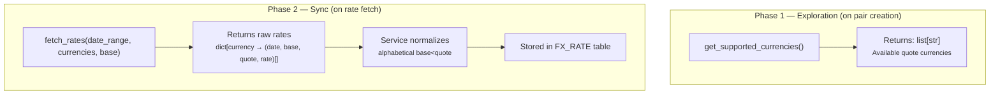
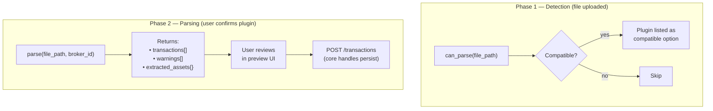
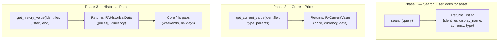
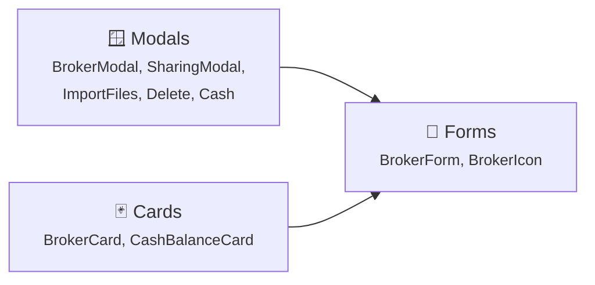
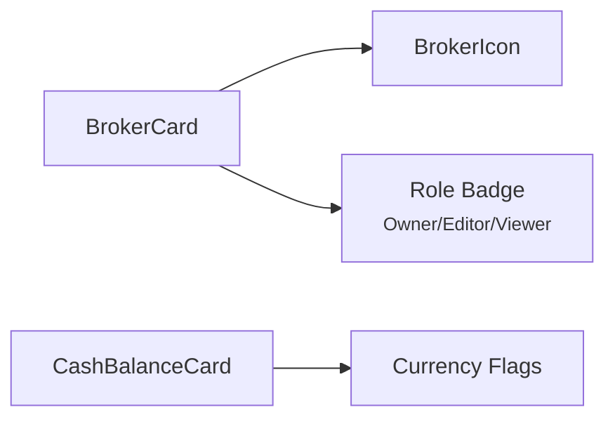
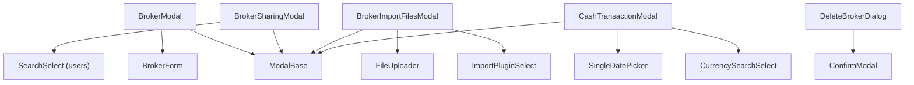
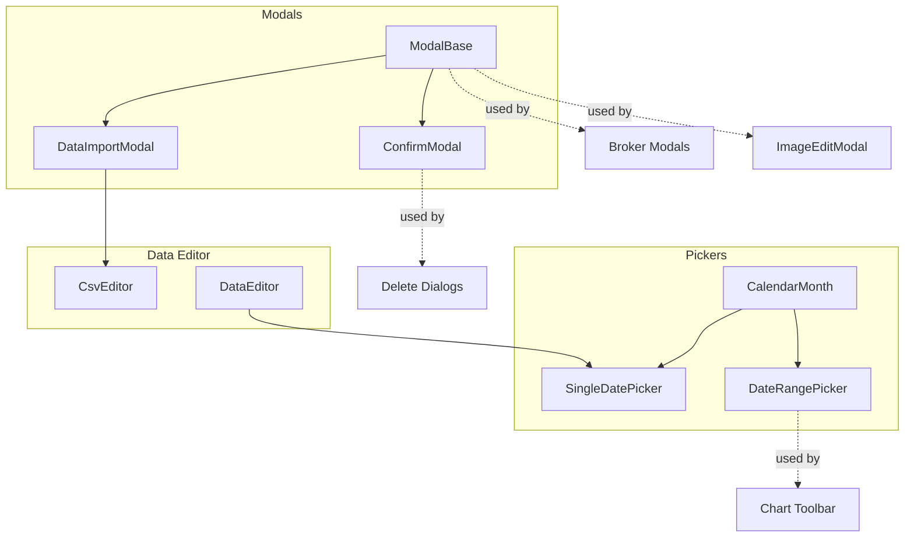

# Plan: Fix e miglioramenti documentazione — Diagrammi, sotto-alberature e componenti base (Round 2)

Sette interventi puntuali: fix bug gallery settings, split UI Base in sotto-file con diagrammi, split diagramma Broker Components, fix immagine Broker Modals, ridisegnare flow diagrams nelle 3 Plugin Guide (FX, BRIM, Asset), e aggiungere asset search nella Asset Guide.

**Dipendenze**: `plan-docsStructuralRefinements.prompt.md` completato ✅, commit precedente (component refinements round 1)
**Status**: ✅ COMPLETATO — Tutti i 7 step eseguiti (20 Marzo 2026)
**Stima**: ~2.5 ore

---

## Step 1 — Fix bug gallery: Settings "user-preferences" mostra profile

**File**: [gallery.spec.ts](frontend/e2e/gallery.spec.ts) righe 228-231

Il test `user preferences - all languages and themes` naviga a `/settings` e fa subito screenshot come `user-preferences`, ma il tab di default è **profile**, non preferences. Manca il click su `settings-tab-preferences` prima dello screenshot.

**Fix**: Dopo riga 230 (`freezeAnimations`), aggiungere click su `settings-tab-preferences` prima dello screenshot (stesso pattern usato in tutti gli altri test settings riga 242, 255, 285):

```ts
// Click preferences tab explicitly (default tab may be profile)
const prefsTab = page.getByTestId('settings-tab-preferences');
if (await prefsTab.isVisible().catch(() => false)) {
    await prefsTab.click();
    await page.waitForTimeout(300);
}
```

**Poi rieseguire**: `./dev.py mkdocs gallery --filter "user preferences" --desktop-only --no-populate`

---

## Step 2 — Fix immagine Broker Sharing Modal

**File**: [brokers/modals.md](mkdocs_src/docs/developer/frontend/components/brokers/modals.md) riga 30

L'immagine usa `data-name="sharing"` ma nella gallery lo screenshot è salvato come `sharing-modal` (riga 616 di `gallery.spec.ts`).

**Fix**: Cambiare `data-name="sharing"` → `data-name="sharing-modal"`.

---

## Step 3 — Plugin Guides: ridisegnare flow diagrams (3 file)

### 3a. FX Plugin Guide — separare exploration vs execution

**File**: [fx_plugin_guide.md](mkdocs_src/docs/developer/architecture/patterns/fx_plugin_guide.md)

Sostituire il diagramma a catena singola con due sotto-grafi che rappresentano chiamate diverse fatte dal sistema in momenti diversi:



### 3b. BRIM Plugin Guide — separare detection vs parsing

**File**: [brim_plugin_guide.md](mkdocs_src/docs/developer/architecture/patterns/brim_plugin_guide.md)

Sostituire il diagramma lineare con due fasi che avvengono in momenti diversi:



### 3c. Asset Plugin Guide — 3 fasi + aggiungere search

**File**: [asset_plugin_guide.md](mkdocs_src/docs/developer/architecture/patterns/asset_plugin_guide.md)

Ridisegnare il flow in 3 fasi separate (chiamate indipendenti del frontend):



**Aggiungere alla tabella ABC methods**:

| Method | Signature | Description |
|--------|-----------|-------------|
| `search(query)` | `async → list[dict]` | Search for assets matching query. Returns `{identifier, display_name, currency, type}`. Default raises `NOT_SUPPORTED`. |
| `test_search_query` | `@property → str \| None` | Query string for automated search tests. `None` if search not supported. |

**Aggiungere nuova sezione "Asset Search"** dopo la tabella, documentando:

- `search(query)` è un metodo **opzionale** (il default nella ABC solleva `NOT_SUPPORTED`)
- Provider che lo implementano: Yahoo Finance (`search("Apple")` → AAPL, AAPL.L, etc.), JustETF (`search("MSCI World")` → lista ISIN)
- Provider senza search: CSS scraper, Scheduled Investment → restituiscono `NOT_SUPPORTED`, vengono saltati
- Endpoint API: `GET /api/v1/assets/provider/search?q=Apple&providers=yfinance,justetf`
- Le ricerche sono eseguite **in parallelo** su tutti i provider che supportano search (`AssetSearchService.search()` con `asyncio.gather`)
- Provider con errori vengono loggati in `providers_with_errors` ma non bloccano la risposta
- Risposta include `total_results`, `results[]`, `providers_queried[]`, `providers_with_errors[]`

---

## Step 4 — Broker Components: dividere diagramma in 3

**File**: [brokers/index.md](mkdocs_src/docs/developer/frontend/components/brokers/index.md)

Il diagramma unico con tutti i componenti + le loro dipendenze esterne è troppo denso e illeggibile su schermi piccoli. Dividere in **3 mini-diagrammi** specifici per file:

### 4a. Overview diagram (in `index.md`)

Ridurre a un diagramma semplificato con soli 3 nodi (categorie) con link:



### 4b. Cards diagram (aggiungere in `cards.md`)



### 4c. Modals diagram (aggiungere in `modals.md`)



---

## Step 5 — Split UI Base in sotto-file con diagrammi

**File corrente**: [ui-base.md](mkdocs_src/docs/developer/frontend/components/ui-base.md) (224 righe)

Ristrutturare in sotto-cartella con 6 file:

```
components/ui-base/
├── index.md           # Overview con diagramma dipendenze globale + tabella link
├── modals.md          # ModalBase, ConfirmModal (righe 7-33 di ui-base.md)
├── feedback.md        # ToastContainer, InfoBanner, LoadingSpinner, Tooltip (righe 37-77)
├── pickers.md         # CalendarMonth, SingleDatePicker, DateRangePicker (righe 81-114)
├── atoms.md           # ThemeToggle, DocsLink, AnimatedBackground, OrderableList, PasswordInput, PasswordStrength (righe 118-182)
└── data-editor.md     # DataEditor, CsvEditor, DataImportModal (righe 186-221)
```

### `index.md` — Diagramma dipendenze globale



Tabella riassuntiva con link ai sotto-file:

| Section | Components | Details |
|---------|-----------|---------|
| [Modals](modals.md) | ModalBase, ConfirmModal | Foundation for all modal dialogs |
| [Feedback](feedback.md) | ToastContainer, InfoBanner, LoadingSpinner, Tooltip | Notifications and user feedback |
| [Pickers](pickers.md) | CalendarMonth, SingleDatePicker, DateRangePicker | Date selection components |
| [Atoms](atoms.md) | ThemeToggle, DocsLink, AnimatedBackground, OrderableList, PasswordInput, PasswordStrength | Small standalone UI primitives |
| [Data Editor](data-editor.md) | DataEditor, CsvEditor, DataImportModal | Inline editing and CSV import |

### Sotto-file: ciascuno con il suo mini-diagramma

- **`modals.md`**: Diagramma `ModalBase → ConfirmModal`, con link "usato da" ai compositi (BrokerModal, ImageEditModal, ChartSettingsModal, DataImportModal)
- **`pickers.md`**: Diagramma `CalendarMonth → SingleDatePicker / DateRangePicker`, con link "usato da" (DataEditor, CashTransactionModal, Chart Toolbar)
- **`data-editor.md`**: Diagramma `DataImportModal → ModalBase + CsvEditor`, `DataEditor → SingleDatePicker`
- **`feedback.md`** e **`atoms.md`**: Componenti standalone, nessun diagramma di dipendenza necessario (solo "usato da" link testuali)

### Azioni di pulizia

1. Eliminare `ui-base.md`
2. Aggiornare nav in `mkdocs.yml`:
   ```yaml
   - UI Base:
       - Overview: developer/frontend/components/ui-base/index.md
       - Modals: developer/frontend/components/ui-base/modals.md
       - Feedback: developer/frontend/components/ui-base/feedback.md
       - Pickers: developer/frontend/components/ui-base/pickers.md
       - Atoms: developer/frontend/components/ui-base/atoms.md
       - Data Editor: developer/frontend/components/ui-base/data-editor.md
   ```
3. Aggiornare tutti i cross-link (grep per `ui-base.md`):
   - `brokers/modals.md` → `ui-base.md#modalbase` diventa `ui-base/modals.md`
   - `brokers/index.md` → `../ui-base.md#modalbase` diventa `../ui-base/modals.md`
   - `brokers/forms.md` → eventuali link
   - `auth.md` → `ui-base.md#passwordinput` diventa `ui-base/atoms.md#passwordinput`
   - `components/index.md` → `ui-base.md` diventa `ui-base/index.md`
   - `select.md` → eventuali link

---

## Considerazioni

### Ordine di esecuzione

1 (gallery bug fix + regen screenshot) → 2 (modals image name) → 3a,3b,3c (plugin guide diagrams + asset search) → 4 (broker diagrams) → 5 (UI base split)

Step 5 è il più impattante per cross-link. Build mkdocs dopo ogni step per validare.

### Step 1 richiede rigenerazione screenshot

Dopo il fix del gallery.spec.ts, eseguire:
```bash
./dev.py mkdocs gallery --filter "user preferences" --desktop-only --no-populate
```
Questo rigenera solo gli screenshot affected, in modo veloce (~1 min).

### Cross-link impattati dallo Step 5

Fare grep esaustivo per `ui-base.md` prima di eliminarlo. File noti:
- `brokers/modals.md` (2 link)
- `brokers/index.md` (1 link)
- `auth.md` (1 link)
- `components/index.md` (1 link nella tabella)

