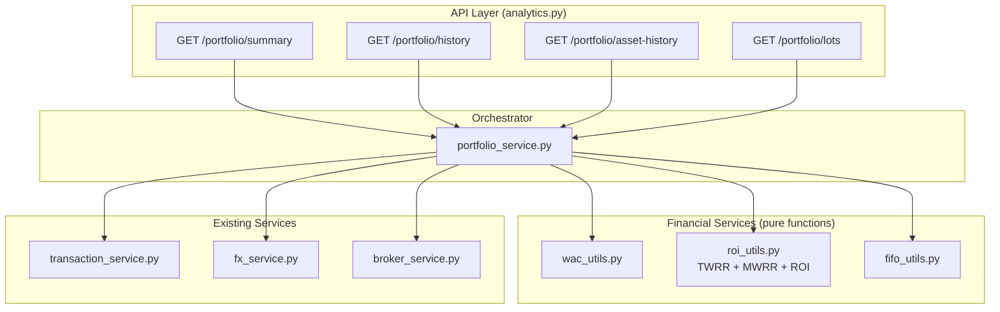

# Phase 09 — Milestone 1: Fondamenta Backend e API di Portafoglio

> **Stato**: ⏳ Piano  
> **Scope**: Backend-only (nessuna modifica frontend)  
> **Obiettivo**: Creare i servizi finanziari puri, l'orchestratore portfolio e i nuovi endpoint REST, migrando il WAC service e aggiungendo TWRR/MWRR/ROI/FIFO.  
> **Piano padre**: [implementation_roadmap.md](../implementation_roadmap.md)  
> **Algoritmi**: [plan_financial_algorithms.md](../plan_financial_algorithms.md)

---

## Panoramica Architetturale



---

## Pre-requisiti

| # | Azione | File/Comando | Note |
|---|--------|-------------|------|
| P1 | Aggiungere `scipy` alle dipendenze | `Pipfile` | Necessario per `scipy.optimize.newton` (MWRR/XIRR) |
| P2 | Installare le dipendenze | `pipenv install` | Verificare che `scipy` si installi correttamente |

---

## Step 1 — Creare la cartella `financial/` per i nuovi servizi

> **Nota di contesto**: I calcoli matematici puri del WAC esistono già in `backend/app/utils/financial_utils.py` (`compute_wac_from_txlist`). Non è necessario migrare la logica esistente di `wac_service.py`, ma `portfolio_service.py` riutilizzerà la funzione matematica pura esistente per aggregare il WAC.

### 1.1 `financial_utils` diventa `wac_utils.py`

Per coerenza, la logica pura esistente nel WAC verrà spostata e rinominata in `utils/financial/wac_utils.py`.

```text
backend/app/utils/financial/
├── __init__.py          # Export delle funzioni pure
├── wac_utils.py         # WAC puro (git mv da utils/financial_utils.py)
├── roi_utils.py         # TWRR + MWRR + ROI semplice
└── fifo_utils.py        # Lotti aperti/chiusi FIFO
```

> **Azioni**: 
> 1. Creare `backend/app/utils/financial/__init__.py`
> 2. Eseguire `git mv backend/app/utils/financial_utils.py backend/app/utils/financial/wac_utils.py`

---

## Step 2 — Creare il ROI Service (TWRR, MWRR, ROI Semplice)

> **File da creare**: `backend/app/utils/financial/roi_utils.py`

### 2.1 Interfaccia

```python
# backend/app/utils/financial/roi_utils.py

from dataclasses import dataclass
from decimal import Decimal
from datetime import date
from typing import NamedTuple

class CashFlowInput(NamedTuple):
    """Flusso di cassa con data. Positivo = outflow (prelievo), Negativo = inflow (deposito)."""
    date: date
    amount: Decimal  # Segno: -deposito, +prelievo

class NAVSnapshot(NamedTuple):
    """Snapshot del NAV del portafoglio in una data specifica."""
    date: date
    nav: Decimal

@dataclass(frozen=True)
class ROIResult:
    simple_roi: Decimal          # (NAV_finale - Capitale_investito) / Capitale_investito
    twrr: Decimal | None         # Time-Weighted Return (None se non calcolabile)
    mwrr: Decimal | None         # Money-Weighted Return / XIRR (None se non converge)

def calculate_simple_roi(current_nav: Decimal, total_invested: Decimal) -> Decimal:
    """ROI = (NAV - Investito) / Investito. Returns 0 se investito == 0."""
    ...

@dataclass(frozen=True)
class TWRRPoint:
    date: date
    twrr: Decimal

@dataclass(frozen=True)
class MWRRPoint:
    date: date
    mwrr: Decimal | None

def calculate_twrr_series(nav_snapshots: list[NAVSnapshot], cash_flows: list[CashFlowInput]) -> list[TWRRPoint]:
    """
    Versione iterativa: calcola la serie storica del TWRR in O(N).
    Ad ogni snapshot calcola l'HPR rispetto al precedente e accumula il
    prodotto geometrico giorno per giorno. Ritorna il cumulato storico.
    """
    ...

def calculate_twrr(nav_snapshots: list[NAVSnapshot], cash_flows: list[CashFlowInput]) -> TWRRPoint:
    """
    Time-Weighted Rate of Return.
    
    ALGORITMO:
    1. Identificare i giorni con cash flow esterno
    2. Per ogni sotto-periodo, calcolare HPR = (V_end - CF - V_start) / V_start
    3. Comporre geometricamente: TWRR = Π(1 + HPR_i) - 1
    
    REGOLE:
    - nav_snapshots DEVE contenere un NAV per ogni data di cash_flow + data finale
    - Se V_start == 0 per un sotto-periodo, il sotto-periodo viene saltato
    - Dividendi e interessi NON sono cash flows (sono rendimento interno)
    
    Returns: TWRRPoint(date=ultima_data, twrr=risultato)
    Raises: ValueError se dati insufficienti
    """
    ...

def calculate_mwrr(cash_flows: list[CashFlowInput], 
                    initial_nav: Decimal,
                    final_nav: Decimal,
                    start_date: date,
                    end_date: date) -> MWRRPoint:
    """
    Money-Weighted Rate of Return (XIRR).
    
    ALGORITMO:
    1. Costruire la serie di flussi: [-NAV_iniziale] + CFs intermedi + [+NAV_finale]
    2. Risolvere NPV = Σ(CF_i / (1+r)^(d_i/365)) = 0 per r
    3. Usare scipy.optimize.newton per il root-finding
    
    NOTA: scipy è CPU-bound (no I/O), non serve asyncio.to_thread()
    
    Returns: MWRRPoint(date=end_date, mwrr=risultato) (o mwrr=None se non converge)
    Raises: ValueError se non converge (e se si sceglie di non usare None)
    """
    ...

def calculate_mwrr_series(
    nav_snapshots: list[NAVSnapshot], 
    cash_flows: list[CashFlowInput]
) -> list[MWRRPoint]:
    """
    Versione iterativa: risolve XIRR per ogni snapshot temporale usando il NAV
    di quel giorno come cash flow finale.
    OTTIMIZZAZIONE: Per evitare N ricalcoli da zero (costoso), usa il risultato (radice)
    del giorno precedente come `x0` (guess iniziale) per scipy.newton del giorno corrente.
    Questo fa convergere il calcolo in 1-2 iterazioni per punto.
    """
    ...
```

### 2.2 Dettagli implementativi

| Aspetto | Decisione |
|---------|-----------|
| **Libreria XIRR** | `scipy.optimize.newton` — robusta, scritta in C, gestisce edge case |
| **Tipo numerico** | Input/Output `Decimal`, conversione interna a `float` solo per scipy |
| **Arrotondamento** | 6 decimali per percentuali, 2 per valori monetari |
| **Divisione per zero** | Se `total_invested == 0` → ROI = 0. Se `V_start == 0` → skip sotto-periodo |
| **Non convergenza MWRR** | Ritornare `None` (non crashare) — il frontend mostrerà "N/A" |
| **Cash flow sign convention** | Depositi = negativo (investitore dà soldi), Prelievi = positivo (investitore riceve) |

### 2.3 Test ROI Service

> **File da creare**: `backend/test_scripts/test_utils/test_financial/test_roi_utils.py`

```python
class TestSimpleROI:
    def test_positive_roi(self):
        assert calculate_simple_roi(Decimal("1200"), Decimal("1000")) == Decimal("0.20")
    
    def test_negative_roi(self):
        assert calculate_simple_roi(Decimal("800"), Decimal("1000")) == Decimal("-0.20")
    
    def test_zero_invested(self):
        assert calculate_simple_roi(Decimal("500"), Decimal("0")) == Decimal("0")


class TestTWRR:
    def test_no_cash_flows(self):
        """Senza flussi intermedi, TWRR = rendimento semplice."""
        navs = [NAVSnapshot(date(2025,1,1), Decimal("1000")),
                NAVSnapshot(date(2025,12,31), Decimal("1100"))]
        result = calculate_twrr(navs, [])
        assert result.twrr == pytest.approx(Decimal("0.10"), abs=Decimal("0.001"))
        assert result.date == date(2025,12,31)

    def test_with_deposit_midway(self):
        """Deposito a metà periodo — TWRR elimina l'effetto del deposito."""
        navs = [
            NAVSnapshot(date(2025,1,1), Decimal("1000")),    # Inizio
            NAVSnapshot(date(2025,7,1), Decimal("1100")),    # Pre-deposito: +10%
            NAVSnapshot(date(2025,12,31), Decimal("2310")),  # Fine: +10% sul nuovo
        ]
        cfs = [CashFlowInput(date(2025,7,1), Decimal("-1000"))]  # Deposito 1000
        result = calculate_twrr(navs, cfs)
        # HPR1 = (1100-1000)/1000 = 0.10
        # HPR2 = (2310-2100)/2100 = 0.10  (2100 = 1100 + 1000 deposito)
        # TWRR = (1.10 * 1.10) - 1 = 0.21
        assert result.twrr == pytest.approx(Decimal("0.21"), abs=Decimal("0.001"))

    def test_withdrawal(self):
        """Prelievo intermedio — TWRR indipendente dal prelievo."""
        ...

    def test_single_day_no_change(self):
        """Edge: periodo di un solo giorno senza variazione."""
        ...


class TestMWRR:
    def test_simple_investment(self):
        """Investimento iniziale → rendimento finale → MWRR = rendimento annualizzato."""
        result = calculate_mwrr(
            cash_flows=[],
            initial_nav=Decimal("10000"),
            final_nav=Decimal("11000"),
            start_date=date(2025,1,1),
            end_date=date(2025,12,31),
        )
        assert result.mwrr == pytest.approx(Decimal("0.10"), abs=Decimal("0.01"))
        assert result.date == date(2025,12,31)

    def test_good_timing_beats_twrr(self):
        """Deposito prima di un rialzo → MWRR > TWRR."""
        ...

    def test_bad_timing_below_twrr(self):
        """Deposito prima di un ribasso → MWRR < TWRR."""
        ...

    def test_no_convergence_returns_none(self):
        """Portafoglio troppo breve o senza movimenti."""
        ...

class TestROISeries:
    def test_twrr_series_accumulation(self):
        """Verifica che la serie iterativa corrisponda ai TWRR one-shot calcolati troncando i dati."""
        ...
        
    def test_mwrr_series_warm_start(self):
        """Verifica la serie iterativa MWRR e la logica di warm-start del Newton-Raphson."""
        ...
```

> [!TIP]
> Usare **scenari numerici verificati a mano** (spreadsheet) per i test TWRR/MWRR. Includere i valori attesi come commenti.

---

## Step 3 — Creare il FIFO Service

> **File da creare**: `backend/app/utils/financial/fifo_utils.py`

### 3.1 Interfaccia

```python
# backend/app/utils/financial/fifo_utils.py

from dataclasses import dataclass
from decimal import Decimal
from datetime import date
from typing import NamedTuple

class FIFOTransactionInput(NamedTuple):
    """Input per il FIFO — include l'id originale per il cross-reference."""
    id: int
    type: str          # "BUY" | "SELL"
    quantity: Decimal
    price: Decimal
    date: date

@dataclass(frozen=True)
class OpenLot:
    """Lotto di acquisto non ancora completamente venduto."""
    buy_transaction_id: int
    buy_date: date
    buy_price: Decimal
    original_quantity: Decimal
    remaining_quantity: Decimal

@dataclass(frozen=True)
class ClosedLot:
    """Lotto chiuso: un acquisto (parziale) matchato con una vendita."""
    buy_transaction_id: int
    sell_transaction_id: int
    buy_date: date
    sell_date: date
    buy_price: Decimal
    sell_price: Decimal
    quantity: Decimal  # Quantità matchata
    realized_pnl: Decimal  # (sell_price - buy_price) * quantity

@dataclass(frozen=True)
class FIFOResult:
    open_lots: list[OpenLot]
    closed_lots: list[ClosedLot]
    total_realized_pnl: Decimal
    total_unrealized_quantity: Decimal

def calculate_fifo_lots(transactions: list[FIFOTransactionInput]) -> FIFOResult:
    """
    Calcola i lotti aperti e chiusi in ordine FIFO.
    
    ALGORITMO:
    1. Ordinare le transazioni per data
    2. Per ogni BUY: push in coda (FIFO queue)
    3. Per ogni SELL: consumare dalla testa della coda
       - Se il lotto più vecchio ha qty sufficiente → partial match
       - Altrimenti → esaurire il lotto e passare al successivo
    4. Lotti rimasti in coda = open_lots
    
    REGOLE:
    - Input DEVE contenere solo BUY e SELL (filtrati dal chiamante)
    - Se si vende più di quanto acquistato → ValueError
    """
    ...
```

### 3.2 Test FIFO Service

> **File da creare**: `backend/test_scripts/test_utils/test_financial/test_fifo_utils.py`

```python
class TestFIFOLots:
    def test_single_buy_no_sell(self):
        """Un solo acquisto → 1 lotto aperto, 0 chiusi."""
        ...

    def test_buy_then_full_sell(self):
        """Acquisto + vendita totale → 0 aperti, 1 chiuso."""
        ...

    def test_buy_then_partial_sell(self):
        """Acquisto 100, vendita 30 → 1 aperto (70 residue), 1 chiuso (30)."""
        ...

    def test_two_buys_one_sell_fifo_order(self):
        """2 acquisti, 1 vendita → il primo lotto viene consumato per primo (FIFO)."""
        ...

    def test_sell_spans_multiple_lots(self):
        """Vendita che esaurisce il primo lotto e intacca il secondo."""
        txns = [
            FIFOTransactionInput(1, "BUY", Decimal("50"), Decimal("100"), date(2025,1,1)),
            FIFOTransactionInput(2, "BUY", Decimal("50"), Decimal("150"), date(2025,2,1)),
            FIFOTransactionInput(3, "SELL", Decimal("70"), Decimal("200"), date(2025,3,1)),
        ]
        result = calculate_fifo_lots(txns)
        assert len(result.open_lots) == 1
        assert result.open_lots[0].remaining_quantity == Decimal("30")
        assert len(result.closed_lots) == 2  # 50 dal lotto1 + 20 dal lotto2
        ...

    def test_realized_pnl_calculation(self):
        """Verifica P&L realizzato = (sell_price - buy_price) * qty."""
        ...

    def test_oversell_raises_error(self):
        """Vendita > quantità posseduta → ValueError."""
        ...

    def test_complex_scenario_multiple_buys_sells(self):
        """Scenario realistico: 5 BUY + 3 SELL con FIFO incrociato."""
        ...
```

---

## Step 4 — Creare il Portfolio Service

### 4.2 L'Orchestratore `PortfolioService` (Evoluzione di `wac_service.py`)

> **Azione**: Rinominare `wac_service.py` in `portfolio_service.py`
> `git mv backend/app/services/wac_service.py backend/app/services/portfolio_service.py`
>
> Questo file conterrà il nuovo `PortfolioService` e diventerà il punto centrale che connette il DB con le `utils/financial/`. Eventuali dipendenze preesistenti del WAC verranno raggruppate qui come metodi compatibili o refattorizzate.

### 4.2 Interfaccia

```python
# backend/app/services/portfolio_service.py

class PortfolioService:
    def __init__(self, db: AsyncSession):
        self.db = db
        self.transaction_service = TransactionService(db)
        self.fx_service = FXService(db)
        self.broker_service = BrokerService(db)

    async def get_summary(
        self, 
        user_id: int, 
        broker_ids: list[int] | None = None,
        include_breakdown: bool = False,
    ) -> PortfolioSummary:
        """
        Ritorna il summary aggregato del portafoglio.
        
        FLUSSO:
        1. Ottenere la lista dei broker accessibili all'utente (o filtrare per broker_ids)
        2. Per ogni broker:
           a. Fetch transazioni (filtrate per BUY/SELL/DEPOSIT/WITHDRAWAL/DIVIDEND/INTEREST/FEE/TAX)
           b. Raggruppare per asset_id → calcolare WAC per ciascuno
           c. Ottenere prezzi correnti degli asset
           d. Convertire tutto in base_currency via fx_service
           e. Applicare share_percentage
        3. Aggregare:
           a. Holdings (merge per asset cross-broker)
           b. Cash totale
           c. NAV = Cash + Market Value Holdings
           d. Gain/Loss = NAV - Total Invested
           e. Allocazioni (by type, sector, geography)
        4. Calcolare ROI:
           a. Estrarre cash flows (DEPOSIT/WITHDRAWAL)
           b. Ricostruire NAV snapshots nelle date dei cash flows
           c. Calcolare TWRR e MWRR
        5. Se include_breakdown: calcolare il mini-summary per ogni broker
        
        Returns: PortfolioSummary
        """
        ...

    async def get_history(
        self,
        user_id: int,
        broker_ids: list[int] | None = None,
        date_from: date | None = None,
        date_to: date | None = None,
    ) -> list[PortfolioHistoryPoint]:
        """
        Ritorna la serie storica a 3 metriche: Cash, Investito, NAV.
        
        FLUSSO:
        1. Ottenere TUTTE le transazioni nel range (o tutte se range non specificato)
        2. Per ogni giorno con transazioni:
           a. Calcolare il cash cumulativo (depositi - prelievi - acquisti + vendite)
           b. Calcolare il costo di carico cumulativo (somma acquisti - somma vendite al costo)
           c. Calcolare il NAV (cash + valore di mercato al prezzo del giorno)
        3. Applicare share_percentage
        4. Ritornare serie giornaliera
        
        Returns: list[PortfolioHistoryPoint(date, cash, invested, nav)]
        """
        ...

    async def get_asset_history(
        self,
        user_id: int,
        asset_id: int,
        broker_id: int | None = None,
    ) -> list[AssetHistoryPoint]:
        """
        Ritorna la serie storica WAC vs Prezzo di mercato per un singolo asset.
        
        Returns: list[AssetHistoryPoint(date, wac, market_price)]
        """
        ...

    async def get_lots(
        self,
        user_id: int,
        broker_id: int,
        asset_id: int,
    ) -> FIFOResult:
        """
        Ritorna i lotti FIFO per un asset specifico in un broker specifico.
        
        FLUSSO:
        1. Fetch transazioni BUY/SELL per (broker_id, asset_id)
        2. Convertire in FIFOTransactionInput
        3. Delegare a calculate_fifo_lots()
        4. Arricchire open_lots con unrealized P&L (prezzo corrente)
        
        Returns: FIFOResult con lotti aperti/chiusi
        """
        ...
```

### 4.3 Schema di risposta API

> **Nota per lo Sviluppatore**: Usare **SEMPRE** `SafeDecimal` (da `backend/app/schemas/common.py`) al posto di `Decimal` nei modelli Pydantic di risposta, per evitare che fastidiosi valori in notazione scientifica arrivino al Frontend causando errori Zod.
> Per i filtri temporali in ingresso (es. `date_range`), riutilizzare `OpenDateRangeModel` dallo stesso file.

```python
# Nuovi schemi Pydantic (in backend/app/schemas/portfolio.py o inline)
from backend.app.schemas.common import SafeDecimal, Currency

class PortfolioSummary(BaseModel):
    net_worth: SafeDecimal
    total_invested: SafeDecimal
    total_gain_loss: SafeDecimal
    total_gain_loss_percent: SafeDecimal
    cash_total: SafeDecimal
    cash_balances: list[Currency]                 # Sostituisce dict, usa modello di common.py
    twrr_percent: SafeDecimal | None
    mwrr_percent: SafeDecimal | None
    simple_roi_percent: SafeDecimal
    allocation_by_type: list[AllocationItem]      # [{name: "ETF", value: 45.2}, ...]
    allocation_by_sector: list[AllocationItem]
    allocation_by_geography: list[AllocationItem]
    holdings: list[PortfolioHolding]
    by_broker: list[BrokerBreakdown] | None  # Solo se include_breakdown=true
    wac_missing_pairs: list[WACMissingPairInfo] = Field(default_factory=list)  # Esporta coppie mancanti per banner UI

class AllocationItem(BaseModel):
    name: str       # es. "ETF", "Technology", "US", "Unknown"
    value: SafeDecimal  # Percentuale (0-100)
    amount: SafeDecimal # Valore assoluto in base currency

class PortfolioHolding(BaseModel):
    asset_id: int
    asset_name: str
    asset_ticker: str | None
    asset_type: str
    quantity: SafeDecimal
    wac_per_unit: SafeDecimal | None      # None se FX mancante blocca il calcolo
    current_price: SafeDecimal | None     # None se FX mancante per il prezzo odierno
    current_value: SafeDecimal | None     # None se prezzo o quantita' non computabili
    gain_loss: SafeDecimal | None
    gain_loss_percent: SafeDecimal | None
    allocation_percent: SafeDecimal | None

class BrokerBreakdown(BaseModel):
    broker_id: int
    broker_name: str
    net_worth: SafeDecimal
    gain_loss: SafeDecimal
    gain_loss_percent: SafeDecimal
    cash_total: SafeDecimal

class PortfolioHistoryPoint(BaseModel):
    date: date
    cash_value: SafeDecimal
    invested_value: SafeDecimal
    nav_value: SafeDecimal

class AssetHistoryPoint(BaseModel):
    date: date
    wac: SafeDecimal
    market_price: SafeDecimal
```

### 4.4 Punti critici di implementazione

### 4.4 Punti critici di implementazione e Logica

> [!WARNING]
> **Rischio di blocco Event Loop (scipy.newton)**: Il calcolo MWRR iterativo (`calculate_mwrr_series`) usa `scipy.newton` per centinaia o migliaia di giorni. Pur essendoci il *warm-start*, la computazione CPU è intensa. Per non bloccare l'event loop di FastAPI, le chiamate a queste funzioni nel `PortfolioService` andrebbero wrappate in `asyncio.to_thread()`.

> [!CAUTION]
> **share_percentage e Ordine delle Operazioni**: L'applicazione della `share_percentage` (es. utente possiede solo il 50% di un broker) deve avvenire sui **valori assoluti originali** (Cash Flows e NAV del broker) **PRIMA** di aggregarli al portafoglio globale. Se si sommassero i flussi interi e solo alla fine si applicasse il 50%, le metriche percentuali (TWRR/MWRR) risulterebbero pesate scorrettamente.

> [!IMPORTANT]
> **Corporate Actions (Stock Splits) nel FIFO**: A livello teorico, uno Stock Split (frazionamento azionario) non crea né distrugge capitale, ma altera retroattivamente i lotti. Come andrebbe gestito? L'algoritmo FIFO dovrebbe accettare un tipo operazione `SPLIT` con un `ratio` (es. 4 per uno split 1:4). Quando incontra lo split temporalmente, itera su tutti i *lotti aperti in quel momento*, moltiplica la loro quantità residua per 4 e divide il loro prezzo di carico per 4. Per ora (se l'operazione `SPLIT` non è supportata dal backend base), il FIFO deve lanciare un errore chiaro se la quantità venduta supera la somma dei lotti aperti, suggerendo all'utente che potrebbe mancare una gestione dello stock split.

> [!TIP]
> **Overload del Frontend per `wac_missing_pairs`**: Se mancano tassi FX per 5 anni, restituire array di migliaia di date fa esplodere il JSON. `wac_missing_pairs` espone già liste di date, ma il `PortfolioService` dovrebbe assicurarsi di aggregarle in range contigui (min_date, max_date) o limitarle, affinché il payload API resti compatto e la UI possa mostrare un banner snello.

> [!WARNING]
> **Async I/O e Bulk Operations**: Il fetching FX o dei prezzi storici può essere oneroso. Invece di usare semafori custom, utilizzare le firme *bulk* già predisposte (come `convert_bulk` in `fx.py`) o passare tutte le richieste tramite `asyncio.gather()`. Lo strato sottostante si occuperà di parallelizzare o usare la cache sul DB in modo ottimale.

### 4.5 Test Portfolio Service

> **File da creare**: `backend/test_scripts/test_utils/test_financial/test_portfolio_service.py`

Questi test sono **integrativi** (usano il DB) perché il `PortfolioService` è un orchestratore:

```python
class TestPortfolioSummary:
    @pytest.fixture
    async def portfolio_scenario(self, db_session):
        """Crea uno scenario con 2 broker, 3 asset, 10+ transazioni."""
        # Broker 1: 2 asset (AAPL, VWCE), depositi, acquisti, 1 vendita
        # Broker 2: 1 asset (BTC), depositi, acquisti
        # Share percentages: Broker1=100%, Broker2=50%
        ...

    async def test_single_broker_summary(self, db_session, portfolio_scenario):
        """Summary filtrato per un solo broker."""
        ...

    async def test_multi_broker_aggregation(self, db_session, portfolio_scenario):
        """Summary globale — verifica che i totali siano la somma corretta."""
        ...

    async def test_share_percentage_applied(self, db_session, portfolio_scenario):
        """Broker con 50% share → tutti i valori dimezzati."""
        ...

    async def test_allocations_sum_to_100(self, db_session, portfolio_scenario):
        """Le allocazioni per tipo/settore/geo devono sommare a ~100%."""
        ...

    async def test_unknown_sector_grouped(self, db_session, portfolio_scenario):
        """Asset senza settore → raggruppati in 'Unknown', non 'Other'."""
        ...

    async def test_breakdown_included_when_requested(self, db_session, portfolio_scenario):
        """include_breakdown=True → by_broker populated."""
        ...

    async def test_twrr_mwrr_calculated(self, db_session, portfolio_scenario):
        """Verifica che TWRR e MWRR siano calcolati e ragionevoli."""
        ...


class TestPortfolioHistory:
    async def test_history_daily_points(self, ...):
        """Ritorna un punto per ogni giorno con transazioni."""
        ...

    async def test_history_cash_invested_nav_consistent(self, ...):
        """NAV >= Cash + 0 (almeno) per ogni punto."""
        ...

    async def test_history_date_range_filter(self, ...):
        """Filtrando per range → solo punti nel range."""
        ...


class TestPortfolioLots:
    async def test_lots_for_specific_asset(self, ...):
        """Lotti FIFO per un asset specifico di un broker."""
        ...

    async def test_lots_enriched_with_current_price(self, ...):
        """Open lots hanno il P&L non realizzato calcolato con il prezzo corrente."""
        ...
```

---

## Step 5 — Aggiungere Endpoint API

> **File da modificare**: `backend/app/api/v1/analytics.py` (Il file esiste già e contiene `POST /analytics/wac`)

### 5.1 Endpoint

```python
# Aggiungere al file backend/app/api/v1/analytics.py esistente

from fastapi import Depends, Query
from datetime import date
from backend.app.schemas.analytics import ... # Aggiungere i nuovi schemi

@router.get("/summary", response_model=PortfolioSummary)
async def get_portfolio_summary(
    broker_ids: list[int] | None = Query(None, description="Filter by broker IDs"),
    include_breakdown: bool = Query(False, description="Include per-broker breakdown"),
    db: AsyncSession = Depends(get_db),
    current_user: User = Depends(get_current_user),
):
    """
    Ritorna il summary aggregato del portafoglio dell'utente.
    Se broker_ids è specificato, filtra per quei broker.
    """
    service = PortfolioService(db)
    return await service.get_summary(
        user_id=current_user.id,
        broker_ids=broker_ids,
        include_breakdown=include_breakdown,
    )

@router.get("/history", response_model=list[PortfolioHistoryPoint])
async def get_portfolio_history(
    broker_ids: list[int] | None = Query(None),
    date_from: date | None = Query(None),
    date_to: date | None = Query(None),
    db: AsyncSession = Depends(get_db),
    current_user: User = Depends(get_current_user),
):
    """Serie storica a 3 metriche (Cash, Investito, NAV)."""
    service = PortfolioService(db)
    return await service.get_history(
        user_id=current_user.id,
        broker_ids=broker_ids,
        date_from=date_from,
        date_to=date_to,
    )

@router.get("/asset-history", response_model=list[AssetHistoryPoint])
async def get_asset_history(
    asset_id: int = Query(..., description="Asset ID"),
    broker_id: int | None = Query(None, description="Optional broker filter"),
    db: AsyncSession = Depends(get_db),
    current_user: User = Depends(get_current_user),
):
    """Serie storica WAC vs Prezzo di mercato per un asset specifico."""
    service = PortfolioService(db)
    return await service.get_asset_history(
        user_id=current_user.id,
        asset_id=asset_id,
        broker_id=broker_id,
    )

@router.get("/lots", response_model=FIFOLotsResponse)
async def get_fifo_lots(
    broker_id: int = Query(...),
    asset_id: int = Query(...),
    db: AsyncSession = Depends(get_db),
    current_user: User = Depends(get_current_user),
):
    """Lotti FIFO (aperti e chiusi) per un asset di un broker specifico."""
    service = PortfolioService(db)
    return await service.get_lots(
        user_id=current_user.id,
        broker_id=broker_id,
        asset_id=asset_id,
    )
```

### 5.2 Registrazione del Router
*Nessuna azione necessaria. Il router `analytics.py` è già registrato nel sistema.*

### 5.3 Test Endpoint API

> **File da creare**: `backend/test_scripts/test_api/test_portfolio_analytics.py`

```python
class TestPortfolioSummaryEndpoint:
    async def test_summary_unauthenticated(self, test_client):
        """401 senza token."""
        resp = await test_client.get("/api/v1/portfolio/summary")
        assert resp.status_code == 401

    async def test_summary_empty_portfolio(self, test_client, auth_headers):
        """Utente senza broker/transazioni → summary con valori a zero."""
        resp = await test_client.get("/api/v1/portfolio/summary", headers=auth_headers)
        assert resp.status_code == 200
        data = resp.json()
        assert data["net_worth"] == "0"

    async def test_summary_with_data(self, test_client, auth_headers, portfolio_scenario):
        """Summary con dati reali → verifica struttura e valori."""
        resp = await test_client.get("/api/v1/portfolio/summary", headers=auth_headers)
        assert resp.status_code == 200
        data = resp.json()
        assert "net_worth" in data
        assert "twrr_percent" in data
        assert "allocation_by_type" in data

    async def test_summary_filter_by_broker(self, test_client, auth_headers, portfolio_scenario):
        """Filtro per broker_ids → solo dati di quel broker."""
        broker_id = portfolio_scenario["broker1"]["id"]
        resp = await test_client.get(
            f"/api/v1/portfolio/summary?broker_ids={broker_id}",
            headers=auth_headers,
        )
        assert resp.status_code == 200

    async def test_summary_with_breakdown(self, test_client, auth_headers, portfolio_scenario):
        """include_breakdown=true → by_broker presente."""
        resp = await test_client.get(
            "/api/v1/portfolio/summary?include_breakdown=true",
            headers=auth_headers,
        )
        data = resp.json()
        assert data["by_broker"] is not None
        assert len(data["by_broker"]) > 0

    async def test_summary_other_user_cannot_access(self, ...):
        """Un utente non può vedere il portfolio di un altro."""
        ...


class TestPortfolioHistoryEndpoint:
    async def test_history_returns_series(self, ...):
        """Ritorna array di punti con date, cash, invested, nav."""
        ...

    async def test_history_date_range(self, ...):
        """Filtra per date_from/date_to."""
        ...

    async def test_history_empty_range(self, ...):
        """Range senza dati → array vuoto."""
        ...


class TestAssetHistoryEndpoint:
    async def test_asset_history_required_asset_id(self, ...):
        """asset_id è obbligatorio → 422 se mancante."""
        ...

    async def test_asset_history_returns_wac_and_price(self, ...):
        """Ogni punto ha date, wac, market_price."""
        ...


class TestFIFOLotsEndpoint:
    async def test_lots_required_params(self, ...):
        """broker_id e asset_id obbligatori."""
        ...

    async def test_lots_open_and_closed(self, ...):
        """Verifica separazione open/closed lots."""
        ...
```

---

## Step 6 — Rigenerare il Client TypeScript e Verificare

### 6.1 Azioni

| # | Azione | Comando |
|---|--------|---------|
| 6.1 | Rigenerare client TypeScript | `./dev.py api sync` |
| 6.2 | Verificare che i nuovi tipi siano generati | Controllare `frontend/src/lib/api/generated/` per i nuovi endpoint |
| 6.3 | Verificare build frontend | `./dev.py front check` e `./dev.py front build` (non deve avere errori di tipo) |

> [!NOTE]
> Nella Milestone 1 non modifichiamo il frontend, ma la rigenerazione del client è necessaria per verificare che gli schemi OpenAPI siano corretti e che il frontend continui a compilare.

---

## Step 7 — Verifica Finale e Non-Regressione

### 7.1 Checklist di verifica

- [ ] **Test unitari utils**: `pytest backend/test_scripts/test_utils/test_financial/test_roi_utils.py backend/test_scripts/test_utils/test_financial/test_fifo_utils.py -v`
- [ ] **Test integrativi portfolio service**: `pytest backend/test_scripts/test_utils/test_financial/test_portfolio_service.py -v`
- [ ] **Test API analytics**: `pytest backend/test_scripts/test_api/test_portfolio_analytics.py -v`
- [ ] **Aggiornamento Test Runner**: Assicurarsi di aggiungere i nuovi percorsi in `backend/test_scripts/test_runner.py` per farli girare nel workflow CI/CD.
- [ ] **NON-REGRESSIONE — Tutti i test esistenti passano**: `./dev.py test backend`
- [ ] **Swagger UI**: Avviare il server (`./dev.py run test`) e verificare i 4 nuovi endpoint in `/docs`
- [ ] **Frontend build**: Eseguire `./dev.py front check` e `./dev.py front build` — zero errori e garantisce la corretta sincronizzazione dei client API.
- [ ] **E2E tests**: `./dev.py test e2e` — nessun test rotto

### 7.2 Verifica manuale su Swagger

| Endpoint | Verifica |
|----------|----------|
| `GET /api/v1/portfolio/summary` | JSON con net_worth, twrr, mwrr, allocazioni |
| `GET /api/v1/portfolio/summary?include_breakdown=true` | by_broker array presente |
| `GET /api/v1/portfolio/summary?broker_ids=1` | Filtro per broker funzionante |
| `GET /api/v1/portfolio/history` | Array di punti temporali |
| `GET /api/v1/portfolio/history?date_from=2025-01-01&date_to=2025-12-31` | Range filtrato |
| `GET /api/v1/portfolio/asset-history?asset_id=1` | Serie WAC vs market_price |
| `GET /api/v1/portfolio/lots?broker_id=1&asset_id=1` | Lotti aperti e chiusi |

---

## Riepilogo File da Creare/Modificare

### File NUOVI

| File | Tipo | Contenuto |
|------|------|-----------|
| `backend/app/utils/financial/__init__.py` | Service | Export delle funzioni pure |
| `backend/app/utils/financial/wac_utils.py` | Utils | Funzione pura WAC (tramite `git mv`) |
| `backend/app/utils/financial/roi_utils.py` | Utils | `calculate_twrr()`, `calculate_mwrr()`, `calculate_simple_roi()` |
| `backend/app/utils/financial/fifo_utils.py` | Utils | `calculate_fifo_lots()` |
| `backend/app/services/portfolio_service.py` | Service | Orchestratore `PortfolioService` |
| `backend/test_scripts/test_utils/test_financial/test_roi_utils.py` | Test | Test TWRR/MWRR/ROI (~15 test) |
| `backend/test_scripts/test_utils/test_financial/test_fifo_utils.py` | Test | Test FIFO lots (~10 test) |
| `backend/test_scripts/test_utils/test_financial/test_portfolio_service.py` | Test | Test integrativi orchestratore (~15 test) |
| `backend/test_scripts/test_api/test_portfolio_analytics.py` | Test | Test endpoint API (~20 test) |

### File MODIFICATI

| File | Modifica |
|------|----------|
| `Pipfile` | Aggiungere `scipy` |
| `backend/app/api/v1/analytics.py` | Pulizia o rimozione del vecchio `POST /analytics/wac` se inutilizzato (era nato come test helper) |
| `backend/app/schemas/analytics.py` | Aggiungere i nuovi schemi Pydantic |

### File NON toccati

| File | Motivo |
|------|--------|
| `backend/app/services/broker_service.py` | Continua a usare la vecchia logica — deprecazione in Milestone 5 |
| Tutto il frontend | Milestone 1 è backend-only |
| Test E2E (Playwright) | Nessun cambio frontend → nessun test E2E rotto |

---

## Ordine di Esecuzione

```mermaid
gantt
    title Milestone 1 — Ordine Esecuzione
    dateFormat X
    axisFormat %s
    
    section Pre-requisiti
    P1 - Aggiungere scipy a Pipfile     :p1, 0, 1
    P2 - pipenv install                 :p2, after p1, 1

    section Step 1 - Setup
    1.1 Creare cartella financial/      :s11, after p2, 1

    section Step 2 - ROI Service
    2.1 Implementare roi_utils.py     :s21, after s11, 3
    2.2 Test ROI                        :s22, after s21, 2

    section Step 3 - FIFO Service
    3.1 Implementare fifo_utils.py    :s31, after s11, 2
    3.2 Test FIFO                       :s32, after s31, 2

    section Step 4 - Portfolio Service
    4.1 Implementare portfolio_service  :s41, after s22, 4
    4.2 Schemi Pydantic                 :s42, after s41, 1
    4.3 Test integrativi                :s43, after s42, 3

    section Step 5 - API Endpoints
    5.1 Implementare analytics.py       :s51, after s43, 2
    5.2 Registrare router               :s52, after s51, 1
    5.3 Test API                        :s53, after s52, 2

    section Step 6-7 - Verifica
    6.1 Rigenerare client TS            :s61, after s53, 1
    7.1 Non-regressione completa        :s71, after s61, 1
```



---

## Rischi e Mitigazioni

| Rischio | Probabilità | Impatto | Mitigazione |
|---------|-------------|---------|-------------|
| MWRR non converge per portafogli complessi | Media | Basso | Ritornare `None`, mostrare "N/A" nel frontend |
| Conversioni FX lente | Media | Medio | Utilizzo logiche bulk (`convert_bulk`) |
| scipy troppo pesante come dipendenza | Bassa | Basso | ~40MB, accettabile per un server. Alternativa: `scipy-optimize` standalone |
| Il refactoring di portfolio_service rompe `broker_service` | Bassa | Alto | Test di non-regressione eseguiti ad ogni step |
| Serie storica troppo lunga (anni di dati) | Media | Medio | Limitare a 365 punti max, aggregare per settimana/mese se necessario |
