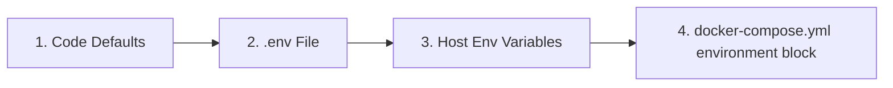

# 🐳 Advanced Docker Guide

This guide provides a deeper look into the Docker configuration for LibreFolio, intended for users who want to customize their deployment.

## ⚠️ Prerequisites

!!! warning "Docker group (Linux)"

    On Linux, your user must be in the `docker` group to run Docker commands without `sudo`:

    ```bash
    sudo usermod -aG docker $USER
    ```

    Then **log out and log back in**, or run `newgrp docker` to activate the group in the current session. Without this, all `docker` and `docker compose` commands will fail with a permission error.

!!! warning "`.env` file required"

    LibreFolio requires a `.env` file in the project root. If it's missing, `./dev.py docker build` will refuse to proceed.

    ```bash
    cp .env.example .env
    $EDITOR .env          # review and customize parameters
    ```

## 🏗️ Architecture

LibreFolio uses a **runtime-only Docker image**. The frontend (SvelteKit) and documentation (MkDocs) are built on the host and then copied into the image. The `./dev.py docker build` command handles this automatically.

```text
Host (build)                    Docker Image (runtime)
┌──────────────┐                ┌──────────────────────┐
│ frontend/src │──npm build──▶  │ frontend/build/      │
│ mkdocs_src/  │──mkdocs ───▶   │ mkdocs_src/site/     │
│ backend/     │──copy──────▶   │ backend/             │
│ Pipfile*     │──pipenv ───▶   │ Python packages      │
└──────────────┘                └──────────────────────┘
```

## 📄 `docker-compose.yml`

The `docker-compose.yml` file defines the service and persistent data directory.

### 🔝 Resolution Priority {: #resolution-priority }

When resolving configuration variables, LibreFolio respects the following order of precedence (from lowest to highest priority):



### 🔧 Service: `librefolio`

- 🏗️ **`build: .`**: Builds from the `Dockerfile` in the project root.
- 🔌 **`ports`**: Maps the host port (`${PORT:-6040}`) to the container's port `6040`, and `${TEST_PORT:-6041}` to `6041` for test mode.
- 📂 **`volumes`**: A bind mount `./LibreFolio-data` → `/app/backend/data/prod-docker` persists database, uploads, broker reports, and logs **in the same directory as `docker-compose.yml`**.
- 📝 **`env_file: .env`**: Loads all configuration from the `.env` file (copied from `.env.example`).
- 🌍 **`environment`**: Overrides only Docker-specific values: `LIBREFOLIO_DATA_DIR` (container path) and `HOST=0.0.0.0`.
- 🩺 **`healthcheck`**: Polls `GET /api/v1/system/health` every 30 seconds.

### 💾 Data Directory: `LibreFolio-data/`

A **bind mount** directory created alongside `docker-compose.yml`. Contains the SQLite database, custom uploads, broker reports, and log files. Data survives container stop/restart/removal. You can back it up directly from the host filesystem.

### 👤 User & Permissions

The LibreFolio container runs as a **non-root user** for security. The default UID/GID is `1000:1000`. Files created by the application in `LibreFolio-data/` will be owned by this UID/GID on the host.

#### Choosing the right UID and GID

Set `UID` and `GID` in your `.env` file to match the **host user** (or dedicated user) that should own the data files:

```bash
UID=1000
GID=1000
```


!!! note "How `ls -l` shows ownership"

    On the **host**, `ls -l LibreFolio-data/` shows your chosen user/group name (resolved from UID/GID via `/etc/passwd`).

    **Inside the container**, the same files show as `librefolio:librefolio` — it's the same numeric UID/GID, just resolved against the container's own `/etc/passwd`.

??? tip "Linux cheatsheet: users, groups, and IDs"

    **Discover your current UID and GID:**

    ```bash
    id -u              # your user ID (e.g. 1000)
    id -g              # your primary group ID (e.g. 1000)
    id                 # full info: uid, gid, groups
    ```

    **Find the UID/GID of any user:**

    ```bash
    id -u username     # UID of 'username'
    id -g username     # primary GID of 'username'
    ```

    **Create a new group:**

    ```bash
    sudo groupadd librefolio          # create group (auto-assigns GID)
    sudo groupadd -g 1500 librefolio  # create group with specific GID
    ```

    **Create a new user:**

    ```bash
    # System user (no home, no login — ideal for services)
    sudo useradd --system --no-create-home --gid librefolio --shell /usr/sbin/nologin librefolio

    # Regular user with home directory
    sudo useradd -m -g librefolio librefolio
    ```

    **Check the assigned IDs:**

    ```bash
    id librefolio
    # → uid=998(librefolio) gid=998(librefolio) groups=998(librefolio)
    ```

    **Add your existing user to a group:**

    ```bash
    sudo usermod -aG librefolio $USER
    newgrp librefolio    # activate in current session (or log out/in)
    ```

    **Verify group membership:**

    ```bash
    groups $USER         # list all groups for your user
    ```

    **Set ownership of the data directory:**

    ```bash
    sudo chown -R librefolio:librefolio ./LibreFolio-data
    ```

    Then set the matching UID/GID in `.env`.

## 🛠️ CLI Commands

All Docker operations are available through `dev.py`:

```bash
./dev.py docker build          # Build image (auto-builds frontend + docs)
./dev.py docker build --no-cache  # Full rebuild without Docker cache
./dev.py docker rebuild        # Build → stop → restart (one-step deploy)
./dev.py docker up             # Start containers
./dev.py docker down           # Stop containers
./dev.py docker logs -f        # Follow container logs
./dev.py docker status         # Show container status
./dev.py docker exec <cmd>     # Run a dev.py command inside the container
```

!!! tip "Documentation with screenshots"

    If you are building the documentation and want complete screenshots in the gallery, run:

    ```bash
    ./dev.py mkdocs --gallery
    ```

    This requires a fully installed environment (with `pipenv`) and a running server with populated test data. Be patient — gallery generation takes a few minutes.

### 📡 `docker exec` — Running Commands Inside the Container

The `docker exec` subcommand forwards any `dev.py` command into the running container:

```bash
./dev.py docker exec user create admin admin@example.com Pass123!
./dev.py docker exec user list
./dev.py docker exec db upgrade
./dev.py docker exec server --test
```

This is equivalent to running `docker compose exec librefolio python dev.py <cmd>`.

## 🧪 Test Mode

The Docker Compose configuration exposes **two ports**:

| Port | Purpose | Database |
|------|---------|----------|
| `6040` | Production server (started by container CMD) | `prod-docker/sqlite/app.db` (persistent volume) |
| `6041` | Test server (started manually via `docker exec`) | `test/sqlite/app.db` (ephemeral) |

### Starting the Test Server

1. **Start the container** (production server starts automatically on `:6040`):

    ```bash
    docker compose up -d
    ```

2. **Populate the test database** with mock data:

    ```bash
    ./dev.py docker exec test db populate --force --with-static
    ```

3. **Start the test server** on port 6041:

    ```bash
    ./dev.py docker exec server --test
    ```

4. **Access** at **`http://localhost:6041`**

    Test credentials:

    | Username | Password |
    |----------|----------|
    | `e2e_test_user` | `E2eTestPass123!` |
    | `e2e_test_admin` | `E2eAdminPass123!` |

!!! warning "Test data is ephemeral"

    The test database lives inside the container's **writable layer**, not on a persistent bind mount. This means:

    - ✅ Data survives `docker compose stop` / `docker compose start` (container is paused, not removed).
    - ❌ Data is **lost** with `docker compose down` (container is removed and recreated).

    If you need persistent test data, add a dedicated bind mount in `docker-compose.yml`:

    ```yaml
    volumes:
      - ./LibreFolio-data:/app/backend/data/prod-docker
      - ./LibreFolio-test-data:/app/backend/data/test    # ← add this
    ```

## 🏭 Production Considerations

### 🎮 1. Customizing `docker-compose.yml`

The repository includes a ready-to-use `docker-compose.yml`. Here is the full file with annotations showing what you can customize:

```yaml
services:
  librefolio:
    image: librefolio:latest           # Built by ./dev.py docker build
    build:
      context: .
      args:
        UID: ${UID:-1000}              # (1) Match host user UID
        GID: ${GID:-1000}              # (1) Match host user GID
    container_name: librefolio
    # No 'user:' directive — entrypoint starts as root, fixes permissions,
    # then drops to 'librefolio' user via gosu (same pattern as postgres/redis).
    restart: unless-stopped
    ports:
      - "${PORT:-6040}:6040"           # (2) Production port — change via PORT in .env
      - "${TEST_PORT:-6041}:6041"      # (3) Test server port (optional)
    volumes:
      - ./LibreFolio-data:/app/backend/data/prod-docker  # (4) Persistent data (bind mount)
    env_file: .env                     # (5) All config from .env file
    environment:
      - LIBREFOLIO_DATA_DIR=/app/backend/data/prod-docker  # Docker-specific override
      - HOST=0.0.0.0
    healthcheck:
      test: ["CMD", "python", "-c", "import urllib.request; urllib.request.urlopen('http://localhost:6040/api/v1/system/health')"]
      interval: 30s
      timeout: 10s
      start_period: 15s
      retries: 3
```

**Common customizations:**

| # | What | How |
|---|------|-----|
| (1) | Match host UID/GID | Set `UID=1001` and `GID=1001` in `.env`, then rebuild |
| (2) | Change production port | Set `PORT=3000` in `.env` |
| (3) | Disable test port | Remove the `TEST_PORT` line from `ports:` |
| (4) | Custom data path | Change bind mount: `./my-data:/app/backend/data/prod-docker` |
| (5) | All configuration | Edit `.env` file (copied from `.env.example`) |

!!! tip "First user"

    The first time you access LibreFolio in the browser, you'll see a registration page. Create your account directly — the first user automatically becomes the administrator. No CLI needed.

### 🔒 2. Security and Exposure (Tailscale and Reverse Proxy)

It is highly recommended to expose LibreFolio securely using **Tailscale** (recommended and simplest choice) or behind a classic reverse proxy like **Nginx** or **Traefik**.

*   **Tailscale (Recommended)**: Allows you to expose LibreFolio securely with automatic HTTPS, without opening router ports or setting up public DNS records. See the detailed **[Tailscale Exposure Guide](service_exposure.md)**.
*   **Classic Reverse Proxy (Nginx/Traefik)**: Useful if you already have an existing web infrastructure or want to:
    - 🔐 Manage custom SSL/TLS certificates for HTTPS.
    - 🖥️ Serve multiple applications on the same server.
    - 🛡️ Add custom security headers and rate limiting.

### 💾 3. Database Backup

The database is stored in the `LibreFolio-data/` directory alongside `docker-compose.yml`. Back it up directly from the host filesystem:

```bash
#!/bin/bash
cp ./LibreFolio-data/sqlite/app.db /path/to/backups/app.db-$(date +%F)
```

No `docker cp` needed — the data directory is a bind mount accessible from the host.

### 🔑 4. Environment Variables

All configuration is managed in the `.env` file (copied from `.env.example`). The Docker-specific overrides in the `environment:` block should not be changed.

For a complete list of all configurable environment variables (including those in the `.env` file and system parameters managed by Docker/CLI) and to understand how each one affects the application's behavior, see the detailed **[Configuration Guide](configuration.md)**.
