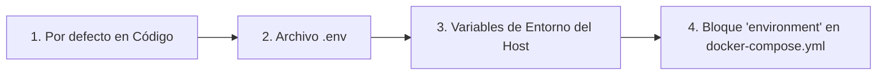

# 🐳 Guía Avanzada de Docker

Esta guía proporciona una mirada más profunda a la configuración de Docker para LibreFolio, destinada a usuarios que deseen personalizar su despliegue.

## ⚠️ Prerrequisitos

!!! warning "Grupo Docker (Linux)"

    En Linux, su usuario debe pertenecer al grupo `docker` para ejecutar comandos de Docker sin `sudo`:

    ```bash
    sudo usermod -aG docker $USER
    ```

    Luego **cierre sesión y vuelva a iniciar sesión**, o ejecute `newgrp docker` para activar el grupo en la sesión actual. Sin esto, todos los comandos `docker` y `docker compose` fallarán con un error de permisos.

!!! warning "Archivo `.env` requerido"

    LibreFolio requiere un archivo `.env` en la raíz del proyecto. Si falta, `./dev.py docker build` se negará a proceder.

    ```bash
    cp .env.example .env
    $EDITOR .env          # review and customize parameters
    ```

## 🏗️ Arquitectura

LibreFolio utiliza una **imagen de Docker solo de tiempo de ejecución (runtime-only)**. El frontend (SvelteKit) y la documentación (MkDocs) se construyen en el host y luego se copian en la imagen. El comando `./dev.py docker build` gestiona esto automáticamente.

```text
Host (build)                    Docker Image (runtime)
┌──────────────┐                ┌──────────────────────┐
│ frontend/src │──npm build──▶  │ frontend/build/      │
│ mkdocs_src/  │──mkdocs ───▶   │ mkdocs_src/site/     │
│ backend/     │──copy──────▶   │ backend/             │
│ Pipfile*     │──pipenv ───▶   │ Python packages      │
└──────────────┘                └──────────────────────┘
```

## 📄 `docker-compose.yml`

El archivo `docker-compose.yml` define el servicio y el directorio de datos persistentes.

### 🔝 Prioridad de Resolución {: #resolution-priority }

Al resolver variables de configuración, LibreFolio respeta el siguiente orden de precedencia (de menor a mayor prioridad):




### 🔧 Servicio: `librefolio`

- 🏗️ **`build: .`**: Construye a partir del `Dockerfile` en la raíz del proyecto.
- 🔌 **`ports`**: Mapea el puerto del host (`${PORT:-6040}`) al puerto `6040` del contenedor, y `${TEST_PORT:-6041}` al `6041` para el modo de prueba.
- 📂 **`volumes`**: Un montaje de enlace (bind mount) `./LibreFolio-data` → `/app/backend/data/prod-docker` persiste la base de datos, las subidas, los informes del bróker y los logs **en el mismo directorio que `docker-compose.yml`**.
- 📝 **`env_file: .env`**: Carga toda la configuración desde el archivo `.env` (copiado de `.env.example`).
- 🌍 **`environment`**: Sobrescribe solo los valores específicos de Docker: `LIBREFOLIO_DATA_DIR` (ruta del contenedor) y `HOST=0.0.0.0`.
- 🩺 **`healthcheck`**: Consulta `GET /api/v1/system/health` cada 30 segundos.

### 💾 Directorio de Datos: `LibreFolio-data/`

Un directorio de **montaje de enlace (bind mount)** creado junto a `docker-compose.yml`. Contiene la base de datos SQLite, subidas personalizadas, informes del bróker y archivos de log. Los datos sobreviven a la detención, el reinicio o la eliminación del contenedor. Puede realizar copias de seguridad directamente desde el sistema de archivos del host.

### 👤 Usuario y Permisos

El contenedor de LibreFolio se ejecuta como un **usuario no root** por seguridad. El UID/GID predeterminado es `1000:1000`. Los archivos creados por la aplicación en `LibreFolio-data/` pertenecerán a este UID/GID en el host.

#### Elegir el UID y GID correctos

Configure `UID` y `GID` en su archivo `.env` para que coincidan con el **usuario del host** (o usuario dedicado) que debe poseer los archivos de datos:

```bash
UID=1000
GID=1000
```

!!! note "Cómo `ls -l` muestra la propiedad"

    En el **host**, `ls -l LibreFolio-data/` muestra el nombre de usuario/grupo elegido (resuelto desde UID/GID vía `/etc/passwd`).

    **Dentro del contenedor**, los mismos archivos se muestran como `librefolio:librefolio`; es el mismo UID/GID numérico, solo que resuelto contra el `/etc/passwd` del propio contenedor.

??? tip "Chuleta de Linux: usuarios, grupos e IDs"

    **Descubra su UID y GID actuales:**

    ```bash
    id -u              # your user ID (e.g. 1000)
    id -g              # your primary group ID (e.g. 1000)
    id                 # full info: uid, gid, groups
    ```

    **Encuentre el UID/GID de cualquier usuario:**

    ```bash
    id -u username     # UID of 'username'
    id -g username     # primary GID of 'username'
    ```

    **Crear un nuevo grupo:**

    ```bash
    sudo groupadd librefolio          # create group (auto-assigns GID)
    sudo groupadd -g 1500 librefolio  # create group with specific GID
    ```

    **Crear un nuevo usuario:**

    ```bash
    # System user (no home, no login — ideal for services)
    sudo useradd --system --no-create-home --gid librefolio --shell /usr/sbin/nologin librefolio

    # Regular user with home directory
    sudo useradd -m -g librefolio librefolio
    ```

    **Verificar los IDs asignados:**

    ```bash
    id librefolio
    # → uid=998(librefolio) gid=998(librefolio) groups=998(librefolio)
    ```

    **Añadir su usuario existente a un grupo:**

    ```bash
    sudo usermod -aG librefolio $USER
    newgrp librefolio    # activate in current session (or log out/in)
    ```

    **Verificar la pertenencia al grupo:**

    ```bash
    groups $USER         # list all groups for your user
    ```

    **Establecer la propiedad del directorio de datos:**

    ```bash
    sudo chown -R librefolio:librefolio ./LibreFolio-data
    ```

    Luego establezca el UID/GID coincidente en `.env`.

## 🛠️ Comandos de la CLI

Todas las operaciones de Docker están disponibles a través de `dev.py`:

```bash
./dev.py docker build          # Build image (auto-builds frontend + docs)
./dev.py docker build --no-cache  # Full rebuild without Docker cache
./dev.py docker rebuild        # Build → stop → restart (one-step deploy)
./dev.py docker up             # Start containers
./dev.py docker down           # Stop containers
./dev.py docker logs -f        # Follow container logs
./dev.py docker status         # Show container status
./dev.py docker exec <cmd>     # Run a dev.py command inside the container
```

!!! tip "Documentación con capturas de pantalla"

    Si está construyendo la documentación y desea capturas de pantalla completas en la galería, ejecute:

    ```bash
    ./dev.py mkdocs --gallery
    ```

    Esto requiere un entorno completamente instalado (con `pipenv`) y un servidor en ejecución con datos de prueba cargados. Sea paciente: la generación de la galería tarda unos minutos.

### 📡 `docker exec` — Ejecución de Comandos Dentro del Contenedor

El subcomando `docker exec` redirige cualquier comando de `dev.py` al contenedor en ejecución:

```bash
./dev.py docker exec user create admin admin@example.com Pass123!
./dev.py docker exec user list
./dev.py docker exec db upgrade
./dev.py docker exec server --test
```

Esto es equivalente a ejecutar `docker compose exec librefolio python dev.py <cmd>`.

## 🧪 Modo de Prueba { #test-mode }

La configuración de Docker Compose expone **dos puertos**:

| Puerto | Propósito | Base de Datos |
|------|---------|----------|
| `6040` | Servidor de producción (iniciado por el CMD del contenedor) | `prod-docker/sqlite/app.db` (volumen persistente) |
| `6041` | Servidor de prueba (iniciado manualmente vía `docker exec`) | `test/sqlite/app.db` (efímero) |

### Iniciar el Servidor de Prueba

1. **Inicie el contenedor** (el servidor de producción se inicia automáticamente en `:6040`):

    ```bash
    docker compose up -d
    ```

2. **Cargue la base de datos de prueba** con datos simulados:

    ```bash
    ./dev.py docker exec test db populate --force --with-static
    ```

3. **Inicie el servidor de prueba** en el puerto 6041:

    ```bash
    ./dev.py docker exec server --test
    ```

4. **Acceda** en **`http://localhost:6041`**

    Credenciales de prueba:

    | Usuario | Contraseña |
    |----------|----------|
    | `e2e_test_user` | `E2eTestPass123!` |
    | `e2e_test_admin` | `E2eAdminPass123!` |

!!! warning "Los datos de prueba son efímeros"

    La base de datos de prueba reside dentro de la **capa escribible** del contenedor, no en un montaje de enlace persistente. Esto significa que:

    - ✅ Los datos sobreviven a `docker compose stop` / `docker compose start` (el contenedor se pausa, no se elimina).
    - ❌ Los datos se **pierden** con `docker compose down` (el contenedor se elimina y se recrea).

    Si necesita datos de prueba persistentes, añada un montaje de enlace dedicado en `docker-compose.yml`:

    ```yaml
    volumes:
      - ./LibreFolio-data:/app/backend/data/prod-docker
      - ./LibreFolio-test-data:/app/backend/data/test    # ← add this
    ```

## 🏭 Consideraciones de Producción

### 🎮 1. Personalización de `docker-compose.yml`

El repositorio incluye un `docker-compose.yml` listo para usar. Aquí está el archivo completo con anotaciones que muestran lo que puede personalizar:

```yaml
services:
  librefolio:
    image: librefolio:latest           # Built by ./dev.py docker build
    build:
      context: .
      args:
        UID: ${UID:-1000}              # (1) Match host user UID
        GID: ${GID:-1000}              # (1) Match host user GID
    container_name: librefolio
    # No 'user:' directive — entrypoint starts as root, fixes permissions,
    # then drops to 'librefolio' user via gosu (same pattern as postgres/redis).
    restart: unless-stopped
    ports:
      - "${PORT:-6040}:6040"           # (2) Production port — change via PORT in .env
      - "${TEST_PORT:-6041}:6041"      # (3) Test server port (optional)
    volumes:
      - ./LibreFolio-data:/app/backend/data/prod-docker  # (4) Persistent data (bind mount)
    env_file: .env                     # (5) All config from .env file
    environment:
      - LIBREFOLIO_DATA_DIR=/app/backend/data/prod-docker  # Docker-specific override
      - HOST=0.0.0.0
    healthcheck:
      test: ["CMD", "python", "-c", "import urllib.request; urllib.request.urlopen('http://localhost:6040/api/v1/system/health')"]
      interval: 30s
      timeout: 10s
      start_period: 15s
      retries: 3
```

**Personalizaciones comunes:**

| # | Qué personalizar | Cómo |
|---|------|-----|
| (1) | Coincidir UID/GID del host | Establecer `UID=1001` y `GID=1001` en `.env`, luego reconstruir |
| (2) | Cambiar puerto de producción | Establecer `PORT=3000` en `.env` |
| (3) | Desactivar puerto de prueba | Eliminar la línea `TEST_PORT` de `ports:` |
| (4) | Ruta de datos personalizada | Cambiar montaje: `./my-data:/app/backend/data/prod-docker` |
| (5) | Toda la configuración | Editar archivo `.env` (copiado de `.env.example`) |

!!! tip "Primer usuario"

    La primera vez que acceda a LibreFolio en el navegador, verá una página de registro. Cree su cuenta directamente; el primer usuario se convierte automáticamente en el administrador. No se necesita la CLI.

### 🔒 2. Seguridad y Exposición (Tailscale y Proxy Inverso)

Se recomienda encarecidamente exponer LibreFolio de forma segura utilizando **Tailscale** (la opción recomendada y más sencilla) o detrás de un proxy inverso clásico como **Nginx** o **Traefik**.

*   **Tailscale (Opción Recomendada)**: Permite exponer LibreFolio de forma segura con HTTPS automático, sin abrir puertos en el router ni configurar registros DNS públicos. Consulte la guía detallada de **[Exposición con Tailscale](tailscale_exposure.md)**.
*   **Proxy Inverso Clásico (Nginx/Traefik)**: Útil si ya tiene una infraestructura web existente o desea:
    - 🔐 Gestionar certificados SSL/TLS personalizados para HTTPS.
    - 🖥️ Servir múltiples aplicaciones en el mismo servidor.
    - 🛡️ Añadir cabeceras de seguridad y limitación de solicitudes (rate limiting).

### 💾 3. Copia de Seguridad de la Base de Datos

La base de datos se almacena en el directorio `LibreFolio-data/` junto a `docker-compose.yml`. Haga una copia de seguridad directamente desde el sistema de archivos del host:

```bash
#!/bin/bash
cp ./LibreFolio-data/sqlite/app.db /path/to/backups/app.db-$(date +%F)
```

No es necesario usar `docker cp`; el directorio de datos es un montaje de enlace accesible desde el host.

### 🔑 4. Variables de Entorno

Toda la configuración se gestiona en el archivo `.env` (copiado de `.env.example`). Las sobrescrituras específicas de Docker en el bloque `environment:` no deben cambiarse.

Para obtener una lista completa de todas las variables de entorno configurables (incluidas las del archivo `.env` y los parámetros del sistema gestionados por Docker/CLI) y comprender cómo afecta cada una al comportamiento de la aplicación, consulte la guía detallada de **[Configuración](configuration.md)**.
