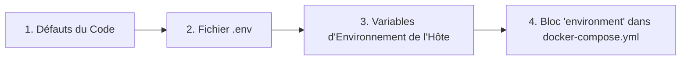

# 🐳 Guide Docker Avancé

Ce guide propose un examen approfondi de la configuration Docker pour LibreFolio, destiné aux utilisateurs qui souhaitent personnaliser leur déploiement.

## ⚠️ Prérequis

!!! warning "Groupe Docker (Linux)"

    Sur Linux, votre utilisateur doit appartenir au groupe `docker` pour exécuter les commandes Docker sans `sudo` :

    ```bash
    sudo usermod -aG docker $USER
    ```

    Ensuite, **déconnectez-vous et reconnectez-vous**, ou exécutez `newgrp docker` pour activer le groupe dans la session actuelle. Sans cela, toutes les commandes `docker` et `docker compose` échoueront avec une erreur de permission.

!!! warning "Fichier `.env` requis"

    LibreFolio nécessite un fichier `.env` à la racine du projet. S'il est manquant, `./dev.py docker build` refusera de continuer.

    ```bash
    cp .env.example .env
    $EDITOR .env          # review and customize parameters
    ```

## 🏗️ Architecture

LibreFolio utilise une **image Docker "runtime-only"**. Le frontend (SvelteKit) et la documentation (MkDocs) sont générés sur l'hôte, puis copiés dans l'image. La commande `./dev.py docker build` gère cela automatiquement.

```text
Host (build)                    Docker Image (runtime)
┌──────────────┐                ┌──────────────────────┐
│ frontend/src │──npm build──▶  │ frontend/build/      │
│ mkdocs_src/  │──mkdocs ───▶   │ mkdocs_src/site/     │
│ backend/     │──copy──────▶   │ backend/             │
│ Pipfile*     │──pipenv ───▶   │ Python packages      │
└──────────────┘                └──────────────────────┘
```

## 📄 `docker-compose.yml`

Le fichier `docker-compose.yml` définit le service et le répertoire de données persistantes.

### 🔝 Priorité de Résolution {: #resolution-priority }

Lors de la résolution des variables de configuration, LibreFolio respecte l'ordre de priorité suivant (de la priorité la plus basse à la plus haute) :




### 🔧 Service : `librefolio`

- 🏗️ **`build: .`** : Construit à partir du `Dockerfile` situé à la racine du projet.
- 🔌 **`ports`** : Mappe le port de l'hôte (`${PORT:-6040}`) vers le port `6040` du conteneur, et `${TEST_PORT:-6041}` vers `6041` pour le mode test.
- 📂 **`volumes`** : Un montage lié (bind mount) `./LibreFolio-data` → `/app/backend/data/prod-docker` permet de persister la base de données, les téléchargements, les rapports de courtier et les logs **dans le même répertoire que `docker-compose.yml`**.
- 📝 **`env_file: .env`** : Charge toute la configuration depuis le fichier `.env` (copié depuis `.env.example`).
- 🌍 **`environment`** : Écrase uniquement les valeurs spécifiques à Docker : `LIBREFOLIO_DATA_DIR` (chemin dans le conteneur) et `HOST=0.0.0.0`.
- 🩺 **`healthcheck`** : Interroge `GET /api/v1/system/health` toutes les 30 secondes.

### 💾 Répertoire de données : `LibreFolio-data/`

Un répertoire de **montage lié** créé à côté de `docker-compose.yml`. Il contient la base de données SQLite, les téléchargements personnalisés, les rapports de courtier et les fichiers de logs. Les données survivent à l'arrêt, au redémarrage ou à la suppression du conteneur. Vous pouvez les sauvegarder directement depuis le système de fichiers de l'hôte.

### 👤 Utilisateur et Permissions

Le conteneur LibreFolio s'exécute avec un **utilisateur non-root** pour des raisons de sécurité. L'UID/GID par défaut est `1000:1000`. Les fichiers créés par l'application dans `LibreFolio-data/` appartiendront à cet UID/GID sur l'hôte.

#### Choisir le bon UID et GID

Définissez `UID` et `GID` dans votre fichier `.env` pour qu'ils correspondent à l'**utilisateur hôte** (ou utilisateur dédié) qui doit être le propriétaire des fichiers de données :

```bash
UID=1000
GID=1000
```

!!! note "Comment `ls -l` affiche la propriété"

    Sur l'**hôte**, `ls -l LibreFolio-data/` affiche le nom de l'utilisateur/groupe choisi (résolu à partir de l'UID/GID via `/etc/passwd`).

    **À l'intérieur du conteneur**, les mêmes fichiers apparaissent comme `librefolio:librefolio` — c'est le même UID/GID numérique, simplement résolu par rapport au fichier `/etc/passwd` du conteneur.

??? tip "Aide-mémoire Linux : utilisateurs, groupes et IDs"

    **Découvrir votre UID et GID actuels :**

    ```bash
    id -u              # your user ID (e.g. 1000)
    id -g              # your primary group ID (e.g. 1000)
    id                 # full info: uid, gid, groups
    ```

    **Trouver l'UID/GID de n'importe quel utilisateur :**

    ```bash
    id -u username     # UID of 'username'
    id -g username     # primary GID of 'username'
    ```

    **Créer un nouveau groupe :**

    ```bash
    sudo groupadd librefolio          # create group (auto-assigns GID)
    sudo groupadd -g 1500 librefolio  # create group with specific GID
    ```

    **Créer un nouvel utilisateur :**

    ```bash
    # System user (no home, no login — ideal for services)
    sudo useradd --system --no-create-home --gid librefolio --shell /usr/sbin/nologin librefolio

    # Regular user with home directory
    sudo useradd -m -g librefolio librefolio
    ```

    **Vérifier les IDs assignés :**

    ```bash
    id librefolio
    # → uid=998(librefolio) gid=998(librefolio) groups=998(librefolio)
    ```

    **Ajouter votre utilisateur actuel à un groupe :**

    ```bash
    sudo usermod -aG librefolio $USER
    newgrp librefolio    # activate in current session (or log out/in)
    ```

    **Vérifier l'appartenance aux groupes :**

    ```bash
    groups $USER         # list all groups for your user
    ```

    **Définir la propriété du répertoire de données :**

    ```bash
    sudo chown -R librefolio:librefolio ./LibreFolio-data
    ```

    Ensuite, définissez l'UID/GID correspondant dans `.env`.

## 🛠️ Commandes CLI

Toutes les opérations Docker sont disponibles via `dev.py` :

```bash
./dev.py docker build          # Build image (auto-builds frontend + docs)
./dev.py docker build --no-cache  # Full rebuild without Docker cache
./dev.py docker rebuild        # Build → stop → restart (one-step deploy)
./dev.py docker up             # Start containers
./dev.py docker down           # Stop containers
./dev.py docker logs -f        # Follow container logs
./dev.py docker status         # Show container status
./dev.py docker exec <cmd>     # Run a dev.py command inside the container
```

!!! tip "Documentation avec captures d'écran"

    Si vous compilez la documentation et souhaitez des captures d'écran complètes dans la galerie, exécutez :

    ```bash
    ./dev.py mkdocs --gallery
    ```

    Ceci nécessite un environnement complet installé (avec `pipenv`) et un serveur en cours d'exécution avec des données de test. Soyez patient — la génération de la galerie prend quelques minutes.

### 📡 `docker exec` — Exécuter des commandes dans le conteneur

La sous-commande `docker exec` redirige n'importe quelle commande `dev.py` vers le conteneur en cours d'exécution :

```bash
./dev.py docker exec user create admin admin@example.com Pass123!
./dev.py docker exec user list
./dev.py docker exec db upgrade
./dev.py docker exec server --test
```

Ceci est équivalent à l'exécution de `docker compose exec librefolio python dev.py <cmd>`.

## 🧪 Mode Test { #test-mode }

La configuration Docker Compose expose **deux ports** :

| Port | Usage | Base de données |
|------|---------|----------|
| `6040` | Serveur de production (lancé par le CMD du conteneur) | `prod-docker/sqlite/app.db` (volume persistant) |
| `6041` | Serveur de test (lancé manuellement via `docker exec`) | `test/sqlite/app.db` (éphémère) |

### Démarrer le serveur de test

1. **Démarrer le conteneur** (le serveur de production démarre automatiquement sur `:6040`) :

    ```bash
    docker compose up -d
    ```

2. **Remplir la base de données de test** avec des données fictives :

    ```bash
    ./dev.py docker exec test db populate --force --with-static
    ```

3. **Démarrer le serveur de test** sur le port 6041 :

    ```bash
    ./dev.py docker exec server --test
    ```

4. **Accéder** à l'adresse **`http://localhost:6041`**

    Identifiants de test :

    | Utilisateur | Mot de passe |
    |----------|----------|
    | `e2e_test_user` | `E2eTestPass123!` |
    | `e2e_test_admin` | `E2eAdminPass123!` |

!!! warning "Les données de test sont éphémères"

    La base de données de test réside dans la **couche d'écriture** du conteneur, et non sur un montage lié persistant. Cela signifie que :

    - ✅ Les données survivent à `docker compose stop` / `docker compose start` (le conteneur est mis en pause, pas supprimé).
    - ❌ Les données sont **perdues** avec `docker compose down` (le conteneur est supprimé et recréé).

    Si vous avez besoin de données de test persistantes, ajoutez un montage lié dédié dans `docker-compose.yml` :

    ```yaml
    volumes:
      - ./LibreFolio-data:/app/backend/data/prod-docker
      - ./LibreFolio-test-data:/app/backend/data/test    # ← add this
    ```

## 🏭 Considérations pour la Production

### 🎮 1. Personnalisation de `docker-compose.yml`

Le dépôt inclut un fichier `docker-compose.yml` prêt à l'emploi. Voici le fichier complet avec des annotations montrant ce que vous pouvez personnaliser :

```yaml
services:
  librefolio:
    image: librefolio:latest           # Built by ./dev.py docker build
    build:
      context: .
      args:
        UID: ${UID:-1000}              # (1) Match host user UID
        GID: ${GID:-1000}              # (1) Match host user GID
    container_name: librefolio
    # No 'user:' directive — entrypoint starts as root, fixes permissions,
    # then drops to 'librefolio' user via gosu (same pattern as postgres/redis).
    restart: unless-stopped
    ports:
      - "${PORT:-6040}:6040"           # (2) Production port — change via PORT in .env
      - "${TEST_PORT:-6041}:6041"      # (3) Test server port (optional)
    volumes:
      - ./LibreFolio-data:/app/backend/data/prod-docker  # (4) Persistent data (bind mount)
    env_file: .env                     # (5) All config from .env file
    environment:
      - LIBREFOLIO_DATA_DIR=/app/backend/data/prod-docker  # Docker-specific override
      - HOST=0.0.0.0
    healthcheck:
      test: ["CMD", "python", "-c", "import urllib.request; urllib.request.urlopen('http://localhost:6040/api/v1/system/health')"]
      interval: 30s
      timeout: 10s
      start_period: 15s
      retries: 3
```

**Personnalisations courantes :**

| # | Quoi | Comment |
|---|------|-----|
| (1) | Faire correspondre l'UID/GID de l'hôte | Définir `UID=1001` et `GID=1001` dans `.env`, puis recompiler |
| (2) | Changer le port de production | Définir `PORT=3000` dans `.env` |
| (3) | Désactiver le port de test | Supprimer la ligne `TEST_PORT` dans `ports:` |
| (4) | Chemin de données personnalisé | Changer le montage : `./my-data:/app/backend/data/prod-docker` |
| (5) | Toute la configuration | Éditer le fichier `.env` (copié depuis `.env.example`) |

!!! tip "Premier utilisateur"

    La première fois que vous accédez à LibreFolio dans le navigateur, vous verrez une page d'inscription. Créez votre compte directement — le premier utilisateur devient automatiquement l'administrateur. Aucune commande CLI n'est nécessaire.

### 🔒 2. Sécurité et Exposition (Tailscale et Proxy Inverse)

Il est fortement recommandé d'exposer LibreFolio de manière sécurisée en utilisant **Tailscale** (le choix recommandé et le plus simple) ou derrière un proxy inverse classique comme **Nginx** ou **Traefik**.

*   **Tailscale (Choix Recommandé)** : Vous permet d'exposer LibreFolio en toute sécurité avec du HTTPS automatique, sans ouvrir de ports sur le routeur ni configurer d'enregistrements DNS publics. Voir le guide détaillé sur **[Exposition avec Tailscale](tailscale_exposure.md)**.
*   **Proxy Inverse Classique (Nginx/Traefik)** : Utile si vous disposez déjà d'une infrastructure web existante ou souhaitez :
    - 🔐 Gérer des certificats SSL/TLS personnalisés pour le HTTPS.
    - 🖥️ Héberger plusieurs applications sur le même serveur.
    - 🛡️ Ajouter des en-têtes de sécurité et une limitation du nombre de requêtes.

### 💾 3. Sauvegarde de la Base de Données

La base de données est stockée dans le répertoire `LibreFolio-data/` à côté de `docker-compose.yml`. Sauvegardez-la directement depuis le système de fichiers de l'hôte :

```bash
#!/bin/bash
cp ./LibreFolio-data/sqlite/app.db /path/to/backups/app.db-$(date +%F)
```

Aucun `docker cp` n'est nécessaire — le répertoire de données est un montage lié accessible depuis l'hôte.

### 🔑 4. Variables d'Environnement

Toute la configuration est gérée dans le fichier `.env` (copié depuis `.env.example`). Les écrasements spécifiques à Docker dans le bloc `environment:` ne doivent pas être modifiés.

Pour obtenir la liste complète de toutes les variables d'environnement configurables (y compris celles du fichier `.env` et les paramètres système gérés par Docker/CLI) et pour comprendre comment chacune affecte le comportement de l'application, consultez le guide détaillé de **[Configuration](configuration.md)**.
