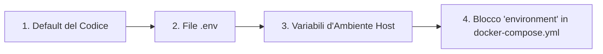

# 🐳 Guida Avanzata a Docker

Questa guida fornisce un approfondimento sulla configurazione Docker per LibreFolio, destinata agli utenti che desiderano personalizzare la propria installazione.

## ⚠️ Prerequisiti

!!! warning "Docker group (Linux)"

    Su Linux, il tuo utente deve appartenere al gruppo `docker` per eseguire i comandi Docker senza `sudo`:

    ```bash
    sudo usermod -aG docker $USER
    ```

    Successivamente, effettua il **logout e accedi nuovamente**, oppure esegui `newgrp docker` per attivare il gruppo nella sessione corrente. Senza questo passaggio, tutti i comandi `docker` e `docker compose` falliranno con un errore di permessi.

!!! warning "`.env` file required"

    LibreFolio richiede un file `.env` nella root del progetto. Se manca, `./dev.py docker build` si rifiuterà di procedere.

    ```bash
    cp .env.example .env
    $EDITOR .env          # review and customize parameters
    ```

## 🏗️ Architettura

LibreFolio utilizza un'**immagine Docker solo per il runtime**. Il frontend (SvelteKit) e la documentazione (MkDocs) vengono compilati sull'host e poi copiati nell'immagine. Il comando `./dev.py docker build` gestisce questo processo automaticamente.

```text
Host (build)                    Docker Image (runtime)
┌──────────────┐                ┌──────────────────────┐
│ frontend/src │──npm build──▶  │ frontend/build/      │
│ mkdocs_src/  │──mkdocs ───▶   │ mkdocs_src/site/     │
│ backend/     │──copy──────▶   │ backend/             │
│ Pipfile*     │──pipenv ───▶   │ Python packages      │
└──────────────┘                └──────────────────────┘
```

## 📄 `docker-compose.yml`

Il file `docker-compose.yml` definisce il servizio e la directory dei dati persistenti.

### 🔝 Ordine di Priorità delle Variabili {: #resolution-priority }

Quando risolve le variabili di configurazione, LibreFolio rispetta il seguente ordine di precedenza (dalla priorità più bassa alla più alta):



### 🔧 Servizio: `librefolio`

- 🏗️ **`build: .`**: Compila a partire dal `Dockerfile` nella root del progetto.
- 🔌 **`ports`**: Mappa la porta dell'host (`${PORT:-6040}`) alla porta `6040` del container, e `${TEST_PORT:-6041}` alla porta `6041` per la modalità test.
- 📂 **`volumes`**: Un bind mount `./LibreFolio-data` → `/app/backend/data/prod-docker` rende persistenti database, upload, report dei broker e log **nella stessa directory di `docker-compose.yml`**.
- 📝 **`env_file: .env`**: Carica tutta la configurazione dal file `.env` (copiato da `.env.example`).
- 🌍 **`environment`**: Sovrascrive solo i valori specifici di Docker: `LIBREFOLIO_DATA_DIR` (percorso nel container) e `HOST=0.0.0.0`.
- 🩺 **`healthcheck`**: Interroga `GET /api/v1/system/health` ogni 30 secondi.

### 💾 Directory dei dati: `LibreFolio-data/`

Una directory in **bind mount** creata accanto a `docker-compose.yml`. Contiene il database SQLite, gli upload personalizzati, i report dei broker e i file di log. I dati sopravvivono all'arresto/riavvio/rimozione del container. È possibile eseguire il backup direttamente dal file system dell'host.

### 👤 Utente e Permessi

Il container di LibreFolio viene eseguito come **utente non root** per motivi di sicurezza. L'UID/GID predefinito è `1000:1000`. I file creati dall'applicazione in `LibreFolio-data/` apparterranno a questo UID/GID sull'host.

#### Scegliere l'UID e il GID corretti

Imposta `UID` e `GID` nel tuo file `.env` per farli corrispondere all'**utente dell'host** (o a un utente dedicato) che deve possedere i file dei dati:

```bash
UID=1000
GID=1000
```

!!! note "Come `ls -l` mostra la proprietà dei file"

    Sull'**host**, `ls -l LibreFolio-data/` mostra il nome dell'utente/gruppo scelto (risolto dall'UID/GID tramite `/etc/passwd`).

    **All'interno del container**, gli stessi file appaiono come `librefolio:librefolio` — è lo stesso UID/GID numerico, semplicemente risolto rispetto al file `/etc/passwd` del container.

??? tip "Linux cheatsheet: utenti, gruppi e ID"

    **Scoprire l'UID e il GID correnti:**

    ```bash
    id -u              # your user ID (e.g. 1000)
    id -g              # your primary group ID (e.g. 1000)
    id                 # full info: uid, gid, groups
    ```

    **Trovare l'UID/GID di qualsiasi utente:**

    ```bash
    id -u username     # UID of 'username'
    id -g username     # primary GID of 'username'
    ```

    **Creare un nuovo gruppo:**

    ```bash
    sudo groupadd librefolio          # create group (auto-assigns GID)
    sudo groupadd -g 1500 librefolio  # create group with specific GID
    ```

    **Creare un nuovo utente:**

    ```bash
    # System user (no home, no login — ideal for services)
    sudo useradd --system --no-create-home --gid librefolio --shell /usr/sbin/nologin librefolio

    # Regular user with home directory
    sudo useradd -m -g librefolio librefolio
    ```

    **Verificare gli ID assegnati:**

    ```bash
    id librefolio
    # → uid=998(librefolio) gid=998(librefolio) groups=998(librefolio)
    ```

    **Aggiungere l'utente esistente a un gruppo:**

    ```bash
    sudo usermod -aG librefolio $USER
    newgrp librefolio    # activate in current session (or log out/in)
    ```

    **Verificare l'appartenenza al gruppo:**

    ```bash
    groups $USER         # list all groups for your user
    ```

    **Impostare la proprietà della directory dei dati:**

    ```bash
    sudo chown -R librefolio:librefolio ./LibreFolio-data
    ```

    Successivamente, imposta l'UID/GID corrispondente in `.env`.

## 🛠️ Comandi CLI

Tutte le operazioni Docker sono disponibili tramite `dev.py`:

```bash
./dev.py docker build          # Build image (auto-builds frontend + docs)
./dev.py docker build --no-cache  # Full rebuild without Docker cache
./dev.py docker rebuild        # Build → stop → restart (one-step deploy)
./dev.py docker up             # Start containers
./dev.py docker down           # Stop containers
./dev.py docker logs -f        # Follow container logs
./dev.py docker status         # Show container status
./dev.py docker exec <cmd>     # Run a dev.py command inside the container
```

!!! tip "Documentazione con screenshot"

    Se stai compilando la documentazione e desideri gli screenshot completi nella galleria, esegui:

    ```bash
    ./dev.py mkdocs --gallery
    ```

    Questo richiede un ambiente completamente installato (con `pipenv`) e un server in esecuzione con dati di test popolati. Sii paziente: la generazione della galleria richiede alcuni minuti.

### 📡 `docker exec` — Esecuzione di comandi all'interno del container

Il sottocomando `docker exec` inoltra qualsiasi comando `dev.py` nel container in esecuzione:

```bash
./dev.py docker exec user create admin admin@example.com Pass123!
./dev.py docker exec user list
./dev.py docker exec db upgrade
./dev.py docker exec server --test
```

Questo equivale a eseguire `docker compose exec librefolio python dev.py <cmd>`.

## 🧪 Modalità Test { #test-mode }

La configurazione Docker Compose espone **due porte**:

| Porta | Scopo | Database |
|------|---------|----------|
| `6040` | Server di produzione (avviato dal CMD del container) | `prod-docker/sqlite/app.db` (volume persistente) |
| `6041` | Server di test (avviato manualmente via `docker exec`) | `test/sqlite/app.db` (effimero) |

### Avvio del server di test

1. **Avvia il container** (il server di produzione parte automaticamente su `:6040`):

    ```bash
    docker compose up -d
    ```

2. **Popola il database di test** con dati simulati:

    ```bash
    ./dev.py docker exec test db populate --force --with-static
    ```

3. **Avvia il server di test** sulla porta 6041:

    ```bash
    ./dev.py docker exec server --test
    ```

4. **Accedi** all'indirizzo **`http://localhost:6041`**

    Credenziali di test:

    | Username | Password |
    |----------|----------|
    | `e2e_test_user` | `E2eTestPass123!` |
    | `e2e_test_admin` | `E2eAdminPass123!` |

!!! warning "I dati di test sono effimeri"

    Il database di test risiede nello **strato scrivibile** del container, non su un bind mount persistente. Ciò significa che:

    - ✅ I dati sopravvivono a `docker compose stop` / `docker compose start` (il container è in pausa, non rimosso).
    - ❌ I dati vanno **persi** con `docker compose down` (il container viene rimosso e ricreato).

    Se hai bisogno di dati di test persistenti, aggiungi un bind mount dedicato in `docker-compose.yml`:

    ```yaml
    volumes:
      - ./LibreFolio-data:/app/backend/data/prod-docker
      - ./LibreFolio-test-data:/app/backend/data/test    # ← add this
    ```

## 🏭 Considerazioni per la Produzione

### 🎮 1. Personalizzazione di `docker-compose.yml`

Il repository include un file `docker-compose.yml` pronto all'uso. Ecco il file completo con annotazioni che mostrano cosa puoi personalizzare:

```yaml
services:
  librefolio:
    image: librefolio:latest           # Built by ./dev.py docker build
    build:
      context: .
      args:
        UID: ${UID:-1000}              # (1) Match host user UID
        GID: ${GID:-1000}              # (1) Match host user GID
    container_name: librefolio
    # No 'user:' directive — entrypoint starts as root, fixes permissions,
    # then drops to 'librefolio' user via gosu (same pattern as postgres/redis).
    restart: unless-stopped
    ports:
      - "${PORT:-6040}:6040"           # (2) Production port — change via PORT in .env
      - "${TEST_PORT:-6041}:6041"      # (3) Test server port (optional)
    volumes:
      - ./LibreFolio-data:/app/backend/data/prod-docker  # (4) Persistent data (bind mount)
    env_file: .env                     # (5) All config from .env file
    environment:
      - LIBREFOLIO_DATA_DIR=/app/backend/data/prod-docker  # Docker-specific override
      - HOST=0.0.0.0
    healthcheck:
      test: ["CMD", "python", "-c", "import urllib.request; urllib.request.urlopen('http://localhost:6040/api/v1/system/health')"]
      interval: 30s
      timeout: 10s
      start_period: 15s
      retries: 3
```

**Personalizzazioni comuni:**

| # | Cosa | Come |
|---|------|-----|
| (1) | Allineare UID/GID all'host | Imposta `UID=1001` e `GID=1001` in `.env`, poi ricompila |
| (2) | Cambiare porta produzione | Imposta `PORT=3000` in `.env` |
| (3) | Disabilitare porta test | Rimuovi la riga `TEST_PORT` da `ports:` |
| (4) | Percorso dati personalizzato | Cambia il bind mount: `./my-data:/app/backend/data/prod-docker` |
| (5) | Tutta la configurazione | Modifica il file `.env` (copiato da `.env.example`) |

!!! tip "Primo utente"

    La prima volta che accederai a LibreFolio nel browser, vedrai una pagina di registrazione. Crea il tuo account direttamente — il primo utente diventa automaticamente l'amministratore. Non è necessario l'uso della CLI.

### 🔒 2. Sicurezza ed Esposizione (Tailscale e Reverse Proxy)

È vivamente consigliato esporre LibreFolio all'esterno o in sicurezza tramite **Tailscale** (consigliata e più semplice) oppure dietro un reverse proxy classico come **Nginx** o **Traefik**.

*   **Tailscale (Scelta Consigliata)**: Consente di esporre LibreFolio in modo sicuro, con HTTPS automatico, senza dover configurare porte sul router o record DNS pubblici. Vedi la guida dettagliata all'**[Esposizione con Tailscale](tailscale_exposure.md)**.
*   **Reverse Proxy Classico (Nginx/Traefik)**: Utile se hai già un'infrastruttura web esistente o vuoi:
    - 🔐 Gestire i certificati SSL/TLS personalizzati per HTTPS.
    - 🖥️ Servire più applicazioni sullo stesso server.
    - 🛡️ Aggiungere header di seguridad e rate limiting aggiuntivi.

### 💾 3. Backup del Database

Il database è memorizzato nella directory `LibreFolio-data/` accanto a `docker-compose.yml`. Eseguine il backup direttamente dal file system dell'host:

```bash
#!/bin/bash
cp ./LibreFolio-data/sqlite/app.db /path/to/backups/app.db-$(date +%F)
```

Non è necessario `docker cp` — la directory dei dati è un bind mount accessibile dall'host.

### 🔑 4. Variabili d'Ambiente

Tutta la configurazione è gestita nel file `.env` (copiato da `.env.example`). Le sovrascritture specifiche per Docker nel blocco `environment:` non devono essere modificate.

Per l'elenco completo di tutte le variabili d'ambiente configurabili (incluse quelle del file `.env` e quelle di sistema gestite da Docker/CLI) e per capire come ciascuna influenzi il comportamento dell'applicazione, fai riferimento alla guida dettagliata di **[Configurazione](configuration.md)**.
