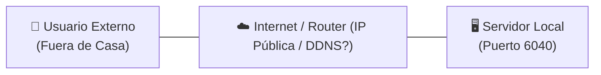
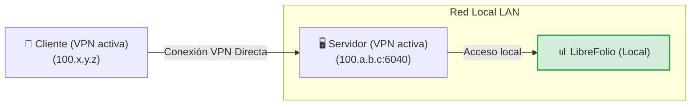
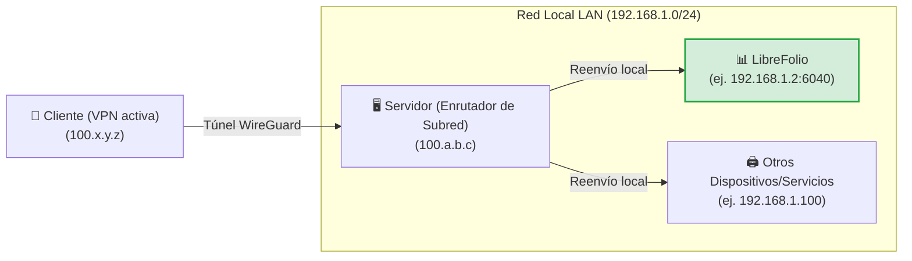
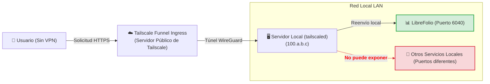
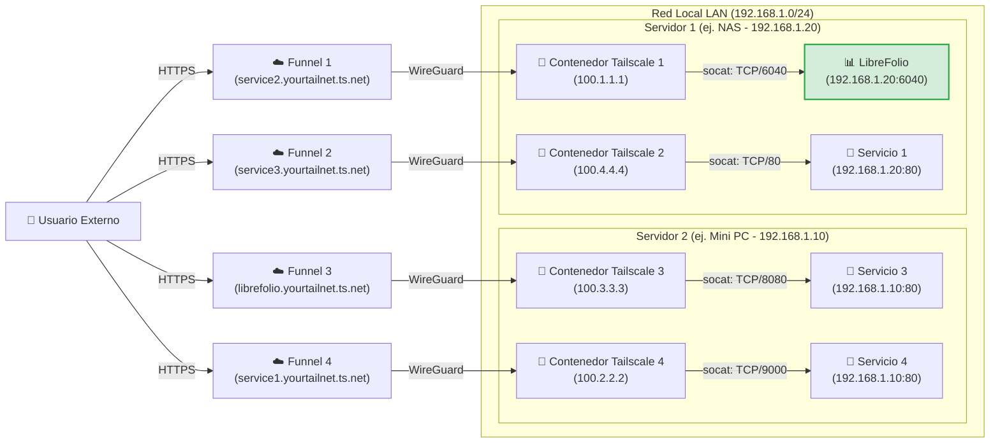

# 🌐 Exposición Segura

Exponer servicios autoalojados de forma segura en internet es uno de los desafíos más comunes. Esta guía explica cómo hacer accesible LibreFolio (o cualquier otro servicio en tu red local) aprovechando [Tailscale](https://tailscale.com/), una solución VPN mesh segura, de alto rendimiento y gratuita para uso doméstico.

!!! tip "Nuestra Recomendación de Configuración"

    Entre los diferentes enfoques presentados, creemos que **el Nivel 4 (Multi-Funnel vía Docker)** es, sin duda, la mejor solución: requiere muy poca configuración adicional en comparación con los otros métodos, ofrece las máximas ventajas en términos de aislamiento y modularidad, y resuelve las limitaciones estructurales de los otros métodos. Los otros niveles se presentan tanto como alternativas como para entender el camino técnico para llegar hasta allí.

---

## 🔒 Seguridad y Riesgos del Reenvío de Puertos Tradicional

El método tradicional para hacer un servicio accesible desde el exterior implica abrir puertos en el router doméstico (reenvío de puertos) asociados a una IP pública (a menudo dinámica) y un servicio DDNS (como DuckDNS).

Este enfoque presenta riesgos significativos:

1. **Exposición a toda la web**: Cualquiera puede escanear tu IP pública e intentar atacar el puerto abierto.
2. **Complejidad de gestión**: Es necesario configurar y renovar manualmente los certificados SSL (HTTPS) a través de un proxy inverso (Nginx, Caddy, etc.).
3. **Riesgos del protocolo HTTP**: Sin una encriptación HTTPS configurada correctamente, tus credenciales y datos financieros viajan en texto plano sobre la red local y pública, haciéndolos interceptables por actores maliciosos (sniffing de paquetes).

El siguiente diagrama muestra el problema inicial de exposición remota:



---

## 🚀 ¿Qué es Tailscale?

[Tailscale](https://tailscale.com/) es un servicio VPN mesh de configuración cero basado en el moderno protocolo de encriptación **WireGuard**.

* **Plan Gratuito (Personal)**: Permite conectar hasta **100 dispositivos** de forma gratuita.
* **Red Mesh**: Todos los dispositivos configurados se conectan directamente entre sí de forma encriptada punto a punto, sin que el tráfico pase por servidores intermedios.
* **Compatibilidad**: Funciona en todos los sistemas operativos principales (Linux, macOS, Windows, iOS, Android) y se puede instalar en un NAS o dentro de contenedores Docker.

---

## 🏁 Paso 0: Instalación de Tailscale en tus Dispositivos

Para que cualquier VPN funcione, se requieren **al menos 2 dispositivos conectados**: el *cliente* (ej., tu smartphone o portátil) y el *servidor* (el nodo en el que se ejecuta LibreFolio). Antes de continuar con los niveles, instala e inicia sesión en Tailscale en tus dispositivos:

=== "Linux"

    Ejecuta el comando de instalación oficial en el servidor:

    ```bash
    curl -fsSL https://tailscale.com/install.sh | sh
    sudo tailscale up
    ```

    Para más detalles, consulta la [Guía de Instalación Genérica](https://tailscale.com/docs/install).

=== "macOS"

    Instala la aplicación oficial desde la **Mac App Store** o usa Homebrew:

    ```bash
    brew install --cask tailscale
    sudo tailscale up
    ```

    Para más detalles, consulta la [Guía de Instalación Genérica](https://tailscale.com/docs/install).

=== "Windows"

    Descarga el instalador oficial desde el portal de Tailscale y sigue el asistente de inicio de sesión.

    Para más detalles, consulta la [Guía de Instalación para Windows](https://tailscale.com/docs/install/windows).

=== "Android"

    Instala la aplicación oficial desde [Google Play Store](https://play.google.com/store/apps/details?id=com.tailscale.ipn).

=== "iOS (iPhone/iPad)"

    Instala la aplicación oficial desde [Apple App Store](https://apps.apple.com/us/app/tailscale/id1470499037).

---

## 🛠️ Los 4 Niveles de Configuración y Exposición

---

## 🏃 Nivel 1: Conexión VPN Punto a Punto Privada (Inicio)

Consiste en conectar el servidor y el cliente a la misma red privada de Tailscale. En el servidor, el puerto del servicio se expone usando el comando `serve`.



En el servidor, usa el comando para exponer el puerto local de LibreFolio (puerto por defecto `6040`):

```bash
tailscale serve tcp:6040 /
```

En este punto, con la VPN activa en tu smartphone o PC, simplemente ingresa la IP de Tailscale del servidor (o su MagicDNS) seguida del puerto en el navegador para acceder a LibreFolio de forma remota.

<table style="width: 100%; border-collapse: collapse; margin-top: 1rem; margin-bottom: 1rem;">
 <thead>
 <tr style="background-color: #f3f4f6;">
 <th style="width: 50%; padding: 10px; border: 1px solid #e5e7eb; text-align: left; font-weight: bold;">🟢 Ventajas (Pros)</th>
 <th style="width: 50%; padding: 10px; border: 1px solid #e5e7eb; text-align: left; font-weight: bold;">🔴 Desventajas (Contras)</th>
 </tr>
 </thead>
 <tbody>
 <tr>
 <td style="padding: 10px; border: 1px solid #e5e7eb; background-color: rgba(76, 175, 80, 0.08); vertical-align: top;">
 <ul>
 <li>Configuración instantánea y mínima.</li>
 <li>Máxima seguridad: tus datos no pasan por internet público, el puerto está cerrado fuera de la VPN.</li>
 </ul>
 </td>
 <td style="padding: 10px; border: 1px solid #e5e7eb; background-color: rgba(244, 67, 54, 0.08); vertical-align: top;">
 <ul>
 <li><strong>Requiere que la VPN de Tailscale esté activa y conectada</strong> en cada cliente (ej., en el teléfono) para alcanzar el servicio.</li>
 <li><strong>Expone solo un único servicio</strong> por host.</li>
 </ul>
 </td>
 </tr>
 </tbody>
</table>

---

## 🥉 Nivel 2: Configuración del Enrutador de Subred (Túnel LAN)

Este nivel transforma tu servidor en un "sub-enrutador". Cuando estás fuera de casa con la VPN activada en el cliente, puedes alcanzar no solo el servidor sino **cualquier dispositivo o servicio en tu LAN doméstica** simplemente ingresando su IP local.



### 1. Habilitar el Enrutamiento de Subred en el Sistema Operativo del Servidor

=== "Linux"

    Habilita el reenvío de IP a nivel del kernel:

    ```bash
    echo 'net.ipv4.ip_forward = 1' | sudo tee -a /etc/sysctl.d/99-tailscale.conf
    echo 'net.ipv6.conf.all.forwarding = 1' | sudo tee -a /etc/sysctl.d/99-tailscale.conf
    sudo sysctl -p /etc/sysctl.d/99-tailscale.conf
    ```

    Comienza a anunciar la subred (reemplaza el rango de IP con tu red local, ej., `192.168.1.0/24`):

    ```bash
    sudo tailscale up --advertise-routes=192.168.1.0/24
    ```

=== "macOS"

    Usa la ruta del ejecutable de Tailscale para anunciar la subred local:

    ```bash
    /Applications/Tailscale.app/Contents/MacOS/Tailscale up --advertise-routes=192.168.1.0/24
    ```

=== "Windows"

    Ejecuta Símbolo del sistema (`cmd.exe`) o PowerShell como **Administrador** y anuncia la subred local:

    ```cmd
    tailscale up --advertise-routes=192.168.1.0/24
    ```

### 2. Aprobar la Ruta en la Consola de Administración

1. Ve a la [Consola de Administración de Tailscale](https://login.tailscale.com/admin/machines).
2. Haz clic en los tres puntos junto a tu servidor -> **Editar configuración de ruta**.
3. Habilita la subred anunciada.

!!! tip "Deshabilitar la Caducidad de la Clave para el Servidor"

    Dado que el servidor actúa como infraestructura de red (enrutador de subred), se recomienda deshabilitar la caducidad automática de la clave para este nodo para evitar que se desconecte y requiera una reautenticación interactiva periódica (cada 180 días por defecto):

    1. En la página **Máquinas** de la consola de administración, localiza tu servidor.
    2. Haz clic en el **icono de tres puntos (...)** a la derecha de la fila del dispositivo.
    3. Selecciona la opción **Deshabilitar caducidad de clave**.

<table style="width: 100%; border-collapse: collapse; margin-top: 1rem; margin-bottom: 1rem;">
 <thead>
 <tr style="background-color: #f3f4f6;">
 <th style="width: 50%; padding: 10px; border: 1px solid #e5e7eb; text-align: left; font-weight: bold;">🟢 Ventajas (Pros)</th>
 <th style="width: 50%; padding: 10px; border: 1px solid #e5e7eb; text-align: left; font-weight: bold;">🔴 Desventajas (Contras)</th>
 </tr>
 </thead>
 <tbody>
 <tr>
 <td style="padding: 10px; border: 1px solid #e5e7eb; background-color: rgba(76, 175, 80, 0.08); vertical-align: top;">
 <ul>
 <li>Acceso a todos los dispositivos de la casa (impresoras, cámaras, LibreFolio, domótica) con un solo nodo activo.</li>
 <li>No es necesario configurar puertos o proxies inversos para cada servicio.</li>
 </ul>
 </td>
 <td style="padding: 10px; border: 1px solid #e5e7eb; background-color: rgba(244, 67, 54, 0.08); vertical-align: top;">
 <ul>
 <li><strong>La VPN en el cliente debe estar activa</strong> para permitir la comunicación.</li>
 <li><strong>Debes conocer las IPs locales</strong> de los dispositivos para alcanzarlos.</li>
 <li>Una vez dentro de casa, <strong>los paquetes viajan en texto plano (HTTP)</strong> en la LAN privada.</li>
 </ul>
 </td>
 </tr>
 </tbody>
</table>

---

## 🔑 Habilitando Funnel y ACLs en la Consola {: #enabling-funnel-and-acls-on-the-console }

*Configuración única requerida para el Nivel 3 y el Nivel 4*

Antes de poder usar Tailscale Funnel (ya sea en el servidor local en el Nivel 3 o dentro de contenedores Docker en el Nivel 4), debes habilitar Funnel y definir las reglas de control de acceso global (ACLs) para toda tu Tailnet. Esta es una configuración única que se realiza directamente en la consola de administración de Tailscale.

### 1. Habilitar HTTPS y Funnel en el Panel de Control

1. Visita la página de [Controles de Acceso](https://login.tailscale.com/admin/acls) en la consola de administración de Tailscale.
2. Haz clic en el botón **Añadir atributo de nodo** para crear la autorización requerida.


3. Configura las siguientes opciones en el formulario:
 * **Destinos**: Ingresa la etiqueta o grupo que deseas autorizar para la activación de Funnel. Un *Destino* define a qué nodos se aplica la regla. **Sugerimos usar `tag:external_access`** (para asociarlo selectivamente a contenedores Docker) o `autogroup:member` (si deseas permitir la exposición para todos los dispositivos registrados bajo tu cuenta personal).
 * **Atributos**: Ingresa `funnel`.
 * **Nota**: Ingresa algún texto para registrar el motivo de esta regla.
 * **Grupos de IP, Aplicación, Capacidad, etc.**: Estos campos adicionales no son necesarios para esta configuración de exposición, así que déjalos vacíos o con sus valores por defecto.

*Importante: La configuración de ACL define las políticas de seguridad globales necesarias para habilitar Funnel. Es independiente de las claves de autenticación (Auth Keys), que se utilizan solo para registrar un nuevo dispositivo o contenedor en la red por primera vez.*

Alternativamente, si prefieres editar la configuración JSON de ACL directamente, puedes usar el siguiente ejemplo funcional (actualizado para soportar tanto tus propios dispositivos como los contenedores etiquetados con `tag:external_access`):

??? example "Ver la configuración JSON de ACL completa para habilitar Funnel"

    ```json
    {
    // Declaración de etiquetas autorizadas
    "tagOwners": {
    "tag:external_access": ["autogroup:admin"]
    },

    // Reglas de acceso estándar
    "acls": [
    // Permite que todos los nodos en tu red privada se comuniquen
    {"action": "accept", "src": ["*"], "dst": ["*:*"]}
    ],

    "ssh": [
    {
    "action": "check",
    "src": ["autogroup:member"],
    "dst": ["autogroup:self"],
    "users": ["autogroup:nonroot", "root"]
    }
    ],

    // Habilitación de Funnel en nodos o etiquetas específicos
    "nodeAttrs": [
    {
    "target": ["autogroup:member"],
    "attr": ["funnel"]
    },
    {
    "target": ["tag:external_access"],
    "attr": ["funnel"]
    }
    ]
    }
    ```

---

## 🥈 Nivel 3: Exposición Pública vía Tailscale Funnel (Sin VPN en el Cliente)

!!! warning "Requisito Previo Fundamental"

    Antes de continuar, asegúrate de haber completado la [configuración única de Funnel y ACL en la consola](#enabling-funnel-and-acls-on-the-console).

**Tailscale Funnel** te permite exponer un servicio públicamente en internet. Cualquier persona puede acceder a tu instancia de LibreFolio a través de una URL HTTPS segura proporcionada por MagicDNS, **sin necesidad de instalar o activar Tailscale** en su smartphone o PC. Esto es esencial si deseas instalar LibreFolio como una PWA en dispositivos móviles y obtener el aviso de instalación automática (para más detalles, consulta la guía [📱 Instalar como App (PWA)](../user/pwa.md)).



### 1. Iniciar el Funnel en el Servidor

Asocia el funnel con el puerto local de LibreFolio:

```bash
tailscale funnel 6040 on
```

*Nota: Para este nivel, no se requiere ninguna clave de autenticación (Auth Key) ya que la máquina servidor ya ha iniciado sesión y se ha registrado de forma interactiva en tu Tailnet durante el **Paso 0**.*

### 2. Aprobar y Esperar la Propagación

Una vez lanzado el comando, aparecerá una advertencia en la terminal indicando que el Funnel está habilitado pero aún no autorizado para tu nodo, mostrando un enlace similar al siguiente:

```text
Funnel is enabled, but the list of allowed nodes in the tailnet policy file does not include the one you are using.
To give access to this node you can edit the tailnet policy file, or visit:

 https://login.tailscale.com/f/funnel?node=xxxxxx
```

* Visita el enlace mostrado en el navegador, inicia sesión en Tailscale y aprueba la activación del Funnel para este nodo.
* Una vez aprobado, la terminal mostrará la URL pública generada.
* Espera unos minutos para que los registros de MagicDNS se propaguen globalmente y poder alcanzar el servicio desde cualquier red externa.

<table style="width: 100%; border-collapse: collapse; margin-top: 1rem; margin-bottom: 1rem;">
 <thead>
 <tr style="background-color: #f3f4f6;">
 <th style="width: 50%; padding: 10px; border: 1px solid #e5e7eb; text-align: left; font-weight: bold;">🟢 Ventajas (Pros)</th>
 <th style="width: 50%; padding: 10px; border: 1px solid #e5e7eb; text-align: left; font-weight: bold;">🔴 Desventajas (Contras)</th>
 </tr>
 </thead>
 <tbody>
 <tr>
 <td style="padding: 10px; border: 1px solid #e5e7eb; background-color: rgba(76, 175, 80, 0.08); vertical-align: top;">
 <ul>
 <li>Acceso público universal mediante HTTPS gratuito gestionado por Tailscale.</li>
 <li>Sin certificado SSL ni proxy inverso que configurar en el servidor.</li>
 <li>Permite la instalación nativa de PWA en smartphones sin activar la VPN.</li>
 </ul>
 </td>
 <td style="padding: 10px; border: 1px solid #e5e7eb; background-color: rgba(244, 67, 54, 0.08); vertical-align: top;">
 <ul>
 <li><strong>Solo se puede exponer 1 único servicio</strong> Funnel por máquina host.</li>
 </ul>
 </td>
 </tr>
 </tbody>
</table>

---

## 🥇 Nivel 4: Exposición Multi-Funnel Avanzada vía Docker (Sidecars)

!!! warning "Requisito Previo Fundamental"

    Antes de continuar con la configuración del contenedor, asegúrate de haber completado la [configuración única de Funnel y ACL en la consola](#enabling-funnel-and-acls-on-the-console).

Para superar el límite de un Funnel por nodo host, podemos ejecutar múltiples nodos paralelos de Tailscale dentro de contenedores Docker. Cada contenedor se registrará como un nodo independiente en tu Tailnet, obteniendo su propia URL MagicDNS dedicada.

Nuestra solución utiliza un pequeño script de inicio personalizado que instala **socat** en el contenedor y redirige el tráfico HTTPS entrante a la IP LAN estática del servicio objetivo.

??? info "¿Qué es socat?"

    **socat** (SOcket CAT) es una utilidad de línea de comandos extremadamente flexible que establece dos flujos de bytes bidireccionales y transfiere datos entre ellos. En nuestro caso, lo usamos como un **mini proxy-redireccionador**: escucha en el puerto local del contenedor de Tailscale y reenvía todos los paquetes recibidos al puerto real del servicio en el servidor local.

El diagrama de red ilustra el escenario de múltiples nodos expuestos en paralelo, donde los contenedores de Tailscale 1 y 2 se ejecutan en el primer host (Servidor 1) y los contenedores de Tailscale 3 y 4 se ejecutan en el segundo host (Servidor 2):



!!! note "Múltiples Nodos y Servicios"

    Con esta arquitectura, puedes añadir y exponer todos los servicios deseados simplemente iniciando nuevos contenedores de Tailscale asociados al script relevante. El único límite lo establecen los términos de tu plan de suscripción de Tailscale (que cubre hasta 100 dispositivos en la versión gratuita).

### 1. Preparación de la Carpeta y el Script

Crea una carpeta en el servidor (ej., dentro de la ruta donde guardas tus volúmenes persistentes de Docker):

```bash
# Crear una carpeta para los nodos de Tailscale y entrar en ella
mkdir -p <ruta_elegida>/tailscale-nodes
cd <ruta_elegida>/tailscale-nodes
```

Descarga el script de inicio personalizado <a href="https://raw.githubusercontent.com/Librefolio/LibreFolio/main/docs/static/tailscale-guide/custom_startup.sh" target="_blank" rel="noopener noreferrer">custom_startup.sh</a> dentro de esta carpeta:

```bash
# Descargar el script desde el repositorio oficial
wget https://raw.githubusercontent.com/Librefolio/LibreFolio/main/docs/static/tailscale-guide/custom_startup.sh
# Hacer el script ejecutable
chmod +x custom_startup.sh
```

### 2. Configuración de Docker Compose

Sugerimos definir y declarar el servicio de Tailscale **dentro del mismo archivo `docker-compose.yml` que el servicio** que deseas exponer (ej., LibreFolio) para mantenerlos cerca y lógicamente acoplados. Añade el bloque de servicio como se muestra a continuación:

```yaml
services:
 tailscale-librefolio:
 image: tailscale/tailscale:latest
 container_name: tailscale-librefolio
 hostname: tailscale-librefolio
 restart: unless-stopped
 privileged: false
 network_mode: bridge
 cap_add:

 - NET_ADMIN
 - NET_RAW
 devices:

 - /dev/net/tun:/dev/net/tun
 command:

 - /custom_startup.sh
 environment:

 - HOST_IP=192.168.1.10 # IP local del servicio a exponer (ej. Servidor 1)
 - HOST_PORT=6040 # Puerto real del servicio a exponer
 - TAILSCALE_FUNNEL_PORT=6040 # Puerto interno del Funnel
 - TS_HOSTNAME=librefolio # Nombre de host público personalizado (ej. librefolio)
 - TS_AUTHKEY=tskey-auth-... # Clave de autenticación generada por Tailscale
 - TS_ACCEPT_DNS=true
 - TS_STATE_DIR=/var/lib/tailscale
 - TS_USERSPACE=false
 volumes:

 - <ruta_elegida>/tailscale-nodes/tailscale-librefolio/state:/var/lib/tailscale
 - <ruta_elegida>/tailscale-nodes/custom_startup.sh:/custom_startup.sh
 - /etc/localtime:/etc/localtime:ro
 - /etc/timezone:/etc/timezone:ro
```

#### Descripción de los Parámetros de Configuración

<table style="width: 100%; border-collapse: collapse; margin-top: 1rem; margin-bottom: 1rem;">
 <thead>
 <tr style="background-color: #f3f4f6;">
 <th style="width: 35%; padding: 10px; border: 1px solid #e5e7eb; text-align: left; font-weight: bold; white-space: nowrap;">Parámetro</th>
 <th style="width: 65%; padding: 10px; border: 1px solid #e5e7eb; text-align: left; font-weight: bold;">Descripción</th>
 </tr>
 </thead>
 <tbody>
 <tr>
 <td style="padding: 10px; border: 1px solid #e5e7eb; font-family: monospace; white-space: nowrap;">&lt;ruta_elegida&gt;</td>
 <td style="padding: 10px; border: 1px solid #e5e7eb;">La ruta absoluta (ruta completa) en el servidor local donde se guardan el script y los datos de estado (ej. <code>/home/usuario/docker</code>).</td>
 </tr>
 <tr>
 <td style="padding: 10px; border: 1px solid #e5e7eb; font-family: monospace; white-space: nowrap;">HOST_IP</td>
 <td style="padding: 10px; border: 1px solid #e5e7eb;">La IP LAN estática de la máquina que aloja el servicio.</td>
 </tr>
 <tr>
 <td style="padding: 10px; border: 1px solid #e5e7eb; font-family: monospace; white-space: nowrap;">HOST_PORT</td>
 <td style="padding: 10px; border: 1px solid #e5e7eb;">El puerto real en el servidor LAN al que conectarse (ej. <code>6040</code> para LibreFolio).</td>
 </tr>
 <tr>
 <td style="padding: 10px; border: 1px solid #e5e7eb; font-family: monospace; white-space: nowrap;">TAILSCALE_FUNNEL_PORT</td>
 <td style="padding: 10px; border: 1px solid #e5e7eb;">El puerto en el que el contenedor de Tailscale escuchará y activará el Funnel. En principio, el mejor enfoque es establecer este parámetro al mismo valor que el puerto interno del servicio (<code>HOST_PORT</code>) por coherencia; se deja como un parámetro separado para soportar posibles casos especiales futuros.</td>
 </tr>
 <tr>
 <td style="padding: 10px; border: 1px solid #e5e7eb; font-family: monospace; white-space: nowrap;">TS_HOSTNAME</td>
 <td style="padding: 10px; border: 1px solid #e5e7eb;">El nombre de host personalizado para el nodo. La dirección pública generada será <code>https://TS_HOSTNAME.your-tailnet.ts.net</code>.</td>
 </tr>
 <tr>
 <td style="padding: 10px; border: 1px solid #e5e7eb; font-family: monospace; white-space: nowrap;">TS_AUTHKEY</td>
 <td style="padding: 10px; border: 1px solid #e5e7eb;">
 La clave de autenticación (Auth Key) generada por Tailscale. Para obtenerla:<br>

 1. Ve a <a href="https://login.tailscale.com/admin/settings/keys" target="_blank" rel="noopener noreferrer">Claves de configuración de administración de Tailscale</a>.<br>
 2. En la sección <strong>Claves de autenticación</strong> (<em>no</em> en la sección de tokens de acceso a la API), haz clic en el botón <strong>Generar clave de autenticación...</strong>.<br>
 3. Debes <strong>habilitar el interruptor de etiquetas</strong> para seleccionar la etiqueta deseada (ej., <code>tag:external_access</code>). En la descripción de la clave, ingresa una nota descriptiva para que sea fácilmente reconocible (ej., <code>docker-librefolio-funnel</code>).<br>
 4. Haz clic en <strong>Generar</strong> y copia la clave generada (ej., <code>tskey-auth-...</code>).<br>
 <br>
 <em>Nota: Una vez que el contenedor se haya iniciado correctamente, la clave de un solo uso se consume y desaparece automáticamente de la lista "Claves" en la consola de administración, mientras que el nuevo dispositivo registrado aparecerá en "Máquinas".</em>
 </td>
 </tr>
 </tbody>
</table>

??? example "Ver el archivo Docker Compose de producción completo (LibreFolio + Tailscale)"

    A continuación se muestra un ejemplo real y completo de un archivo `docker-compose.yml` de producción que ejecuta la imagen oficial de producción de LibreFolio junto al sidecar de Tailscale para exposición automática:

    ```yaml
    # =============================================================================
    # LibreFolio — Docker Compose de Producción
    # =============================================================================
    # Optimizado para usuarios finales que ejecutan la imagen preconstruida oficial desde GHCR.
    # =============================================================================

    services:
    librefolio:
    image: ghcr.io/librefolio/librefolio:nightly
    container_name: librefolio
    restart: unless-stopped
    ports:

    - "${PORT:-6040}:6040"
    volumes:

    - ./LibreFolio-data:/app/backend/data/prod-docker
    env_file: .env
    environment:

    - LIBREFOLIO_DATA_DIR=/app/backend/data/prod-docker
    - HOST=0.0.0.0
    healthcheck:
    test: ["CMD", "python", "-c", "import urllib.request; urllib.request.urlopen('http://localhost:6040/api/v1/system/health')"]
    interval: 30s
    timeout: 10s
    start_period: 15s
    retries: 3

    tailscale-librefolio:
    image: tailscale/tailscale:latest
    container_name: tailscale-librefolio
    hostname: tailscale-librefolio
    restart: unless-stopped
    privileged: false
    network_mode: bridge
    cap_add:

    - NET_ADMIN
    - NET_RAW
    devices:

    - /dev/net/tun:/dev/net/tun
    command:

    - /custom_startup.sh
    environment:

    - HOST_IP=192.168.1.10 # IP local del servicio a exponer (ej. Servidor 1)
    - HOST_PORT=6040 # Puerto real del servicio a exponer
    - TAILSCALE_FUNNEL_PORT=6040 # Puerto interno del Funnel
    - TS_HOSTNAME=librefolio # Nombre de host público personalizado (ej. librefolio)
    - TS_AUTHKEY=tskey-auth-... # Reemplazar con tu clave generada
    - TS_ACCEPT_DNS=true
    - TS_STATE_DIR=/var/lib/tailscale
    - TS_USERSPACE=false
    volumes:

    - /DATA/AppData/tailscale-nodes/tailscale-librefolio/state:/var/lib/tailscale
    - /DATA/AppData/tailscale-nodes/custom_startup.sh:/custom_startup.sh
    - /etc/localtime:/etc/localtime:ro
    - /etc/timezone:/etc/timezone:ro
    ```

### 3. Inicio y Aprobación

Inicia el contenedor compose de tu servicio (incluyendo el sidecar de Tailscale):

```bash
docker compose up -d
```

Visualiza los registros del contenedor de Tailscale para extraer el enlace de aprobación del Funnel (requerido en el primer inicio):

```bash
docker logs -f tailscale-librefolio
```

En los registros del contenedor, aparecerá una línea de advertencia con el enlace de autorización específico para tu nodo:

```text
Funnel is enabled, but the list of allowed nodes in the tailnet policy file does not include the one you are using.
To give access to this node you can edit the tailnet policy file, or visit:

 https://login.tailscale.com/f/funnel?node=nsKGo6k9ZF11CNTRL
```

* Abre el enlace mostrado en el navegador, inicia sesión en Tailscale y aprueba la activación del Funnel.
* Inmediatamente después de la aprobación, verás la confirmación de la exposición exitosa en los registros del contenedor con la URL pública y el proxy local:

```text
Available on the internet:

https://librefolio.yourtailnet.ts.net/
|-- proxy http://127.0.0.1:6040

Press Ctrl+C to exit.
```

* **Nota**: En este punto, el servicio está en línea, pero debes esperar unos minutos para que la propagación del registro MagicDNS se complete globalmente.

!!! tip "Deshabilitar la Caducidad de la Clave para el Contenedor"

    Para evitar que el contenedor sidecar caduque y se desconecte de tu Tailnet después del período predeterminado (180 días):

    1. Ve a la página **Máquinas** de la Consola de Administración de Tailscale.
    2. Encuentra el nodo del contenedor (ej., `librefolio` o `tailscale-librefolio`) en la lista.
    3. Haz clic en el **icono de tres puntos (...)** a la derecha de la fila del dispositivo.
    4. Selecciona la opción **Deshabilitar caducidad de clave**.

<table style="width: 100%; border-collapse: collapse; margin-top: 1rem; margin-bottom: 1rem;">
 <thead>
 <tr style="background-color: #f3f4f6;">
 <th style="width: 50%; padding: 10px; border: 1px solid #e5e7eb; text-align: left; font-weight: bold;">🟢 Ventajas (Pros)</th>
 <th style="width: 50%; padding: 10px; border: 1px solid #e5e7eb; text-align: left; font-weight: bold;">🔴 Desventajas (Contras)</th>
 </tr>
 </thead>
 <tbody>
 <tr>
 <td style="padding: 10px; border: 1px solid #e5e7eb; background-color: rgba(76, 175, 80, 0.08); vertical-align: top;">
 <ul>
 <li>Capacidad de crear <strong>Funnels públicos independientes ilimitados</strong> en una sola máquina física.</li>
 <li>URLs separadas y dedicadas para cada servicio del hogar.</li>
 <li>Los paquetes de la red local viajan de forma segura y directa entre el contenedor y el servicio objetivo.</li>
 </ul>
 </td>
 <td style="padding: 10px; border: 1px solid #e5e7eb; background-color: rgba(244, 67, 54, 0.08); vertical-align: top;">
 <ul>
 <li><strong>Requiere el uso de la terminal</strong> y la configuración manual de los archivos Docker Compose.</li>
 </ul>
 </td>
 </tr>
 </tbody>
</table>

---

## 🔮 MagicDNS y Dominios Personalizados

### ¿Qué es MagicDNS?

**MagicDNS** asigna automáticamente un nombre de dominio DNS local y público a cada uno de tus dispositivos registrados en la Tailnet. En lugar de tener que recordar direcciones IP como `100.110.222.112`, puedes escribir `http://tu-servidor` en el navegador.
Los dominios públicos asignados por MagicDNS terminan con el sufijo `*.ts.net` (por ejemplo, `https://librefolio.tu-tailnet.ts.net`).

### Cómo Usar un Dominio Personalizado con Tailscale

Si posees tu propio dominio personal (ej., `midominio.com`) y deseas usarlo para alcanzar tus nodos privados de Tailscale en lugar de usar la URL estándar `*.ts.net`, puedes proceder con dos técnicas principales:

#### Método 1: DNS Público Mapeado a IP de Tailscale (Recomendado para Red Privada)

Esta es la solución más simple para acceder a tus dispositivos de forma privada usando tu dominio.

1. Inicia sesión en la consola de tu registrador de dominios (ej., Cloudflare, GoDaddy, Namecheap).
2. Crea un registro DNS de tipo **A** (o **AAAA** para IPv6) para el subdominio elegido (ej., `librefolio.midominio.com`).
3. Apunta el registro directamente a la **IP privada de Tailscale** de tu servidor (ej., `100.77.72.90`).
4. **Cómo funciona**: Dado que las direcciones IP en la red `100.64.0.0/10` no son enrutables públicamente a nivel global, el dominio se resolverá y funcionará **solo** cuando estés conectado a tu VPN de Tailscale, asegurando que ningún usuario externo pueda acceder o escanear el servicio. Para más detalles, consulta la [Documentación oficial sobre configuración de DNS](https://tailscale.com/kb/1054/dns#public-dns).

#### Método 2: DNS Dividido (Con Servidor DNS Interno)

Si deseas gestionar dinámicamente registros internos y no publicarlos en internet:

1. Configura un servidor DNS privado en tu LAN (como Pi-hole, AdGuard Home o CoreDNS).
2. Añade registros locales de tu dominio apuntándolos a tus IPs de Tailscale.
3. En la consola de administración de Tailscale, ve a *DNS -> Servidores de nombres -> Añadir servidor de nombres* y añade la IP de Tailscale de tu DNS privado como servidor de nombres global o restringido a tu dominio. Para más detalles, consulta la [Documentación oficial sobre DNS dividido](https://tailscale.com/kb/1054/dns#split-dns).

!!! warning "Precaución sobre la Exposición Pública con Funnel"

    Dado que los Funnels públicos de Tailscale se exponen en internet solo a través del dominio seguro `*.ts.net` (gracias a los certificados SSL firmados por Tailscale), el mapeo directo de CNAME desde tu dominio personalizado a una dirección de Funnel provocará errores de seguridad SSL/TLS en los navegadores, a menos que se utilice un proxy inverso separado (como Caddy o Nginx) para gestionar los certificados de tu zona. La dirección pública de tu instancia será `librefolio.tu-tailnet.ts.net`, donde la parte inicial `librefolio` se define automáticamente por el valor asignado a la variable `TS_HOSTNAME`.

---

## 🔗 Enlaces y Recursos Útiles

* 🖥️ [Consola de Administración de Tailscale (Máquinas)](https://login.tailscale.com/admin/machines)
* 🔐 [Gestión de Controles de Acceso (ACLs)](https://login.tailscale.com/admin/acls)
* 📖 [Guía Oficial de Tailscale Funnel (Documentación en Inglés)](https://tailscale.com/kb/1223/tailscale-funnel)
* 🐳 [Ejecutar Tailscale en Docker](https://tailscale.com/kb/1282/docker)
