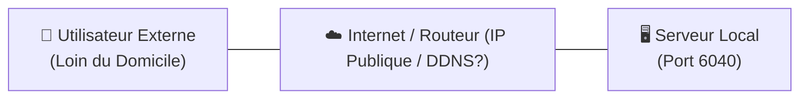
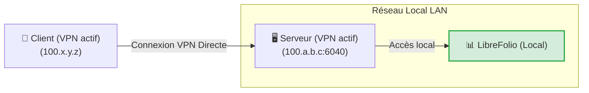
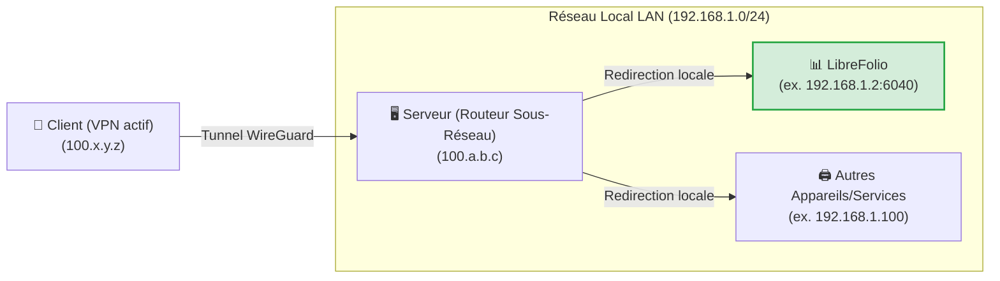
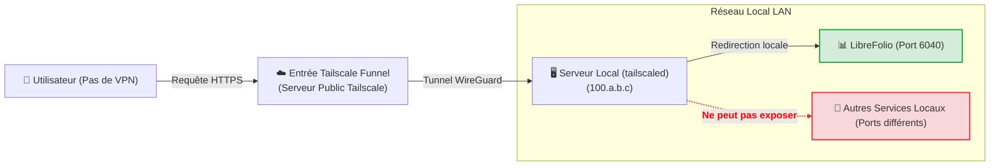
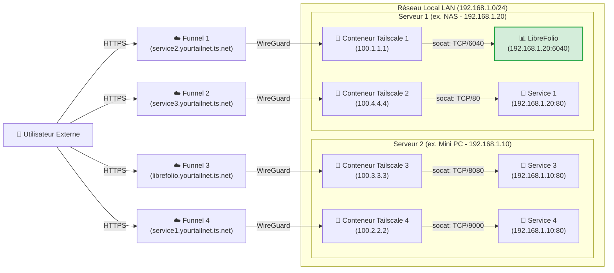

# 🌐 Exposer de Manière Sécurisée

Exposer des services auto-hébergés de manière sécurisée sur Internet est l'un des défis les plus courants. Ce guide explique comment rendre LibreFolio (ou tout autre service de votre réseau local) accessible en utilisant [Tailscale](https://tailscale.com/), une solution VPN maillé sécurisée, performante et gratuite pour un usage domestique.

!!! tip "Notre Recommandation de Configuration"

    Parmi les différentes approches présentées, nous pensons que le **Niveau 4 (Multi-Entonnoir via Docker)** est la solution absolument la meilleure : elle nécessite très peu de configuration supplémentaire par rapport aux autres méthodes, offre le maximum d'avantages en termes d'isolation et de modularité, et résout les limitations structurelles des autres méthodes. Les autres niveaux sont présentés à la fois comme alternatives et pour comprendre le chemin technique pour y arriver.

---

## 🔒 Sécurité et Risques du Transfert de Port Traditionnel

La méthode traditionnelle pour rendre un service accessible depuis l'extérieur consiste à ouvrir des ports sur votre routeur domestique (redirection de port) associée à une IP publique (souvent dynamique) et un service DDNS (comme DuckDNS).

Cette approche présente des risques importants :

1. **Exposition au web entier** : N'importe qui peut scanner votre IP publique et tenter d'attaquer le port ouvert.
2. **Complexité de gestion** : Il est nécessaire de configurer et renouveler manuellement les certificats SSL (HTTPS) via un proxy inverse (Nginx, Caddy, etc.).
3. **Risques du protocole HTTP** : Sans un chiffrement HTTPS correctement configuré, vos identifiants et données financières voyagent en texte clair sur le réseau local et public, les rendant interceptables par des acteurs malveillants (écoute de paquets).

Le diagramme suivant montre le problème initial d'exposition à distance :



---

## 🚀 Qu'est-ce que Tailscale ?

[Tailscale](https://tailscale.com/) est un service VPN maillé sans configuration basé sur le protocole de chiffrement moderne **WireGuard**.

* **Plan Gratuit (Personnel)** : Permet de connecter jusqu'à **100 appareils** gratuitement.
* **Réseau maillé** : Tous les appareils configurés se connectent directement les uns aux autres de manière chiffrée pair-à-pair, sans que le trafic ne passe par des serveurs intermédiaires.
* **Compatibilité** : Fonctionne sur tous les principaux systèmes d'exploitation (Linux, macOS, Windows, iOS, Android) et peut être installé sur un NAS ou à l'intérieur de conteneurs Docker.

---

## 🏁 Étape 0 : Installation de Tailscale sur Vos Appareils

Pour faire fonctionner un VPN, **au moins 2 appareils connectés** sont nécessaires : le *client* (par exemple, votre smartphone ou ordinateur portable) et le *serveur* (le nœud sur lequel LibreFolio est exécuté). Avant de passer aux niveaux, installez et connectez-vous à Tailscale sur vos appareils :

=== "Linux"

    Exécutez la commande d'installation officielle sur le serveur :

    ```bash
    curl -fsSL https://tailscale.com/install.sh | sh
    sudo tailscale up
    ```

    Pour plus de détails, consultez le [Guide d'Installation Générique](https://tailscale.com/docs/install).

=== "macOS"

    Installez l'application officielle depuis le **Mac App Store** ou utilisez Homebrew :

    ```bash
    brew install --cask tailscale
    sudo tailscale up
    ```

    Pour plus de détails, consultez le [Guide d'Installation Générique](https://tailscale.com/docs/install).

=== "Windows"

    Téléchargez l'installateur officiel depuis le portail Tailscale et suivez l'assistant de connexion.

    Pour plus de détails, consultez le [Guide d'Installation Windows](https://tailscale.com/docs/install/windows).

=== "Android"

    Installez l'application officielle depuis le [Google Play Store](https://play.google.com/store/apps/details?id=com.tailscale.ipn).

=== "iOS (iPhone/iPad)"

    Installez l'application officielle depuis l'[Apple App Store](https://apps.apple.com/us/app/tailscale/id1470499037).

---

## 🛠️ Les 4 Niveaux de Configuration et d'Exposition

---

## 🏃 Niveau 1 : Connexion VPN Privée Point-à-Point (Début)

Cela consiste à connecter le serveur et le client au même réseau privé Tailscale. Sur le serveur, le port du service est exposé à l'aide de la commande `serve`.



Sur le serveur, utilisez la commande pour exposer le port local de LibreFolio (port par défaut `6040`) :

```bash
tailscale serve tcp:6040 /
```

À ce stade, avec le VPN actif sur votre smartphone ou PC, il suffit de saisir l'IP Tailscale du serveur (ou son MagicDNS) suivie du port dans le navigateur pour accéder à LibreFolio à distance.

<table style="width: 100%; border-collapse: collapse; margin-top: 1rem; margin-bottom: 1rem;">
 <thead>
 <tr style="background-color: #f3f4f6;">
 <th style="width: 50%; padding: 10px; border: 1px solid #e5e7eb; text-align: left; font-weight: bold;">🟢 Avantages (Pros)</th>
 <th style="width: 50%; padding: 10px; border: 1px solid #e5e7eb; text-align: left; font-weight: bold;">🔴 Inconvénients (Cons)</th>
 </tr>
 </thead>
 <tbody>
 <tr>
 <td style="padding: 10px; border: 1px solid #e5e7eb; background-color: rgba(76, 175, 80, 0.08); vertical-align: top;">
 <ul>
 <li>Configuration instantanée et minimale.</li>
 <li>Sécurité maximale : vos données ne passent pas par l'internet public, le port est fermé en dehors du VPN.</li>
 </ul>
 </td>
 <td style="padding: 10px; border: 1px solid #e5e7eb; background-color: rgba(244, 67, 54, 0.08); vertical-align: top;">
 <ul>
 <li><strong>Nécessite que le VPN Tailscale soit actif et connecté</strong> sur chaque client (ex. sur le téléphone) pour accéder au service.</li>
 <li><strong>Expose un seul service</strong> par hôte.</li>
 </ul>
 </td>
 </tr>
 </tbody>
</table>

---

## 🥉 Niveau 2 : Configuration du Routeur de Sous-Réseau (Tunnel LAN)

Ce niveau transforme votre serveur en « sous-routeur ». Lorsque vous êtes loin de chez vous avec le VPN activé sur le client, vous pouvez accéder non seulement au serveur mais aussi à **n'importe quel appareil ou service de votre LAN domestique** en saisissant simplement son IP locale.



### 1. Activer le Routage de Sous-Réseau sur le Système d'Exploitation du Serveur

=== "Linux"

    Activez le transfert IP au niveau du noyau :

    ```bash
    echo 'net.ipv4.ip_forward = 1' | sudo tee -a /etc/sysctl.d/99-tailscale.conf
    echo 'net.ipv6.conf.all.forwarding = 1' | sudo tee -a /etc/sysctl.d/99-tailscale.conf
    sudo sysctl -p /etc/sysctl.d/99-tailscale.conf
    ```

    Commencez à annoncer le sous-réseau (remplacez la plage IP par votre réseau local, ex. `192.168.1.0/24`) :

    ```bash
    sudo tailscale up --advertise-routes=192.168.1.0/24
    ```

=== "macOS"

    Utilisez le chemin exécutable de Tailscale pour annoncer le sous-réseau local :

    ```bash
    /Applications/Tailscale.app/Contents/MacOS/Tailscale up --advertise-routes=192.168.1.0/24
    ```

=== "Windows"

    Exécutez l'Invite de commandes (`cmd.exe`) ou PowerShell en tant qu'**Administrateur** et annoncez le sous-réseau local :

    ```cmd
    tailscale up --advertise-routes=192.168.1.0/24
    ```

### 2. Approuver la Route dans la Console d'Administration

1. Allez dans la [Console d'Administration Tailscale](https://login.tailscale.com/admin/machines).
2. Cliquez sur les trois points à côté de votre serveur -> **Edit route settings**.
3. Activez le sous-réseau annoncé.

!!! tip "Désactiver l'Expiration de la Clé pour le Serveur"

    Étant donné que le serveur agit comme une infrastructure réseau (routeur de sous-réseau), il est recommandé de désactiver l'expiration automatique de la clé pour ce nœud afin d'éviter qu'il ne se déconnecte et ne nécessite une réauthentification interactive périodique (tous les 180 jours par défaut) :

    1. Sur la page **Machines** de la console d'administration, localisez votre serveur.
    2. Cliquez sur l'**icône trois points (...)** à droite de la ligne de l'appareil.
    3. Sélectionnez l'option **Disable Key Expiry**.

<table style="width: 100%; border-collapse: collapse; margin-top: 1rem; margin-bottom: 1rem;">
 <thead>
 <tr style="background-color: #f3f4f6;">
 <th style="width: 50%; padding: 10px; border: 1px solid #e5e7eb; text-align: left; font-weight: bold;">🟢 Avantages (Pros)</th>
 <th style="width: 50%; padding: 10px; border: 1px solid #e5e7eb; text-align: left; font-weight: bold;">🔴 Inconvénients (Cons)</th>
 </tr>
 </thead>
 <tbody>
 <tr>
 <td style="padding: 10px; border: 1px solid #e5e7eb; background-color: rgba(76, 175, 80, 0.08); vertical-align: top;">
 <ul>
 <li>Accès à tous les appareils de la maison (imprimantes, caméras, LibreFolio, domotique) avec un seul nœud actif.</li>
 <li>Pas besoin de configurer des ports ou des proxys inverses pour chaque service.</li>
 </ul>
 </td>
 <td style="padding: 10px; border: 1px solid #e5e7eb; background-color: rgba(244, 67, 54, 0.08); vertical-align: top;">
 <ul>
 <li><strong>Le VPN sur le client doit être actif</strong> pour permettre la communication.</li>
 <li><strong>Vous devez connaître les IP locales</strong> des appareils pour y accéder.</li>
 <li>Une fois à la maison, <strong>les paquets voyagent en texte clair (HTTP)</strong> sur le LAN privé.</li>
 </ul>
 </td>
 </tr>
 </tbody>
</table>

---

## 🔑 Activation de Funnel et des ACL sur la Console {: #enabling-funnel-and-acls-on-the-console }

*Configuration unique requise pour le Niveau 3 et le Niveau 4*

Avant de pouvoir utiliser Tailscale Funnel (soit sur le serveur local au Niveau 3, soit à l'intérieur des conteneurs Docker au Niveau 4), vous devez activer Funnel et définir les règles de contrôle d'accès globales (ACL) pour l'ensemble de votre Tailnet. Il s'agit d'une configuration unique effectuée directement dans la console d'administration Tailscale.

### 1. Activer HTTPS et Funnel sur le Panneau de Contrôle

1. Visitez la page [Access Controls](https://login.tailscale.com/admin/acls) dans la console d'administration Tailscale.
2. Cliquez sur le bouton **Add node attribute** pour créer l'autorisation requise.


3. Configurez les options suivantes dans le formulaire :
 * **Targets** : Saisissez le tag ou le groupe que vous souhaitez autoriser pour l'activation de Funnel. Une *Target* définit à quels nœuds la règle s'applique. **Nous suggérons d'utiliser `tag:external_access`** (pour l'associer sélectivement aux conteneurs Docker) ou `autogroup:member` (si vous souhaitez autoriser l'exposition pour tous les appareils enregistrés sous votre compte personnel).
 * **Attributes** : Saisissez `funnel`.
 * **Note** : Saisissez du texte pour enregistrer la raison de cette règle.
 * **IP Pools, App, Capability, etc.** : Ces champs supplémentaires ne sont pas nécessaires pour cette configuration d'exposition, laissez-les donc vides ou à leurs valeurs par défaut.

*Important : La configuration ACL définit les politiques de sécurité globales nécessaires pour activer Funnel. Elle est indépendante des clés d'authentification (Auth Keys), qui sont utilisées uniquement pour enregistrer un nouvel appareil ou conteneur sur le réseau pour la première fois.*

Alternativement, si vous préférez éditer directement la configuration JSON des ACL, vous pouvez utiliser l'exemple fonctionnel suivant (mis à jour pour prendre en charge à la fois vos propres appareils et les conteneurs taggés avec `tag:external_access`) :

??? example "Voir la configuration JSON complète des ACL pour activer Funnel"

    ```json
    {
    // Déclaration des tags autorisés
    "tagOwners": {
    "tag:external_access": ["autogroup:admin"]
    },

    // Règles d'accès standard
    "acls": [
    // Permet à tous les nœuds de votre réseau privé de communiquer
    {"action": "accept", "src": ["*"], "dst": ["*:*"]}
    ],

    "ssh": [
    {
    "action": "check",
    "src": ["autogroup:member"],
    "dst": ["autogroup:self"],
    "users": ["autogroup:nonroot", "root"]
    }
    ],

    // Activation de Funnel sur des nœuds ou tags spécifiques
    "nodeAttrs": [
    {
    "target": ["autogroup:member"],
    "attr": ["funnel"]
    },
    {
    "target": ["tag:external_access"],
    "attr": ["funnel"]
    }
    ]
    }
    ```

---

## 🥈 Niveau 3 : Exposition Publique via Tailscale Funnel (Pas de VPN sur le Client)

!!! warning "Prérequis Fondamental"

    Avant de continuer, assurez-vous d'avoir effectué la [configuration unique de Funnel et des ACL sur la console](#enabling-funnel-and-acls-on-the-console).

**Tailscale Funnel** vous permet d'exposer un service publiquement sur Internet. N'importe qui peut accéder à votre instance LibreFolio via une URL HTTPS sécurisée fournie par MagicDNS, **sans avoir besoin d'installer ou d'activer Tailscale** sur son smartphone ou PC. Ceci est essentiel si vous souhaitez installer LibreFolio en tant que PWA sur des appareils mobiles et obtenir l'invite d'installation automatique (pour plus de détails, consultez le guide [📱 Installer comme Application (PWA)](../user/pwa.md)).



### 1. Démarrer le Funnel sur le Serveur

Associez le funnel au port local de LibreFolio :

```bash
tailscale funnel 6040 on
```

*Remarque : Pour ce niveau, aucune clé d'authentification (Auth Key) n'est requise car la machine serveur a déjà été connectée et enregistrée de manière interactive à votre Tailnet lors de **l'Étape 0**.*

### 2. Approuver et Attendre la Propagation

Une fois la commande lancée, un avertissement apparaîtra dans le terminal indiquant que Funnel est activé mais pas encore autorisé pour votre nœud, affichant un lien similaire à celui-ci :

```text
Funnel is enabled, but the list of allowed nodes in the tailnet policy file does not include the one you are using.
To give access to this node you can edit the tailnet policy file, or visit:

 https://login.tailscale.com/f/funnel?node=xxxxxx
```

* Visitez le lien affiché dans le navigateur, connectez-vous à Tailscale, et approuvez l'activation du Funnel pour ce nœud.
* Une fois approuvé, le terminal affichera l'URL publique générée.
* Attendez quelques minutes que les enregistrements MagicDNS se propagent globalement pour atteindre le service depuis n'importe quel réseau externe.

<table style="width: 100%; border-collapse: collapse; margin-top: 1rem; margin-bottom: 1rem;">
 <thead>
 <tr style="background-color: #f3f4f6;">
 <th style="width: 50%; padding: 10px; border: 1px solid #e5e7eb; text-align: left; font-weight: bold;">🟢 Avantages (Pros)</th>
 <th style="width: 50%; padding: 10px; border: 1px solid #e5e7eb; text-align: left; font-weight: bold;">🔴 Inconvénients (Cons)</th>
 </tr>
 </thead>
 <tbody>
 <tr>
 <td style="padding: 10px; border: 1px solid #e5e7eb; background-color: rgba(76, 175, 80, 0.08); vertical-align: top;">
 <ul>
 <li>Accès public universel via HTTPS gratuit géré par Tailscale.</li>
 <li>Pas de certificat SSL ou de proxy inverse à configurer sur le serveur.</li>
 <li>Permet l'installation native PWA sur les smartphones sans activer le VPN.</li>
 </ul>
 </td>
 <td style="padding: 10px; border: 1px solid #e5e7eb; background-color: rgba(244, 67, 54, 0.08); vertical-align: top;">
 <ul>
 <li><strong>Vous pouvez exposer au maximum 1 seul service</strong> Funnel par machine hôte.</li>
 </ul>
 </td>
 </tr>
 </tbody>
</table>

---

## 🥇 Niveau 4 : Exposition Multi-Entonnoir Avancée via Docker (Sidecars)

!!! warning "Prérequis Fondamental"

    Avant de continuer avec la configuration du conteneur, assurez-vous d'avoir effectué la [configuration unique de Funnel et des ACL sur la console](#enabling-funnel-and-acls-on-the-console).

Pour surmonter la limite d'un Funnel par nœud hôte, nous pouvons exécuter plusieurs nœuds Tailscale parallèles à l'intérieur de conteneurs Docker. Chaque conteneur s'enregistrera comme un nœud indépendant sur votre Tailnet, obtenant sa propre URL MagicDNS dédiée.

Notre solution utilise un petit script de démarrage personnalisé qui installe **socat** dans le conteneur et redirige le trafic HTTPS entrant vers l'IP LAN statique du service cible.

??? info "Qu'est-ce que socat ?"

    **socat** (SOcket CAT) est un utilitaire en ligne de commande extrêmement flexible qui établit deux flux d'octets bidirectionnels et transfère les données entre eux. Dans notre cas, nous l'utilisons comme un **mini-proxy de transfert** : il écoute sur le port local du conteneur Tailscale et transmet tous les paquets reçus au port réel du service sur le serveur local.

Le diagramme réseau illustre le scénario multi-nœuds exposé en parallèle, où les conteneurs Tailscale 1 et 2 s'exécutent sur le premier hôte (Serveur 1) et les conteneurs Tailscale 3 et 4 s'exécutent sur le second hôte (Serveur 2) :



!!! note "Nœuds et Services Multiples"

    Avec cette architecture, vous pouvez ajouter et exposer tous les services souhaités simplement en démarrant de nouveaux conteneurs Tailscale associés au script pertinent. La seule limite est fixée par les conditions de votre abonnement Tailscale (qui couvre jusqu'à 100 appareils dans la version gratuite).

### 1. Préparation du Dossier et du Script

Créez un dossier sur le serveur (par exemple, dans le chemin où vous conservez vos volumes persistants Docker) :

```bash
# Créez un dossier pour les nœuds Tailscale et entrez-y
mkdir -p <path_chosen>/tailscale-nodes
cd <path_chosen>/tailscale-nodes
```

Téléchargez le script de démarrage personnalisé <a href="https://raw.githubusercontent.com/Librefolio/LibreFolio/main/docs/static/tailscale-guide/custom_startup.sh" target="_blank" rel="noopener noreferrer">custom_startup.sh</a> dans ce dossier :

```bash
# Téléchargez le script depuis le dépôt officiel
wget https://raw.githubusercontent.com/Librefolio/LibreFolio/main/docs/static/tailscale-guide/custom_startup.sh
# Rendez le script exécutable
chmod +x custom_startup.sh
```

### 2. Configuration Docker Compose

Nous suggérons de définir et déclarer le service Tailscale **dans le même fichier `docker-compose.yml` que le service** que vous souhaitez exposer (par exemple, LibreFolio) pour les garder proches et logiquement couplés. Ajoutez le bloc de service comme indiqué ci-dessous :

```yaml
services:
 tailscale-librefolio:
 image: tailscale/tailscale:latest
 container_name: tailscale-librefolio
 hostname: tailscale-librefolio
 restart: unless-stopped
 privileged: false
 network_mode: bridge
 cap_add:

 - NET_ADMIN
 - NET_RAW
 devices:

 - /dev/net/tun:/dev/net/tun
 command:

 - /custom_startup.sh
 environment:

 - HOST_IP=192.168.1.10 # IP locale du service à exposer (ex. Serveur 1)
 - HOST_PORT=6040 # Port réel du service à exposer
 - TAILSCALE_FUNNEL_PORT=6040 # Port interne du Funnel
 - TS_HOSTNAME=librefolio # Nom d'hôte public personnalisé (ex. librefolio)
 - TS_AUTHKEY=tskey-auth-... # Clé d'authentification générée par Tailscale
 - TS_ACCEPT_DNS=true
 - TS_STATE_DIR=/var/lib/tailscale
 - TS_USERSPACE=false
 volumes:

 - <path_chosen>/tailscale-nodes/tailscale-librefolio/state:/var/lib/tailscale
 - <path_chosen>/tailscale-nodes/custom_startup.sh:/custom_startup.sh
 - /etc/localtime:/etc/localtime:ro
 - /etc/timezone:/etc/timezone:ro
```

#### Description des Paramètres de Configuration

<table style="width: 100%; border-collapse: collapse; margin-top: 1rem; margin-bottom: 1rem;">
 <thead>
 <tr style="background-color: #f3f4f6;">
 <th style="width: 35%; padding: 10px; border: 1px solid #e5e7eb; text-align: left; font-weight: bold; white-space: nowrap;">Paramètre</th>
 <th style="width: 65%; padding: 10px; border: 1px solid #e5e7eb; text-align: left; font-weight: bold;">Description</th>
 </tr>
 </thead>
 <tbody>
 <tr>
 <td style="padding: 10px; border: 1px solid #e5e7eb; font-family: monospace; white-space: nowrap;">&lt;path_chosen&gt;</td>
 <td style="padding: 10px; border: 1px solid #e5e7eb;">Le chemin absolu (full-path) sur le serveur local où le script et les données d'état sont sauvegardés (ex. <code>/home/user/docker</code>).</td>
 </tr>
 <tr>
 <td style="padding: 10px; border: 1px solid #e5e7eb; font-family: monospace; white-space: nowrap;">HOST_IP</td>
 <td style="padding: 10px; border: 1px solid #e5e7eb;">L'IP LAN statique de la machine hébergeant le service.</td>
 </tr>
 <tr>
 <td style="padding: 10px; border: 1px solid #e5e7eb; font-family: monospace; white-space: nowrap;">HOST_PORT</td>
 <td style="padding: 10px; border: 1px solid #e5e7eb;">Le port réel sur le serveur LAN auquel se connecter (ex. <code>6040</code> pour LibreFolio).</td>
 </tr>
 <tr>
 <td style="padding: 10px; border: 1px solid #e5e7eb; font-family: monospace; white-space: nowrap;">TAILSCALE_FUNNEL_PORT</td>
 <td style="padding: 10px; border: 1px solid #e5e7eb;">Le port sur lequel le conteneur Tailscale écoutera et activera le Funnel. En principe, la meilleure approche consiste à définir ce paramètre sur la même valeur que le port du service interne (<code>HOST_PORT</code>) pour des raisons de cohérence ; il est laissé comme paramètre séparé pour prendre en charge d'éventuels cas spéciaux futurs.</td>
 </tr>
 <tr>
 <td style="padding: 10px; border: 1px solid #e5e7eb; font-family: monospace; white-space: nowrap;">TS_HOSTNAME</td>
 <td style="padding: 10px; border: 1px solid #e5e7eb;">Le nom d'hôte personnalisé pour le nœud. L'adresse publique générée sera <code>https://TS_HOSTNAME.votre-tailnet.ts.net</code>.</td>
 </tr>
 <tr>
 <td style="padding: 10px; border: 1px solid #e5e7eb; font-family: monospace; white-space: nowrap;">TS_AUTHKEY</td>
 <td style="padding: 10px; border: 1px solid #e5e7eb;">
 La clé d'authentification (Auth Key) générée par Tailscale. Pour l'obtenir :<br>

 1. Allez dans <a href="https://login.tailscale.com/admin/settings/keys" target="_blank" rel="noopener noreferrer">Paramètres des Clés d'Administration Tailscale</a>.<br>
 2. Sous la section <strong>Auth keys</strong> (<em>pas</em> sous la section des jetons d'accès API), cliquez sur le bouton <strong>Generate auth key...</strong>.<br>
 3. Vous devez <strong>activer le bouton Tags</strong> pour sélectionner le tag souhaité (ex., <code>tag:external_access</code>). Dans la description de la clé, saisissez une note descriptive pour la rendre facilement reconnaissable (ex., <code>docker-librefolio-funnel</code>).<br>
 4. Cliquez sur <strong>Generate</strong> et copiez la clé générée (ex., <code>tskey-auth-...</code>).<br>
 <br>
 <em>Remarque : Une fois le conteneur démarré avec succès, la clé à usage unique est consommée et disparaît automatiquement de la liste « Keys » dans la console d'administration, tandis que le nouvel appareil enregistré apparaîtra dans « Machines ».</em>
 </td>
 </tr>
 </tbody>
</table>

??? example "Voir le fichier Docker Compose de production complet (LibreFolio + Tailscale)"

    Voici un exemple réel et complet d'un fichier `docker-compose.yml` de production qui exécute l'image de production officielle de LibreFolio aux côtés du sidecar Tailscale pour une exposition automatique :

    ```yaml
    # =============================================================================
    # LibreFolio — Docker Compose de Production
    # =============================================================================
    # Optimisé pour les utilisateurs finaux exécutant l'image pré-construite officielle depuis GHCR.
    # =============================================================================

    services:
    librefolio:
    image: ghcr.io/librefolio/librefolio:nightly
    container_name: librefolio
    restart: unless-stopped
    ports:

    - "${PORT:-6040}:6040"
    volumes:

    - ./LibreFolio-data:/app/backend/data/prod-docker
    env_file: .env
    environment:

    - LIBREFOLIO_DATA_DIR=/app/backend/data/prod-docker
    - HOST=0.0.0.0
    healthcheck:
    test: ["CMD", "python", "-c", "import urllib.request; urllib.request.urlopen('http://localhost:6040/api/v1/system/health')"]
    interval: 30s
    timeout: 10s
    start_period: 15s
    retries: 3

    tailscale-librefolio:
    image: tailscale/tailscale:latest
    container_name: tailscale-librefolio
    hostname: tailscale-librefolio
    restart: unless-stopped
    privileged: false
    network_mode: bridge
    cap_add:

    - NET_ADMIN
    - NET_RAW
    devices:

    - /dev/net/tun:/dev/net/tun
    command:

    - /custom_startup.sh
    environment:

    - HOST_IP=192.168.1.10 # IP locale du service à exposer (ex. Serveur 1)
    - HOST_PORT=6040 # Port réel du service à exposer
    - TAILSCALE_FUNNEL_PORT=6040 # Port interne du Funnel
    - TS_HOSTNAME=librefolio # Nom d'hôte public personnalisé (ex. librefolio)
    - TS_AUTHKEY=tskey-auth-... # Remplacez par votre clé générée
    - TS_ACCEPT_DNS=true
    - TS_STATE_DIR=/var/lib/tailscale
    - TS_USERSPACE=false
    volumes:

    - /DATA/AppData/tailscale-nodes/tailscale-librefolio/state:/var/lib/tailscale
    - /DATA/AppData/tailscale-nodes/custom_startup.sh:/custom_startup.sh
    - /etc/localtime:/etc/localtime:ro
    - /etc/timezone:/etc/timezone:ro
    ```

### 3. Démarrage et Approbation

Démarrez le conteneur compose de votre service (incluant le sidecar Tailscale) :

```bash
docker compose up -d
```

Consultez les logs du conteneur Tailscale pour extraire le lien d'approbation Funnel (requis au premier démarrage) :

```bash
docker logs -f tailscale-librefolio
```

Dans les logs du conteneur, une ligne d'avertissement apparaîtra avec le lien d'autorisation spécifique pour votre nœud :

```text
Funnel is enabled, but the list of allowed nodes in the tailnet policy file does not include the one you are using.
To give access to this node you can edit the tailnet policy file, or visit:

 https://login.tailscale.com/f/funnel?node=nsKGo6k9ZF11CNTRL
```

* Ouvrez le lien affiché dans le navigateur, connectez-vous à Tailscale, et approuvez l'activation du Funnel.
* Immédiatement après l'approbation, vous verrez une confirmation de l'exposition réussie dans les logs du conteneur avec l'URL publique et le proxy local :

```text
Available on the internet:

https://librefolio.yourtailnet.ts.net/
|-- proxy http://127.0.0.1:6040

Press Ctrl+C to exit.
```

* **Remarque** : À ce stade, le service est en ligne, mais vous devez attendre quelques minutes pour que la propagation de l'enregistrement MagicDNS soit terminée globalement.

!!! tip "Désactiver l'Expiration de la Clé pour le Conteneur"

    Pour éviter que le conteneur sidecar n'expire et ne se déconnecte de votre Tailnet après la période par défaut (180 jours) :

    1. Allez sur la page **Machines** de la Console d'Administration Tailscale.
    2. Trouvez le nœud du conteneur (ex., `librefolio` ou `tailscale-librefolio`) dans la liste.
    3. Cliquez sur l'**icône trois points (...)** à droite de la ligne de l'appareil.
    4. Sélectionnez l'option **Disable Key Expiry**.

<table style="width: 100%; border-collapse: collapse; margin-top: 1rem; margin-bottom: 1rem;">
 <thead>
 <tr style="background-color: #f3f4f6;">
 <th style="width: 50%; padding: 10px; border: 1px solid #e5e7eb; text-align: left; font-weight: bold;">🟢 Avantages (Pros)</th>
 <th style="width: 50%; padding: 10px; border: 1px solid #e5e7eb; text-align: left; font-weight: bold;">🔴 Inconvénients (Cons)</th>
 </tr>
 </thead>
 <tbody>
 <tr>
 <td style="padding: 10px; border: 1px solid #e5e7eb; background-color: rgba(76, 175, 80, 0.08); vertical-align: top;">
 <ul>
 <li>Capacité de créer <strong>des Funnels publics indépendants infinis</strong> sur une seule machine physique.</li>
 <li>URL séparées et dédiées pour chaque service domestique.</li>
 <li>Les paquets réseau locaux voyagent de manière sécurisée et directe entre le conteneur et le service cible.</li>
 </ul>
 </td>
 <td style="padding: 10px; border: 1px solid #e5e7eb; background-color: rgba(244, 67, 54, 0.08); vertical-align: top;">
 <ul>
 <li><strong>Nécessite l'utilisation du terminal</strong> et la configuration manuelle des fichiers Docker Compose.</li>
 </ul>
 </td>
 </tr>
 </tbody>
</table>

---

## 🔮 MagicDNS et Noms de Domaine Personnalisés

### Qu'est-ce que MagicDNS ?

**MagicDNS** attribue automatiquement un nom de domaine DNS local et public à chacun de vos appareils enregistrés dans le Tailnet. Au lieu d'avoir à mémoriser des adresses IP comme `100.110.222.112`, vous pouvez taper `http://votre-serveur` dans le navigateur.
Les domaines publics attribués par MagicDNS se terminent par le suffixe `*.ts.net` (par exemple, `https://librefolio.votre-tailnet.ts.net`).

### Comment Utiliser un Nom de Domaine Personnalisé avec Tailscale

Si vous possédez votre propre domaine personnel (ex., `mondomaine.com`) et souhaitez l'utiliser pour atteindre vos nœuds privés Tailscale au lieu d'utiliser l'URL standard `*.ts.net`, vous pouvez procéder avec deux techniques principales :

#### Méthode 1 : DNS Public Mappé sur l'IP Tailscale (Recommandé pour Réseau Privé)

C'est la solution la plus simple pour accéder à vos appareils de manière privée en utilisant votre domaine.

1. Connectez-vous à la console de votre registraire de domaine (ex., Cloudflare, GoDaddy, Namecheap).
2. Créez un enregistrement DNS de type **A** (ou **AAAA** pour IPv6) pour le sous-domaine choisi (ex., `librefolio.mondomaine.com`).
3. Pointez l'enregistrement directement sur l'**IP privée Tailscale** de votre serveur (ex., `100.77.72.90`).
4. **Comment ça fonctionne** : Étant donné que les adresses IP du réseau `100.64.0.0/10` ne sont pas routables publiquement globalement, le domaine se résoudra et fonctionnera **uniquement** lorsque vous êtes connecté à votre VPN Tailscale, garantissant qu'aucun utilisateur externe ne peut accéder ou scanner le service. Pour plus de détails, consultez la [Documentation officielle sur les paramètres DNS](https://tailscale.com/kb/1054/dns#public-dns).

#### Méthode 2 : DNS Fractionné (Avec Serveur DNS Interne)

Si vous souhaitez gérer dynamiquement les enregistrements internes et ne pas les publier sur Internet :

1. Configurez un serveur DNS privé dans votre LAN (tel que Pi-hole, AdGuard Home, ou CoreDNS).
2. Ajoutez des enregistrements locaux de votre domaine pointant vers vos IP Tailscale.
3. Dans la console d'administration Tailscale, allez dans *DNS -> Nameservers -> Add Nameserver* et ajoutez l'IP Tailscale de votre DNS privé en tant que serveur de noms global ou restreint à votre domaine. Pour plus de détails, consultez la [Documentation officielle sur le DNS Fractionné](https://tailscale.com/kb/1054/dns#split-dns).

!!! warning "Attention à l'Exposition Publique Funnel"

    Étant donné que les Funnels publics Tailscale sont exposés sur Internet uniquement via le domaine sécurisé `*.ts.net` (grâce aux certificats SSL signés par Tailscale), un mappage CNAME direct de votre domaine personnalisé vers une adresse Funnel provoquera des erreurs de sécurité SSL/TLS dans les navigateurs, à moins d'utiliser un proxy inverse séparé (tel que Caddy ou Nginx) pour gérer les certificats de votre zone. L'adresse publique de votre instance sera `librefolio.votre-tailnet.ts.net`, où la partie initiale `librefolio` est automatiquement définie par la valeur attribuée à la variable `TS_HOSTNAME`.

---

## 🔗 Liens et Ressources Utiles

* 🖥️ [Console d'Administration Tailscale (Machines)](https://login.tailscale.com/admin/machines)
* 🔐 [Gestion des Contrôles d'Accès (ACLs)](https://login.tailscale.com/admin/acls)
* 📖 [Guide Officiel de Tailscale Funnel (Documentation en Anglais)](https://tailscale.com/kb/1223/tailscale-funnel)
* 🐳 [Exécution de Tailscale dans Docker](https://tailscale.com/kb/1282/docker)
