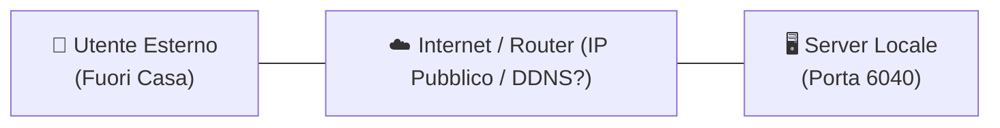
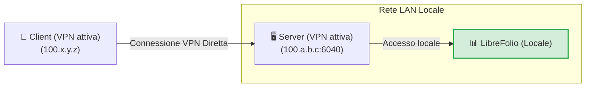
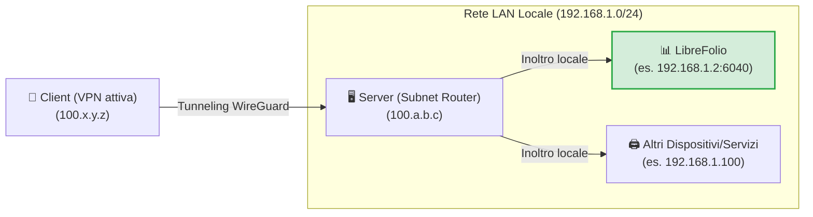
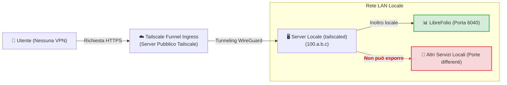
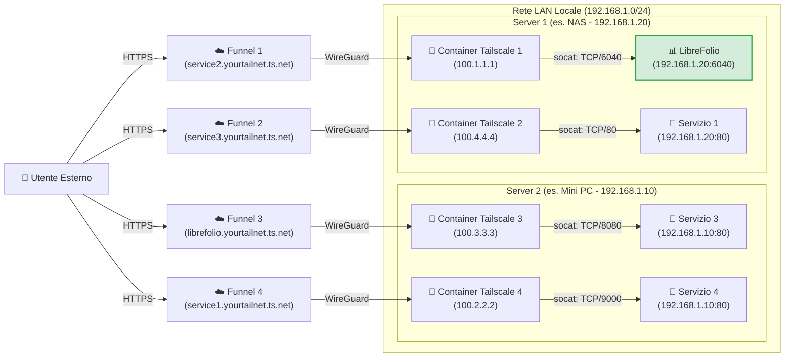

# 🌐 Esporre in Modo Sicuro

Esporre servizi self-hosted in modo sicuro su internet è una delle sfide più comuni. Questa guida spiega come rendere accessibile LibreFolio (o qualsiasi altro servizio nella tua rete locale) sfruttando [Tailscale](https://tailscale.com/), una soluzione VPN mesh sicura, ad alte prestazioni e gratuita per uso domestico.

!!! tip "La Nostra Raccomandazione di Configurazione"

    Tra i diversi approcci presentati, riteniamo che il **Livello 4 (Multi-Funnel via Docker)** sia la soluzione assolutamente migliore: richiede pochissima configurazione aggiuntiva rispetto agli altri metodi, offre i massimi vantaggi in termini di isolamento e modularità, e risolve i limiti strutturali degli altri metodi. Gli altri livelli sono presentati sia come alternative sia per comprendere il percorso tecnico per arrivarci.

---

## 🔒 Sicurezza e Rischi del Port Forwarding Tradizionale

Il metodo tradizionale per rendere un servizio accessibile dall'esterno prevede l'apertura di porte sul router di casa (port forwarding) associata a un IP pubblico (spesso dinamico) e un servizio DDNS (come DuckDNS).

Questo approccio presenta rischi significativi:

1. **Esposizione all'intero web**: Chiunque può scansionare il tuo IP pubblico e tentare di attaccare la porta aperta.
2. **Complessità di gestione**: È necessario configurare e rinnovare manualmente i certificati SSL (HTTPS) tramite un reverse proxy (Nginx, Caddy, ecc.).
3. **Rischi del protocollo HTTP**: Senza una crittografia HTTPS configurata correttamente, le tue credenziali e i dati finanziari viaggiano in chiaro sulla rete locale e pubblica, rendendoli intercettabili da attori malintenzionati (packet sniffing).

Il seguente diagramma mostra il problema iniziale dell'esposizione remota:



---

## 🚀 Cos'è Tailscale?

[Tailscale](https://tailscale.com/) è un servizio VPN mesh a configurazione zero basato sul moderno protocollo di crittografia **WireGuard**.

* **Piano Gratuito (Personale)**: Permette di connettere fino a **100 dispositivi** gratuitamente.
* **Rete Mesh**: Tutti i dispositivi configurati si connettono direttamente tra loro in modo peer-to-peer crittografato, senza che il traffico passi attraverso server intermedi.
* **Compatibilità**: Funziona su tutti i principali sistemi operativi (Linux, macOS, Windows, iOS, Android) e può essere installato su un NAS o all'interno di container Docker.

---

## 🏁 Passo 0: Installare Tailscale sui Tuoi Dispositivi

Per far funzionare qualsiasi VPN, sono necessari **almeno 2 dispositivi connessi**: il *client* (es. il tuo smartphone o laptop) e il *server* (il nodo su cui è in esecuzione LibreFolio). Prima di procedere con i livelli, installa e accedi a Tailscale sui tuoi dispositivi:

=== "Linux"

    Esegui il comando di installazione ufficiale sul server:

    ```bash
    curl -fsSL https://tailscale.com/install.sh | sh
    sudo tailscale up
    ```

    Per maggiori dettagli, consulta la [Guida all'Installazione Generica](https://tailscale.com/docs/install).

=== "macOS"

    Installa l'app ufficiale dal **Mac App Store** o usa Homebrew:

    ```bash
    brew install --cask tailscale
    sudo tailscale up
    ```

    Per maggiori dettagli, consulta la [Guida all'Installazione Generica](https://tailscale.com/docs/install).

=== "Windows"

    Scarica il programma di installazione ufficiale dal portale Tailscale e segui la procedura guidata di accesso.

    Per dettagli, consulta la [Guida all'Installazione per Windows](https://tailscale.com/docs/install/windows).

=== "Android"

    Installa l'applicazione ufficiale dal [Google Play Store](https://play.google.com/store/apps/details?id=com.tailscale.ipn).

=== "iOS (iPhone/iPad)"

    Installa l'applicazione ufficiale dall'[Apple App Store](https://apps.apple.com/us/app/tailscale/id1470499037).

---

## 🛠️ I 4 Livelli di Configurazione ed Esposizione

---

## 🏃 Livello 1: Connessione VPN Privata Punto-a-Punto (Inizio)

Consiste nel connettere il server e il client alla stessa rete Tailscale privata. Sul server, la porta del servizio viene esposta utilizzando il comando `serve`.



Sul server, usa il comando per esporre la porta locale di LibreFolio (porta predefinita `6040`):

```bash
tailscale serve tcp:6040 /
```

A questo punto, con la VPN attiva sul tuo smartphone o PC, basta inserire l'IP Tailscale del server (o il suo MagicDNS) seguito dalla porta nel browser per accedere a LibreFolio da remoto.

<table style="width: 100%; border-collapse: collapse; margin-top: 1rem; margin-bottom: 1rem;">
 <thead>
 <tr style="background-color: #f3f4f6;">
 <th style="width: 50%; padding: 10px; border: 1px solid #e5e7eb; text-align: left; font-weight: bold;">🟢 Vantaggi (Pro)</th>
 <th style="width: 50%; padding: 10px; border: 1px solid #e5e7eb; text-align: left; font-weight: bold;">🔴 Svantaggi (Contro)</th>
 </tr>
 </thead>
 <tbody>
 <tr>
 <td style="padding: 10px; border: 1px solid #e5e7eb; background-color: rgba(76, 175, 80, 0.08); vertical-align: top;">
 <ul>
 <li>Configurazione immediata e minima.</li>
 <li>Massima sicurezza: i tuoi dati non passano su internet pubblico, la porta è chiusa fuori dalla VPN.</li>
 </ul>
 </td>
 <td style="padding: 10px; border: 1px solid #e5e7eb; background-color: rgba(244, 67, 54, 0.08); vertical-align: top;">
 <ul>
 <li><strong>Richiede che la VPN Tailscale sia attiva e connessa</strong> su ogni client (es. sul telefono) per raggiungere il servizio.</li>
 <li><strong>Espone un solo servizio</strong> per host.</li>
 </ul>
 </td>
 </tr>
 </tbody>
</table>

---

## 🥉 Livello 2: Configurazione del Subnet Router (Tunneling LAN)

Questo livello trasforma il tuo server in un "sub-router". Quando sei fuori casa con la VPN accesa sul client, puoi raggiungere non solo il server ma **qualsiasi dispositivo o servizio sulla tua LAN domestica** semplicemente inserendo il suo IP locale.



### 1. Abilita il Subnet Routing sul Sistema Operativo del Server

=== "Linux"

    Abilita l'IP forwarding a livello kernel:

    ```bash
    echo 'net.ipv4.ip_forward = 1' | sudo tee -a /etc/sysctl.d/99-tailscale.conf
    echo 'net.ipv6.conf.all.forwarding = 1' | sudo tee -a /etc/sysctl.d/99-tailscale.conf
    sudo sysctl -p /etc/sysctl.d/99-tailscale.conf
    ```

    Inizia ad annunciare la subnet (sostituisci il range IP con la tua rete locale, es. `192.168.1.0/24`):

    ```bash
    sudo tailscale up --advertise-routes=192.168.1.0/24
    ```

=== "macOS"

    Usa il percorso dell'eseguibile di Tailscale per annunciare la subnet locale:

    ```bash
    /Applications/Tailscale.app/Contents/MacOS/Tailscale up --advertise-routes=192.168.1.0/24
    ```

=== "Windows"

    Esegui il Prompt dei Comandi (`cmd.exe`) o PowerShell come **Amministratore** e annuncia la subnet locale:

    ```cmd
    tailscale up --advertise-routes=192.168.1.0/24
    ```

### 2. Approva la Route nella Console di Amministrazione

1. Vai alla [Console di Amministrazione Tailscale](https://login.tailscale.com/admin/machines).
2. Clicca i tre puntini accanto al tuo server -> **Edit route settings**.
3. Abilita la subnet annunciata.

!!! tip "Disabilita la Scadenza della Chiave per il Server"

    Poiché il server funge da infrastruttura di rete (subnet router), si consiglia di disabilitare la scadenza automatica della chiave per questo nodo per evitare che si disconnetta e richieda una riautenticazione interattiva periodica (ogni 180 giorni per impostazione predefinita):

    1. Nella pagina **Machines** della console di amministrazione, individua il tuo server.
    2. Clicca sull'**icona dei tre punti (...)** a destra della riga del dispositivo.
    3. Seleziona l'opzione **Disable Key Expiry**.

<table style="width: 100%; border-collapse: collapse; margin-top: 1rem; margin-bottom: 1rem;">
 <thead>
 <tr style="background-color: #f3f4f6;">
 <th style="width: 50%; padding: 10px; border: 1px solid #e5e7eb; text-align: left; font-weight: bold;">🟢 Vantaggi (Pro)</th>
 <th style="width: 50%; padding: 10px; border: 1px solid #e5e7eb; text-align: left; font-weight: bold;">🔴 Svantaggi (Contro)</th>
 </tr>
 </thead>
 <tbody>
 <tr>
 <td style="padding: 10px; border: 1px solid #e5e7eb; background-color: rgba(76, 175, 80, 0.08); vertical-align: top;">
 <ul>
 <li>Accesso a tutti i dispositivi in casa (stampanti, telecamere, LibreFolio, domotica) con un solo nodo attivo.</li>
 <li>Nessuna necessità di configurare porte o reverse proxy per ogni servizio.</li>
 </ul>
 </td>
 <td style="padding: 10px; border: 1px solid #e5e7eb; background-color: rgba(244, 67, 54, 0.08); vertical-align: top;">
 <ul>
 <li><strong>La VPN sul client deve essere attiva</strong> per consentire la comunicazione.</li>
 <li><strong>Devi conoscere gli IP locali</strong> dei dispositivi per raggiungerli.</li>
 <li>Una volta all'interno della rete domestica, <strong>i pacchetti viaggiano in chiaro (HTTP)</strong> sulla LAN privata.</li>
 </ul>
 </td>
 </tr>
 </tbody>
</table>

---

## 🔑 Abilitazione di Funnel e ACL sulla Console {: #enabling-funnel-and-acls-on-the-console }

*Configurazione una tantum richiesta per il Livello 3 e il Livello 4*

Prima di poter utilizzare Tailscale Funnel (sia sul server locale nel Livello 3 che all'interno dei container Docker nel Livello 4), devi abilitare Funnel e definire le regole di controllo degli accessi globali (ACL) per tutta la tua Tailnet. Questa è una configurazione una tantum eseguita direttamente nella console di amministrazione di Tailscale.

### 1. Abilita HTTPS e Funnel sul Pannello di Controllo

1. Visita la pagina [Access Controls](https://login.tailscale.com/admin/acls) nella console di amministrazione di Tailscale.
2. Clicca sul pulsante **Add node attribute** per creare l'autorizzazione richiesta.


3. Configura le seguenti opzioni nel modulo:
 * **Targets**: Inserisci il tag o il gruppo che vuoi autorizzare per l'attivazione di Funnel. Un *Target* definisce a quali nodi si applica la regola. **Suggeriamo di usare `tag:external_access`** (per associarlo selettivamente ai container Docker) o `autogroup:member` (se vuoi permettere l'esposizione per tutti i dispositivi registrati sotto il tuo account personale).
 * **Attributes**: Inserisci `funnel`.
 * **Note**: Inserisci del testo per registrare il motivo di questa regola.
 * **IP Pools, App, Capability, ecc.**: Questi campi extra non sono necessari per questa configurazione di esposizione, quindi lasciali vuoti o con i valori predefiniti.

*Importante: La configurazione ACL definisce le politiche di sicurezza globali necessarie per abilitare Funnel. È indipendente dalle chiavi di autenticazione (Auth Keys), che vengono utilizzate solo per registrare un nuovo dispositivo o container sulla rete per la prima volta.*

In alternativa, se preferisci modificare direttamente la configurazione ACL JSON, puoi utilizzare il seguente esempio funzionante (aggiornato per supportare sia i tuoi dispositivi che i container taggati con `tag:external_access`):

??? example "Visualizza la configurazione ACL JSON completa per abilitare Funnel"

    ```json
    {
    // Dichiarazione dei tag autorizzati
    "tagOwners": {
    "tag:external_access": ["autogroup:admin"]
    },

    // Regole di accesso standard
    "acls": [
    // Permette a tutti i nodi nella tua rete privata di comunicare
    {"action": "accept", "src": ["*"], "dst": ["*:*"]}
    ],

    "ssh": [
    {
    "action": "check",
    "src": ["autogroup:member"],
    "dst": ["autogroup:self"],
    "users": ["autogroup:nonroot", "root"]
    }
    ],

    // Abilitazione di Funnel su nodi o tag specifici
    "nodeAttrs": [
    {
    "target": ["autogroup:member"],
    "attr": ["funnel"]
    },
    {
    "target": ["tag:external_access"],
    "attr": ["funnel"]
    }
    ]
    }
    ```

---

## 🥈 Livello 3: Esposizione Pubblica tramite Tailscale Funnel (Nessuna VPN sul Client)

!!! warning "Prerequisito Fondamentale"

    Prima di procedere, assicurati di aver completato la [configurazione una tantum di Funnel e ACL sulla console](#enabling-funnel-and-acls-on-the-console).

**Tailscale Funnel** ti permette di esporre un servizio pubblicamente su internet. Chiunque può accedere alla tua istanza di LibreFolio tramite un URL HTTPS sicuro fornito da MagicDNS, **senza bisogno di installare o attivare Tailscale** sul proprio smartphone o PC. Questo è essenziale se vuoi installare LibreFolio come PWA sui dispositivi mobili e ottenere il prompt di installazione automatico (per maggiori dettagli, consulta la guida [📱 Installa come App (PWA)](../user/pwa.md)).



### 1. Avvia il Funnel sul Server

Associa il funnel alla porta locale di LibreFolio:

```bash
tailscale funnel 6040 on
```

*Nota: Per questo livello, non è richiesta alcuna chiave di autenticazione (Auth Key) poiché la macchina server ha già effettuato l'accesso e si è registrata interattivamente alla tua Tailnet durante il **Passo 0**.*

### 2. Approva e Attendi la Propagazione

Una volta lanciato il comando, apparirà un avviso nel terminale che indica che Funnel è abilitato ma non ancora autorizzato per il tuo nodo, mostrando un link simile al seguente:

```text
Funnel is enabled, but the list of allowed nodes in the tailnet policy file does not include the one you are using.
To give access to this node you can edit the tailnet policy file, or visit:

 https://login.tailscale.com/f/funnel?node=xxxxxx
```

* Visita il link mostrato nel browser, accedi a Tailscale e approva l'attivazione di Funnel per questo nodo.
* Una volta approvato, il terminale mostrerà l'URL pubblico generato.
* Attendi qualche minuto affinché i record MagicDNS si propaghino globalmente per raggiungere il servizio da qualsiasi rete esterna.

<table style="width: 100%; border-collapse: collapse; margin-top: 1rem; margin-bottom: 1rem;">
 <thead>
 <tr style="background-color: #f3f4f6;">
 <th style="width: 50%; padding: 10px; border: 1px solid #e5e7eb; text-align: left; font-weight: bold;">🟢 Vantaggi (Pro)</th>
 <th style="width: 50%; padding: 10px; border: 1px solid #e5e7eb; text-align: left; font-weight: bold;">🔴 Svantaggi (Contro)</th>
 </tr>
 </thead>
 <tbody>
 <tr>
 <td style="padding: 10px; border: 1px solid #e5e7eb; background-color: rgba(76, 175, 80, 0.08); vertical-align: top;">
 <ul>
 <li>Accesso pubblico universale tramite HTTPS gratuito gestito da Tailscale.</li>
 <li>Nessun certificato SSL o reverse proxy da configurare sul server.</li>
 <li>Permette l'installazione nativa come PWA sugli smartphone senza attivare la VPN.</li>
 </ul>
 </td>
 <td style="padding: 10px; border: 1px solid #e5e7eb; background-color: rgba(244, 67, 54, 0.08); vertical-align: top;">
 <ul>
 <li><strong>Puoi esporre al massimo 1 singolo servizio</strong> Funnel per macchina host.</li>
 </ul>
 </td>
 </tr>
 </tbody>
</table>

---

## 🥇 Livello 4: Esposizione Multi-Funnel Avanzata tramite Docker (Sidecar)

!!! warning "Prerequisito Fondamentale"

    Prima di procedere con la configurazione del container, assicurati di aver completato la [configurazione una tantum di Funnel e ACL sulla console](#enabling-funnel-and-acls-on-the-console).

Per superare il limite di un Funnel per nodo host, possiamo eseguire più nodi Tailscale paralleli all'interno di container Docker. Ogni container si registrerà come nodo indipendente sulla tua Tailnet, ottenendo il proprio URL MagicDNS dedicato.

La nostra soluzione utilizza un piccolo script di avvio personalizzato che installa **socat** nel container e reindirizza il traffico HTTPS in entrata all'IP LAN statico del servizio di destinazione.

??? info "Cos'è socat?"

    **socat** (SOcket CAT) è un'utilità a riga di comando estremamente flessibile che stabilisce due flussi di byte bidirezionali e trasferisce dati tra di essi. Nel nostro caso, lo usiamo come un **mini proxy-forwarder**: ascolta sulla porta locale del container Tailscale e inoltra tutti i pacchetti ricevuti alla porta reale del servizio sul server locale.

Il diagramma di rete illustra lo scenario multi-nodo esposto in parallelo, dove i container Tailscale 1 e 2 sono in esecuzione sul primo host (Server 1) e i container Tailscale 3 e 4 sono in esecuzione sul secondo host (Server 2):



!!! note "Nodi e Servizi Multipli"

    Con questa architettura, puoi aggiungere ed esporre tutti i servizi desiderati semplicemente avviando nuovi container Tailscale associati allo script pertinente. L'unico limite è impostato dai termini del tuo piano di abbonamento Tailscale (che copre fino a 100 dispositivi nella versione gratuita).

### 1. Preparazione della Cartella e dello Script

Crea una cartella sul server (es. all'interno del percorso dove conservi i volumi persistenti Docker):

```bash
# Create a folder for the Tailscale nodes and enter it
mkdir -p <path_chosen>/tailscale-nodes
cd <path_chosen>/tailscale-nodes
```

Scarica lo script di avvio personalizzato <a href="https://raw.githubusercontent.com/Librefolio/LibreFolio/main/docs/static/tailscale-guide/custom_startup.sh" target="_blank" rel="noopener noreferrer">custom_startup.sh</a> all'interno di questa cartella:

```bash
# Download the script from the official repository
wget https://raw.githubusercontent.com/Librefolio/LibreFolio/main/docs/static/tailscale-guide/custom_startup.sh
# Make the script executable
chmod +x custom_startup.sh
```

### 2. Configurazione di Docker Compose

Suggeriamo di definire e dichiarare il servizio Tailscale **all'interno dello stesso file `docker-compose.yml` del servizio** che vuoi esporre (es. LibreFolio) per mantenerli vicini e logicamente accoppiati. Aggiungi il blocco di servizio come mostrato di seguito:

```yaml
services:
 tailscale-librefolio:
 image: tailscale/tailscale:latest
 container_name: tailscale-librefolio
 hostname: tailscale-librefolio
 restart: unless-stopped
 privileged: false
 network_mode: bridge
 cap_add:

 - NET_ADMIN
 - NET_RAW
 devices:

 - /dev/net/tun:/dev/net/tun
 command:

 - /custom_startup.sh
 environment:

 - HOST_IP=192.168.1.10 # Local IP of the service to expose (e.g. Server 1)
 - HOST_PORT=6040 # Real port of the service to expose
 - TAILSCALE_FUNNEL_PORT=6040 # Internal Funnel port
 - TS_HOSTNAME=librefolio # Custom public hostname (e.g. librefolio)
 - TS_AUTHKEY=tskey-auth-... # Authentication key generated by Tailscale
 - TS_ACCEPT_DNS=true
 - TS_STATE_DIR=/var/lib/tailscale
 - TS_USERSPACE=false
 volumes:

 - <path_chosen>/tailscale-nodes/tailscale-librefolio/state:/var/lib/tailscale
 - <path_chosen>/tailscale-nodes/custom_startup.sh:/custom_startup.sh
 - /etc/localtime:/etc/localtime:ro
 - /etc/timezone:/etc/timezone:ro
```

#### Descrizione dei Parametri di Configurazione

<table style="width: 100%; border-collapse: collapse; margin-top: 1rem; margin-bottom: 1rem;">
 <thead>
 <tr style="background-color: #f3f4f6;">
 <th style="width: 35%; padding: 10px; border: 1px solid #e5e7eb; text-align: left; font-weight: bold; white-space: nowrap;">Parametro</th>
 <th style="width: 65%; padding: 10px; border: 1px solid #e5e7eb; text-align: left; font-weight: bold;">Descrizione</th>
 </tr>
 </thead>
 <tbody>
 <tr>
 <td style="padding: 10px; border: 1px solid #e5e7eb; font-family: monospace; white-space: nowrap;">&lt;path_chosen&gt;</td>
 <td style="padding: 10px; border: 1px solid #e5e7eb;">Il percorso assoluto (full-path) sul server locale dove sono salvati lo script e i dati di stato (es. <code>/home/user/docker</code>).</td>
 </tr>
 <tr>
 <td style="padding: 10px; border: 1px solid #e5e7eb; font-family: monospace; white-space: nowrap;">HOST_IP</td>
 <td style="padding: 10px; border: 1px solid #e5e7eb;">L'IP LAN statico della macchina che ospita il servizio.</td>
 </tr>
 <tr>
 <td style="padding: 10px; border: 1px solid #e5e7eb; font-family: monospace; white-space: nowrap;">HOST_PORT</td>
 <td style="padding: 10px; border: 1px solid #e5e7eb;">La porta reale sul server LAN a cui connettersi (es. <code>6040</code> per LibreFolio).</td>
 </tr>
 <tr>
 <td style="padding: 10px; border: 1px solid #e5e7eb; font-family: monospace; white-space: nowrap;">TAILSCALE_FUNNEL_PORT</td>
 <td style="padding: 10px; border: 1px solid #e5e7eb;">La porta su cui il container Tailscale ascolterà e attiverà il Funnel. In linea di principio, l'approccio migliore è impostare questo parametro allo stesso valore della porta del servizio interno (<code>HOST_PORT</code>) per coerenza; viene lasciato come parametro separato per supportare potenziali casi speciali futuri.</td>
 </tr>
 <tr>
 <td style="padding: 10px; border: 1px solid #e5e7eb; font-family: monospace; white-space: nowrap;">TS_HOSTNAME</td>
 <td style="padding: 10px; border: 1px solid #e5e7eb;">Il nome host personalizzato per il nodo. L'indirizzo pubblico generato sarà <code>https://TS_HOSTNAME.your-tailnet.ts.net</code>.</td>
 </tr>
 <tr>
 <td style="padding: 10px; border: 1px solid #e5e7eb; font-family: monospace; white-space: nowrap;">TS_AUTHKEY</td>
 <td style="padding: 10px; border: 1px solid #e5e7eb;">
 La chiave di autenticazione (Auth Key) generata da Tailscale. Per ottenerla:<br>

 1. Vai su <a href="https://login.tailscale.com/admin/settings/keys" target="_blank" rel="noopener noreferrer">Tailscale Admin Settings Keys</a>.<br>
 2. Sotto la sezione <strong>Auth keys</strong> (<em>non</em> sotto la sezione dei token di accesso API), clicca sul pulsante <strong>Generate auth key...</strong>.<br>
 3. Devi <strong>abilitare l'interruttore Tags</strong> per selezionare il tag desiderato (es., <code>tag:external_access</code>). Nella descrizione della chiave, inserisci una nota descrittiva per renderla facilmente riconoscibile (es., <code>docker-librefolio-funnel</code>).<br>
 4. Clicca su <strong>Generate</strong> e copia la chiave generata (es., <code>tskey-auth-...</code>).<br>
 <br>
 <em>Nota: Una volta che il container è stato avviato con successo, la chiave monouso viene consumata e scompare automaticamente dall'elenco "Keys" nella console di amministrazione, mentre il nuovo dispositivo registrato apparirà in "Machines".</em>
 </td>
 </tr>
 </tbody>
</table>

??? example "Visualizza il file Docker Compose di produzione completo (LibreFolio + Tailscale)"

    Di seguito è riportato un esempio reale e completo di un file `docker-compose.yml` di produzione che esegue l'immagine di produzione ufficiale di LibreFolio insieme al sidecar Tailscale per l'esposizione automatica:

    ```yaml
    # =============================================================================
    # LibreFolio — Docker Compose di Produzione
    # =============================================================================
    # Ottimizzato per utenti finali che eseguono l'immagine pre-costruita ufficiale da GHCR.
    # =============================================================================

    services:
    librefolio:
    image: ghcr.io/librefolio/librefolio:nightly
    container_name: librefolio
    restart: unless-stopped
    ports:

    - "${PORT:-6040}:6040"
    volumes:

    - ./LibreFolio-data:/app/backend/data/prod-docker
    env_file: .env
    environment:

    - LIBREFOLIO_DATA_DIR=/app/backend/data/prod-docker
    - HOST=0.0.0.0
    healthcheck:
    test: ["CMD", "python", "-c", "import urllib.request; urllib.request.urlopen('http://localhost:6040/api/v1/system/health')"]
    interval: 30s
    timeout: 10s
    start_period: 15s
    retries: 3

    tailscale-librefolio:
    image: tailscale/tailscale:latest
    container_name: tailscale-librefolio
    hostname: tailscale-librefolio
    restart: unless-stopped
    privileged: false
    network_mode: bridge
    cap_add:

    - NET_ADMIN
    - NET_RAW
    devices:

    - /dev/net/tun:/dev/net/tun
    command:

    - /custom_startup.sh
    environment:

    - HOST_IP=192.168.1.10 # Local IP of the service to expose (e.g. Server 1)
    - HOST_PORT=6040 # Real port of the service to expose
    - TAILSCALE_FUNNEL_PORT=6040 # Internal Funnel port
    - TS_HOSTNAME=librefolio # Custom public hostname (e.g. librefolio)
    - TS_AUTHKEY=tskey-auth-... # Replace with your generated key
    - TS_ACCEPT_DNS=true
    - TS_STATE_DIR=/var/lib/tailscale
    - TS_USERSPACE=false
    volumes:

    - /DATA/AppData/tailscale-nodes/tailscale-librefolio/state:/var/lib/tailscale
    - /DATA/AppData/tailscale-nodes/custom_startup.sh:/custom_startup.sh
    - /etc/localtime:/etc/localtime:ro
    - /etc/timezone:/etc/timezone:ro
    ```

### 3. Avvio e Approvazione

Avvia il container compose del tuo servizio (inclusivo del sidecar Tailscale):

```bash
docker compose up -d
```

Visualizza i log del container Tailscale per estrarre il link di approvazione del Funnel (richiesto al primo avvio):

```bash
docker logs -f tailscale-librefolio
```

Nei log del container, apparirà una riga di avviso con il link di autorizzazione specifico per il tuo nodo:

```text
Funnel is enabled, but the list of allowed nodes in the tailnet policy file does not include the one you are using.
To give access to this node you can edit the tailnet policy file, or visit:

 https://login.tailscale.com/f/funnel?node=nsKGo6k9ZF11CNTRL
```

* Apri il link mostrato nel browser, accedi a Tailscale e approva l'attivazione del Funnel.
* Immediatamente dopo l'approvazione, vedrai la conferma dell'esposizione riuscita nei log del container con l'URL pubblico e il proxy locale:

```text
Available on the internet:

https://librefolio.yourtailnet.ts.net/
|-- proxy http://127.0.0.1:6040

Press Ctrl+C to exit.
```

* **Nota**: A questo punto, il servizio è online, ma devi attendere qualche minuto affinché la propagazione del record MagicDNS sia completa a livello globale.

!!! tip "Disabilita la Scadenza della Chiave per il Container"

    Per evitare che il container sidecar scada e si disconnetta dalla tua Tailnet dopo il periodo predefinito (180 giorni):

    1. Vai alla pagina **Machines** della Console di Amministrazione Tailscale.
    2. Trova il nodo del container (es., `librefolio` o `tailscale-librefolio`) nell'elenco.
    3. Clicca sull'**icona dei tre punti (...)** a destra della riga del dispositivo.
    4. Seleziona l'opzione **Disable Key Expiry**.

<table style="width: 100%; border-collapse: collapse; margin-top: 1rem; margin-bottom: 1rem;">
 <thead>
 <tr style="background-color: #f3f4f6;">
 <th style="width: 50%; padding: 10px; border: 1px solid #e5e7eb; text-align: left; font-weight: bold;">🟢 Vantaggi (Pro)</th>
 <th style="width: 50%; padding: 10px; border: 1px solid #e5e7eb; text-align: left; font-weight: bold;">🔴 Svantaggi (Contro)</th>
 </tr>
 </thead>
 <tbody>
 <tr>
 <td style="padding: 10px; border: 1px solid #e5e7eb; background-color: rgba(76, 175, 80, 0.08); vertical-align: top;">
 <ul>
 <li>Possibilità di creare <strong>Funnel pubblici indipendenti illimitati</strong> su una singola macchina fisica.</li>
 <li>URL separati e dedicati per ogni servizio domestico.</li>
 <li>I pacchetti di rete locali viaggiano in modo sicuro e diretto tra il container e il servizio di destinazione.</li>
 </ul>
 </td>
 <td style="padding: 10px; border: 1px solid #e5e7eb; background-color: rgba(244, 67, 54, 0.08); vertical-align: top;">
 <ul>
 <li><strong>Richiede l'uso del terminale</strong> e la configurazione manuale dei file Docker Compose.</li>
 </ul>
 </td>
 </tr>
 </tbody>
</table>

---

## 🔮 MagicDNS e Domini Personalizzati

### Cos'è MagicDNS?

**MagicDNS** assegna automaticamente un nome di dominio DNS locale e pubblico a ciascuno dei tuoi dispositivi registrati nella Tailnet. Invece di dover ricordare indirizzi IP come `100.110.222.112`, puoi digitare `http://tuo-server` nel browser.
I domini pubblici assegnati da MagicDNS terminano con il suffisso `*.ts.net` (per esempio, `https://librefolio.your-tailnet.ts.net`).

### Come Usare un Dominio Personalizzato con Tailscale

Se possiedi un tuo dominio personale (es., `miodominio.com`) e vuoi usarlo per raggiungere i tuoi nodi Tailscale privati invece di usare l'URL standard `*.ts.net`, puoi procedere con due tecniche principali:

#### Metodo 1: DNS Pubblico Mappato all'IP Tailscale (Consigliato per Rete Privata)

Questa è la soluzione più semplice per accedere ai tuoi dispositivi privatamente usando il tuo dominio.

1. Accedi alla console del tuo registrar di domini (es., Cloudflare, GoDaddy, Namecheap).
2. Crea un record DNS di tipo **A** (o **AAAA** per IPv6) per il sottodominio scelto (es., `librefolio.miodominio.com`).
3. Punta il record direttamente all'**IP Tailscale privato** del tuo server (es., `100.77.72.90`).
4. **Come funziona**: Poiché gli indirizzi IP nella rete `100.64.0.0/10` non sono instradabili pubblicamente a livello globale, il dominio risolverà e funzionerà **solo** quando sei connesso alla tua VPN Tailscale, assicurando che nessun utente esterno possa accedere o scansionare il servizio. Per dettagli, consulta la [Documentazione ufficiale sulle impostazioni DNS](https://tailscale.com/kb/1054/dns#public-dns).

#### Metodo 2: Split DNS (Con Server DNS Interno)

Se vuoi gestire dinamicamente i record interni e non pubblicarli su internet:

1. Configura un server DNS privato nella tua LAN (come Pi-hole, AdGuard Home o CoreDNS).
2. Aggiungi record locali del tuo dominio puntandoli ai tuoi IP Tailscale.
3. Nella console di amministrazione di Tailscale, vai su *DNS -> Nameservers -> Add Nameserver* e aggiungi l'IP Tailscale del tuo DNS privato come nameserver globale o limitato al tuo dominio. Per dettagli, consulta la [Documentazione ufficiale su Split DNS](https://tailscale.com/kb/1054/dns#split-dns).

!!! warning "Attenzione sull'Esposizione Pubblica tramite Funnel"

    Poiché i Funnel pubblici di Tailscale sono esposti su internet solo tramite il dominio sicuro `*.ts.net` (grazie ai certificati SSL firmati da Tailscale), il mapping diretto di un CNAME dal tuo dominio personalizzato a un indirizzo Funnel causerà errori di sicurezza SSL/TLS nei browser, a meno che non venga utilizzato un reverse proxy separato (come Caddy o Nginx) per gestire i certificati della tua zona. L'indirizzo pubblico della tua istanza sarà `librefolio.your-tailnet.ts.net`, dove la parte iniziale `librefolio` è definita automaticamente dal valore assegnato alla variabile `TS_HOSTNAME`.

---

## 🔗 Link Utili e Risorse

* 🖥️ [Console di Amministrazione Tailscale (Macchine)](https://login.tailscale.com/admin/machines)
* 🔐 [Gestione dei Controlli di Accesso (ACL)](https://login.tailscale.com/admin/acls)
* 📖 [Guida Ufficiale a Tailscale Funnel (Documentazione in Inglese)](https://tailscale.com/kb/1223/tailscale-funnel)
* 🐳 [Eseguire Tailscale in Docker](https://tailscale.com/kb/1282/docker)
