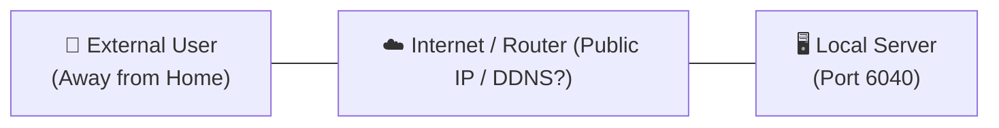
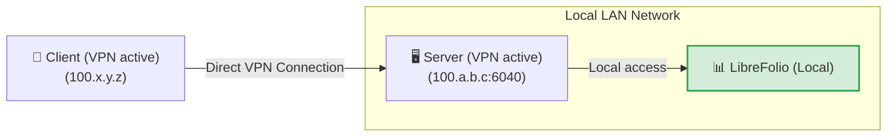
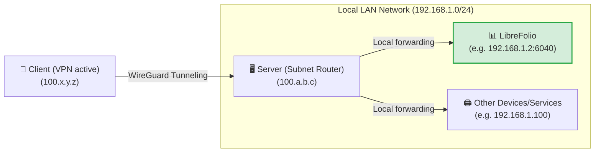
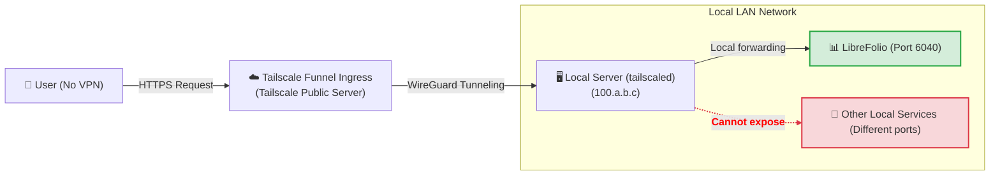
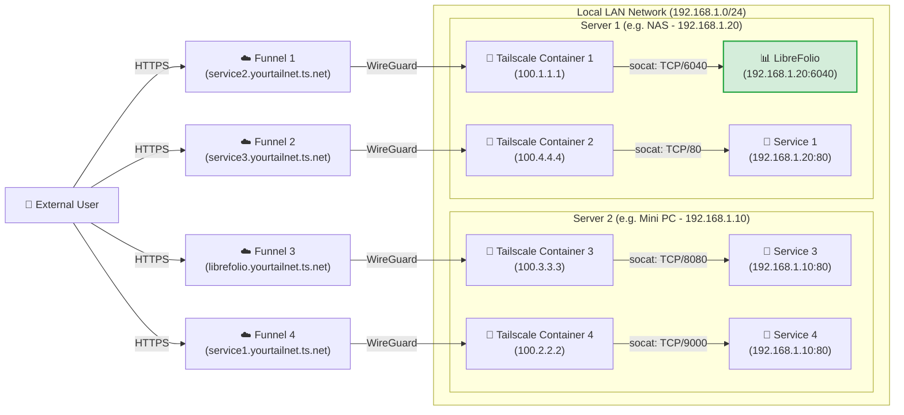

# 🌐 Exposing LibreFolio via Tailscale

Exposing self-hosted services securely on the internet is one of the most common challenges. This guide explains how to make LibreFolio (or any other service in your local network) accessible by leveraging [Tailscale](https://tailscale.com/), a secure, high-performance, and free mesh VPN solution for home use.

!!! tip "Our Configuration Recommendation"

    Among the different approaches presented, we believe that **Level 4 (Multi-Funnel via Docker)** is the absolute best solution: it requires very little additional configuration compared to the other methods, offers the maximum advantages in terms of isolation and modularity, and resolves the structural limitations of the other methods. The other levels are presented both as alternatives and to understand the technical path to get there.

---

## 🔒 Security and Risks of Traditional Port Forwarding

The traditional method for making a service accessible from the outside involves opening ports on your home router (port forwarding) associated with a public IP (often dynamic) and a DDNS service (like DuckDNS). 

This approach presents significant risks:

1. **Exposure to the entire web**: Anyone can scan your public IP and attempt to attack the open port.
2. **Management complexity**: It is necessary to manually configure and renew SSL certificates (HTTPS) via a reverse proxy (Nginx, Caddy, etc.).
3. **HTTP protocol risks**: Without a correctly configured HTTPS encryption, your credentials and financial data travel in plain text over the local and public network, making them interceptable by malicious actors (packet sniffing).

The following diagram shows the initial remote exposure problem:



---

## 🚀 What is Tailscale?

[Tailscale](https://tailscale.com/) is a zero-configuration mesh VPN service based on the modern **WireGuard** encryption protocol. 

* **Free Plan (Personal)**: Allows connecting up to **100 devices** for free.
* **Mesh Network**: All configured devices connect directly to each other in an encrypted peer-to-peer fashion, without traffic passing through intermediate servers.
* **Compatibility**: Works on all major operating systems (Linux, macOS, Windows, iOS, Android) and can be installed on a NAS or inside Docker containers.

---

## 🏁 Step 0: Installing Tailscale on Your Devices

To make any VPN work, **at least 2 connected devices** are required: the *client* (e.g., your smartphone or laptop) and the *server* (the node on which LibreFolio is running). Before proceeding with the levels, install and log into Tailscale on your devices:

=== "Linux"

    Run the official installation command on the server:

    ```bash
    curl -fsSL https://tailscale.com/install.sh | sh
    sudo tailscale up
    ```

    For more details, see the [Generic Installation Guide](https://tailscale.com/docs/install).

=== "macOS"

    Install the official app from the **Mac App Store** or use Homebrew:

    ```bash
    brew install --cask tailscale
    sudo tailscale up
    ```

    For more details, see the [Generic Installation Guide](https://tailscale.com/docs/install).

=== "Windows"

    Download the official installer from the Tailscale portal and follow the login wizard.

    For details, see the [Windows Installation Guide](https://tailscale.com/docs/install/windows).

=== "Android"

    Install the official application from the [Google Play Store](https://play.google.com/store/apps/details?id=com.tailscale.ipn).

=== "iOS (iPhone/iPad)"

    Install the official application from the [Apple App Store](https://apps.apple.com/us/app/tailscale/id1470499037).

---

## 🛠️ The 4 Levels of Configuration and Exposure

---

## 🏃 Level 1: Private Point-to-Point VPN Connection (Start)

This consists of connecting the server and the client to the same private Tailscale network. On the server, the service port is exposed using the `serve` command.



On the server, use the command to expose the local LibreFolio port (default port `6040`):

```bash
tailscale serve tcp:6040 /
```

At this point, with the VPN active on your smartphone or PC, simply enter the server's Tailscale IP (or its MagicDNS) followed by the port in the browser to access LibreFolio remotely.

<table style="width: 100%; border-collapse: collapse; margin-top: 1rem; margin-bottom: 1rem;">
  <thead>
    <tr style="background-color: #f3f4f6;">
      <th style="width: 50%; padding: 10px; border: 1px solid #e5e7eb; text-align: left; font-weight: bold;">🟢 Advantages (Pros)</th>
      <th style="width: 50%; padding: 10px; border: 1px solid #e5e7eb; text-align: left; font-weight: bold;">🔴 Disadvantages (Cons)</th>
    </tr>
  </thead>
  <tbody>
    <tr>
      <td style="padding: 10px; border: 1px solid #e5e7eb; background-color: rgba(76, 175, 80, 0.08); vertical-align: top;">
        <ul>
          <li>Instant and minimal configuration.</li>
          <li>Maximum security: your data does not pass over the public internet, the port is closed outside the VPN.</li>
        </ul>
      </td>
      <td style="padding: 10px; border: 1px solid #e5e7eb; background-color: rgba(244, 67, 54, 0.08); vertical-align: top;">
        <ul>
          <li><strong>Requires the Tailscale VPN to be active and connected</strong> on each client (e.g., on the phone) to reach the service.</li>
          <li><strong>Exposes only one single service</strong> per host.</li>
        </ul>
      </td>
    </tr>
  </tbody>
</table>

---

## 🥉 Level 2: Subnet Router Configuration (LAN Tunneling)

This level transforms your server into a "sub-router". When you are away from home with the VPN turned on on the client, you can reach not only the server but **any device or service on your home LAN** by simply entering its local IP.



### 1. Enable Subnet Routing on the Server OS

=== "Linux"

    Enable IP forwarding at the kernel level:

    ```bash
    echo 'net.ipv4.ip_forward = 1' | sudo tee -a /etc/sysctl.d/99-tailscale.conf
    echo 'net.ipv6.conf.all.forwarding = 1' | sudo tee -a /etc/sysctl.d/99-tailscale.conf
    sudo sysctl -p /etc/sysctl.d/99-tailscale.conf
    ```

    Start advertising the subnet (replace the IP range with your local network, e.g., `192.168.1.0/24`):

    ```bash
    sudo tailscale up --advertise-routes=192.168.1.0/24
    ```

=== "macOS"

    Use the Tailscale executable path to advertise the local subnet:

    ```bash
    /Applications/Tailscale.app/Contents/MacOS/Tailscale up --advertise-routes=192.168.1.0/24
    ```

=== "Windows"

    Run Command Prompt (`cmd.exe`) or PowerShell as **Administrator** and advertise the local subnet:

    ```cmd
    tailscale up --advertise-routes=192.168.1.0/24
    ```

### 2. Approve the Route in the Admin Console

1. Go to the [Tailscale Admin Console](https://login.tailscale.com/admin/machines).
2. Click the three dots next to your server -> **Edit route settings**.
3. Enable the advertised subnet.

!!! tip "Disable Key Expiry for the Server"

    Since the server acts as network infrastructure (subnet router), it is recommended to disable automatic key expiry for this node to prevent it from disconnecting and requiring periodic interactive reauthentication (every 180 days by default):
    1. On the **Machines** page of the admin console, locate your server.
    2. Click the **three dots (...) icon** on the right of the device row.
    3. Select the **Disable Key Expiry** option.

<table style="width: 100%; border-collapse: collapse; margin-top: 1rem; margin-bottom: 1rem;">
  <thead>
    <tr style="background-color: #f3f4f6;">
      <th style="width: 50%; padding: 10px; border: 1px solid #e5e7eb; text-align: left; font-weight: bold;">🟢 Advantages (Pros)</th>
      <th style="width: 50%; padding: 10px; border: 1px solid #e5e7eb; text-align: left; font-weight: bold;">🔴 Disadvantages (Cons)</th>
    </tr>
  </thead>
  <tbody>
    <tr>
      <td style="padding: 10px; border: 1px solid #e5e7eb; background-color: rgba(76, 175, 80, 0.08); vertical-align: top;">
        <ul>
          <li>Access to all devices in the house (printers, cameras, LibreFolio, home automation) with only one active node.</li>
          <li>No need to configure ports or reverse proxies for each service.</li>
        </ul>
      </td>
      <td style="padding: 10px; border: 1px solid #e5e7eb; background-color: rgba(244, 67, 54, 0.08); vertical-align: top;">
        <ul>
          <li><strong>The VPN on the client must be active</strong> to allow communication.</li>
          <li><strong>You must know the local IPs</strong> of the devices to reach them.</li>
          <li>Once inside the home, <strong>packets travel in plain text (HTTP)</strong> on the private LAN.</li>
        </ul>
      </td>
    </tr>
  </tbody>
</table>

---

## 🔑 Abilitare il Funnel e le ACL sulla Console

*Configurazione una tantum necessaria per il Livello 3 e il Livello 4*

Prima di poter utilizzare Tailscale Funnel (sia sul server locale al Livello 3, sia all'interno dei container Docker al Livello 4), è necessario abilitare il Funnel e definire le regole di accesso (ACL) a livello globale per tutta la tua Tailnet. Questa operazione si esegue una sola volta direttamente sulla console amministrativa di Tailscale.

### 1. Abilitare HTTPS e Funnel sul Pannello di Controllo

1. Visita la scheda [Access Controls](https://login.tailscale.com/admin/acls) della console di amministrazione Tailscale.
2. Clicca sul pulsante **Add node attribute** per generare le autorizzazioni.


3. Configura le seguenti opzioni della schermata:
    * **Targets**: Inserisci il tag o gruppo che desideri autorizzare ad attivare il Funnel. Un *Target* definisce a quali nodi si applica la regola. **Noi suggeriamo di inserire `tag:external_access`** (per associarlo selettivamente ai container Docker) oppure `autogroup:member` (se desideri consentire l'esposizione a tutti i dispositivi registrati col tuo account personale).
    * **Attributes**: Inserisci `funnel`.
    * **Note**: Inserisci un testo per tenere traccia delle tue motivazioni.
    * **IP Pools, App, Capability, ecc.**: Questi campi aggiuntivi non ci interessano per questa esposizione, lasciali vuoti o ai valori predefiniti.

*Nota bene: La configurazione delle ACL definisce le policy di sicurezza globali per l'abilitazione del Funnel. Essa è indipendente dalle chiavi di autenticazione (Auth Key), che servono esclusivamente per registrare inizialmente un nuovo dispositivo/container alla rete.*

In alternativa, se preferisci modificare direttamente la configurazione JSON delle ACL, puoi utilizzare la seguente configurazione funzionante (aggiornata per supportare sia i tuoi dispositivi che il tag `tag:external_access` dei container):

??? example "Visualizza la configurazione ACL JSON completa per abilitare il Funnel"

    ```json
    {
      // Dichiarazione dei tag autorizzati
      "tagOwners": {
        "tag:external_access": ["autogroup:admin"]
      },

      // Regole di accesso standard
      "acls": [
        // Consente a tutti i nodi della tua rete privata di comunicare
        {"action": "accept", "src": ["*"], "dst": ["*:*"]}
      ],

      "ssh": [
        {
          "action": "check",
          "src":    ["autogroup:member"],
          "dst":    ["autogroup:self"],
          "users":  ["autogroup:nonroot", "root"]
        }
      ],

      // Abilitazione del Funnel su determinati nodi o tag
      "nodeAttrs": [
        {
          "target": ["autogroup:member"],
          "attr":   ["funnel"]
        },
        {
          "target": ["tag:external_access"],
          "attr":   ["funnel"]
        }
      ]
    }
    ```

---

### 🥈 Level 3: Public Exposure via Tailscale Funnel (No VPN on Client)

!!! warning "Prerequisito Fondamentale"

    Prima di procedere, assicurati di aver completato la [configurazione una tantum del Funnel e delle ACL sulla console](#abilitare-il-funnel-e-le-acl-sulla-console).

**Tailscale Funnel** consente di esporre pubblicamente un servizio a Internet. Chiunque potrà accedere al tuo LibreFolio tramite un URL HTTPS protetto fornito da MagicDNS, **senza dover installare o attivare Tailscale** sul proprio smartphone o PC. Questo è essenziale per poter installare LibreFolio come PWA su dispositivi mobili ed avere l'auto-prompt (per approfondimenti, consulta la guida [📱 Installa come App (PWA)](../user/pwa.md)).



### 1. Start the Funnel on the Server

Associate the funnel with the local LibreFolio port:

```bash
tailscale funnel 6040 on
```

*Note: For this level, no authentication key (Auth Key) is required as the server machine has already been logged in and registered interactively to your Tailnet during **Step 0**.*

### 2. Approve and Wait for Propagation

Once the command is launched, a warning will appear in the terminal indicating that the Funnel is enabled but not yet authorized for your node, showing a link similar to the following:

```text
Funnel is enabled, but the list of allowed nodes in the tailnet policy file does not include the one you are using.
To give access to this node you can edit the tailnet policy file, or visit:

         https://login.tailscale.com/f/funnel?node=xxxxxx
```

* Visit the link shown in the browser, log in to Tailscale, and approve the activation of the Funnel for this node.
* Once approved, the terminal will display the generated public URL.
* Wait a few minutes for the MagicDNS records to propagate globally to reach the service from any external network.

<table style="width: 100%; border-collapse: collapse; margin-top: 1rem; margin-bottom: 1rem;">
  <thead>
    <tr style="background-color: #f3f4f6;">
      <th style="width: 50%; padding: 10px; border: 1px solid #e5e7eb; text-align: left; font-weight: bold;">🟢 Advantages (Pros)</th>
      <th style="width: 50%; padding: 10px; border: 1px solid #e5e7eb; text-align: left; font-weight: bold;">🔴 Disadvantages (Cons)</th>
    </tr>
  </thead>
  <tbody>
    <tr>
      <td style="padding: 10px; border: 1px solid #e5e7eb; background-color: rgba(76, 175, 80, 0.08); vertical-align: top;">
        <ul>
          <li>Universal public access via free HTTPS managed by Tailscale.</li>
          <li>No SSL certificate or reverse proxy to configure on the server.</li>
          <li>Allows native PWA installation on smartphones without turning on the VPN.</li>
        </ul>
      </td>
      <td style="padding: 10px; border: 1px solid #e5e7eb; background-color: rgba(244, 67, 54, 0.08); vertical-align: top;">
        <ul>
          <li><strong>You can expose at most 1 single service</strong> Funnel per host machine.</li>
        </ul>
      </td>
    </tr>
  </tbody>
</table>

---

### 🥇 Level 4: Advanced Multi-Funnel Exposure via Docker (Sidecars)

!!! warning "Prerequisito Fondamentale"

    Prima di procedere con la configurazione dei container, assicurati di aver completato la [configurazione una tantum del Funnel e delle ACL sulla console](#abilitare-il-funnel-e-le-acl-sulla-console).

To overcome the limit of one Funnel per host node, we can run multiple parallel Tailscale nodes inside Docker containers. Each container will register as an independent node on your Tailnet, obtaining its own dedicated MagicDNS URL.

Our solution uses a small custom startup script that installs **socat** in the container and redirects incoming HTTPS traffic to the static LAN IP of the target service.

??? info "What is socat?"

    **socat** (SOcket CAT) is an extremely flexible command-line utility that establishes two bidirectional byte streams and transfers data between them. In our case, we use it as a **mini proxy-forwarder**: it listens on the local port of the Tailscale container and forwards all received packets to the real port of the service on the local server.

The network diagram illustrates the multi-node scenario exposed in parallel, where Tailscale containers 1 and 2 run on the first host (Server 1) and Tailscale containers 3 and 4 run on the second host (Server 2):



!!! note "Multiple Nodes and Services"

    With this architecture, you can add and expose all desired services simply by starting new Tailscale containers associated with the relevant script. The only limit is set by the terms of your Tailscale subscription plan (which covers up to 100 devices in the free version).

### 1. Folder and Script Preparation

Create a folder on the server (e.g., inside the path where you keep your Docker persistent volumes):

```bash
# Create a folder for the Tailscale nodes and enter it
mkdir -p <path_chosen>/tailscale-nodes
cd <path_chosen>/tailscale-nodes
```

Download the custom startup script <a href="https://raw.githubusercontent.com/Librefolio/LibreFolio/main/docs/static/tailscale-guide/custom_startup.sh" target="_blank" rel="noopener noreferrer">custom_startup.sh</a> inside this folder:

```bash
# Download the script from the official repository
wget https://raw.githubusercontent.com/Librefolio/LibreFolio/main/docs/static/tailscale-guide/custom_startup.sh
# Make the script executable
chmod +x custom_startup.sh
```

### 2. Docker Compose Configuration

We suggest defining and declaring the Tailscale service **within the same `docker-compose.yml` file as the service** you want to expose (e.g., LibreFolio) to keep them close and logically coupled. Add the service block as shown below:

```yaml
services:
  tailscale-librefolio:
    image: tailscale/tailscale:latest
    container_name: tailscale-librefolio
    hostname: tailscale-librefolio
    restart: unless-stopped
    privileged: false
    network_mode: bridge
    cap_add:
      - NET_ADMIN
      - NET_RAW
    devices:
      - /dev/net/tun:/dev/net/tun
    command:
      - /custom_startup.sh
    environment:
      - HOST_IP=192.168.1.10                # Local IP of the service to expose (e.g. Server 1)
      - HOST_PORT=6040                      # Real port of the service to expose
      - TAILSCALE_FUNNEL_PORT=6040          # Internal Funnel port
      - TS_HOSTNAME=librefolio              # Custom public hostname (e.g. librefolio)
      - TS_AUTHKEY=tskey-auth-...           # Authentication key generated by Tailscale
      - TS_ACCEPT_DNS=true
      - TS_STATE_DIR=/var/lib/tailscale
      - TS_USERSPACE=false
    volumes:
      - <path_chosen>/tailscale-nodes/tailscale-librefolio/state:/var/lib/tailscale
      - <path_chosen>/tailscale-nodes/custom_startup.sh:/custom_startup.sh
      - /etc/localtime:/etc/localtime:ro
      - /etc/timezone:/etc/timezone:ro
```

#### Configuration Parameters Description

<table style="width: 100%; border-collapse: collapse; margin-top: 1rem; margin-bottom: 1rem;">
  <thead>
    <tr style="background-color: #f3f4f6;">
      <th style="width: 35%; padding: 10px; border: 1px solid #e5e7eb; text-align: left; font-weight: bold; white-space: nowrap;">Parameter</th>
      <th style="width: 65%; padding: 10px; border: 1px solid #e5e7eb; text-align: left; font-weight: bold;">Description</th>
    </tr>
  </thead>
  <tbody>
    <tr>
      <td style="padding: 10px; border: 1px solid #e5e7eb; font-family: monospace; white-space: nowrap;">&lt;path_chosen&gt;</td>
      <td style="padding: 10px; border: 1px solid #e5e7eb;">The absolute path (full-path) on the local server where the script and state data are saved (e.g. <code>/home/user/docker</code>).</td>
    </tr>
    <tr>
      <td style="padding: 10px; border: 1px solid #e5e7eb; font-family: monospace; white-space: nowrap;">HOST_IP</td>
      <td style="padding: 10px; border: 1px solid #e5e7eb;">The static LAN IP of the machine hosting the service.</td>
    </tr>
    <tr>
      <td style="padding: 10px; border: 1px solid #e5e7eb; font-family: monospace; white-space: nowrap;">HOST_PORT</td>
      <td style="padding: 10px; border: 1px solid #e5e7eb;">The real port on the LAN server to connect to (e.g. <code>6040</code> for LibreFolio).</td>
    </tr>
    <tr>
      <td style="padding: 10px; border: 1px solid #e5e7eb; font-family: monospace; white-space: nowrap;">TAILSCALE_FUNNEL_PORT</td>
      <td style="padding: 10px; border: 1px solid #e5e7eb;">The port on which the Tailscale container will listen and activate the Funnel. In principle, the best approach is to set this parameter to the same value as the internal service port (<code>HOST_PORT</code>) for consistency; it is left as a separate parameter to support potential future special cases.</td>
    </tr>
    <tr>
      <td style="padding: 10px; border: 1px solid #e5e7eb; font-family: monospace; white-space: nowrap;">TS_HOSTNAME</td>
      <td style="padding: 10px; border: 1px solid #e5e7eb;">The custom hostname for the node. The generated public address will be <code>https://TS_HOSTNAME.your-tailnet.ts.net</code>.</td>
    </tr>
    <tr>
      <td style="padding: 10px; border: 1px solid #e5e7eb; font-family: monospace; white-space: nowrap;">TS_AUTHKEY</td>
      <td style="padding: 10px; border: 1px solid #e5e7eb;">
        The authentication key (Auth Key) generated by Tailscale. To obtain it:<br>
        1. Go to <a href="https://login.tailscale.com/admin/settings/keys" target="_blank" rel="noopener noreferrer">Tailscale Admin Settings Keys</a>.<br>
        2. Under the <strong>Auth keys</strong> section (<em>not</em> under the API access tokens section), click the <strong>Generate auth key...</strong> button.<br>
        3. You must <strong>enable the Tags toggle</strong> to select the desired tag (e.g., <code>tag:external_access</code>). In the key description, enter a descriptive note to make it easily recognizable (e.g., <code>docker-librefolio-funnel</code>).<br>
        4. Click <strong>Generate</strong> and copy the generated key (e.g., <code>tskey-auth-...</code>).<br>
        <br>
        <em>Note: Once the container has successfully started, the one-time key is consumed and automatically disappears from the "Keys" list in the admin console, while the new registered device will appear in "Machines".</em>
      </td>
    </tr>
  </tbody>
</table>

??? example "View the complete production Docker Compose file (LibreFolio + Tailscale)"

    Below is a real and complete example of a production `docker-compose.yml` file that runs the official LibreFolio production image alongside the Tailscale sidecar for automatic exposure:

    ```yaml
    # =============================================================================
    # LibreFolio — Production Docker Compose
    # =============================================================================
    # Optimized for end-users running the official pre-built image from GHCR.
    # =============================================================================

    services:
      librefolio:
        image: ghcr.io/librefolio/librefolio:nightly
        container_name: librefolio
        restart: unless-stopped
        ports:
          - "${PORT:-6040}:6040"
        volumes:
          - ./LibreFolio-data:/app/backend/data/prod-docker
        env_file: .env
        environment:
          - LIBREFOLIO_DATA_DIR=/app/backend/data/prod-docker
          - HOST=0.0.0.0
        healthcheck:
          test: ["CMD", "python", "-c", "import urllib.request; urllib.request.urlopen('http://localhost:6040/api/v1/system/health')"]
          interval: 30s
          timeout: 10s
          start_period: 15s
          retries: 3

      tailscale-librefolio:
        image: tailscale/tailscale:latest
        container_name: tailscale-librefolio
        hostname: tailscale-librefolio
        restart: unless-stopped
        privileged: false
        network_mode: bridge
        cap_add:
          - NET_ADMIN
          - NET_RAW
        devices:
          - /dev/net/tun:/dev/net/tun
        command:
          - /custom_startup.sh
        environment:
          - HOST_IP=192.168.1.10                # Local IP of the service to expose (e.g. Server 1)
          - HOST_PORT=6040                      # Real port of the service to expose
          - TAILSCALE_FUNNEL_PORT=6040          # Internal Funnel port
          - TS_HOSTNAME=librefolio              # Custom public hostname (e.g. librefolio)
          - TS_AUTHKEY=tskey-auth-...           # Replace with your generated key
          - TS_ACCEPT_DNS=true
          - TS_STATE_DIR=/var/lib/tailscale
          - TS_USERSPACE=false
        volumes:
          - /DATA/AppData/tailscale-nodes/tailscale-librefolio/state:/var/lib/tailscale
          - /DATA/AppData/tailscale-nodes/custom_startup.sh:/custom_startup.sh
          - /etc/localtime:/etc/localtime:ro
          - /etc/timezone:/etc/timezone:ro
    ```

### 3. Startup and Approval

Start the compose container of your service (inclusive of the Tailscale sidecar):

```bash
docker compose up -d
```

View the logs of the Tailscale container to extract the Funnel approval link (required on first startup):

```bash
docker logs -f tailscale-librefolio
```

In the container logs, a warning line will appear with the specific authorization link for your node:

```text
Funnel is enabled, but the list of allowed nodes in the tailnet policy file does not include the one you are using.
To give access to this node you can edit the tailnet policy file, or visit:

         https://login.tailscale.com/f/funnel?node=nsKGo6k9ZF11CNTRL
```

* Open the link shown in the browser, log in to Tailscale, and approve the Funnel activation.
* Immediately after approval, you will see confirmation of successful exposure in the container logs with the public URL and the local proxy:

```text
Available on the internet:

https://librefolio.yourtailnet.ts.net/
|-- proxy http://127.0.0.1:6040

Press Ctrl+C to exit.
```

* **Note**: At this point, the service is online, but you must wait a few minutes for the MagicDNS record propagation to complete globally.

!!! tip "Disable Key Expiry for the Container"

    To prevent the sidecar container from expiring and disconnecting from your Tailnet after the default period (180 days):
    1. Go to the **Machines** page of the Tailscale Admin Console.
    2. Find the container node (e.g., `librefolio` or `tailscale-librefolio`) in the list.
    3. Click the **three dots (...) icon** on the right of the device row.
    4. Select the **Disable Key Expiry** option.

<table style="width: 100%; border-collapse: collapse; margin-top: 1rem; margin-bottom: 1rem;">
  <thead>
    <tr style="background-color: #f3f4f6;">
      <th style="width: 50%; padding: 10px; border: 1px solid #e5e7eb; text-align: left; font-weight: bold;">🟢 Advantages (Pros)</th>
      <th style="width: 50%; padding: 10px; border: 1px solid #e5e7eb; text-align: left; font-weight: bold;">🔴 Disadvantages (Cons)</th>
    </tr>
  </thead>
  <tbody>
    <tr>
      <td style="padding: 10px; border: 1px solid #e5e7eb; background-color: rgba(76, 175, 80, 0.08); vertical-align: top;">
        <ul>
          <li>Ability to create <strong>infinite independent public Funnels</strong> on a single physical machine.</li>
          <li>Separate and dedicated URLs for each home service.</li>
          <li>Local network packets travel securely and directly between the container and the target service.</li>
        </ul>
      </td>
      <td style="padding: 10px; border: 1px solid #e5e7eb; background-color: rgba(244, 67, 54, 0.08); vertical-align: top;">
        <ul>
          <li><strong>Requires terminal use</strong> and manual configuration of Docker Compose files.</li>
        </ul>
      </td>
    </tr>
  </tbody>
</table>

---

## 🔮 MagicDNS and Custom Domains

### What is MagicDNS?

**MagicDNS** automatically assigns a local and public DNS domain name to each of your devices registered in the Tailnet. Instead of having to remember IP addresses like `100.110.222.112`, you can type `http://your-server` in the browser. 
Public domains assigned by MagicDNS end with the suffix `*.ts.net` (for example, `https://librefolio.your-tailnet.ts.net`).

### How to Use a Custom Domain with Tailscale

If you own your own personal domain (e.g., `mydomain.com`) and want to use it to reach your private Tailscale nodes instead of using the standard `*.ts.net` URL, you can proceed with two main techniques:

#### Method 1: Public DNS Mapped to Tailscale IP (Recommended for Private Network)

This is the simplest solution to access your devices privately using your domain.

1. Log into your domain registrar's console (e.g., Cloudflare, GoDaddy, Namecheap).
2. Create a type **A** (or **AAAA** for IPv6) DNS record for the chosen subdomain (e.g., `librefolio.mydomain.com`).
3. Point the record directly to the **private Tailscale IP** of your server (e.g., `100.77.72.90`).
4. **How it works**: Since IP addresses in the `100.64.0.0/10` network are not publicly routable globally, the domain will resolve and work **only** when you are connected to your Tailscale VPN, ensuring that no external user can access or scan the service. For details, see the [Official documentation on DNS settings](https://tailscale.com/kb/1054/dns#public-dns).

#### Method 2: Split DNS (With Internal DNS Server)

If you want to dynamically manage internal records and not publish them on the internet:

1. Configure a private DNS server in your LAN (such as Pi-hole, AdGuard Home, or CoreDNS).
2. Add local records of your domain pointing them to your Tailscale IPs.
3. In the Tailscale admin console, go to *DNS -> Nameservers -> Add Nameserver* and add the Tailscale IP of your private DNS as a global nameserver or restricted to your domain. For details, see the [Official documentation on Split DNS](https://tailscale.com/kb/1054/dns#split-dns).

!!! warning "Caution on Public Funnel Exposure"

    Since Tailscale public Funnels are exposed on the internet only via the secure `*.ts.net` domain (thanks to SSL certificates signed by Tailscale), direct CNAME mapping from your custom domain to a Funnel address will cause SSL/TLS security errors in browsers, unless a separate reverse proxy (such as Caddy or Nginx) is used to manage your zone's certificates. The public address of your instance will be `librefolio.your-tailnet.ts.net`, where the initial part `librefolio` is automatically defined by the value assigned to the `TS_HOSTNAME` variable.

---

## 🔗 Useful Links and Resources

* 🖥️ [Tailscale Administration Console (Machines)](https://login.tailscale.com/admin/machines)
* 🔐 [Access Controls Management (ACLs)](https://login.tailscale.com/admin/acls)
* 📖 [Official Guide to Tailscale Funnel (English Documentation)](https://tailscale.com/kb/1223/tailscale-funnel)
* 🐳 [Running Tailscale in Docker](https://tailscale.com/kb/1282/docker)
