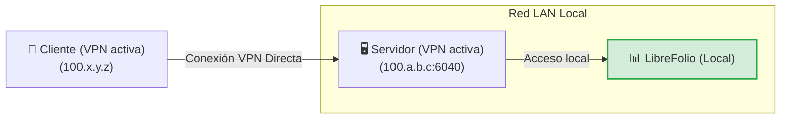
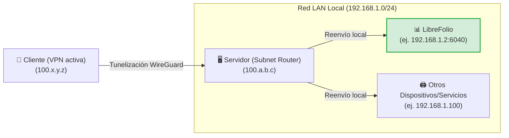
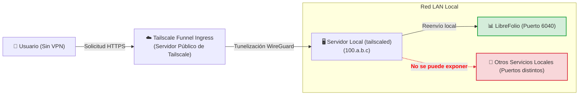
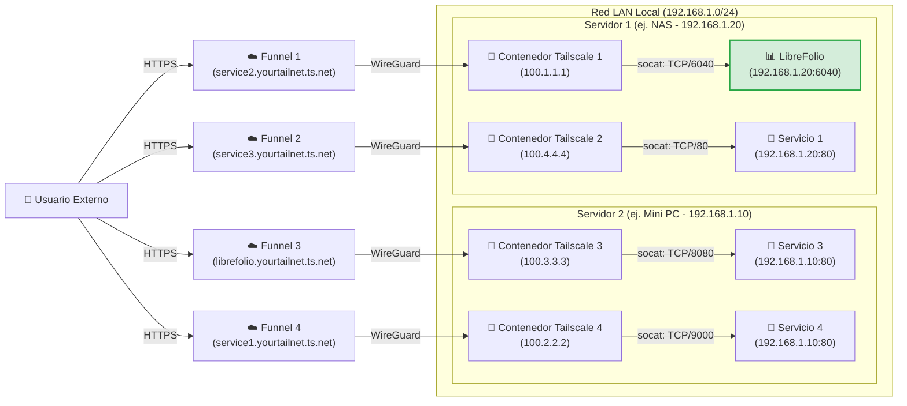

# 🌐 Exposición Segura

Exponer servicios autoalojados de forma segura en internet es uno de los desafíos más comunes. Esta guía explica cómo hacer que LibreFolio (o cualquier otro servicio en su red local) sea accesible aprovechando [Tailscale](https://tailscale.com/), una solución de VPN mesh segura, de alto rendimiento y gratuita para uso doméstico.

!!! tip "Nuestra Recomendación de Configuración"

    Entre los diferentes enfoques presentados, creemos que el **Nivel 4 (Multi-Funnel vía Docker)** es la mejor solución absoluta: requiere muy poca configuración adicional en comparación con los otros métodos, ofrece las máximas ventajas en términos de aislamiento y modularidad, y resuelve las limitaciones estructurales de los demás métodos. Los otros niveles se presentan tanto como alternativas como para comprender el camino técnico para llegar allí.

---

## 🔒 Seguridad y Riesgos del Redireccionamiento de Puertos Tradicional

El método tradicional para hacer que un servicio sea accesible desde el exterior implica abrir puertos en el router doméstico (port forwarding) asociados a una IP pública (a menudo dinámica) y un servicio DDNS (como DuckDNS). 

Este enfoque presenta riesgos significativos:

1. **Exposición a toda la web**: Cualquier persona puede escanear su IP pública e intentar atacar el puerto abierto.
2. **Complejidad de gestión**: Es necesario configurar y renovar manualmente los certificados SSL (HTTPS) a través de un proxy inverso (Nginx, Caddy, etc.).
3. **Riesgos del protocolo HTTP**: Sin un cifrado HTTPS correctamente configurado, sus credenciales y datos financieros viajan en texto plano a través de la red local y pública, lo que los hace interceptables por actores maliciosos (packet sniffing).

El siguiente diagrama muestra el problema inicial de la exposición remota:


---

## 🚀 ¿Qué es Tailscale?

[Tailscale](https://tailscale.com/) es un servicio de VPN mesh de configuración cero basado en el moderno protocolo de cifrado **WireGuard**. 

* **Plan Gratuito (Personal)**: Permite conectar hasta **100 dispositivos** de forma gratuita.
* **Red Mesh**: Todos los dispositivos configurados se conectan directamente entre sí de forma cifrada punto a punto (peer-to-peer), sin que el tráfico pase por servidores intermedios.
* **Compatibilidad**: Funciona en todos los principales sistemas operativos (Linux, macOS, Windows, iOS, Android) y puede instalarse en un NAS o dentro de contenedores Docker.

---

## 🏁 Paso 0: Instalando Tailscale en sus Dispositivos

Para que cualquier VPN funcione, se requieren **al menos 2 dispositivos conectados**: el *cliente* (por ejemplo, su smartphone o portátil) y el *servidor* (el nodo en el que se ejecuta LibreFolio). Antes de proceder con los niveles, instale e inicie sesión en Tailscale en sus dispositivos:

=== "Linux"

 Ejecute el comando de instalación oficial en el servidor:

 ```bash
 curl -fsSL https://tailscale.com/install.sh | sh
 sudo tailscale up
 ```

 Para más detalles, consulte la [Generic Installation Guide](https://tailscale.com/docs/install).

=== "macOS"

 Instale la aplicación oficial desde la **Mac App Store** o use Homebrew:

 ```bash
 brew install --cask tailscale
 sudo tailscale up
 ```

 Para más detalles, consulte la [Generic Installation Guide](https://tailscale.com/docs/install).

=== "Windows"

 Descargue el instalador oficial desde el portal de Tailscale y siga el asistente de inicio de sesión.

 Para detalles, consulte la [Windows Installation Guide](https://tailscale.com/docs/install/windows).

=== "Android"

 Instale la aplicación oficial desde la [Google Play Store](https://play.google.com/store/apps/details?id=com.tailscale.ipn).

=== "iOS (iPhone/iPad)"

 Instale la aplicación oficial desde la [Apple App Store](https://apps.apple.com/us/app/tailscale/id1470499037).

---

## 🛠️ Los 4 Niveles de Configuración y Exposición

---

## 🏃 Nivel 1: Conexión VPN Privada Punto a Punto (Inicio)

Consiste en conectar el servidor y el cliente a la misma red privada de Tailscale. En el servidor, el puerto del servicio se expone utilizando el comando `serve`.



En el servidor, utilice el comando para exponer el puerto local de LibreFolio (puerto por defecto `6040`):

```bash
tailscale serve tcp:6040 /
```

En este punto, con la VPN activa en su smartphone o PC, simplemente ingrese la IP de Tailscale del servidor (o su MagicDNS) seguida del puerto en el navegador para acceder a LibreFolio de forma remota.

<table style="width: 100%; border-collapse: collapse; margin-top: 1rem; margin-bottom: 1rem;">
 <thead>
 <tr style="background-color: #f3f4f6;">
 <th style="width: 50%; padding: 10px; border: 1px solid #e5e7eb; text-align: left; font-weight: bold;">🟢 Ventajas (Pros)</th>
 <th style="width: 50%; padding: 10px; border: 1px solid #e5e7eb; text-align: left; font-weight: bold;">🔴 Desventajas (Cons)</th>
 </tr>
 </thead>
 <tbody>
 <tr>
 <td style="padding: 10px; border: 1px solid #e5e7eb; background-color: rgba(76, 175, 80, 0.08); vertical-align: top;">
 <ul>
 <li>Configuración instantánea y mínima.</li>
 <li>Máxima seguridad: sus datos no pasan por la internet pública, el puerto está cerrado fuera de la VPN.</li>
 </ul>
 </td>
 <td style="padding: 10px; border: 1px solid #e5e7eb; background-color: rgba(244, 67, 54, 0.08); vertical-align: top;">
 <ul>
 <li><strong>Requiere que la VPN de Tailscale esté activa y conectada</strong> en cada cliente (por ejemplo, en el teléfono) para acceder al servicio.</li>
 <li><strong>Expone solo un único servicio</strong> por host.</li>
 </ul>
 </td>
 </tr>
 </tbody>
</table>

---

## 🥉 Nivel 2: Configuración de Subnet Router (Tunelización LAN)

Este nivel transforma su servidor en un "sub-router". Cuando esté fuera de casa con la VPN activada en el cliente, podrá acceder no solo al servidor sino a **cualquier dispositivo o servicio en su LAN doméstica** simplemente ingresando su IP local.



### 1. Habilitar Subnet Routing en el SO del Servidor

=== "Linux"

 Habilite el reenvío de IP (IP forwarding) a nivel de kernel:

 ```bash
 echo 'net.ipv4.ip_forward = 1' | sudo tee -a /etc/sysctl.d/99-tailscale.conf
 echo 'net.ipv6.conf.all.forwarding = 1' | sudo tee -a /etc/sysctl.d/99-tailscale.conf
 sudo sysctl -p /etc/sysctl.d/99-tailscale.conf
 ```

 Comience a anunciar la subred (reemplace el rango de IP por su red local, por ejemplo, `192.168.1.0/24`):

 ```bash
 sudo tailscale up --advertise-routes=192.168.1.0/24
 ```

=== "macOS"

 Use la ruta del ejecutable de Tailscale para anunciar la subred local:

 ```bash
 /Applications/Tailscale.app/Contents/MacOS/Tailscale up --advertise-routes=192.168.1.0/24
 ```

=== "Windows"

 Ejecute el Símbolo del sistema (`cmd.exe`) o PowerShell como **Administrador** y anuncie la subred local:

 ```cmd
 tailscale up --advertise-routes=192.168.1.0/24
 ```

### 2. Aprobar la Ruta en la Consola de Administración

1. Vaya a la [Tailscale Admin Console](https://login.tailscale.com/admin/machines).
2. Haga clic en los tres puntos junto a su servidor -> **Edit route settings**.
3. Habilite la subred anunciada.

!!! tip "Deshabilitar la Expiración de Claves para el Servidor"

    Dado que el servidor actúa como infraestructura de red (subnet router), se recomienda deshabilitar la expiración automática de claves para este nodo para evitar que se desconecte y requiera una reautenticación interactiva periódica (cada 180 días por defecto):
    1. En la página **Machines** de la consola de administración, localice su servidor.
    2. Haga clic en el **icono de los tres puntos (...)** a la derecha de la fila del dispositivo.
    3. Seleccione la opción **Disable Key Expiry**.

<table style="width: 100%; border-collapse: collapse; margin-top: 1rem; margin-bottom: 1rem;">
 <thead>
 <tr style="background-color: #f3f4f6;">
 <th style="width: 50%; padding: 10px; border: 1px solid #e5e7eb; text-align: left; font-weight: bold;">🟢 Ventajas (Pros)</th>
 <th style="width: 50%; padding: 10px; border: 1px solid #e5e7eb; text-align: left; font-weight: bold;">🔴 Desventajas (Cons)</th>
 </tr>
 </thead>
 <tbody>
 <tr>
 <td style="padding: 10px; border: 1px solid #e5e7eb; background-color: rgba(76, 175, 80, 0.08); vertical-align: top;">
 <ul>
 <li>Acceso a todos los dispositivos de la casa (impresoras, cámaras, LibreFolio, domótica) con un solo nodo activo.</li>
 <li>No es necesario configurar puertos o proxies inversos para cada servicio.</li>
 </ul>
 </td>
 <td style="padding: 10px; border: 1px solid #e5e7eb; background-color: rgba(244, 67, 54, 0.08); vertical-align: top;">
 <ul>
 <li><strong>La VPN en el cliente debe estar activa</strong> para permitir la comunicación.</li>
 <li><strong>Debe conocer las IPs locales</strong> de los dispositivos para alcanzarlos.</li>
 <li>Una vez dentro del hogar, <strong>los paquetes viajan en texto plano (HTTP)</strong> en la LAN privada.</li>
 </ul>
 </td>
 </tr>
 </tbody>
</table>

---

## 🔑 Habilitando Funnel y ACLs en la Consola

*Configuración única requerida para el Nivel 3 y Nivel 4*

Antes de poder usar Tailscale Funnel (ya sea en el servidor local en el Nivel 3 o dentro de contenedores Docker en el Nivel 4), debe habilitar Funnel y definir las reglas globales de control de acceso (ACLs) para toda su Tailnet. Esta es una configuración única que se realiza directamente en la consola de administración de Tailscale.

### 1. Habilitar HTTPS y Funnel en el Panel de Control

1. Visite la página de [Access Controls](https://login.tailscale.com/admin/acls) en la consola de administración de Tailscale.
2. Haga clic en el botón **Add node attribute** para crear la autorización requerida.


3. Configure las siguientes opciones en el formulario:
 * **Targets**: Ingrese la etiqueta (tag) o grupo que desea autorizar para la activación de Funnel. Un *Target* define a qué nodos se aplica la regla. **Sugerimos usar `tag:external_access`** (para asociarlo selectivamente con contenedores Docker) o `autogroup:member` (si desea permitir la exposición para todos los dispositivos registrados bajo su cuenta personal).
 * **Attributes**: Ingrese `funnel`.
 * **Note**: Ingrese algún texto para registrar el motivo de esta regla.
 * **IP Pools, App, Capability, etc.**: Estos campos adicionales no son necesarios para esta configuración de exposición, así que déjelos vacíos o con sus valores por defecto.

*Importante: La configuración de ACL define las políticas de seguridad globales necesarias para habilitar Funnel. Es independiente de las claves de autenticación (Auth Keys), que se utilizan solo para registrar un nuevo dispositivo o contenedor en la red por primera vez.*

Alternativamente, si prefiere editar la configuración JSON de las ACL directamente, puede usar el siguiente ejemplo funcional (actualizado para admitir tanto sus propios dispositivos como los contenedores etiquetados con `tag:external_access`):

??? example "Ver la configuración JSON completa de ACL para habilitar Funnel"

 ```json
 {
 // Declaration of authorized tags
 "tagOwners": {
 "tag:external_access": ["autogroup:admin"]
 },

 // Standard access rules
 "acls": [
 // Allows all nodes in your private network to communicate
 {"action": "accept", "src": ["*"], "dst": ["*:*"]}
 ],

 "ssh": [
 {
 "action": "check",
 "src": ["autogroup:member"],
 "dst": ["autogroup:self"],
 "users": ["autogroup:nonroot", "root"]
 }
 ],

 // Enabling Funnel on specific nodes or tags
 "nodeAttrs": [
 {
 "target": ["autogroup:member"],
 "attr": ["funnel"]
 },
 {
 "target": ["tag:external_access"],
 "attr": ["funnel"]
 }
 ]
 }
 ```

---

## 🥈 Nivel 3: Exposición Pública vía Tailscale Funnel (Sin VPN en el Cliente)

!!! warning "Prerrequisito Fundamental"

    Antes de proceder, asegúrese de haber completado la [configuración única de Funnel y ACL en la consola](#habilitando-funnel-y-acls-en-la-consola).

**Tailscale Funnel** le permite exponer un servicio públicamente en internet. Cualquier persona puede acceder a su instancia de LibreFolio a través de una URL HTTPS segura proporcionada por MagicDNS, **sin necesidad de instalar o activar Tailscale** en su smartphone o PC. Esto es esencial si desea instalar LibreFolio como una PWA en dispositivos móviles y obtener la solicitud de instalación automática (para más detalles, consulte la guía [📱 Install as App (PWA)](../user/pwa.md)).



### 1. Iniciar el Funnel en el Servidor

Asocie el funnel con el puerto local de LibreFolio:

```bash
tailscale funnel 6040 on
```

*Nota: Para este nivel, no se requiere ninguna clave de autenticación (Auth Key), ya que la máquina del servidor ya ha sido iniciada y registrada interactivamente en su Tailnet durante el **Paso 0**.*

### 2. Aprobar y Esperar la Propagación

Una vez lanzado el comando, aparecerá una advertencia en la terminal indicando que el Funnel está habilitado pero aún no autorizado para su nodo, mostrando un enlace similar al siguiente:

```text
Funnel is enabled, but the list of allowed nodes in the tailnet policy file does not include the one you are using.
To give access to this node you can edit the tailnet policy file, or visit:

 https://login.tailscale.com/f/funnel?node=xxxxxx
```

* Visite el enlace mostrado en el navegador, inicie sesión en Tailscale y apruebe la activación del Funnel para este nodo.
* Una vez aprobado, la terminal mostrará la URL pública generada.
* Espere unos minutos para que los registros de MagicDNS se propaguen globalmente y pueda alcanzar el servicio desde cualquier red externa.

<table style="width: 100%; border-collapse: collapse; margin-top: 1rem; margin-bottom: 1rem;">
 <thead>
 <tr style="background-color: #f3f4f6;">
 <th style="width: 50%; padding: 10px; border: 1px solid #e5e7eb; text-align: left; font-weight: bold;">🟢 Ventajas (Pros)</th>
 <th style="width: 50%; padding: 10px; border: 1px solid #e5e7eb; text-align: left; font-weight: bold;">🔴 Desventajas (Cons)</th>
 </tr>
 </thead>
 <tbody>
 <tr>
 <td style="padding: 10px; border: 1px solid #e5e7eb; background-color: rgba(76, 175, 80, 0.08); vertical-align: top;">
 <ul>
 <li>Acceso público universal vía HTTPS gratuito gestionado por Tailscale.</li>
 <li>No hay certificados SSL ni proxy inverso que configurar en el servidor.</li>
 <li>Permite la instalación nativa de PWA en smartphones sin activar la VPN.</li>
 </ul>
 </td>
 <td style="padding: 10px; border: 1px solid #e5e7eb; background-color: rgba(244, 67, 54, 0.08); vertical-align: top;">
 <ul>
 <li><strong>Solo puede exponer como máximo 1 único servicio</strong> Funnel por máquina host.</li>
 </ul>
 </td>
 </tr>
 </tbody>
</table>

---

## 🥇 Nivel 4: Exposición Multi-Funnel Avanzada vía Docker (Sidecars)

!!! warning "Prerrequisito Fundamental"

    Antes de proceder con la configuración del contenedor, asegúrese de haber completado la [configuración única de Funnel y ACL en la consola](#habilitando-funnel-y-acls-en-la-consola).

Para superar el límite de un Funnel por nodo host, podemos ejecutar múltiples nodos de Tailscale paralelos dentro de contenedores Docker. Cada contenedor se registrará como un nodo independiente en su Tailnet, obteniendo su propia URL de MagicDNS dedicada.

Nuestra solución utiliza un pequeño script de inicio personalizado que instala **socat** en el contenedor y redirige el tráfico HTTPS entrante a la IP LAN estática del servicio de destino.

??? info "¿Qué es socat?"

 **socat** (SOcket CAT) es una utilidad de línea de comandos extremadamente flexible que establece dos flujos de bytes bidireccionales y transfiere datos entre ellos. En nuestro caso, lo utilizamos como un **mini proxy-forwarder**: escucha en el puerto local del contenedor de Tailscale y reenvía todos los paquetes recibidos al puerto real del servicio en el servidor local.

El diagrama de red ilustra el escenario de multi-nodo expuesto en paralelo, donde los contenedores de Tailscale 1 y 2 se ejecutan en el primer host (Servidor 1) y los contenedores de Tailscale 3 y 4 se ejecutan en el segundo host (Servidor 2):



!!! note "Nodos y Servicios Múltiples"

    Con esta arquitectura, puede añadir y exponer todos los servicios deseados simplemente iniciando nuevos contenedores de Tailscale asociados con el script correspondiente. El único límite está establecido por los términos de su plan de suscripción de Tailscale (que cubre hasta 100 dispositivos en la versión gratuita).

### 1. Preparación de Carpeta y Script

Cree una carpeta en el servidor (por ejemplo, dentro de la ruta donde guarda sus volúmenes persistentes de Docker):

```bash
# Create a folder for the Tailscale nodes and enter it
mkdir -p <path_chosen>/tailscale-nodes
cd <path_chosen>/tailscale-nodes
```

Descargue el script de inicio personalizado <a href="https://raw.githubusercontent.com/Librefolio/LibreFolio/main/docs/static/tailscale-guide/custom_startup.sh" target="_blank" rel="noopener noreferrer">custom_startup.sh</a> dentro de esta carpeta:

```bash
# Download the script from the official repository
wget https://raw.githubusercontent.com/Librefolio/LibreFolio/main/docs/static/tailscale-guide/custom_startup.sh
# Make the script executable
chmod +x custom_startup.sh
```

### 2. Configuración de Docker Compose

Sugerimos definir y declarar el servicio de Tailscale **dentro del mismo archivo `docker-compose.yml` que el servicio** que desea exponer (por ejemplo, LibreFolio) para mantenerlos cercanos y acoplados lógicamente. Añada el bloque de servicio como se muestra a continuación:

```yaml
services:
 tailscale-librefolio:
 image: tailscale/tailscale:latest
 container_name: tailscale-librefolio
 hostname: tailscale-librefolio
 restart: unless-stopped
 privileged: false
 network_mode: bridge
 cap_add:
 - NET_ADMIN
 - NET_RAW
 devices:
 - /dev/net/tun:/dev/net/tun
 command:
 - /custom_startup.sh
 environment:
 - HOST_IP=192.168.1.10 # Local IP of the service to expose (e.g. Server 1)
 - HOST_PORT=6040 # Real port of the service to expose
 - TAILSCALE_FUNNEL_PORT=6040 # Internal Funnel port
 - TS_HOSTNAME=librefolio # Custom public hostname (e.g. librefolio)
 - TS_AUTHKEY=tskey-auth-... # Authentication key generated by Tailscale
 - TS_ACCEPT_DNS=true
 - TS_STATE_DIR=/var/lib/tailscale
 - TS_USERSPACE=false
 volumes:
 - <path_chosen>/tailscale-nodes/tailscale-librefolio/state:/var/lib/tailscale
 - <path_chosen>/tailscale-nodes/custom_startup.sh:/custom_startup.sh
 - /etc/localtime:/etc/localtime:ro
 - /etc/timezone:/etc/timezone:ro
```

#### Descripción de Parámetros de Configuración

<table style="width: 100%; border-collapse: collapse; margin-top: 1rem; margin-bottom: 1rem;">
 <thead>
 <tr style="background-color: #f3f4f6;">
 <th style="width: 35%; padding: 10px; border: 1px solid #e5e7eb; text-align: left; font-weight: bold; white-space: nowrap;">Parámetro</th>
 <th style="width: 65%; padding: 10px; border: 1px solid #e5e7eb; text-align: left; font-weight: bold;">Descripción</th>
 </tr>
 </thead>
 <tbody>
 <tr>
 <td style="padding: 10px; border: 1px solid #e5e7eb; font-family: monospace; white-space: nowrap;">&lt;path_chosen&gt;</td>
 <td style="padding: 10px; border: 1px solid #e5e7eb;">La ruta absoluta (full-path) en el servidor local donde se guardan el script y los datos de estado (por ejemplo, <code>/home/user/docker</code>).</td>
 </tr>
 <tr>
 <td style="padding: 10px; border: 1px solid #e5e7eb; font-family: monospace; white-space: nowrap;">HOST_IP</td>
 <td style="padding: 10px; border: 1px solid #e5e7eb;">La IP LAN estática de la máquina que aloja el servicio.</td>
 </tr>
 <tr>
 <td style="padding: 10px; border: 1px solid #e5e7eb; font-family: monospace; white-space: nowrap;">HOST_PORT</td>
 <td style="padding: 10px; border: 1px solid #e5e7eb;">El puerto real en el servidor LAN al que conectarse (por ejemplo, <code>6040</code> para LibreFolio).</td>
 </tr>
 <tr>
 <td style="padding: 10px; border: 1px solid #e5e7eb; font-family: monospace; white-space: nowrap;">TAILSCALE_FUNNEL_PORT</td>
 <td style="padding: 10px; border: 1px solid #e5e7eb;">El puerto en el que el contenedor de Tailscale escuchará y activará el Funnel. En principio, el mejor enfoque es establecer este parámetro con el mismo valor que el puerto del servicio interno (<code>HOST_PORT</code>) por consistencia; se deja como un parámetro separado para soportar posibles casos especiales futuros.</td>
 </tr>
 <tr>
 <td style="padding: 10px; border: 1px solid #e5e7eb; font-family: monospace; white-space: nowrap;">TS_HOSTNAME</td>
 <td style="padding: 10px; border: 1px solid #e5e7eb;">El nombre de host personalizado para el nodo. La dirección pública generada será <code>https://TS_HOSTNAME.your-tailnet.ts.net</code>.</td>
 </tr>
 <tr>
 <td style="padding: 10px; border: 1px solid #e5e7eb; font-family: monospace; white-space: nowrap;">TS_AUTHKEY</td>
 <td style="padding: 10px; border: 1px solid #e5e7eb;">
 La clave de autenticación (Auth Key) generada por Tailscale. Para obtenerla:<br>
 1. Vaya a <a href="https://login.tailscale.com/admin/settings/keys" target="_blank" rel="noopener noreferrer">Tailscale Admin Settings Keys</a>.<br>
 2. Bajo la sección <strong>Auth keys</strong> (<em>no</em> bajo la sección de tokens de acceso API), haga clic en el botón <strong>Generate auth key...</strong>.<br>
 3. Debe <strong>habilitar el interruptor de Tags</strong> para seleccionar la etiqueta deseada (por ejemplo, <code>tag:external_access</code>). En la descripción de la clave, ingrese una nota descriptiva para reconocerla fácilmente (por ejemplo, <code>docker-librefolio-funnel</code>).<br>
 4. Haga clic en <strong>Generate</strong> y copie la clave generada (por ejemplo, <code>tskey-auth-...</code>).<br>
 <br>
 <em>Nota: Una vez que el contenedor se haya iniciado correctamente, la clave de un solo uso se consume y desaparece automáticamente de la lista "Keys" en la consola de administración, mientras que el nuevo dispositivo registrado aparecerá en "Machines".</em>
 </td>
 </tr>
 </tbody>
</table>

??? example "Ver el archivo Docker Compose de producción completo (LibreFolio + Tailscale)"

 A continuación se muestra un ejemplo real y completo de un archivo `docker-compose.yml` de producción que ejecuta la imagen oficial de producción de LibreFolio junto con el sidecar de Tailscale para la exposición automática:

 ```yaml
 # =============================================================================
 # LibreFolio — Production Docker Compose
 # =============================================================================
 # Optimized for end-users running the official pre-built image from GHCR.
 # =============================================================================

 services:
 librefolio:
 image: ghcr.io/librefolio/librefolio:nightly
 container_name: librefolio
 restart: unless-stopped
 ports:
 - "${PORT:-6040}:6040"
 volumes:
 - ./LibreFolio-data:/app/backend/data/prod-docker
 env_file: .env
 environment:
 - LIBREFOLIO_DATA_DIR=/app/backend/data/prod-docker
 - HOST=0.0.0.0
 healthcheck:
 test: ["CMD", "python", "-c", "import urllib.request; urllib.request.urlopen('http://localhost:6040/api/v1/system/health')"]
 interval: 30s
 timeout: 10s
 start_period: 15s
 retries: 3

 tailscale-librefolio:
 image: tailscale/tailscale:latest
 container_name: tailscale-librefolio
 hostname: tailscale-librefolio
 restart: unless-stopped
 privileged: false
 network_mode: bridge
 cap_add:
 - NET_ADMIN
 - NET_RAW
 devices:
 - /dev/net/tun:/dev/net/tun
 command:
 - /custom_startup.sh
 environment:
 - HOST_IP=192.168.1.10 # Local IP of the service to expose (e.g. Server 1)
 - HOST_PORT=6040 # Real port of the service to expose
 - TAILSCALE_FUNNEL_PORT=6040 # Internal Funnel port
 - TS_HOSTNAME=librefolio # Custom public hostname (e.g. librefolio)
 - TS_AUTHKEY=tskey-auth-... # Replace with your generated key
 - TS_ACCEPT_DNS=true
 - TS_STATE_DIR=/var/lib/tailscale
 - TS_USERSPACE=false
 volumes:
 - /DATA/AppData/tailscale-nodes/tailscale-librefolio/state:/var/lib/tailscale
 - /DATA/AppData/tailscale-nodes/custom_startup.sh:/custom_startup.sh
 - /etc/localtime:/etc/localtime:ro
 - /etc/timezone:/etc/timezone:ro
 ```

### 3. Inicio y Aprobación

Inicie el contenedor compose de su servicio (incluyendo el sidecar de Tailscale):

```bash
docker compose up -d
```

Vea los logs del contenedor de Tailscale para extraer el enlace de aprobación del Funnel (requerido en el primer inicio):

```bash
docker logs -f tailscale-librefolio
```

En los logs del contenedor, aparecerá una línea de advertencia con el enlace de autorización específico para su nodo:

```text
Funnel is enabled, but the list of allowed nodes in the tailnet policy file does not include the one you are using.
To give access to this node you can edit the tailnet policy file, or visit:

 https://login.tailscale.com/f/funnel?node=nsKGo6k9ZF11CNTRL
```

* Abra el enlace mostrado en el navegador, inicie sesión en Tailscale y apruebe la activación del Funnel.
* Inmediatamente después de la aprobación, verá la confirmación de la exposición exitosa en los logs del contenedor con la URL pública y el proxy local:

```text
Available on the internet:

https://librefolio.yourtailnet.ts.net/
|-- proxy http://127.0.0.1:6040

Press Ctrl+C to exit.
```

* **Nota**: En este punto, el servicio está en línea, pero debe esperar unos minutos para que la propagación del registro MagicDNS se complete globalmente.

!!! tip "Deshabilitar la Expiración de Claves para el Contenedor"

    Para evitar que el contenedor sidecar expire y se desconecte de su Tailnet después del período predeterminado (180 días):
    1. Vaya a la página **Machines** de la Tailscale Admin Console.
    2. Busque el nodo del contenedor (por ejemplo, `librefolio` o `tailscale-librefolio`) en la lista.
    3. Haga clic en el **icono de los tres puntos (...)** a la derecha de la fila del dispositivo.
    4. Seleccione la opción **Disable Key Expiry**.

<table style="width: 100%; border-collapse: collapse; margin-top: 1rem; margin-bottom: 1rem;">
 <thead>
 <tr style="background-color: #f3f4f6;">
 <th style="width: 50%; padding: 10px; border: 1px solid #e5e7eb; text-align: left; font-weight: bold;">🟢 Ventajas (Pros)</th>
 <th style="width: 50%; padding: 10px; border: 1px solid #e5e7eb; text-align: left; font-weight: bold;">🔴 Desventajas (Cons)</th>
 </tr>
 </thead>
 <tbody>
 <tr>
 <td style="padding: 10px; border: 1px solid #e5e7eb; background-color: rgba(76, 175, 80, 0.08); vertical-align: top;">
 <ul>
 <li>Capacidad de crear <strong>infinitos Funnels públicos independientes</strong> en una sola máquina física.</li>
 <li>URLs separadas y dedicadas para cada servicio del hogar.</li>
 <li>Los paquetes de la red local viajan de forma segura y directa entre el contenedor y el servicio de destino.</li>
 </ul>
 </td>
 <td style="padding: 10px; border: 1px solid #e5e7eb; background-color: rgba(244, 67, 54, 0.08); vertical-align: top;">
 <ul>
 <li><strong>Requiere el uso de la terminal</strong> y configuración manual de archivos Docker Compose.</li>
 </ul>
 </td>
 </tr>
 </tbody>
</table>

---

## 🔮 MagicDNS y Dominios Personalizados

### ¿Qué es MagicDNS?

**MagicDNS** asigna automáticamente un nombre de dominio DNS local y público a cada uno de sus dispositivos registrados en la Tailnet. En lugar de tener que recordar direcciones IP como `100.110.222.112`, puede escribir `http://your-server` en el navegador. 
Los dominios públicos asignados por MagicDNS terminan con el sufijo `*.ts.net` (por ejemplo, `https://librefolio.your-tailnet.ts.net`).

### Cómo usar un Dominio Personalizado con Tailscale

Si posee su propio dominio personal (por ejemplo, `midominio.com`) y desea usarlo para alcanzar sus nodos privados de Tailscale en lugar de usar la URL estándar `*.ts.net`, puede proceder con dos técnicas principales:

#### Método 1: DNS Público Mapeado a la IP de Tailscale (Recomendado para Red Privada)

Esta es la solución más sencilla para acceder a sus dispositivos de forma privada usando su dominio.

1. Inicie sesión en la consola de su registrador de dominios (por ejemplo, Cloudflare, GoDaddy, Namecheap).
2. Cree un registro DNS de tipo **A** (o **AAAA** para IPv6) para el subdominio elegido (por ejemplo, `librefolio.midominio.com`).
3. Apunte el registro directamente a la **IP privada de Tailscale** de su servidor (por ejemplo, `100.77.72.90`).
4. **Cómo funciona**: Dado que las direcciones IP en la red `100.64.0.0/10` no son enrutables públicamente a nivel global, el dominio se resolverá y funcionará **solo** cuando esté conectado a su VPN de Tailscale, asegurando que ningún usuario externo pueda acceder o escanear el servicio. Para más detalles, consulte la [Official documentation on DNS settings](https://tailscale.com/kb/1054/dns#public-dns).

#### Método 2: DNS Dividido (Con Servidor DNS Interno)

Si desea gestionar dinámicamente los registros internos y no publicarlos en internet:

1. Configure un servidor DNS privado en su LAN (como Pi-hole, AdGuard Home o CoreDNS).
2. Añada registros locales de su dominio apuntándolos a sus IPs de Tailscale.
3. En la consola de administración de Tailscale, vaya a *DNS -> Nameservers -> Add Nameserver* y añada la IP de Tailscale de su DNS privado como un servidor de nombres global o restringido a su dominio. Para más detalles, consulte la [Official documentation on Split DNS](https://tailscale.com/kb/1054/dns#split-dns).

!!! warning "Precaución sobre la Exposición de Funnel Público"

    Dado que los Funnels públicos de Tailscale se exponen en internet solo a través del dominio seguro `*.ts.net` (gracias a los certificados SSL firmados por Tailscale), el mapeo CNAME directo desde su dominio personalizado a una dirección de Funnel causará errores de seguridad SSL/TLS en los navegadores, a menos que se utilice un proxy inverso independiente (como Caddy o Nginx) para gestionar los certificados de su zona. La dirección pública de su instancia será `librefolio.your-tailnet.ts.net`, donde la parte inicial `librefolio` se define automáticamente por el valor asignado a la variable `TS_HOSTNAME`.

---

## 🔗 Enlaces Útiles y Recursos

* 🖥️ [Tailscale Administration Console (Machines)](https://login.tailscale.com/admin/machines)
* 🔐 [Access Controls Management (ACLs)](https://login.tailscale.com/admin/acls)
* 📖 [Official Guide to Tailscale Funnel (English Documentation)](https://tailscale.com/kb/1223/tailscale-funnel)
* 🐳 [Running Tailscale in Docker](https://tailscale.com/kb/1282/docker)
