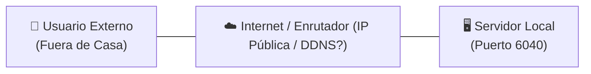
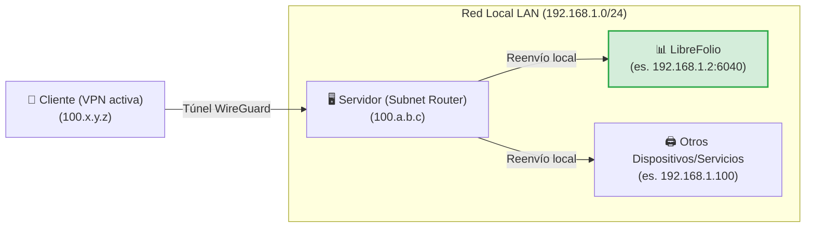
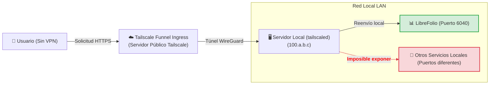
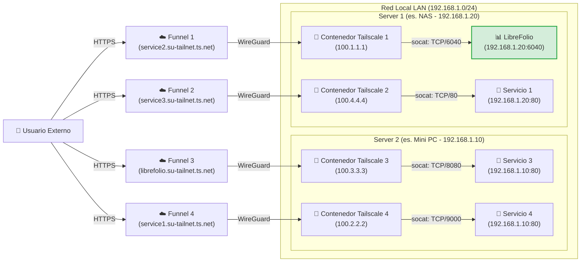

# 🌐 Exponer en Seguridad

Exponer los servicios auto-hospedados de manera segura en Internet es uno de los desafíos más comunes. Esta guía explica cómo hacer accesible LibreFolio (o cualquier otro servicio en su red local) aprovechando [Tailscale](https://tailscale.com/), una solución de VPN mesh segura, de alto rendimiento y gratuita para uso doméstico.

!!! tip "Nuestra recomendación de configuración"

    Entre los diferentes enfoques presentados, consideramos que el **Nivel 4 (Multi-Funnel a través de Docker)** es la mejor solución absoluta: requiere muy poca configuración adicional en comparación con los otros métodos, ofrece las máximas ventajas en términos de aislamiento y modularidad, y resuelve las limitaciones estructurales de los otros métodos. Los demás niveles se presentan tanto como alternativas como para comprender el camino técnico para llegar allí.

---

## 🔒 Seguridad y Riesgos del Reenvío de Puertos Tradicional

El método tradicional para hacer que un servicio sea accesible desde el exterior implica abrir puertos en el enrutador de su hogar (reenvío de puertos o port forwarding) asociado con una IP pública (a menudo dinámica) y un servicio DDNS (como DuckDNS). 

Este enfoque presenta riesgos significativos:

1. **Exposición a toda la web**: Cualquiera puede escanear su IP pública e intentar atacar el puerto abierto.
2. **Complejidad de gestión**: Es necesario configurar y renovar manualmente los certificados SSL (HTTPS) a través de un proxy inverso (Nginx, Caddy, etc.).
3. **Riesgos del protocolo HTTP**: Sin un cifrado HTTPS configurado correctamente, sus credenciales y datos financieros viajan en texto plano a través de la red local y pública, lo que los hace interceptables por atacantes malintencionados (packet sniffing).

El siguiente diagrama muestra el problema inicial de la exposición remota:



---

## 🚀 ¿Qué es Tailscale?

[Tailscale](https://tailscale.com/) es un servicio de VPN mesh de configuración cero basado en el moderno protocolo de cifrado **WireGuard**. 

* **Plan gratuito (Personal)**: Permite conectar hasta **100 dispositivos** de forma gratuita.
* **Red Mesh**: Todos los dispositivos configurados se conectan directamente entre sí de forma cifrada (peer-to-peer), sin que el tráfico pase a través de servidores intermedios.
* **Compatibilidad**: Funciona en todos los principales sistemas operativos (Linux, macOS, Windows, iOS, Android) y se puede instalar en un NAS o dentro de contenedores Docker.

---

## 🏁 Paso 0: Instalación di Tailscale sui Dispositivi

Para que cualquier VPN funcione, se requieren **al menos 2 dispositivos conectados**: el *cliente* (ej. su teléfono inteligente o computadora portátil) y el *servidor* (el nodo en el que se ejecuta LibreFolio). Antes de continuar con los niveles, instale e inicie sesión en Tailscale en sus dispositivos:

=== "Linux"

    Ejecute el comando oficial de instalación en el servidor:

    ```bash
    curl -fsSL https://tailscale.com/install.sh | sh
    sudo tailscale up
    ```

    Para obtener más detalles, consulte la [Guía de instalación genérica](https://tailscale.com/docs/install).

=== "macOS"

    Instale la aplicación oficial desde la **Mac App Store** o use Homebrew:

    ```bash
    brew install --cask tailscale
    sudo tailscale up
    ```

    Para obtener más detalles, consulte la [Guía de instalación genérica](https://tailscale.com/docs/install).

=== "Windows"

    Descargue el instalador oficial desde el portal de Tailscale y siga el asistente de inicio de sesión.

    Para obtener detalles, consulte la [Guía de instalación para Windows](https://tailscale.com/docs/install/windows).

=== "Android"

    Instale la aplicación oficial desde la [Google Play Store](https://play.google.com/store/apps/details?id=com.tailscale.ipn).

=== "iOS (iPhone/iPad)"

    Instale la aplicación oficial desde la [Apple App Store](https://apps.apple.com/us/app/tailscale/id1470499037).

---

## 🛠️ Los 4 Niveles de Configuración y Exposición

---

## 🏃 Nivel 1: Conexión VPN Privada Punto a Punto (Salida)

Consiste en conectar el servidor y el cliente a la misma red privada Tailscale. En el servidor, se expone el puerto del servicio mediante el comando `serve`.


En el servidor, use el comando para exponer el puerto local de LibreFolio (puerto predeterminado `6040`):

```bash
tailscale serve tcp:6040 /
```

En este punto, con la VPN activa en su teléfono inteligente o PC, simplemente ingrese la IP de Tailscale del servidor (o su MagicDNS) seguida del puerto en el navegador para acceder a LibreFolio de forma remota.

<table style="width: 100%; border-collapse: collapse; margin-top: 1rem; margin-bottom: 1rem;">
  <thead>
    <tr style="background-color: #f3f4f6;">
      <th style="width: 50%; padding: 10px; border: 1px solid #e5e7eb; text-align: left; font-weight: bold;">🟢 Ventajas (Pro)</th>
      <th style="width: 50%; padding: 10px; border: 1px solid #e5e7eb; text-align: left; font-weight: bold;">🔴 Desventajas (Contras)</th>
    </tr>
  </thead>
  <tbody>
    <tr>
      <td style="padding: 10px; border: 1px solid #e5e7eb; background-color: rgba(76, 175, 80, 0.08); vertical-align: top;">
        <ul>
          <li>Configuración instantánea y mínima.</li>
          <li>Máxima seguridad: sus datos no pasan por Internet público, el puerto está cerrado fuera de la VPN.</li>
        </ul>
      </td>
      <td style="padding: 10px; border: 1px solid #e5e7eb; background-color: rgba(244, 67, 54, 0.08); vertical-align: top;">
        <ul>
          <li><strong>Requiere que la VPN Tailscale esté activa y conectada</strong> en cada cliente (ej. en el teléfono) para llegar al servicio.</li>
          <li><strong>Expone solo un servicio</strong> por host único.</li>
        </ul>
      </td>
    </tr>
  </tbody>
</table>

---

## 🥉 Nivel 2: Configuración como Subnet Router (LAN Tunneling)

Este nivel transforma su servidor en un "sub-router". Cuando esté fuera de casa con la VPN activada en el cliente, podrá llegar no solo al servidor, sino a **cualquier dispositivo o servicio en su red local LAN** ingresando simplemente su IP local.



### 1. Abilitare il Subnet Routing sull'OS del Server

=== "Linux"

    Habilite el reenvío de IP a nivel de kernel:

    ```bash
    echo 'net.ipv4.ip_forward = 1' | sudo tee -a /etc/sysctl.d/99-tailscale.conf
    echo 'net.ipv6.conf.all.forwarding = 1' | sudo tee -a /etc/sysctl.d/99-tailscale.conf
    sudo sysctl -p /etc/sysctl.d/99-tailscale.conf
    ```

    Inicie anunciando la subred (reemplace el rango de IP con el de su red local, ej. `192.168.1.0/24`):

    ```bash
    sudo tailscale up --advertise-routes=192.168.1.0/24
    ```

=== "macOS"

    Utilice la ruta del ejecutable de Tailscale para anunciar la subred local:

    ```bash
    /Applications/Tailscale.app/Contents/MacOS/Tailscale up --advertise-routes=192.168.1.0/24
    ```

=== "Windows"

    Ejecute el símbolo del sistema (`cmd.exe`) o PowerShell como **Administrador** y anuncie la subred local:

    ```cmd
    tailscale up --advertise-routes=192.168.1.0/24
    ```

### 2. Approvare la rotta nel pannello di amministrazione

1. Vaya a la [Consola de administración de Tailscale](https://login.tailscale.com/admin/machines).
2. Haga clic en los tres puntos junto a su servidor -> **Edit route settings**.
3. Habilite la subred anunciada.

!!! tip "Desactivar la expiración de la clave (Key Expiry) para el Servidor"

    Dado que el servidor actúa como infraestructura de red (subnet router), se recomienda desactivar la expiración automática de la clave para este nodo para evitar que se desconecte y requiera autenticación interactiva periódica (cada 180 días de forma predeterminada):
    1. En la página **Machines** de la consola de administración, busque su servidor.
    2. Haga clic en el **icono de los tres puntos (...)** a la derecha de la fila del dispositivo.
    3. Seleccione la opción **Disable Key Expiry**.

<table style="width: 100%; border-collapse: collapse; margin-top: 1rem; margin-bottom: 1rem;">
  <thead>
    <tr style="background-color: #f3f4f6;">
      <th style="width: 50%; padding: 10px; border: 1px solid #e5e7eb; text-align: left; font-weight: bold;">🟢 Ventajas (Pro)</th>
      <th style="width: 50%; padding: 10px; border: 1px solid #e5e7eb; text-align: left; font-weight: bold;">🔴 Desventajas (Contras)</th>
    </tr>
  </thead>
  <tbody>
    <tr>
      <td style="padding: 10px; border: 1px solid #e5e7eb; background-color: rgba(76, 175, 80, 0.08); vertical-align: top;">
        <ul>
          <li>Acceso a todos los dispositivos de la casa (impresoras, cámaras, LibreFolio, domótica) con un solo nodo activo.</li>
          <li>No es necesario configurar puertos ni proxy inverso para cada servicio.</li>
        </ul>
      </td>
      <td style="padding: 10px; border: 1px solid #e5e7eb; background-color: rgba(244, 67, 54, 0.08); vertical-align: top;">
        <ul>
          <li><strong>La VPN en el cliente debe estar activa</strong> para permitir la comunicación.</li>
          <li><strong>Debe conocer las IPs locales</strong> de los dispositivos para alcanzarlos.</li>
          <li>Una vez dentro de casa, <strong>los paquetes viajan en texto plano (HTTP)</strong> en la red local privada.</li>
        </ul>
      </td>
    </tr>
  </tbody>
</table>

---

## 🔑 Abilitare il Funnel e le ACL sulla Console

*Configuración única necesaria para el Nivel 3 y el Nivel 4*

Antes de poder utilizar Tailscale Funnel (ya sea en el servidor local en el Nivel 3, o dentro de los contenedores Docker en el Nivel 4), es necesario habilitar el Funnel y definir las reglas de acceso (ACL) de forma global para toda su Tailnet. Esta operación se realiza una sola vez directamente en la consola de administración de Tailscale.

### 1. Abilitare HTTPS e Funnel sul Pannello di Controllo

1. Visite la pestaña [Access Controls](https://login.tailscale.com/admin/acls) de la consola de administración de Tailscale.
2. Haga clic en el botón **Add node attribute** para generar los permisos.


3. Configure las siguientes opciones en la pantalla:
    * **Targets**: Ingrese la etiqueta (tag) o grupo que desea autorizar para activar el Funnel. Un *Target* define a qué nodos se aplica la regla. **Sugerimos ingresar `tag:external_access`** (para asociarlo selectivamente a los contenedores Docker) o `autogroup:member` (si desea permitir la exposición para todos los dispositivos registrados con su cuenta personal).
    * **Attributes**: Ingrese `funnel`.
    * **Note**: Ingrese un texto para llevar un registro de sus motivos.
    * **IP Pools, App, Capability, etc.**: Estos campos adicionales no nos interesan para esta exposición, déjelos vacíos o con los valores predeterminados.

*Nota bene: La configuración de las ACL define las políticas de seguridad globales para habilitar el Funnel. Es independiente de las claves de autenticación (Auth Key), que se utilizan exclusivamente para registrar inicialmente un nuevo dispositivo/contenedor en la red.*

Alternativamente, si prefiere editar directamente la configuración JSON de las ACL, puede usar la siguiente configuración en funcionamiento (actualizada para admitir tanto sus dispositivos como la etiqueta `tag:external_access` de los contenedores):

??? example "Mostrar la configuración ACL JSON completa para habilitar el Funnel"

    ```json
    {
      // Declaración de etiquetas autorizadas
      "tagOwners": {
        "tag:external_access": ["autogroup:admin"]
      },

      // Reglas de acceso estándar
      "acls": [
        // Permite la comunicación a todos los nodos de su red privada
        {"action": "accept", "src": ["*"], "dst": ["*:*"]}
      ],

      "ssh": [
        {
          "action": "check",
          "src":    ["autogroup:member"],
          "dst":    ["autogroup:self"],
          "users":  ["autogroup:nonroot", "root"]
        }
      ],

      // Habilitación del Funnel en ciertos nodos o etiquetas
      "nodeAttrs": [
        {
          "target": ["autogroup:member"],
          "attr":   ["funnel"]
        },
        {
          "target": ["tag:external_access"],
          "attr":   ["funnel"]
        }
      ]
    }
    ```

---

### 🥈 Nivel 3: Exposición Pública a través de Tailscale Funnel (Sin VPN en el Cliente)

!!! warning "Prerequisito Fondamentale"

    Antes de proceder, asegúrese de haber completado la [configuración única del Funnel y las ACL en la consola](#abilitare-il-funnel-e-le-acl-sulla-console).

**Tailscale Funnel** permite exponer públicamente un servicio a Internet. Cualquier persona podrá acceder a su LibreFolio a través de una URL HTTPS segura proporcionada por MagicDNS, **sin tener que instalar o activar Tailscale** en su teléfono inteligente o PC. Esto es esencial para poder instalar LibreFolio como PWA en dispositivos móviles y disponer de auto-prompt (para obtener más detalles, consulte la guía [📱 Instalar como Aplicación (PWA)](../user/pwa.md)).



### 1. Avviare il Funnel sul Server

Asocie el funnel al puerto local de LibreFolio:

```bash
tailscale funnel 6040 on
```

*Nota: Para este nivel no se requiere ninguna clave de autenticación (Auth Key) ya que la máquina servidor ya se ha registrado e iniciado sesión de forma interactiva en su Tailnet durante el **Paso 0**.*

### 2. Approvare e attendere la propagazione

Una vez iniciado el comando, aparecerá un aviso en la terminal indicando que el Funnel está habilitado pero no autorizado para su nodo, mostrando un enlace similar al siguiente:

```text
Funnel is enabled, but the list of allowed nodes in the tailnet policy file does not include the one you are using.
To give access to this node you can edit the tailnet policy file, or visit:

         https://login.tailscale.com/f/funnel?node=xxxxxx
```

* Visite el enlace indicado en el navegador, inicie sesión en Tailscale y apruebe la habilitación del Funnel para este nodo.
* Una vez aprobado, la terminal mostrará la URL pública generada.
* Espere unos minutos para que los registros DNS de MagicDNS se propaguen globalmente y pueda acceder al servicio desde cualquier red externa.

<table style="width: 100%; border-collapse: collapse; margin-top: 1rem; margin-bottom: 1rem;">
  <thead>
    <tr style="background-color: #f3f4f6;">
      <th style="width: 50%; padding: 10px; border: 1px solid #e5e7eb; text-align: left; font-weight: bold;">🟢 Ventajas (Pro)</th>
      <th style="width: 50%; padding: 10px; border: 1px solid #e5e7eb; text-align: left; font-weight: bold;">🔴 Desventajas (Contras)</th>
    </tr>
  </thead>
  <tbody>
    <tr>
      <td style="padding: 10px; border: 1px solid #e5e7eb; background-color: rgba(76, 175, 80, 0.08); vertical-align: top;">
        <ul>
          <li>Acceso público universal a través de HTTPS gratuito administrado por Tailscale.</li>
          <li>Sin certificado SSL ni proxy inverso que configurar en el servidor.</li>
          <li>Permite la instalación nativa de la PWA en teléfonos inteligentes sin activar la VPN.</li>
        </ul>
      </td>
      <td style="padding: 10px; border: 1px solid #e5e7eb; background-color: rgba(244, 67, 54, 0.08); vertical-align: top;">
        <ul>
          <li><strong>Se puede exponer como máximo 1 solo servicio</strong> Funnel por máquina/host.</li>
        </ul>
      </td>
    </tr>
  </tbody>
</table>

---

### 🥇 Nivel 4: Exposición Multi-Funnel Avanzada a través de Docker (Sidecars)

!!! warning "Prerequisito Fondamentale"

    Antes de proceder con la configuración de los contenedores, asegúrese de haber completado la [configuración única del Funnel y las ACL en la consola](#abilitare-il-funnel-e-le-acl-sulla-console).

Para superar el límite de un solo Funnel por nodo host, podemos ejecutar múltiples nodos Tailscale paralelos dentro de contenedores Docker. Cada contenedor se registrará como un nodo independiente en su Tailnet, obteniendo su propia URL dedicada de MagicDNS.

Nuestra solución utiliza un pequeño script de inicio personalizado que instala **socat** en el contenedor y redirige el tráfico HTTPS entrante a la IP local LAN del servicio de destino.

??? info "¿Qué es socat?"

    **socat** (SOcket CAT) es una utilidad de línea de comandos extremadamente flexible que establece dos flujos de datos bidireccionales y transfiere datos entre ellos. En nuestro caso, lo usamos como un **mini proxy-forwarder**: escucha en el puerto local del contenedor Tailscale y reenvía todos los paquetes recibidos al puerto real del servicio en el servidor local.

El diagrama de red ilustra el escenario con nodos múltiples expuestos en paralelo, donde los contenedores Tailscale 1 y 2 se ejecutan en el primer host (Server 1) y los contenedores Tailscale 3 y 4 se ejecutan en el segundo host (Server 2):



!!! note "Nodos y Servicios Múltiples"

    Con esta arquitectura, es posible agregar y exponer todos los servicios deseados simplemente iniciando nuevos contenedores Tailscale asociados al script correspondiente. El único límite es el establecido por los términos de su plan de suscripción de Tailscale (que cubre hasta 100 dispositivos en la versión gratuita).

### 1. Preparazione della cartella e dello script

Cree una carpeta en el servidor (ej. dentro de la ruta donde guarda los volúmenes persistentes de Docker):

```bash
# Cree una carpeta para los nodos de Tailscale e ingrese a ella
mkdir -p <path_elegido>/tailscale-nodes
cd <path_elegido>/tailscale-nodes
```

Descargue el script de inicio personalizado <a href="https://raw.githubusercontent.com/Librefolio/LibreFolio/main/docs/static/tailscale-guide/custom_startup.sh" target="_blank" rel="noopener noreferrer">custom_startup.sh</a> en esta carpeta:

```bash
# Descargue el script desde el repositorio oficial
wget https://raw.githubusercontent.com/Librefolio/LibreFolio/main/docs/static/tailscale-guide/custom_startup.sh
# Permita que el script sea ejecutable
chmod +x custom_startup.sh
```

### 2. Configurazione di Docker Compose

Sugerimos definir y declarar el servicio Tailscale **dentro del mismo archivo `docker-compose.yml` del servicio** que desea exponer (ej. LibreFolio) para mantenerlos cerca y acoplados lógicamente. Agregue el bloque de servicio como se muestra a continuación:

```yaml
services:
  tailscale-librefolio:
    image: tailscale/tailscale:latest
    container_name: tailscale-librefolio
    hostname: tailscale-librefolio
    restart: unless-stopped
    privileged: false
    network_mode: bridge
    cap_add:
      - NET_ADMIN
      - NET_RAW
    devices:
      - /dev/net/tun:/dev/net/tun
    command:
      - /custom_startup.sh
    environment:
      - HOST_IP=192.168.1.10                # IP local del servicio a exponer (ej. Server 1)
      - HOST_PORT=6040                      # Puerto real del servicio a exponer
      - TAILSCALE_FUNNEL_PORT=6040          # Puerto interno del Funnel
      - TS_HOSTNAME=librefolio              # Nombre del subdominio público (ej. librefolio)
      - TS_AUTHKEY=tskey-auth-...           # Clave de autenticación generada por Tailscale
      - TS_ACCEPT_DNS=true
      - TS_STATE_DIR=/var/lib/tailscale
      - TS_USERSPACE=false
    volumes:
      - <path_elegido>/tailscale-nodes/tailscale-librefolio/state:/var/lib/tailscale
      - <path_elegido>/tailscale-nodes/custom_startup.sh:/custom_startup.sh
      - /etc/localtime:/etc/localtime:ro
      - /etc/timezone:/etc/timezone:ro
```

#### Descripción de Parámetros de Configuración

<table style="width: 100%; border-collapse: collapse; margin-top: 1rem; margin-bottom: 1rem;">
  <thead>
    <tr style="background-color: #f3f4f6;">
      <th style="width: 35%; padding: 10px; border: 1px solid #e5e7eb; text-align: left; font-weight: bold; white-space: nowrap;">Parámetro</th>
      <th style="width: 65%; padding: 10px; border: 1px solid #e5e7eb; text-align: left; font-weight: bold;">Descripción</th>
    </tr>
  </thead>
  <tbody>
    <tr>
      <td style="padding: 10px; border: 1px solid #e5e7eb; font-family: monospace; white-space: nowrap;">&lt;path_elegido&gt;</td>
      <td style="padding: 10px; border: 1px solid #e5e7eb;">La ruta absoluta (full-path) en el servidor local donde se guardan el script y los datos de estado (ej. <code>/home/user/docker</code>).</td>
    </tr>
    <tr>
      <td style="padding: 10px; border: 1px solid #e5e7eb; font-family: monospace; white-space: nowrap;">HOST_IP</td>
      <td style="padding: 10px; border: 1px solid #e5e7eb;">La IP LAN estática del equipo que aloja el servicio.</td>
    </tr>
    <tr>
      <td style="padding: 10px; border: 1px solid #e5e7eb; font-family: monospace; white-space: nowrap;">HOST_PORT</td>
      <td style="padding: 10px; border: 1px solid #e5e7eb;">El puerto real en el servidor local LAN al que conectarse (ej. <code>6040</code> para LibreFolio).</td>
    </tr>
    <tr>
      <td style="padding: 10px; border: 1px solid #e5e7eb; font-family: monospace; white-space: nowrap;">TAILSCALE_FUNNEL_PORT</td>
      <td style="padding: 10px; border: 1px solid #e5e7eb;">El puerto en el que el contenedor Tailscale escuchará y activará el Funnel. En principio, lo mejor es configurar este parámetro con el mismo valor que el puerto interno del servicio (<code>HOST_PORT</code>) por coherencia; se deja como un parámetro separado para admitir posibles casos especiales futuros.</td>
    </tr>
    <tr>
      <td style="padding: 10px; border: 1px solid #e5e7eb; font-family: monospace; white-space: nowrap;">TS_HOSTNAME</td>
      <td style="padding: 10px; border: 1px solid #e5e7eb;">El nombre de host personalizado del nodo. La dirección pública generada será <code>https://TS_HOSTNAME.su-tailnet.ts.net</code>.</td>
    </tr>
    <tr>
      <td style="padding: 10px; border: 1px solid #e5e7eb; font-family: monospace; white-space: nowrap;">TS_AUTHKEY</td>
      <td style="padding: 10px; border: 1px solid #e5e7eb;">
        La clave de autenticación (Auth Key) generada por Tailscale. Para obtenerla:<br>
        1. Vaya a <a href="https://login.tailscale.com/admin/settings/keys" target="_blank" rel="noopener noreferrer">Keys de la Consola de administración de Tailscale</a>.<br>
        2. Bajo la sección <strong>Auth keys</strong> (<em>no</em> bajo la sección API access tokens), haga clic en el botón <strong>Generate auth key...</strong>.<br>
        3. Debe <strong>habilitar el toggle de los Tags</strong> para poder seleccionar la etiqueta deseada (ej. <code>tag:external_access</code>). En la descripción de la clave, ingrese una nota descriptiva para que sea fácilmente reconocible (ej. <code>docker-librefolio-funnel</code>).<br>
        4. Haga clic en <strong>Generate</strong> y copie la clave generada (ej. <code>tskey-auth-...</code>).<br>
        <br>
        <em>Nota: Una vez que el contenedor se haya iniciado correctamente, la clave de un solo uso se consumirá y desaparecerá automáticamente de la lista "Keys" en la consola de administración, mientras que el nuevo dispositivo registrado aparecerá en "Machines".</em>
      </td>
    </tr>
  </tbody>
</table>

??? example "Mostrar el archivo Docker Compose de producción completo (LibreFolio + Tailscale)"

    A continuación se muestra un ejemplo real y completo de un archivo `docker-compose.yml` de producción que ejecuta la imagen de producción oficial de LibreFolio junto al contenedor sidecar de Tailscale para la exposición automática:

    ```yaml
    # =============================================================================
    # LibreFolio — Production Docker Compose
    # =============================================================================
    # Optimized for end-users running the official pre-built image from GHCR.
    # =============================================================================

    services:
      librefolio:
        image: ghcr.io/librefolio/librefolio:nightly
        container_name: librefolio
        restart: unless-stopped
        ports:
          - "${PORT:-6040}:6040"
        volumes:
          - ./LibreFolio-data:/app/backend/data/prod-docker
        env_file: .env
        environment:
          - LIBREFOLIO_DATA_DIR=/app/backend/data/prod-docker
          - HOST=0.0.0.0
        healthcheck:
          test: ["CMD", "python", "-c", "import urllib.request; urllib.request.urlopen('http://localhost:6040/api/v1/system/health')"]
          interval: 30s
          timeout: 10s
          start_period: 15s
          retries: 3

      tailscale-librefolio:
        image: tailscale/tailscale:latest
        container_name: tailscale-librefolio
        hostname: tailscale-librefolio
        restart: unless-stopped
        privileged: false
        network_mode: bridge
        cap_add:
          - NET_ADMIN
          - NET_RAW
        devices:
          - /dev/net/tun:/dev/net/tun
        command:
          - /custom_startup.sh
        environment:
          - HOST_IP=192.168.1.10                # IP local del servicio a exponer (ej. Server 1)
          - HOST_PORT=6040                      # Puerto real del servicio a exponer
          - TAILSCALE_FUNNEL_PORT=6040          # Puerto interno del Funnel
          - TS_HOSTNAME=librefolio              # Nombre del subdominio público (ej. librefolio)
          - TS_AUTHKEY=tskey-auth-...           # Reemplace con su clave generada
          - TS_ACCEPT_DNS=true
          - TS_STATE_DIR=/var/lib/tailscale
          - TS_USERSPACE=false
        volumes:
          - /DATA/AppData/tailscale-nodes/tailscale-librefolio/state:/var/lib/tailscale
          - /DATA/AppData/tailscale-nodes/custom_startup.sh:/custom_startup.sh
          - /etc/localtime:/etc/localtime:ro
          - /etc/timezone:/etc/timezone:ro
    ```

### 3. Avvio e Approvazione

Inicie el contenedor compose de su servicio (incluido el sidecar de Tailscale):

```bash
docker compose up -d
```

Visualice los registros (logs) del contenedor de Tailscale para extraer el enlace de aprobación del Funnel (requerido en el primer inicio):

```bash
docker logs -f tailscale-librefolio
```

En los registros del contenedor, aparecerá una línea de advertencia con el enlace de autorización específico para su nodo:

```text
Funnel is enabled, but the list of allowed nodes in the tailnet policy file does not include the one you are using.
To give access to this node you can edit the tailnet policy file, or visit:

         https://login.tailscale.com/f/funnel?node=nsKGo6k9ZF11CNTRL
```

* Abra el enlace indicado en el navegador, inicie sesión en Tailscale y apruebe la activación del Funnel.
* Inmediatamente después de la aprobación, verá la confirmación de la exposición exitosa en los registros del contenedor con la URL pública y el proxy local:

```text
Available on the internet:

https://librefolio.su-tailnet.ts.net/
|-- proxy http://127.0.0.1:6040

Press Ctrl+C to exit.
```

* **Nota**: En este punto, el servicio está en línea, pero debe esperar unos minutos para que la propagación del registro DNS de MagicDNS se complete globalmente.

!!! tip "Desactivar la expiración de la clave (Key Expiry) para el Contenedor"

    Para evitar que el contenedor sidecar expire y se desconecte de su Tailnet después del período predeterminado (180 días):
    1. Vaya a la página **Machines** de la consola de administración de Tailscale.
    2. Busque el nodo del contenedor (ej. `librefolio` o `tailscale-librefolio`) en la lista.
    3. Haga clic en el **icono de los tres puntos (...)** a la derecha de la fila del dispositivo.
    4. Seleccione la opción **Disable Key Expiry**.

<table style="width: 100%; border-collapse: collapse; margin-top: 1rem; margin-bottom: 1rem;">
  <thead>
    <tr style="background-color: #f3f4f6;">
      <th style="width: 50%; padding: 10px; border: 1px solid #e5e7eb; text-align: left; font-weight: bold;">🟢 Ventajas (Pro)</th>
      <th style="width: 50%; padding: 10px; border: 1px solid #e5e7eb; text-align: left; font-weight: bold;">🔴 Desventajas (Contras)</th>
    </tr>
  </thead>
  <tbody>
    <tr>
      <td style="padding: 10px; border: 1px solid #e5e7eb; background-color: rgba(76, 175, 80, 0.08); vertical-align: top;">
        <ul>
          <li>Posibilidad de crear <strong>Funnels públicos independientes infinitos</strong> en una sola máquina física.</li>
          <li>URLs distintas y dedicadas para cada servicio doméstico.</li>
          <li>Los paquetes de red local viajan de forma segura y directa entre el contenedor y el servicio de destino.</li>
        </ul>
      </td>
      <td style="padding: 10px; border: 1px solid #e5e7eb; background-color: rgba(244, 67, 54, 0.08); vertical-align: top;">
        <ul>
          <li><strong>Requiere el uso de la terminal</strong> y la configuración manual de los archivos Docker Compose.</li>
        </ul>
      </td>
    </tr>
  </tbody>
</table>

---

## 🔮 MagicDNS e Domini Personalizzati

### Cos'è MagicDNS?

**MagicDNS** asigna automáticamente un nombre de dominio DNS local y público a cada uno de sus dispositivos registrados en la Tailnet. En lugar de tener que recordar direcciones IP como `100.110.222.112`, puede escribir `http://su-servidor` en el navegador. 
Los dominios públicos asignados por MagicDNS terminan con el sufijo `*.ts.net` (por ejemplo, `https://librefolio.su-tailnet.ts.net`).

### How to Use a Custom Domain with Tailscale

Si posee su propio dominio personal (ej. `midominio.es`) y desea usarlo para llegar a sus nodos privados de Tailscale en lugar de usar la URL estándar `*.ts.net`, puede proceder con dos técnicas principales:

#### Metodo 1: DNS Pubblico mappato su IP Tailscale (Consigliato per Rete Privata)

Esta es la solución más sencilla para acceder de forma privada a sus dispositivos con su dominio.

1. Inicie sesión en la consola de su registrador de dominios (ej. Cloudflare, GoDaddy, Namecheap).
2. Cree un registro DNS de tipo **A** (o **AAAA** para IPv6) para el subdominio elegido (ej. `librefolio.midominio.es`).
3. Apunte el registro directamente a la **IP privada de Tailscale** de su servidor (ej. `100.77.72.90`).
4. **Cómo funciona**: Dado que las direcciones IP de la red `100.64.0.0/10` no son enrutables públicamente a nivel global, el dominio se resolverá y funcionará **solo** cuando esté conectado a su VPN de Tailscale, lo que garantiza que ningún usuario externo pueda acceder ni escanear el servicio. Para obtener detalles, consulte la [Documentación oficial sobre configuración de DNS](https://tailscale.com/kb/1054/dns#public-dns).

#### Metodo 2: Split DNS (Con server DNS interno)

Si desea administrar de forma dinámica los registros internos y no publicarlos en Internet:

1. Configure un servidor DNS privado en su LAN (como Pi-hole, AdGuard Home o CoreDNS).
2. Agregue los registros locales de su dominio apuntando a sus IPs de Tailscale.
3. En la consola de administración de Tailscale, vaya a *DNS -> Nameservers -> Add Nameserver* y agregue la IP de Tailscale de su DNS privado como un nameserver global o restringido a su dominio. Para obtener detalles, consulte la [Documentación oficial sobre Split DNS](https://tailscale.com/kb/1054/dns#split-dns).

!!! warning "Precaución al exponer de forma pública mediante Funnel"

    Dado que los Funnels públicos de Tailscale se exponen en Internet únicamente a través del dominio seguro `*.ts.net` (gracias a los certificados SSL firmados por Tailscale), el mapeo directo de un CNAME público de su dominio personalizado a una dirección Funnel provocará errores de seguridad SSL/TLS en los navegadores, a menos que use un proxy inverso separado (como Caddy o Nginx) para administrar los certificados de su propia zona. La dirección pública de su instancia será `librefolio.su-tailnet.ts.net`, donde la parte inicial `librefolio` se define automáticamente por el valor asignado a la variable `TS_HOSTNAME`.

---

## 🔗 Link Utili e Risorse

* 🖥️ [Consola de administración de Tailscale (Machines)](https://login.tailscale.com/admin/machines)
* 🔐 [Gestión de ACL (Access Controls)](https://login.tailscale.com/admin/acls)
* 📖 [Guía oficial de Tailscale Funnel (Documentación en inglés)](https://tailscale.com/kb/1223/tailscale-funnel)
* 🐳 [Ejecutar Tailscale en Docker](https://tailscale.com/kb/1282/docker)
