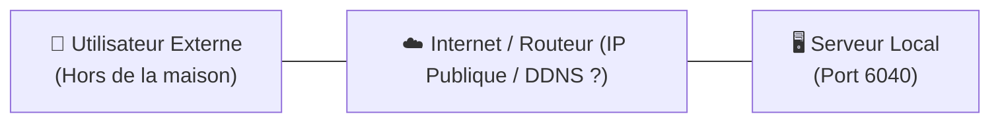
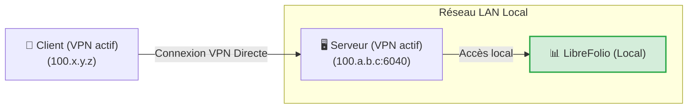
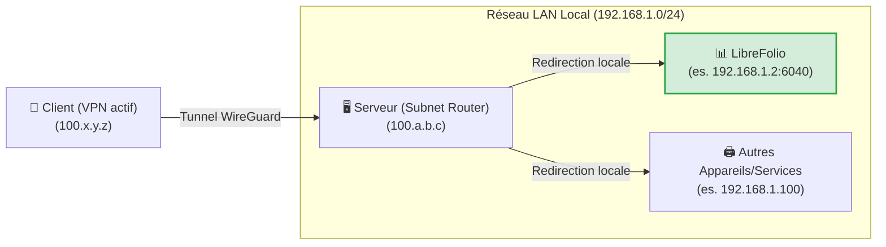
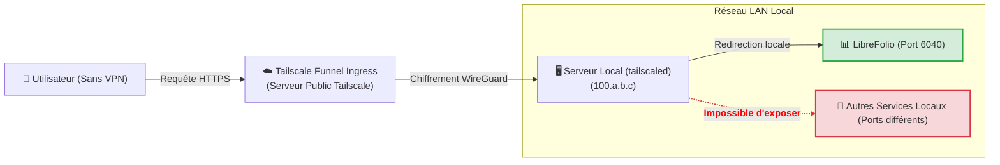
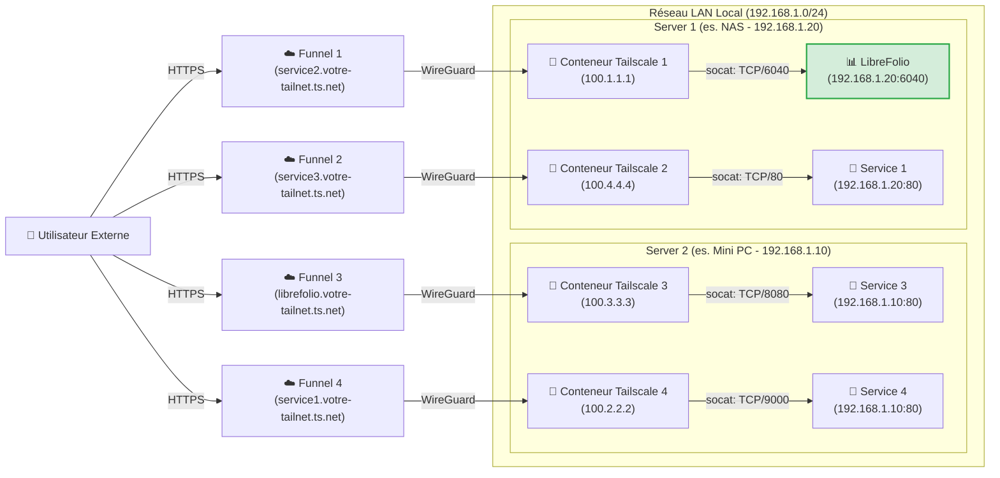

# 🌐 Exposer en Sécurité

Exposer ses services auto-hébergés en toute sécurité sur Internet est l'un des défis les plus courants. Ce guide explique comment rendre accessible LibreFolio (ou tout autre service de votre réseau local) en s'appuyant sur [Tailscale](https://tailscale.com/), una solution de VPN mesh sécurisée, performante et gratuite pour un usage domestique.

!!! tip "Notre recommandation de configuration"

      Parmi les différentes approches présentées, nous pensons que le **Niveau 4 (Multi-Funnel via Docker)** est la solution absolue : elle nécessite très peu de configuration supplémentaire par rapport aux autres méthodes, offre les avantages maximaux en termes d'isolation et de modularité, et résout les limitations structurelles des autres méthodes. Les autres niveaux sont présentés à la fois comme alternatives et pour comprendre le cheminement technique pour y parvenir.

---

## 🔒 Sécurité et Risques du Port Forwarding Traditionnel

La méthode traditionnelle pour rendre un service accessible de l'extérieur consiste à ouvrir des ports sur votre routeur domestique (port forwarding) associés à une IP publique (souvent dynamique) et à un service DDNS (comme DuckDNS). 

Cette approche présente des risques importants :

1. **Exposition à l'ensemble du Web** : N'importe qui peut scanner votre IP publique et tenter d'attaquer le port ouvert.
2. **Complexité de gestion** : Il est nécessaire de configurer et de renouveler manuellement les certificats SSL (HTTPS) via un reverse proxy (Nginx, Caddy, etc.).
3. **Risques du protocole HTTP** : Sans chiffrement HTTPS correctement configuré, vos identifiants et données financières voyagent en clair sur le réseau local et public, ce qui les rend interceptables par des acteurs malveillants (packet sniffing).

Le diagramme suivant montre le problème initial de l'exposition à distance :



---

## 🚀 Qu'est-ce que Tailscale ?

[Tailscale](https://tailscale.com/) est un service de VPN mesh à configuration zéro basé sur le protocole de chiffrement moderne **WireGuard**. 

* **Offre gratuite (Personal)** : Permet de connecter jusqu'à **100 appareils** gratuitement.
* **Réseau Mesh** : Tous les appareils configurés se connettent directement les uns aux autres de manière chiffrée (peer-to-peer), sans que le trafic ne passe par des serveurs intermédiaires.
* **Compatibilité** : Fonctionne sur tous les principaux systèmes d'exploitation (Linux, macOS, Windows, iOS, Android) et peut être installé sur un NAS ou dans des conteneurs Docker.

---

## 🏁 Step 0: Installing Tailscale on Your Devices

Pour faire fonctionner n'importe quel VPN, **au moins 2 appareils connectés** sont requis : le *client* (ex. votre smartphone ou ordinateur portable) et le *serveur* (le nœud sur lequel s'exécute LibreFolio). Avant de procéder avec les niveaux, installez et connectez-vous à Tailscale sur vos appareils :

=== "Linux"

    Exécutez la commande officielle d'installation sur le serveur :

    ```bash
    curl -fsSL https://tailscale.com/install.sh | sh
    sudo tailscale up
    ```

    Pour plus de détails, consultez le [Guide d'installation générique](https://tailscale.com/docs/install).

=== "macOS"

    Installez l'application officielle depuis le **Mac App Store** ou utilisez Homebrew :

    ```bash
    brew install --cask tailscale
    sudo tailscale up
    ```

    Pour plus de détails, consultez le [Guide d'installation générique](https://tailscale.com/docs/install).

=== "Windows"

    Téléchargez l'installateur officiel depuis le portail de Tailscale et suivez l'assistant de connexion.

    Pour plus de détails, consultez le [Guide d'installation pour Windows](https://tailscale.com/docs/install/windows).

=== "Android"

    Installez l'application officielle depuis le [Google Play Store](https://play.google.com/store/apps/details?id=com.tailscale.ipn).

=== "iOS (iPhone/iPad)"

    Installez l'application officielle depuis l' [Apple App Store](https://apps.apple.com/us/app/tailscale/id1470499037).

---

## 🛠️ Les 4 Niveaux de Configuration et d'Exposition

---

## 🏃 Niveau 1 : Connexion VPN Privée Point-à-Point (Départ)

Cela consiste à connecter le serveur et le client au même réseau privé Tailscale. Sur le serveur, le port du service est exposé à l'aide de la commande `serve`.



Sur le serveur, utilisez la commande pour exposer le port local de LibreFolio (port par défaut `6040`) :

```bash
tailscale serve tcp:6040 /
```

À ce stade, avec le VPN actif sur votre smartphone ou PC, il vous suffit de saisir dans le navigateur l'IP Tailscale du serveur (ou son MagicDNS) suivie du port pour accéder à LibreFolio à distance.

<table style="width: 100%; border-collapse: collapse; margin-top: 1rem; margin-bottom: 1rem;">
  <thead>
    <tr style="background-color: #f3f4f6;">
      <th style="width: 50%; padding: 10px; border: 1px solid #e5e7eb; text-align: left; font-weight: bold;">🟢 Avantages (Pro)</th>
      <th style="width: 50%; padding: 10px; border: 1px solid #e5e7eb; text-align: left; font-weight: bold;">🔴 Inconvénients (Contre)</th>
    </tr>
  </thead>
  <tbody>
    <tr>
      <td style="padding: 10px; border: 1px solid #e5e7eb; background-color: rgba(76, 175, 80, 0.08); vertical-align: top;">
        <ul>
          <li>Configuration instantanée et minimale.</li>
          <li>Sécurité maximale : vos données ne transitent pas par l'Internet public, le port est fermé à l'extérieur du VPN.</li>
        </ul>
      </td>
      <td style="padding: 10px; border: 1px solid #e5e7eb; background-color: rgba(244, 67, 54, 0.08); vertical-align: top;">
        <ul>
          <li><strong>Nécessite que le VPN Tailscale soit actif et connecté</strong> sur chaque client (ex. sur le téléphone) pour joindre le service.</li>
          <li><strong>N'expose qu'un seul service</strong> par hôte unique.</li>
        </ul>
      </td>
    </tr>
  </tbody>
</table>

---

## 🥉 Niveau 2 : Configuration comme Subnet Router (LAN Tunneling)

Ce niveau transforme votre serveur en un "sous-routeur". Lorsque vous êtes hors de chez vous avec le VPN activé sur le client, vous pouvez joindre non seulement le serveur, mais **n'importe quel appareil ou service de votre réseau local LAN** en saisissant simplement son IP locale.



### 1. Abilitare il Subnet Routing sull'OS del Server

=== "Linux"

    Activez le transfert d'IP au niveau du noyau (kernel) :

    ```bash
    echo 'net.ipv4.ip_forward = 1' | sudo tee -a /etc/sysctl.d/99-tailscale.conf
    echo 'net.ipv6.conf.all.forwarding = 1' | sudo tee -a /etc/sysctl.d/99-tailscale.conf
    sudo sysctl -p /etc/sysctl.d/99-tailscale.conf
    ```

    Démarrez en publiant le sous-réseau (remplacez la plage IP par celle de votre réseau local, ex. `192.168.1.0/24`) :

    ```bash
    sudo tailscale up --advertise-routes=192.168.1.0/24
    ```

=== "macOS"

    Utilisez le chemin de l'exécutable Tailscale pour publier le sous-réseau local :

    ```bash
    /Applications/Tailscale.app/Contents/MacOS/Tailscale up --advertise-routes=192.168.1.0/24
    ```

=== "Windows"

    Exécutez l'invite de commandes (`cmd.exe`) ou PowerShell en tant qu' **Administrateur** et publiez le sous-réseau local :

    ```cmd
    tailscale up --advertise-routes=192.168.1.0/24
    ```

### 2. Approvare la rotta nel pannello di amministrazione

1. Allez sur la [Console d'administration Tailscale](https://login.tailscale.com/admin/machines).
2. Cliquez sur les trois points à côté de votre serveur -> **Edit route settings**.
3. Activez le sous-réseau publié.

!!! tip "Désactiver l'expiration de la clé (Key Expiry) pour le Serveur"

    Étant donné que le serveur agit en tant qu'infrastructure réseau (subnet router), il est recommandé de désactiver l'expiration automatique de la clé pour ce nœud afin d'éviter qu'il ne se déconnecte et nécessite une réauthentification interactive périodique (tous les 180 jours par défaut) :
    1. Sur la page **Machines** de la console d'administration, localisez votre serveur.
    2. Cliquez sur l'icône des **trois points (...)** située à droite de la ligne de l'appareil.
    3. Sélectionnez l'option **Disable Key Expiry**.

<table style="width: 100%; border-collapse: collapse; margin-top: 1rem; margin-bottom: 1rem;">
  <thead>
    <tr style="background-color: #f3f4f6;">
      <th style="width: 50%; padding: 10px; border: 1px solid #e5e7eb; text-align: left; font-weight: bold;">🟢 Avantages (Pro)</th>
      <th style="width: 50%; padding: 10px; border: 1px solid #e5e7eb; text-align: left; font-weight: bold;">🔴 Inconvénients (Contre)</th>
    </tr>
  </thead>
  <tbody>
    <tr>
      <td style="padding: 10px; border: 1px solid #e5e7eb; background-color: rgba(76, 175, 80, 0.08); vertical-align: top;">
        <ul>
          <li>Accès à tous les appareils de la maison (imprimantes, caméras, LibreFolio, domotique) avec un seul nœud actif.</li>
          <li>Pas besoin de configurer de ports ni de reverse proxy pour chaque service.</li>
        </ul>
      </td>
      <td style="padding: 10px; border: 1px solid #e5e7eb; background-color: rgba(244, 67, 54, 0.08); vertical-align: top;">
        <ul>
          <li><strong>Le VPN sur le client doit être actif</strong> pour permettre la communication.</li>
          <li><strong>Vous devez connaître les IP locales</strong> des appareils pour les atteindre.</li>
          <li>Une fois arrivés dans la maison, <strong>les paquets transitent en clair (HTTP)</strong> sur le réseau local privé.</li>
        </ul>
      </td>
    </tr>
  </tbody>
</table>

---

## 🔑 Abilitare il Funnel e le ACL sulla Console

*Configuration unique nécessaire pour le Niveau 3 et le Niveau 4*

Avant de pouvoir utiliser Tailscale Funnel (soit sur le serveur local au Niveau 3, soit à l'intérieur des conteneurs Docker au Niveau 4), il est nécessaire d'activer le Funnel et de définir les règles d'accès (ACL) globalement pour l'ensemble de votre Tailnet. Cette opération s'effectue une seule fois directement sur la console d'administration de Tailscale.

### 1. Abilitare HTTPS e Funnel sul Pannello di Controllo

1. Visitez l'onglet [Access Controls](https://login.tailscale.com/admin/acls) de la console d'administration Tailscale.
2. Cliquez sur le bouton **Add node attribute** pour générer les autorisations.


3. Configurez les options de l'écran comme suit :
    * **Targets** : Saisissez le tag ou le groupe que vous souhaitez autoriser à activer le Funnel. Un *Target* définit les nœuds auxquels s'applique la règle. **Nous suggérons de saisir `tag:external_access`** (pour l'associer sélectivement aux conteneurs Docker) ou `autogroup:member` (si vous souhaitez autoriser l'exposition pour tous les appareils enregistrés avec votre compte personnel).
    * **Attributes** : Saisissez `funnel`.
    * **Note** : Saisissez un texte pour documenter votre motif.
    * **IP Pools, App, Capability, etc.** : Ces champs supplémentaires ne nous intéressent pas pour cette exposition, laissez-les vides ou aux valeurs par défaut.

*Nota bene : La configuration des ACL définit les règles de sécurité globales pour l'activation du Funnel. Elle est indépendante des clés d'authentification (Auth Key), qui servent uniquement à enregistrer initialement un nouvel appareil/conteneur sur le réseau.*

Alternativement, si vous préférez modifier directement la configuration JSON des ACL, vous pouvez utiliser la configuration fonctionnelle suivante (mise à jour pour prendre en charge vos appareils ainsi que le tag `tag:external_access` des conteneurs) :

??? example "Afficher la configuration ACL JSON complète pour activer le Funnel"

    ```json
    {
      // Déclaration des tags autorisés
      "tagOwners": {
        "tag:external_access": ["autogroup:admin"]
      },

      // Règles d'accès standard
      "acls": [
        // Autorise tous les nœuds de votre réseau privé à communiquer
        {"action": "accept", "src": ["*"], "dst": ["*:*"]}
      ],

      "ssh": [
        {
          "action": "check",
          "src":    ["autogroup:member"],
          "dst":    ["autogroup:self"],
          "users":  ["autogroup:nonroot", "root"]
        }
      ],

      // Activation du Funnel sur certains nœuds ou tags
      "nodeAttrs": [
        {
          "target": ["autogroup:member"],
          "attr":   ["funnel"]
        },
        {
          "target": ["tag:external_access"],
          "attr":   ["funnel"]
        }
      ]
    }
    ```

---

### 🥈 Niveau 3 : Exposition Publique via Tailscale Funnel (Sans VPN sur le Client)

!!! warning "Prerequisito Fondamentale"

    Avant de procéder, assurez-vous d'avoir complété la [configuration unique du Funnel et des ACL sur la console](#abilitare-il-funnel-e-le-acl-sulla-console).

**Tailscale Funnel** permet d'exposer publiquement un service sur Internet. N'importe qui pourra accéder à votre LibreFolio via une URL HTTPS sécurisée fournie par MagicDNS, **sans avoir à installer ou activer Tailscale** sur son smartphone ou PC. C'est essentiel pour installer LibreFolio en tant que PWA sur des appareils mobiles et bénéficier de l'auto-prompt (pour plus de détails, consultez le guide [📱 Installer comme Application (PWA)](../user/pwa.md)).



### 1. Avviare il Funnel sul Server

Associez le funnel au port local de LibreFolio :

```bash
tailscale funnel 6040 on
```

*Note : Pour ce niveau, aucune clé d'authentification (Auth Key) n'est requise car la machine serveur a déjà été connectée et enregistrée de manière interactive à votre Tailnet lors de l'**Étape 0**.*

### 2. Approvare e attendere la propagazione

Une fois la commande lancée, un avertissement s'affichera dans le terminal indiquant que le Funnel est activé mais pas encore autorisé pour votre nœud, avec un lien similaire à celui-ci :

```text
Funnel is enabled, but the list of allowed nodes in the tailnet policy file does not include the one you are using.
To give access to this node you can edit the tailnet policy file, or visit:

         https://login.tailscale.com/f/funnel?node=xxxxxx
```

* Visitez le lien indiqué dans le navigateur, connectez-vous à Tailscale et approuvez l'activation du Funnel pour ce nœud.
* Une fois approuvé, le terminal affichera l'URL publique générée.
* Attendez quelques minutes que les enregistrements DNS de MagicDNS se propagent globalement pour accéder au service depuis n'importe quel réseau externe.

<table style="width: 100%; border-collapse: collapse; margin-top: 1rem; margin-bottom: 1rem;">
  <thead>
    <tr style="background-color: #f3f4f6;">
      <th style="width: 50%; padding: 10px; border: 1px solid #e5e7eb; text-align: left; font-weight: bold;">🟢 Avantages (Pro)</th>
      <th style="width: 50%; padding: 10px; border: 1px solid #e5e7eb; text-align: left; font-weight: bold;">🔴 Inconvénients (Contre)</th>
    </tr>
  </thead>
  <tbody>
    <tr>
      <td style="padding: 10px; border: 1px solid #e5e7eb; background-color: rgba(76, 175, 80, 0.08); vertical-align: top;">
        <ul>
          <li>Accès public universel via HTTPS gratuit géré par Tailscale.</li>
          <li>Aucun certificat SSL ni reverse proxy à configurer sur le serveur.</li>
          <li>Permet l'installation native de la PWA sur smartphone sans VPN actif.</li>
        </ul>
      </td>
      <td style="padding: 10px; border: 1px solid #e5e7eb; background-color: rgba(244, 67, 54, 0.08); vertical-align: top;">
        <ul>
          <li><strong>Il est possible d'exposer au maximum 1 seul service</strong> Funnel par machine/hôte.</li>
        </ul>
      </td>
    </tr>
  </tbody>
</table>

---

### 🥇 Niveau 4 : Exposition Multi-Funnel Avancée via Docker (Sidecars)

!!! warning "Prerequisito Fondamentale"

    Avant de procéder avec la configuration des conteneurs, assurez-vous d'avoir complété la [configuration unique du Funnel et des ACL sur la console](#abilitare-il-funnel-e-le-acl-sulla-console).

Pour surmonter la limite d'un seul Funnel par nœud hôte, nous pouvons exécuter plusieurs nœuds Tailscale en parallèle à l'intérieur de conteneurs Docker. Chaque conteneur s'enregistrera comme un nœud indépendant sur votre Tailnet, obtenant sa propre URL MagicDNS dédiée.

Notre solution s'appuie sur un petit script de démarrage personnalisé qui installe **socat** dans le conteneur et redirige le trafic HTTPS entrant vers l'IP locale LAN du service cible.

??? info "Qu'est-ce que socat ?"

    **socat** (SOcket CAT) est un utilitaire en ligne de commande extrêmement flexible qui établit deux flux de données bidirectionnels et transfère les données entre eux. Dans notre cas, nous l'utilisons comme un **mini proxy-forwarder** : il écoute sur le port local du conteneur Tailscale et redirige tous les paquets reçus vers le port réel du service sur le serveur local.

Le diagramme de réseau illustre le scénario de nœuds multiples exposés en parallèle, où les conteneurs Tailscale 1 et 2 s'exécutent sur le premier hôte (Server 1) et les conteneurs Tailscale 3 et 4 s'exécutent sur le second hôte (Server 2) :



!!! note "Nœuds et Services Multiples"

    Avec cette architecture, il est possible d'ajouter et d'exposer tous les services souhaités en démarrant simplement de nouveaux conteneurs Tailscale associés au script correspondant. La seule limite est celle fixée par les conditions de votre plan d'abonnement Tailscale (qui couvre jusqu'à 100 appareils dans la version gratuite).

### 1. Preparazione della cartella e dello script

Créez un dossier sur le serveur (ex. dans le chemin où vous conservez les volumes persistants de vos conteneurs Docker) :

```bash
# Créez un dossier pour les nœuds Tailscale et placez-vous à l'intérieur
mkdir -p <path_choisi>/tailscale-nodes
cd <path_choisi>/tailscale-nodes
```

Téléchargez le script de démarrage personnalisé <a href="https://raw.githubusercontent.com/Librefolio/LibreFolio/main/docs/static/tailscale-guide/custom_startup.sh" target="_blank" rel="noopener noreferrer">custom_startup.sh</a> dans ce dossier :

```bash
# Téléchargez le script depuis le dépôt officiel
wget https://raw.githubusercontent.com/Librefolio/LibreFolio/main/docs/static/tailscale-guide/custom_startup.sh
# Rendez le script exécutable
chmod +x custom_startup.sh
```

### 2. Configurazione di Docker Compose

Nous suggérons de définir et déclarer le service Tailscale **à l'intérieur du même fichier `docker-compose.yml` que le service** que vous souhaitez exposer (ex. LibreFolio), afin de les garder proches et couplés logiquement. Ajoutez le bloc de service comme illustré ci-dessous :

```yaml
services:
  tailscale-librefolio:
    image: tailscale/tailscale:latest
    container_name: tailscale-librefolio
    hostname: tailscale-librefolio
    restart: unless-stopped
    privileged: false
    network_mode: bridge
    cap_add:
      - NET_ADMIN
      - NET_RAW
    devices:
      - /dev/net/tun:/dev/net/tun
    command:
      - /custom_startup.sh
    environment:
      - HOST_IP=192.168.1.10                # IP locale du service à exposer (ex. Server 1)
      - HOST_PORT=6040                      # Port réel du service à exposer
      - TAILSCALE_FUNNEL_PORT=6040          # Port interne du Funnel
      - TS_HOSTNAME=librefolio              # Nom du sous-domaine public (ex. librefolio)
      - TS_AUTHKEY=tskey-auth-...           # Clé d'authentification générée par Tailscale
      - TS_ACCEPT_DNS=true
      - TS_STATE_DIR=/var/lib/tailscale
      - TS_USERSPACE=false
    volumes:
      - <path_choisi>/tailscale-nodes/tailscale-librefolio/state:/var/lib/tailscale
      - <path_choisi>/tailscale-nodes/custom_startup.sh:/custom_startup.sh
      - /etc/localtime:/etc/localtime:ro
      - /etc/timezone:/etc/timezone:ro
```

#### Description des Paramètres de Configuration

<table style="width: 100%; border-collapse: collapse; margin-top: 1rem; margin-bottom: 1rem;">
  <thead>
    <tr style="background-color: #f3f4f6;">
      <th style="width: 35%; padding: 10px; border: 1px solid #e5e7eb; text-align: left; font-weight: bold; white-space: nowrap;">Paramètre</th>
      <th style="width: 65%; padding: 10px; border: 1px solid #e5e7eb; text-align: left; font-weight: bold;">Description</th>
    </tr>
  </thead>
  <tbody>
    <tr>
      <td style="padding: 10px; border: 1px solid #e5e7eb; font-family: monospace; white-space: nowrap;">&lt;path_choisi&gt;</td>
      <td style="padding: 10px; border: 1px solid #e5e7eb;">Le chemin absolu (full-path) sur le serveur local où le script et les données d'état sont enregistrés (ex. <code>/home/user/docker</code>).</td>
    </tr>
    <tr>
      <td style="padding: 10px; border: 1px solid #e5e7eb; font-family: monospace; white-space: nowrap;">HOST_IP</td>
      <td style="padding: 10px; border: 1px solid #e5e7eb;">L'IP locale LAN statique de la machine hébergeant le service.</td>
    </tr>
    <tr>
      <td style="padding: 10px; border: 1px solid #e5e7eb; font-family: monospace; white-space: nowrap;">HOST_PORT</td>
      <td style="padding: 10px; border: 1px solid #e5e7eb;">Le port réel sur le serveur local LAN auquel se connecter (ex. <code>6040</code> pour LibreFolio).</td>
    </tr>
    <tr>
      <td style="padding: 10px; border: 1px solid #e5e7eb; font-family: monospace; white-space: nowrap;">TAILSCALE_FUNNEL_PORT</td>
      <td style="padding: 10px; border: 1px solid #e5e7eb;">Le port sur lequel le conteneur Tailscale écoutera et activera le Funnel. En principe, il est préférable de configurer ce paramètre avec la même valeur que le port interne du service (<code>HOST_PORT</code>) par souci de cohérence ; il est laissé en tant que paramètre distinct pour prendre en charge d'éventuels cas particuliers futurs.</td>
    </tr>
    <tr>
      <td style="padding: 10px; border: 1px solid #e5e7eb; font-family: monospace; white-space: nowrap;">TS_HOSTNAME</td>
      <td style="padding: 10px; border: 1px solid #e5e7eb;">Le nom d'hôte personnalisé du nœud. L'adresse publique générée sera <code>https://TS_HOSTNAME.votre-tailnet.ts.net</code>.</td>
    </tr>
    <tr>
      <td style="padding: 10px; border: 1px solid #e5e7eb; font-family: monospace; white-space: nowrap;">TS_AUTHKEY</td>
      <td style="padding: 10px; border: 1px solid #e5e7eb;">
        La clé d'authentification (Auth Key) générée par Tailscale. Pour l'obtenir :<br>
        1. Allez sur <a href="https://login.tailscale.com/admin/settings/keys" target="_blank" rel="noopener noreferrer">Keys de la Console d'administration Tailscale</a>.<br>
        2. Sous la section <strong>Auth keys</strong> (<em>non</em> sous la section API access tokens), cliquez sur le bouton <strong>Generate auth key...</strong>.<br>
        3. Vous devez <strong>activer le toggle des Tags</strong> afin de pouvoir sélectionner le tag souhaité (ex. <code>tag:external_access</code>). Dans la description de la clé, saisissez une note descriptive pour la rendre facilement reconnaissable (ex. <code>docker-librefolio-funnel</code>).<br>
        4. Cliquez sur <strong>Generate</strong> et copiez la clé générée (ex. <code>tskey-auth-...</code>).<br>
        <br>
        <em>Note : Une fois que le conteneur aura démarré correctement, la clé à usage unique sera consommée et disparaîtra automatiquement de la liste "Keys" dans la console d'administration, tandis que le nouvel appareil enregistré apparaîtra dans "Machines".</em>
      </td>
    </tr>
  </tbody>
</table>

??? example "Afficher le fichier Docker Compose de production complet (LibreFolio + Tailscale)"

    Voici un exemple réel et complet d'un fichier `docker-compose.yml` de production exécutant l'image de production officielle de LibreFolio aux côtés du conteneur sidecar Tailscale pour une exposition automatique :

    ```yaml
    # =============================================================================
    # LibreFolio — Production Docker Compose
    # =============================================================================
    # Optimized for end-users running the official pre-built image from GHCR.
    # =============================================================================

    services:
      librefolio:
        image: ghcr.io/librefolio/librefolio:nightly
        container_name: librefolio
        restart: unless-stopped
        ports:
          - "${PORT:-6040}:6040"
        volumes:
          - ./LibreFolio-data:/app/backend/data/prod-docker
        env_file: .env
        environment:
          - LIBREFOLIO_DATA_DIR=/app/backend/data/prod-docker
          - HOST=0.0.0.0
        healthcheck:
          test: ["CMD", "python", "-c", "import urllib.request; urllib.request.urlopen('http://localhost:6040/api/v1/system/health')"]
          interval: 30s
          timeout: 10s
          start_period: 15s
          retries: 3

      tailscale-librefolio:
        image: tailscale/tailscale:latest
        container_name: tailscale-librefolio
        hostname: tailscale-librefolio
        restart: unless-stopped
        privileged: false
        network_mode: bridge
        cap_add:
          - NET_ADMIN
          - NET_RAW
        devices:
          - /dev/net/tun:/dev/net/tun
        command:
          - /custom_startup.sh
        environment:
          - HOST_IP=192.168.1.10                # IP locale du service à exposer (ex. Server 1)
          - HOST_PORT=6040                      # Port réel du service à exposer
          - TAILSCALE_FUNNEL_PORT=6040          # Port interne du Funnel
          - TS_HOSTNAME=librefolio              # Nom du sous-domaine public (ex. librefolio)
          - TS_AUTHKEY=tskey-auth-...           # Remplacez par votre clé générée
          - TS_ACCEPT_DNS=true
          - TS_STATE_DIR=/var/lib/tailscale
          - TS_USERSPACE=false
        volumes:
          - /DATA/AppData/tailscale-nodes/tailscale-librefolio/state:/var/lib/tailscale
          - /DATA/AppData/tailscale-nodes/custom_startup.sh:/custom_startup.sh
          - /etc/localtime:/etc/localtime:ro
          - /etc/timezone:/etc/timezone:ro
    ```

### 3. Avvio e Approvazione

Démarrez le conteneur compose de votre service (incluant le sidecar Tailscale) :

```bash
docker compose up -d
```

Affichez les journaux (logs) du conteneur Tailscale pour extraire le lien d'approbation du Funnel (requis lors du premier démarrage) :

```bash
docker logs -f tailscale-librefolio
```

Dans les logs du conteneur, un avertissement s'affichera avec le lien d'autorisation spécifique pour votre nœud :

```text
Funnel is enabled, but the list of allowed nodes in the tailnet policy file does not include the one you are using.
To give access to this node you can edit the tailnet policy file, or visit:

         https://login.tailscale.com/f/funnel?node=nsKGo6k9ZF11CNTRL
```

* Ouvrez le lien indiqué dans le navigateur, connectez-vous à Tailscale et approuvez l'activation du Funnel.
* Immédiatement après approbation, vous verrez la confirmation de l'exposition réussie dans les logs du conteneur avec l'URL publique et le proxy local :

```text
Available on the internet:

https://librefolio.votre-tailnet.ts.net/
|-- proxy http://127.0.0.1:6040

Press Ctrl+C to exit.
```

* **Note** : À ce stade, le service est en ligne, mais vous devez attendre quelques minutes que la propagation de l'enregistrement DNS MagicDNS se termine globalement.

!!! tip "Désactiver l'expiration de la clé (Key Expiry) pour le Conteneur"

    Pour éviter que le conteneur sidecar n'expire et ne se déconnecte de votre Tailnet après le délai par défaut (180 jours) :
    1. Allez sur la page **Machines** de la console d'administration Tailscale.
    2. Recherchez le nœud du conteneur (ex. `librefolio` ou `tailscale-librefolio`) dans la liste.
    3. Cliquez sur l'icône des **trois points (...)** à droite de la ligne de l'appareil.
    4. Sélectionnez l'option **Disable Key Expiry**.

<table style="width: 100%; border-collapse: collapse; margin-top: 1rem; margin-bottom: 1rem;">
  <thead>
    <tr style="background-color: #f3f4f6;">
      <th style="width: 50%; padding: 10px; border: 1px solid #e5e7eb; text-align: left; font-weight: bold;">🟢 Avantages (Pro)</th>
      <th style="width: 50%; padding: 10px; border: 1px solid #e5e7eb; text-align: left; font-weight: bold;">🔴 Inconvénients (Contre)</th>
    </tr>
  </thead>
  <tbody>
    <tr>
      <td style="padding: 10px; border: 1px solid #e5e7eb; background-color: rgba(76, 175, 80, 0.08); vertical-align: top;">
        <ul>
          <li>Possibilité de créer <strong>des Funnels publics indépendants infinis</strong> sur une seule machine physique.</li>
          <li>URLs distinctes et dédiées pour chaque service domestique.</li>
          <li>Les paquets réseau locaux transitent de manière sécurisée et directe entre le conteneur et le service cible.</li>
        </ul>
      </td>
      <td style="padding: 10px; border: 1px solid #e5e7eb; background-color: rgba(244, 67, 54, 0.08); vertical-align: top;">
        <ul>
          <li><strong>Nécessite l'utilisation du terminal</strong> et la configuration manuelle des fichiers Docker Compose.</li>
        </ul>
      </td>
    </tr>
  </tbody>
</table>

---

## 🔮 MagicDNS e Domini Personalizzati

### Cos'è MagicDNS?

**MagicDNS** attribue automatiquement un nom de domaine DNS local et public à chacun de vos appareils enregistrés sur la Tailnet. Au lieu d'avoir à mémoriser des adresses IP comme `100.110.222.112`, vous pouvez saisir `http://votre-serveur` dans le navigateur. 
Les domaines publics attribués par MagicDNS se terminent par le suffixe `*.ts.net` (par exemple, `https://librefolio.votre-tailnet.ts.net`).

### Come Usare un Dominio di Proprietà con Tailscale

Si vous possédez votre propre domaine personnel (ex. `mondomaine.fr`) et souhaitez l'utiliser pour joindre vos nœuds privés Tailscale au lieu d'utiliser l'URL standard `*.ts.net`, vous pouvez procéder selon deux techniques principales :

#### Metodo 1: DNS Pubblico mappato su IP Tailscale (Consigliato per Rete Privata)

C'est la solution la plus simple pour accéder à vos appareils de manière privée avec votre domaine.

1. Connectez-vous à la console de votre registrar de domaine (ex. Cloudflare, GoDaddy, Namecheap).
2. Créez un enregistrement DNS de type **A** (ou **AAAA** pour IPv6) pour le sous-domaine choisi (ex. `librefolio.mondomaine.fr`).
3. Pointez l'enregistrement directement vers l'**IP privée Tailscale** de votre serveur (ex. `100.77.72.90`).
4. **Fonctionnement** : Comme les adresses IP du réseau `100.64.0.0/10` ne sont pas routables publiquement sur Internet, le domaine se résoudra et fonctionnera **uniquement** lorsque vous serez connecté à votre VPN Tailscale, garantissant qu'aucun utilisateur externe ne puisse accéder au service ni le scanner. Pour plus de détails, consultez la [Documentation officielle sur les paramètres DNS](https://tailscale.com/kb/1054/dns#public-dns).

#### Metodo 2: Split DNS (Con server DNS interno)

Si vous souhaitez gérer dynamiquement les enregistrements internes sans les publier sur Internet :

1. Configurez un serveur DNS privé dans votre LAN (tel que Pi-hole, AdGuard Home ou CoreDNS).
2. Ajoutez les enregistrements locaux de votre domaine pointant vers vos IPs Tailscale.
3. Dans la console d'administration Tailscale, allez dans *DNS -> Nameservers -> Add Nameserver* et ajoutez l'IP Tailscale de votre DNS privé comme nameserver global ou restreint à votre domaine. Pour plus de détails, consultez la [Documentation officielle sur Split DNS](https://tailscale.com/kb/1054/dns#split-dns).

!!! warning "Attention à l'exposition publique Funnel"

    Étant donné que les Funnels publics de Tailscale sont exposés sur Internet uniquement via le domaine sécurisé `*.ts.net` (grâce aux certificats SSL signés par Tailscale), le mappage direct d'un CNAME public de votre domaine vers une adresse Funnel provoquera des erreurs de sécurité SSL/TLS dans les navigateurs, à moins d'utiliser un reverse proxy distinct (comme Caddy ou Nginx) pour gérer les certificats de votre propre zone. L'adresse publique de votre instance sera `librefolio.votre-tailnet.ts.net`, où la partie initiale `librefolio` est automatiquement définie par la valeur attribuée à la variable `TS_HOSTNAME`.

---

## 🔗 Link Utili e Risorse

* 🖥️ [Console d'administration Tailscale (Machines)](https://login.tailscale.com/admin/machines)
* 🔐 [Gestion des ACL (Access Controls)](https://login.tailscale.com/admin/acls)
* 📖 [Guide officiel de Tailscale Funnel (Documentation en anglais)](https://tailscale.com/kb/1223/tailscale-funnel)
* 🐳 [Exécuter Tailscale dans Docker](https://tailscale.com/kb/1282/docker)
