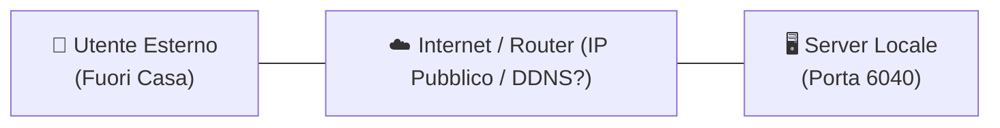
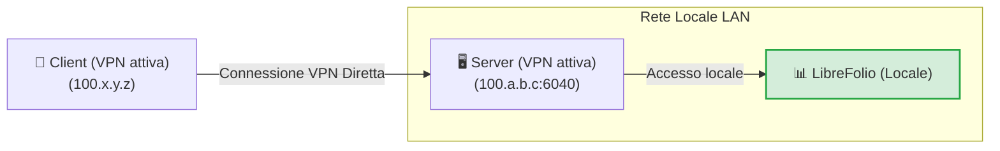
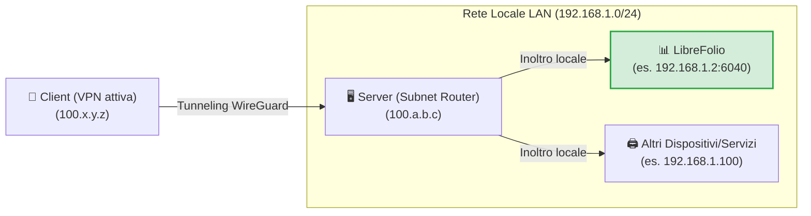
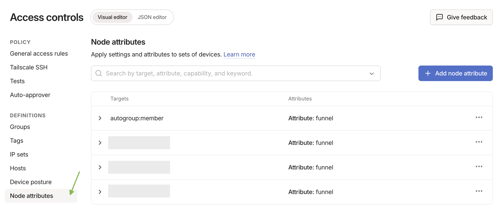
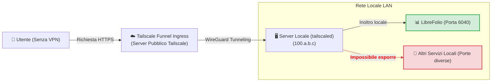
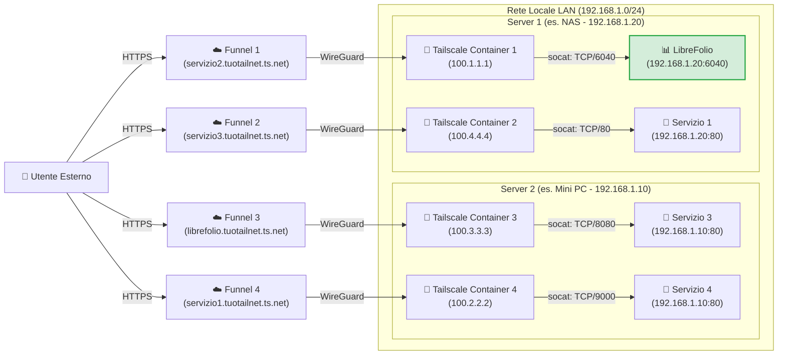

# 🌐 Esporre LibreFolio tramite Tailscale

Esporre in modo sicuro i propri servizi self-hosted su Internet è una delle sfide più comuni. Questa guida spiega come rendere accessibile LibreFolio (o qualsiasi altro servizio nella tua rete locale) sfruttando [Tailscale](https://tailscale.com/), una soluzione VPN mesh sicura, performante e gratuita per uso domestico.

!!! tip "Il nostro consiglio per la configurazione"

    Tra i diversi approcci presentati, riteniamo che il **Livello 4 (Multi-Funnel via Docker)** sia la soluzione migliore in assoluto: richiede pochissima configurazione aggiuntiva rispetto agli altri metodi, offre i massimi vantaggi in termini di isolamento e modularità, e risolve i limiti strutturali degli altri metodi. Gli altri livelli sono presentati sia come alternative sia per comprendere il percorso tecnico per arrivarci.

---

## 🔒 Sicurezza e Rischi del Port Forwarding Tradizionale

Il metodo tradizionale per rendere accessibile un servizio dall'esterno prevede l'apertura di porte sul router di casa (port forwarding) associato a un IP pubblico (spesso dinamico) e un servizio DDNS (come DuckDNS). 

Questo approccio presenta notevoli rischi:

1. **Esposizione all'intero web**: Chiunque può scansionare il tuo IP pubblico e tentare di attaccare la porta aperta.
2. **Complessità di gestione**: È necessario configurare e rinnovare manualmente i certificati SSL (HTTPS) tramite reverse proxy (Nginx, Caddy, ecc.).
3. **Rischi del protocollo HTTP**: Senza una crittografia HTTPS configurata correttamente, le tue credenziali e i dati finanziari viaggiano in chiaro sulla rete locale e pubblica, rendendoli intercettabili da malintenzionati (packet sniffing).

Il diagramma seguente mostra il problema iniziale dell'esposizione da remoto:



---

## 🚀 Cos'è Tailscale?

[Tailscale](https://tailscale.com/) è un servizio VPN mesh a configurazione zero basato sul moderno protocollo di crittografia **WireGuard**. 

* **Piano Gratuito (Personal)**: Permette di collegare fino a **100 dispositivi** gratuitamente.
* **Mesh Network**: Tutti i dispositivi configurati si connettono direttamente tra loro in modo cifrato (peer-to-peer), senza che il traffico passi attraverso server intermedi.
* **Compatibilità**: Funziona su tutti i principali sistemi operativi (Linux, macOS, Windows, iOS, Android) ed è installabile su NAS o all'interno di container Docker.

---

## 🏁 Passo 0: Installazione di Tailscale sui Dispositivi

Per far funzionare qualsiasi VPN, sono necessari **almeno 2 dispositivi connessi**: il *client* (es. il tuo smartphone o PC portatile) e il *server* (il nodo su cui gira LibreFolio). Prima di procedere con i livelli, installa ed effettua l'accesso a Tailscale sui tuoi dispositivi:

=== "Linux"

    Esegui il comando ufficiale di installazione sul server:

    ```bash
    curl -fsSL https://tailscale.com/install.sh | sh
    sudo tailscale up
    ```

    Per approfondimenti, consulta la [Guida di Installazione Generica](https://tailscale.com/docs/install).

=== "macOS"

    Installa l'app ufficiale dal **Mac App Store** oppure utilizza Homebrew:

    ```bash
    brew install --cask tailscale
    sudo tailscale up
    ```

    Per approfondimenti, consulta la [Guida di Installazione Generica](https://tailscale.com/docs/install).

=== "Windows"

    Scarica l'installer ufficiale dal portale di Tailscale ed esegui la procedura guidata di login.

    Per dettagli, consulta la [Guida di Installazione per Windows](https://tailscale.com/docs/install/windows).

=== "Android"

    Installa l'applicazione ufficiale dal [Google Play Store](https://play.google.com/store/apps/details?id=com.tailscale.ipn).

=== "iOS (iPhone/iPad)"

    Installa l'applicazione ufficiale dall'[Apple App Store](https://apps.apple.com/us/app/tailscale/id1470499037).

---

## 🛠️ I 4 Livelli di Configurazione e Esposizione

---

## 🏃 Livello 1: Connessione VPN Privata Point-to-Point (Partenza)

Consiste nel connettere il server e il client alla stessa rete privata Tailscale. Sul server si espone la porta del servizio tramite il comando `serve`.



Sul server, usa il comando per esporre la porta locale di LibreFolio (porta di default `6040`):

```bash
tailscale serve tcp:6040 /
```

A questo punto, con la VPN attiva sul tuo smartphone o PC, ti basterà inserire nel browser l'IP di Tailscale del server (o il suo MagicDNS) seguito dalla porta per accedere a LibreFolio da remoto.

<table style="width: 100%; border-collapse: collapse; margin-top: 1rem; margin-bottom: 1rem;">
  <thead>
    <tr style="background-color: #f3f4f6;">
      <th style="width: 50%; padding: 10px; border: 1px solid #e5e7eb; text-align: left; font-weight: bold;">🟢 Vantaggi (Pro)</th>
      <th style="width: 50%; padding: 10px; border: 1px solid #e5e7eb; text-align: left; font-weight: bold;">🔴 Svantaggi (Contro)</th>
    </tr>
  </thead>
  <tbody>
    <tr>
      <td style="padding: 10px; border: 1px solid #e5e7eb; background-color: rgba(76, 175, 80, 0.08); vertical-align: top;">
        <ul>
          <li>Configurazione istantanea e minima.</li>
          <li>Massima sicurezza: i tuoi dati non passano su Internet pubblico, la porta è chiusa all'esterno della VPN.</li>
        </ul>
      </td>
      <td style="padding: 10px; border: 1px solid #e5e7eb; background-color: rgba(244, 67, 54, 0.08); vertical-align: top;">
        <ul>
          <li><strong>Richiede che la VPN Tailscale sia attiva e connessa</strong> su ogni client (es. sul telefono) per raggiungere il servizio.</li>
          <li><strong>Espone un solo servizio in assoluto</strong> per singolo host.</li>
        </ul>
      </td>
    </tr>
  </tbody>
</table>

---

## 🥉 Livello 2: Configurazione come Subnet Router (LAN Tunneling)

Questo livello trasforma il tuo server in un "sub-router". Quando sei fuori casa con la VPN accesa sul client, potrai raggiungere non solo il server, ma **qualsiasi dispositivo o servizio della tua LAN domestica** inserendo semplicemente il suo IP locale.



### 1. Abilitare il Subnet Routing sull'OS del Server

=== "Linux"

    Abilita l'IP Forwarding a livello kernel:

    ```bash
    echo 'net.ipv4.ip_forward = 1' | sudo tee -a /etc/sysctl.d/99-tailscale.conf
    echo 'net.ipv6.conf.all.forwarding = 1' | sudo tee -a /etc/sysctl.d/99-tailscale.conf
    sudo sysctl -p /etc/sysctl.d/99-tailscale.conf
    ```

    Avvia pubblicizzando la subnet (sostituisci l'intervallo IP con quello della tua rete locale, es. `192.168.1.0/24`):

    ```bash
    sudo tailscale up --advertise-routes=192.168.1.0/24
    ```

=== "macOS"

    Utilizza il percorso dell'eseguibile di Tailscale per pubblicizzare la subnet locale:

    ```bash
    /Applications/Tailscale.app/Contents/MacOS/Tailscale up --advertise-routes=192.168.1.0/24
    ```

=== "Windows"

    Esegui il prompt dei comandi (`cmd.exe`) o PowerShell come **Amministratore** e pubblica la subnet locale:

    ```cmd
    tailscale up --advertise-routes=192.168.1.0/24
    ```

### 2. Approvare la rotta nel pannello di amministrazione

1. Vai su [Tailscale Admin Console](https://login.tailscale.com/admin/machines).
2. Clicca sui tre puntini accanto al tuo server -> **Edit route settings**.
3. Abilita la subnet pubblicizzata.

!!! tip "Disattivare la scadenza della chiave (Key Expiry) per il Server"

    Poiché il server agisce come infrastruttura di rete (subnet router), è consigliabile disabilitare la scadenza automatica della chiave per questo nodo, evitando che si disconnetta richiedendo periodicamente una nuova autenticazione interattiva (di default ogni 180 giorni):
    1. Nella pagina **Machines** della console di amministrazione, individua il tuo server.
    2. Fai clic sull'icona con i **tre puntini (...)** sulla destra della riga del dispositivo.
    3. Seleziona l'opzione **Disable Key Expiry**.

<table style="width: 100%; border-collapse: collapse; margin-top: 1rem; margin-bottom: 1rem;">
  <thead>
    <tr style="background-color: #f3f4f6;">
      <th style="width: 50%; padding: 10px; border: 1px solid #e5e7eb; text-align: left; font-weight: bold;">🟢 Vantaggi (Pro)</th>
      <th style="width: 50%; padding: 10px; border: 1px solid #e5e7eb; text-align: left; font-weight: bold;">🔴 Svantaggi (Contro)</th>
    </tr>
  </thead>
  <tbody>
    <tr>
      <td style="padding: 10px; border: 1px solid #e5e7eb; background-color: rgba(76, 175, 80, 0.08); vertical-align: top;">
        <ul>
          <li>Accesso a tutti i dispositivi della casa (stampanti, telecamere, LibreFolio, domotica) con un solo nodo attivo.</li>
          <li>Non occorre configurare porte o reverse proxy per ogni servizio.</li>
        </ul>
      </td>
      <td style="padding: 10px; border: 1px solid #e5e7eb; background-color: rgba(244, 67, 54, 0.08); vertical-align: top;">
        <ul>
          <li><strong>La VPN sul client deve essere attiva</strong> per consentire la comunicazione.</li>
          <li><strong>Devi conoscere gli IP locali</strong> dei dispositivi per raggiungerli.</li>
          <li>Una volta arrivati in casa, <strong>i pacchetti viaggiano in chiaro (HTTP)</strong> sulla LAN privata.</li>
        </ul>
      </td>
    </tr>
  </tbody>
</table>

---

## 🔑 Abilitare il Funnel e le ACL sulla Console

*Configurazione una tantum necessaria per il Livello 3 e il Livello 4*

Prima di poter utilizzare Tailscale Funnel (sia sul server locale al Livello 3, sia all'interno dei container Docker al Livello 4), è necessario abilitare il Funnel e definire le regole di accesso (ACL) a livello globale per tutta la tua Tailnet. Questa operazione si esegue una sola volta direttamente sulla console amministrativa di Tailscale.

### 1. Abilitare HTTPS e Funnel sul Pannello di Controllo

1. Visita la scheda [Access Controls](https://login.tailscale.com/admin/acls) della console di amministrazione Tailscale.
2. Clicca sul pulsante **Add node attribute** per generare le autorizzazioni.



3. Configura le seguenti opzioni della schermata:
    * **Targets**: Inserisci il tag o gruppo che desideri autorizzare ad attivare il Funnel. Un *Target* definisce a quali nodi si applica la regola. **Noi suggeriamo di inserire `tag:external_access`** (per associarlo selettivamente ai container Docker) oppure `autogroup:member` (se desideri consentire l'esposizione a tutti i dispositivi registrati col tuo account personale).
    * **Attributes**: Inserisci `funnel`.
    * **Note**: Inserisci un testo per tenere traccia delle tue motivazioni.
    * **IP Pools, App, Capability, ecc.**: Questi campi aggiuntivi non ci interessano per questa esposizione, lasciali vuoti o ai valori predefiniti.

*Nota bene: La configurazione delle ACL definisce le policy di sicurezza globali per l'abilitazione del Funnel. Essa è indipendente dalle chiavi di autenticazione (Auth Key), che servono esclusivamente per registrare inizialmente un nuovo dispositivo/container alla rete.*

In alternativa, se preferisci modificare direttamente la configurazione JSON delle ACL, puoi utilizzare la seguente configurazione funzionante (aggiornata per supportare sia i tuoi dispositivi che il tag `tag:external_access` dei container):

??? example "Visualizza la configurazione ACL JSON completa per abilitare il Funnel"

    ```json
    {
      // Dichiarazione dei tag autorizzati
      "tagOwners": {
        "tag:external_access": ["autogroup:admin"]
      },

      // Regole di accesso standard
      "acls": [
        // Consente a tutti i nodi della tua rete privata di comunicare
        {"action": "accept", "src": ["*"], "dst": ["*:*"]}
      ],

      "ssh": [
        {
          "action": "check",
          "src":    ["autogroup:member"],
          "dst":    ["autogroup:self"],
          "users":  ["autogroup:nonroot", "root"]
        }
      ],

      // Abilitazione del Funnel su determinati nodi o tag
      "nodeAttrs": [
        {
          "target": ["autogroup:member"],
          "attr":   ["funnel"]
        },
        {
          "target": ["tag:external_access"],
          "attr":   ["funnel"]
        }
      ]
    }
    ```

### 🥈 Livello 3: Esposizione Pubblica tramite Tailscale Funnel (Senza VPN sul Client)

!!! warning "Prerequisito Fondamentale"

    Prima di procedere, assicurati di aver completato la [configurazione una tantum del Funnel e delle ACL sulla console](#abilitare-il-funnel-e-le-acl-sulla-console).

**Tailscale Funnel** consente di esporre pubblicamente un servizio a Internet. Chiunque potrà accedere al tuo LibreFolio tramite un URL HTTPS protetto fornito da MagicDNS, **senza dover installare o attivare Tailscale** sul proprio smartphone o PC. Questo è essenziale per poter installare LibreFolio come PWA su dispositivi mobili ed avere l'auto-prompt (per approfondimenti, consulta la guida [📱 Installa come App (PWA)](../user/pwa.md)).



### 1. Avviare il Funnel sul Server

Associa il funnel alla porta locale di LibreFolio:

```bash
tailscale funnel 6040 on
```

*Nota: Per questo livello non è richiesta alcuna chiave di autenticazione (Auth Key) in quanto la macchina server è già stata loggata e registrata in modo interattivo alla tua Tailnet durante il **Passo 0**.*

### 2. Approvare e attendere la propagazione

Una volta avviato il comando, nel terminale comparirà un avviso che indica che il Funnel è abilitato ma non ancora autorizzato per il tuo nodo, mostrando un link simile al seguente:

```text
Funnel is enabled, but the list of allowed nodes in the tailnet policy file does not include the one you are using.
To give access to this node you can edit the tailnet policy file, or visit:

         https://login.tailscale.com/f/funnel?node=xxxxxx
```

* Visita il link indicato nel browser, effettua l'accesso a Tailscale e approva l'abilitazione del Funnel per questo nodo.
* Una volta approvato, il terminale visualizzerà l'URL pubblico generato.
* Attendi qualche minuto affinché i record DNS di MagicDNS si propaghino a livello globale per raggiungere il servizio da qualsiasi rete esterna.

<table style="width: 100%; border-collapse: collapse; margin-top: 1rem; margin-bottom: 1rem;">
  <thead>
    <tr style="background-color: #f3f4f6;">
      <th style="width: 50%; padding: 10px; border: 1px solid #e5e7eb; text-align: left; font-weight: bold;">🟢 Vantaggi (Pro)</th>
      <th style="width: 50%; padding: 10px; border: 1px solid #e5e7eb; text-align: left; font-weight: bold;">🔴 Svantaggi (Contro)</th>
    </tr>
  </thead>
  <tbody>
    <tr>
      <td style="padding: 10px; border: 1px solid #e5e7eb; background-color: rgba(76, 175, 80, 0.08); vertical-align: top;">
        <ul>
          <li>Accesso pubblico universale tramite HTTPS gratuito gestito da Tailscale.</li>
          <li>Nessun certificato SSL o reverse proxy da configurare sul server.</li>
          <li>Permette l'installazione nativa della PWA su smartphone senza VPN accesa.</li>
        </ul>
      </td>
      <td style="padding: 10px; border: 1px solid #e5e7eb; background-color: rgba(244, 67, 54, 0.08); vertical-align: top;">
        <ul>
          <li><strong>Si può esporre al massimo 1 solo servizio</strong> Funnel per macchina/host.</li>
        </ul>
      </td>
    </tr>
  </tbody>
</table>

---

### 🥇 Livello 4: Esposizione Multi-Funnel Avanzata via Docker (Sidecars)

!!! warning "Prerequisito Fondamentale"

    Prima di procedere con la configurazione dei container, assicurati di aver completato la [configurazione una tantum del Funnel e delle ACL sulla console](#abilitare-il-funnel-e-le-acl-sulla-console).

Per superare il limite di un solo Funnel per nodo host, possiamo eseguire più nodi Tailscale paralleli all'interno di container Docker. Ciascun container si registrerà come un nodo indipendente sulla tua Tailnet, ottenendo un proprio URL MagicDNS dedicato.

La nostra soluzione prevede l'uso di un piccolo script di startup personalizzato che installa **socat** nel container e re-indirizza il traffico HTTPS in ingresso verso l'IP LAN fisso del servizio target.

??? info "Cos'è socat?"

    **socat** (SOcket CAT) è un'utilità da riga di comando estremamente flessibile che stabilisce due flussi di dati bidirezionali e trasferisce i dati data tra di essi. Nel nostro caso, lo usiamo come un **mini proxy-forwarder**: ascolta sulla porta locale del container Tailscale e inoltra tutti i pacchetti ricevuti verso la porta reale del servizio sul server locale.

Il diagramma di rete illustra lo scenario a nodi multipli esposti in parallelo, dove i container Tailscale 1 e 2 girano sul primo host (Server 1) ed i container Tailscale 3 e 4 girano sul secondo host (Server 2):



!!! note "Nodi e Servizi Multipli"

    Con questa architettura è possibile aggiungere ed esporre tutti i servizi desiderati semplicemente avviando nuovi container di Tailscale associati al relativo script. L'unico limite è dato dalle condizioni del proprio piano di abbonamento Tailscale (che nella versione gratuita copre fino a 100 dispositivi).

### 1. Preparazione della cartella e dello script

Crea una cartella sul server (es. all'interno del path dove tieni i volumi persistenti dei tuoi Docker):

```bash
# Crea una cartella per i nodi Tailscale ed entra all'interno
mkdir -p <path_scelto>/tailscale-nodes
cd <path_scelto>/tailscale-nodes
```

Scarica all'interno di questa cartella lo script di startup personalizzato <a href="https://raw.githubusercontent.com/Librefolio/LibreFolio/main/docs/static/tailscale-guide/custom_startup.sh" target="_blank" rel="noopener noreferrer">custom_startup.sh</a>:

```bash
# Scarica lo script dal repository ufficiale
wget https://raw.githubusercontent.com/Librefolio/LibreFolio/main/docs/static/tailscale-guide/custom_startup.sh
# Rendi lo script eseguibile
chmod +x custom_startup.sh
```

### 2. Configurazione di Docker Compose

Suggeriamo di definire e dichiarare il servizio Tailscale **all'interno dello stesso file `docker-compose.yml` del servizio** che vuoi esporre (es. LibreFolio), per mantenerli vicini e accoppiati logicamente. Aggiungi il blocco del servizio come mostrato di seguito:

```yaml
services:
  tailscale-librefolio:
    image: tailscale/tailscale:latest
    container_name: tailscale-librefolio
    hostname: tailscale-librefolio
    restart: unless-stopped
    privileged: false
    network_mode: bridge
    cap_add:
      - NET_ADMIN
      - NET_RAW
    devices:
      - /dev/net/tun:/dev/net/tun
    command:
      - /custom_startup.sh
    environment:
      - HOST_IP=192.168.1.10                # IP locale del servizio da esporre (es. Server 1)
      - HOST_PORT=6040                      # Porta reale del servizio da esporre
      - TAILSCALE_FUNNEL_PORT=6040          # Porta interna del Funnel
      - TS_HOSTNAME=librefolio              # Nome del sotto-dominio pubblico (es. librefolio)
      - TS_AUTHKEY=tskey-auth-...           # Chiave di autenticazione generata da Tailscale
      - TS_ACCEPT_DNS=true
      - TS_STATE_DIR=/var/lib/tailscale
      - TS_USERSPACE=false
    volumes:
      - <path_scelto>/tailscale-nodes/tailscale-librefolio/state:/var/lib/tailscale
      - <path_scelto>/tailscale-nodes/custom_startup.sh:/custom_startup.sh
      - /etc/localtime:/etc/localtime:ro
      - /etc/timezone:/etc/timezone:ro
```

#### Descrizione Parametri di Configurazione

<table style="width: 100%; border-collapse: collapse; margin-top: 1rem; margin-bottom: 1rem;">
  <thead>
    <tr style="background-color: #f3f4f6;">
      <th style="width: 35%; padding: 10px; border: 1px solid #e5e7eb; text-align: left; font-weight: bold; white-space: nowrap;">Parametro</th>
      <th style="width: 65%; padding: 10px; border: 1px solid #e5e7eb; text-align: left; font-weight: bold;">Descrizione</th>
    </tr>
  </thead>
  <tbody>
    <tr>
      <td style="padding: 10px; border: 1px solid #e5e7eb; font-family: monospace; white-space: nowrap;">&lt;path_scelto&gt;</td>
      <td style="padding: 10px; border: 1px solid #e5e7eb;">Il percorso assoluto (full-path) sul server locale dove sono salvati lo script e i dati di stato (es. <code>/home/user/docker</code>).</td>
    </tr>
    <tr>
      <td style="padding: 10px; border: 1px solid #e5e7eb; font-family: monospace; white-space: nowrap;">HOST_IP</td>
      <td style="padding: 10px; border: 1px solid #e5e7eb;">L'IP LAN statico della macchina che ospita il servizio.</td>
    </tr>
    <tr>
      <td style="padding: 10px; border: 1px solid #e5e7eb; font-family: monospace; white-space: nowrap;">HOST_PORT</td>
      <td style="padding: 10px; border: 1px solid #e5e7eb;">La porta reale sul server LAN a cui connettersi (es. <code>6040</code> per LibreFolio).</td>
    </tr>
    <tr>
      <td style="padding: 10px; border: 1px solid #e5e7eb; font-family: monospace; white-space: nowrap;">TAILSCALE_FUNNEL_PORT</td>
      <td style="padding: 10px; border: 1px solid #e5e7eb;">La porta su cui il container Tailscale ascolterà e attiverà il Funnel. In linea di principio, la cosa migliore è impostare questo parametro con lo stesso valore della porta interna del servizio (<code>HOST_PORT</code>) per coerenza; viene lasciato come parametro separato per supportare eventuali casi particolari futuri.</td>
    </tr>
    <tr>
      <td style="padding: 10px; border: 1px solid #e5e7eb; font-family: monospace; white-space: nowrap;">TS_HOSTNAME</td>
      <td style="padding: 10px; border: 1px solid #e5e7eb;">Il nome host personalizzato del nodo. L'indirizzo pubblico generato sarà <code>https://TS_HOSTNAME.tuo-tailnet.ts.net</code>.</td>
    </tr>
    <tr>
      <td style="padding: 10px; border: 1px solid #e5e7eb; font-family: monospace; white-space: nowrap;">TS_AUTHKEY</td>
      <td style="padding: 10px; border: 1px solid #e5e7eb;">
        La chiave di autenticazione (Auth Key) generata da Tailscale. Per ottenerla:<br>
        1. Vai su <a href="https://login.tailscale.com/admin/settings/keys" target="_blank" rel="noopener noreferrer">Tailscale Admin Settings Keys</a>.<br>
        2. Sotto la sezione <strong>Auth keys</strong> (<em>non</em> sotto la sezione API access tokens), fai clic sul pulsante <strong>Generate auth key...</strong>.<br>
        3. È necessario <strong>abilitare il toggle dei Tags</strong> per poter selezionare il tag desiderato (es. <code>tag:external_access</code>). Nella descrizione della chiave, inserisci una nota descrittiva per renderla facilmente riconoscibile (es. <code>docker-librefolio-funnel</code>).<br>
        4. Fai clic su <strong>Generate</strong> e copia la chiave generata (es. <code>tskey-auth-...</code>).<br>
        <br>
        <em>Nota: Una volta che il container si sarà avviato correttamente, la chiave monouso verrà consumata e sparirà automaticamente dall'elenco "Keys" della console amministrativa, mentre in "Machines" comparirà il nuovo dispositivo registrato.</em>
      </td>
    </tr>
  </tbody>
</table>

??? example "Visualizza il file Docker Compose di produzione completo (LibreFolio + Tailscale)"

    Di seguito è riportato un esempio reale e completo di file `docker-compose.yml` di produzione che affianca il container principale di LibreFolio al sidecar di Tailscale per l'esposizione automatica:

    ```yaml
    # =============================================================================
    # LibreFolio — Production Docker Compose
    # =============================================================================
    # Optimized for end-users running the official pre-built image from GHCR.
    # =============================================================================

    services:
      librefolio:
        image: ghcr.io/librefolio/librefolio:latest
        container_name: librefolio
        restart: unless-stopped
        ports:
          - "${PORT:-6040}:6040"
        volumes:
          - ./LibreFolio-data:/app/backend/data/prod-docker
        env_file: .env
        environment:
          - LIBREFOLIO_DATA_DIR=/app/backend/data/prod-docker
          - HOST=0.0.0.0
        healthcheck:
          test: ["CMD", "python", "-c", "import urllib.request; urllib.request.urlopen('http://localhost:6040/api/v1/system/health')"]
          interval: 30s
          timeout: 10s
          start_period: 15s
          retries: 3

      tailscale-librefolio:
        image: tailscale/tailscale:latest
        container_name: tailscale-librefolio
        hostname: tailscale-librefolio
        restart: unless-stopped
        privileged: false
        network_mode: bridge
        cap_add:
          - NET_ADMIN
          - NET_RAW
        devices:
          - /dev/net/tun:/dev/net/tun
        command:
          - /custom_startup.sh
        environment:
          - HOST_IP=192.168.1.10                # IP locale del servizio da esporre (es. Server 1)
          - HOST_PORT=6040                      # Porta reale del servizio da esporre
          - TAILSCALE_FUNNEL_PORT=6040          # Porta interna del Funnel
          - TS_HOSTNAME=librefolio              # Nome del sotto-dominio pubblico (es. librefolio)
          - TS_AUTHKEY=tskey-auth-...           # Sostituisci con la chiave generata
          - TS_ACCEPT_DNS=true
          - TS_STATE_DIR=/var/lib/tailscale
          - TS_USERSPACE=false
        volumes:
          - /DATA/AppData/tailscale-nodes/tailscale-librefolio/state:/var/lib/tailscale
          - /DATA/AppData/tailscale-nodes/custom_startup.sh:/custom_startup.sh
          - /etc/localtime:/etc/localtime:ro
          - /etc/timezone:/etc/timezone:ro
    ```

### 3. Avvio e Approvazione

Avvia il container compose del tuo servizio (inclusivo del sidecar Tailscale):

```bash
docker compose up -d
```

Visualizza i log del container Tailscale per estrarre il link di approvazione del Funnel (richiesto al primo avvio):

```bash
docker logs -f tailscale-librefolio
```

Nel log del container comparirà una riga di avviso con il link di autorizzazione specifico per il tuo nodo:

```text
Funnel is enabled, but the list of allowed nodes in the tailnet policy file does not include the one you are using.
To give access to this node you can edit the tailnet policy file, or visit:

         https://login.tailscale.com/f/funnel?node=nsXXXXXXX
```

* Apri il link indicato nel browser, effettua l'accesso a Tailscale ed approva l'abilitazione del Funnel.
* Subito dopo l'approvazione, nei log del container visualizzerai la conferma di avvenuta esposizione con l'URL pubblico ed il proxy locale:

```text
Available on the internet:

https://librefolio.stargazer-orfe.ts.net/
|-- proxy http://127.0.0.1:6040

Press Ctrl+C to exit.
```

* **Nota**: A questo punto il servizio è online, ma è necessario attendere qualche minuto affinché la propagazione del record DNS MagicDNS si completi a livello globale.

!!! tip "Disattivare la scadenza della chiave (Key Expiry) per il Container"

    Per evitare che il container del sidecar scada disconnettendosi dalla tua Tailnet dopo il periodo di default (180 giorni):
    
    1. Vai alla pagina **Machines** della Tailscale Admin Console.
    2. Trova il nodo del container (es. `librefolio` o `tailscale-librefolio`) nella lista.
    3. Clicca sull'icona con i **tre puntini (...)** sulla destra della riga del dispositivo.
    4. Seleziona l'opzione **Disable Key Expiry**.

<table style="width: 100%; border-collapse: collapse; margin-top: 1rem; margin-bottom: 1rem;">
  <thead>
    <tr style="background-color: #f3f4f6;">
      <th style="width: 50%; padding: 10px; border: 1px solid #e5e7eb; text-align: left; font-weight: bold;">🟢 Vantaggi (Pro)</th>
      <th style="width: 50%; padding: 10px; border: 1px solid #e5e7eb; text-align: left; font-weight: bold;">🔴 Svantaggi (Contro)</th>
    </tr>
  </thead>
  <tbody>
    <tr>
      <td style="padding: 10px; border: 1px solid #e5e7eb; background-color: rgba(76, 175, 80, 0.08); vertical-align: top;">
        <ul>
          <li>Possibilità di creare <strong>infiniti Funnel pubblici indipendenti</strong> su una sola macchina fisica.</li>
          <li>URL separati e dedicati per ogni servizio domestico.</li>
          <li>I pacchetti di rete locali viaggiano in modo sicuro e diretto tra il container ed il servizio di destinazione.</li>
        </ul>
      </td>
      <td style="padding: 10px; border: 1px solid #e5e7eb; background-color: rgba(244, 67, 54, 0.08); vertical-align: top;">
        <ul>
          <li><strong>Richiede l'uso del terminale</strong> e la configurazione manuale dei file Docker Compose.</li>
        </ul>
      </td>
    </tr>
  </tbody>
</table>

---

## 🔮 MagicDNS e Domini Personalizzati

### Cos'è MagicDNS?

**MagicDNS** assegna automaticamente un nome di dominio DNS locale e pubblico a ciascuno dei tuoi dispositivi registrati nella Tailnet. Invece di dover ricordare indirizzi IP come `100.110.222.112`, puoi digitare nel browser `http://il-tuo-server`. 
I domini pubblici assegnati da MagicDNS terminano con il suffisso `*.ts.net` (ad esempio, `https://librefolio.tuo-tailnet.ts.net`).

### Come Usare un Dominio di Proprietà con Tailscale

Se possiedi un tuo dominio personale (es. `ilmiodominio.it`) e desideri utilizzarlo per raggiungere i tuoi nodi privati Tailscale anziché usare l'URL standard `*.ts.net`, puoi procedere con due tecniche principali:

#### Metodo 1: DNS Pubblico mappato su IP Tailscale (Consigliato per Rete Privata)

Questa è la soluzione più semplice per accedere privatamente ai tuoi dispositivi con il tuo dominio.

1. Accedi alla console del tuo registrar di domini (es. Cloudflare, GoDaddy, Namecheap).
2. Crea un record DNS di tipo **A** (o **AAAA** per IPv6) per il sottodominio scelto (es. `librefolio.ilmiodominio.it`).
3. Fai puntare il record direttamente all'**IP privato Tailscale** del tuo server (es. `100.77.72.90`).
4. **Come funziona**: Poiché gli IP della rete `100.64.0.0/10` non sono pubblicamente instradabili a livello globale, il dominio si risolverà e funzionerà **solo** quando sarai connesso alla tua VPN Tailscale, garantendo che nessun utente esterno possa accedere o scansionare il servizio. Per dettagli, consulta la [Documentazione ufficiale sulle impostazioni DNS](https://tailscale.com/kb/1054/dns#public-dns).

#### Metodo 2: Split DNS (Con server DNS interno)

Se desideri gestire in modo dinamico i record interni e non pubblicarli su Internet:

1. Configura un server DNS privato nella tua LAN (come Pi-hole, AdGuard Home o CoreDNS).
2. Aggiungi i record locali del tuo dominio di proprietà puntandoli verso i tuoi IP Tailscale.
3. Nella console di amministrazione Tailscale, vai su *DNS -> Nameservers -> Add Nameserver* e aggiungi l'IP Tailscale del tuo DNS privato come nameserver globale o limitato al tuo dominio. Per dettagli, consulta la [Documentazione ufficiale su Split DNS](https://tailscale.com/kb/1054/dns#split-dns).

!!! warning "Attenzione all'esposizione pubblica Funnel"

    Poiché i Funnel pubblici di Tailscale sono esposti su Internet solo tramite il dominio protetto `*.ts.net` (grazie ai certificati SSL firmati da Tailscale), la mappatura diretta di un CNAME pubblico dal tuo dominio a un indirizzo Funnel provocherà errori di sicurezza SSL/TLS nei browser, a meno che non si utilizzi un reverse proxy separato (come Caddy o Nginx) per gestire i certificati della propria zona. L'indirizzo pubblico della tua istanza sarà `librefolio.tuo-tailnet.ts.net`, dove la parte iniziale `librefolio` è definita automaticamente dal valore assegnato alla variabile `TS_HOSTNAME`.

---

## 🔗 Link Utili e Risorse

* 🖥️ [Console di Amministrazione Tailscale (Machines)](https://login.tailscale.com/admin/machines)
* 🔐 [Gestione delle ACL (Access Controls)](https://login.tailscale.com/admin/acls)
* 📖 [Guida Ufficiale a Tailscale Funnel (Documentazione Inglese)](https://tailscale.com/kb/1223/tailscale-funnel)
* 🐳 [Eseguire Tailscale in Docker](https://tailscale.com/kb/1282/docker)
