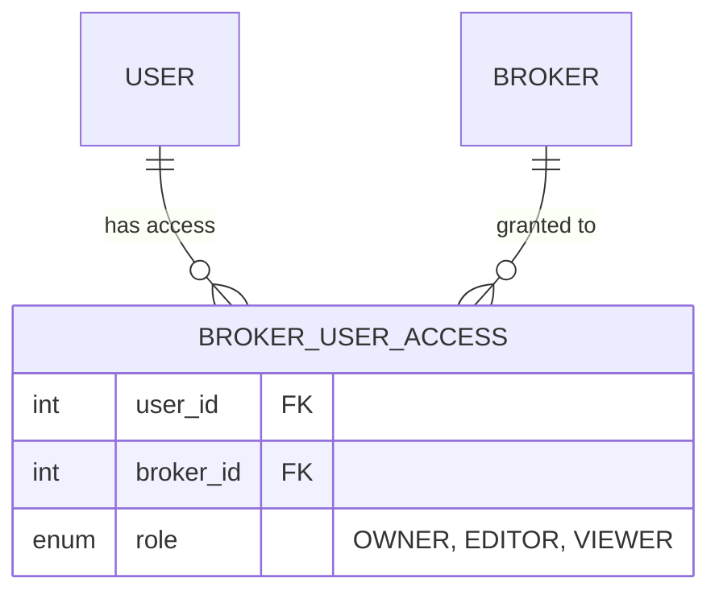

# 🔐 Broker Access Control (RBAC)

LibreFolio implements a granular **Role-Based Access Control (RBAC)** system for Brokers. This allows users to share access to their brokerage accounts with other users (e.g.,
family members, accountants) while maintaining control over permissions.

## 📖 Overview

Access is managed via the `BrokerUserAccess` table, which links a `User` to a `Broker` with a specific `UserRole`.

## 🛡️ Roles and Permissions

There are three roles with increasing levels of privilege:

| Feature                              | VIEWER | EDITOR | OWNER |
|:-------------------------------------|:------:|:------:|:-----:|
| **View Broker Details**              |   ✅    |   ✅    |   ✅   |
| **View Transactions**                |   ✅    |   ✅    |   ✅   |
| **View Reports/Charts**              |   ✅    |   ✅    |   ✅   |
| **Add/Edit Transactions**            |   ❌    |   ✅    |   ✅   |
| **Import Files (BRIM)**              |   ❌    |   ✅    |   ✅   |
| **Edit Broker Settings**             |   ❌    |   ✅    |   ✅   |
| **Manage Access (Add/Remove Users)** |   ❌    |   ❌    |   ✅   |
| **Delete Broker**                    |   ❌    |   ❌    |   ✅   |

### 📋 Role Definitions

1. 👁️ **VIEWER**: Read-only access. Ideal for sharing portfolio visibility without risk of data modification.
2. ✏️ **EDITOR**: Operational access. Can manage the day-to-day data (transactions, imports) and broker settings (name, icon), but cannot perform destructive administrative actions (deleting the broker) or change who has access.
3. 👑 **OWNER**: Administrative access. Full control over the broker.

## 📏 Key Rules & Constraints

### 🔒 The "Last Owner" Rule

To prevent brokers from becoming "orphaned" (inaccessible by anyone with admin rights), the system enforces a strict rule:

> **The last OWNER of a broker cannot be removed or downgraded.**

If a broker has only one user with the `OWNER` role:

- ❌ That user **cannot** remove themselves.
- ❌ That user **cannot** change their role to `EDITOR` or `VIEWER`.
- ✅ To leave the broker, they must first promote another user to `OWNER` or delete the broker entirely.

### 🔧 Self-Management

- 🚪 **Leaving**: Any user (except the last OWNER) can remove *themselves* from a broker at any time.
- ⬇️ **Downgrading**: Users cannot change their own role (except to leave). Only an OWNER can change roles.

## 🔧 Implementation Details

The logic is centralized in `backend/app/services/broker_service.py`.

- 🔍 **`_check_user_access(broker_id, user_id, min_role)`**: Core internal method to verify permissions.
- ➕ **`add_access()`**: Grants access to a new user (OWNER only).
- 🔄 **`update_access()`**: Changes an existing user's role (OWNER only).
- ❌ **`remove_access()`**: Revokes access (OWNER can remove anyone; others can only remove themselves).

### 🌐 API Endpoints

Access management is exposed via the following endpoints:

- `GET /api/v1/brokers/{id}/access`: List all users with access.
- `POST /api/v1/brokers/{id}/access`: Grant access.
- `PATCH /api/v1/brokers/{id}/access/{user_id}`: Change role.
- `DELETE /api/v1/brokers/{id}/access/{user_id}`: Revoke access.
