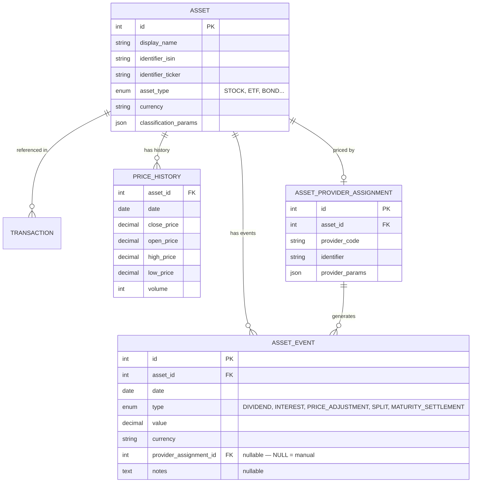

# 📊 Assets & Pricing

Global financial instruments and their pricing sources. Assets are shared across all users — only the transactions referencing them are user-specific.

## 📐 ER Diagram

## 📋 Tables

### 📦 `ASSET`

Global definition of a financial instrument. Each asset has a unique combination of identifiers (ISIN, ticker) and belongs to an [Asset Type](../../../financial-theory/asset-types.md).

- 📋 **`classification_params`** (JSON): Stores flexible metadata like Sector, Geography, and Industry without requiring schema changes.
- 💰 **`currency`**: The asset's native currency (e.g., USD for Apple, EUR for ASML).

### 📈 `PRICE_HISTORY`

Daily OHLCV (Open, High, Low, Close, Volume) price data for each asset. Populated by asset pricing providers.

### 🔌 `ASSET_PROVIDER_ASSIGNMENT`

Decouples the asset from its data source. This table configures which provider to use for fetching prices and metadata.

- 📋 Example: "Use Yahoo Finance (`yfinance`) for Apple (`AAPL`)"
- ⚙️ **`provider_params`** (JSON): Provider-specific configuration (e.g., exchange suffix, custom identifier).

The provider system uses the [Registry Pattern](../patterns/registry_pattern.md) for extensibility.

### 📅 `ASSET_EVENT`

Asset-level events that affect pricing or generate distributions. Events are distinct from transactions:

- **Events** describe what happens to the **asset globally** (e.g., a dividend, a stock split).
- **Transactions** describe what happens in a **user's portfolio** (e.g., buy, sell).

| Event Type | Effect on Price | Description |
|-----------|----------------|-------------|
| `DIVIDEND` | Price drops by event value (ex-date) | Cash distribution from equity/ETF |
| `INTEREST` | Price drops by event value | Interest payment from debt/loan |
| `PRICE_ADJUSTMENT` | Algebraic change (+/-) | Non-cash value change (write-down, haircut, re-rating) |
| `SPLIT` | Changes quantity, not total value | Stock/unit split |
| `MATURITY_SETTLEMENT` | Final capital return | Asset reaches maturity — no further calculations |

**Deduplication strategy**: Events with a `provider_assignment_id` (auto-generated by a provider) are deduped on `(asset_id, date, type)` via DELETE+INSERT during sync. Events with `provider_assignment_id = NULL` are user-created manual events and are never auto-deleted.

**Indexes**: `(asset_id, date)`, `(asset_id, type, date)`, `(provider_assignment_id)`.

## 🔗 Related Documentation

- 📚 [Asset Types (Financial Theory)](../../../financial-theory/asset-types.md) — Stock, ETF, Bond, Crypto, etc.
- ⚙️ [Asset Architecture](../../backend/assets/architecture.md) — How asset prices are fetched and managed
- 📋 [Asset Providers List](../../backend/assets/system_providers.md) — Available pricing providers
