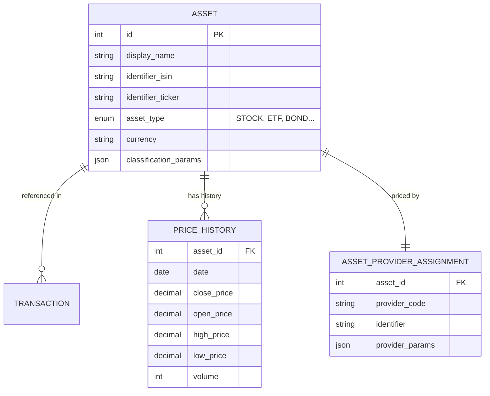

# 📊 Assets & Pricing

Global financial instruments and their pricing sources. Assets are shared across all users — only the transactions referencing them are user-specific.

## 📐 ER Diagram

## 📋 Tables

### 📦 `ASSET`

Global definition of a financial instrument. Each asset has a unique combination of identifiers (ISIN, ticker) and belongs to an [Asset Type](../../../financial-theory/asset-types.md).

- 📋 **`classification_params`** (JSON): Stores flexible metadata like Sector, Geography, and Industry without requiring schema changes.
- 💰 **`currency`**: The asset's native currency (e.g., USD for Apple, EUR for ASML).

### 📈 `PRICE_HISTORY`

Daily OHLCV (Open, High, Low, Close, Volume) price data for each asset. Populated by asset pricing providers.

### 🔌 `ASSET_PROVIDER_ASSIGNMENT`

Decouples the asset from its data source. This table configures which provider to use for fetching prices and metadata.

- 📋 Example: "Use Yahoo Finance (`yfinance`) for Apple (`AAPL`)"
- ⚙️ **`provider_params`** (JSON): Provider-specific configuration (e.g., exchange suffix, custom identifier).

The provider system uses the [Registry Pattern](../patterns/registry_pattern.md) for extensibility.

## 🔗 Related Documentation

- 📚 [Asset Types (Financial Theory)](../../../financial-theory/asset-types.md) — Stock, ETF, Bond, Crypto, etc.
- ⚙️ [Asset Architecture](../../backend/assets/architecture.md) — How asset prices are fetched and managed
- 📋 [Asset Providers List](../../backend/assets/providers_list.md) — Available pricing providers
