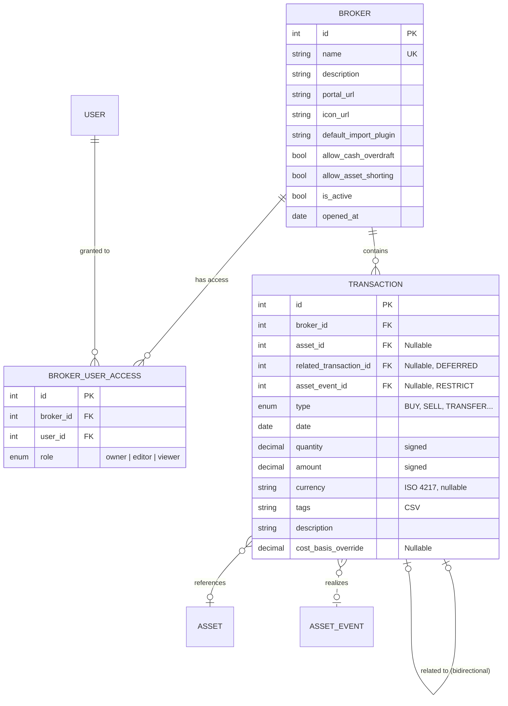

# 🏦 Brokers & Transactions

The core financial data structure. Brokers are containers for transactions, and transactions are the single source of truth for all portfolio calculations.

## 📐 ER Diagram

## 📋 Tables

### 🏦 `brokers`

Represents a brokerage account (e.g., Interactive Brokers, Degiro, a bank account).

| Column | Description |
|--------|-------------|
| `name` | Unique identifier in the UI |
| `description` | Free-text notes |
| `portal_url` | Link to the broker's web portal |
| `icon_url` | Custom icon for the UI |
| `default_import_plugin` | Default BRIM plugin code for imports |
| `allow_cash_overdraft` | When `true`, permits negative cash balances (margin trading) |
| `allow_asset_shorting` | When `true`, permits negative asset quantities (short selling) |
| `is_active` | `false` = account closed (historical data preserved) |
| `opened_at` | Real-world account opening date |

!!! note "No base_currency"

    Unlike some portfolio trackers, brokers do **not** have a single base currency.
    A broker can hold positions in any number of currencies simultaneously.
    Cash balances are tracked per-currency via summation of transaction amounts.

### 🤝 `broker_user_access`

RBAC model — per-broker, per-user role grants.

| Role | Can view | Can edit | Can manage access |
|------|----------|----------|-------------------|
| `viewer` | ✅ | ❌ | ❌ |
| `editor` | ✅ | ✅ | ❌ |
| `owner` | ✅ | ✅ | ✅ |

The first user to create a broker is automatically `owner`. Owners can grant `editor`/`viewer` to other users, enabling shared household portfolios.

### 💰 `transactions`

The single source of truth for all financial operations. Each transaction belongs to exactly one broker.

| Column | Description |
|--------|-------------|
| `broker_id` | FK to broker — required |
| `asset_id` | FK to asset — nullable for cash-only ops (DEPOSIT, WITHDRAWAL) |
| `type` | Enum: BUY, SELL, DIVIDEND, INTEREST, DEPOSIT, WITHDRAWAL, FEE, TAX, TRANSFER, CASH_TRANSFER, FX_CONVERSION, ADJUSTMENT, OTHER |
| `date` | Settlement date |
| `quantity` | Signed asset delta (+in, −out). Default 0, NOT NULL |
| `amount` | Signed cash delta (+in, −out). Default 0, NOT NULL |
| `currency` | ISO 4217 code — required when amount ≠ 0 |
| `related_transaction_id` | Bidirectional self-FK for paired ops (TRANSFER, FX_CONVERSION, CASH_TRANSFER) |
| `tags` | Comma-separated user tags |
| `description` | Free-text |
| `cost_basis_override` | Frozen per-unit cost for the receiving side of a TRANSFER (see below) |
| `asset_event_id` | FK to AssetEvent — links transaction to a global asset event |

**Design rules:**

- `quantity` and `amount` are **signed** and **NOT NULL** — enables simple `SUM()` for balance calculation
- Paired transactions are **bidirectional** (A→B and B→A) using `DEFERRABLE INITIALLY DEFERRED` FK
- Tags are stored as CSV for simple `LIKE` queries without a join table

---

## 🧊 `cost_basis_override` — Snapshot Architecture

The `cost_basis_override` field implements a **frozen acquisition cost** pattern for asset transfers between brokers.

### Problem

When assets move from Broker A to Broker B, Broker B needs to know the historical cost basis (PMC — Prezzo Medio di Carico) for FIFO/tax calculations. Without a snapshot, the system would need to query Broker A's full transaction history every time it calculates P&L on Broker B.

### Solution

At commit time, the backend **computes the Weighted Average Cost (WAC)** at the source broker and writes it to `cost_basis_override` on the **receiver** transaction (qty > 0):

$$WAC = \frac{\sum_{i} q_i \times p_i}{\sum_{i} q_i}$$

where $q_i$ are quantities from BUY transactions and incoming TRANSFERs (that already have a frozen cost) at the source broker.

### Rules

| Side | `cost_basis_override` |
|------|----------------------|
| Sender (qty < 0) | Always `NULL` |
| Receiver (qty > 0) | Auto-calculated if empty; can be manually set |

### Why auto-calc happens at commit

- `compute_weighted_avg_cost(session, source_broker_id, asset_id, as_of_date)` runs in `execute_batch` Step 6b (for creates) and in promote Step 5c (for promote-to-TRANSFER)
- It queries both BUY transactions and previous incoming TRANSFERs with frozen cost
- If no qualifying transactions exist at the source → returns `None` (lot with zero cost)

### Manual override cases

Exit Tax, inheritances, gifts, corporate actions — these require a user-specified value because the fiscal basis differs from the mathematical average. The frontend shows a warning when no override is set on an ADJUSTMENT with positive qty.

---

## 💱 Currency & FX Integration

The `currency` field in `transactions` is an **ISO 4217 string** (e.g., `EUR`, `USD`, `JPY`). There is **no foreign key** to an FX table — currencies are standard codes validated using `pycountry` + a crypto dictionary.

The dotted line in the ER diagram represents a **logical relationship**, not a relational one:

- When the system needs to **convert between currencies** (e.g., aggregating a multi-currency portfolio), it queries the [FX Rates subsystem](fx_rates.md).
- The backend resolves conversion chains automatically — e.g., RON → JPY may route through EUR.

!!! info "Why no currency table?"

    Currencies are an international standard (ISO 4217) with a fixed, well-known list. Storing them as strings avoids unnecessary joins while keeping validation strict at the application layer.

---

## 🔗 Related Documentation

- 📖 [Brokers (User Guide)](../../../user/brokers/index.md) — How to create and manage brokers
- 🤝 [Broker Sharing](../../../user/brokers/sharing.md) — RBAC sharing system
- 📚 [Transaction Types (Financial Theory)](../../../financial-theory/instruments/transaction-types/index.md) — Definitions of all transaction types
- 💱 [FX Architecture](../../backend/fx/architecture.md) — How FX conversion works
- 💱 [FX Configuration & Routing](../../backend/fx/configuration.md) — Provider fallback chain
