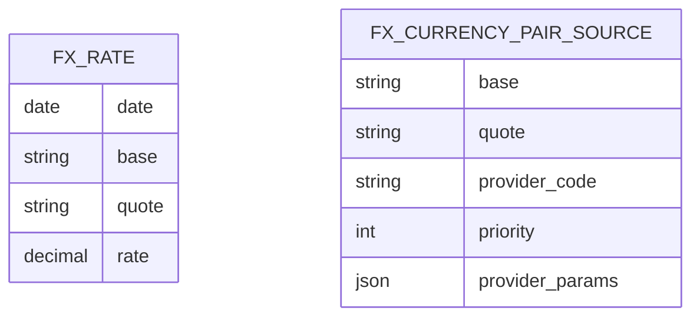

# 💱 FX Rates & Routes

Currency exchange rates and routing configuration. The FX subsystem stores daily rates and manages multi-provider data supply chains.

## 📐 ER Diagram



## 📋 Tables

### 💱 `FX_RATE`

Stores daily exchange rates. Each row represents the rate for a currency pair on a specific date.

- 🔤 **Alphabetical ordering**: Enforces `base < quote` (alphabetical) to prevent duplicate storage. For example, EUR/USD is always stored as `base=EUR, quote=USD` regardless of the query direction. The system automatically inverts the rate when needed.
- 🔒 **Uniqueness**: The composite key `(date, base, quote)` ensures no duplicate rates.

### 🔌 `FX_CURRENCY_PAIR_SOURCE`

Configures which data provider to use for each currency pair. Supports multi-provider fallback via priority ordering.

- 🏛️ **`provider_code`**: References a registered FX provider (ECB, FED, BOE, SNB, etc.)
- 🔢 **`priority`**: Lower number = higher priority. If priority-1 provider fails, the system tries priority-2.
- ⚙️ **`provider_params`** (JSON): Provider-specific configuration if needed.

The provider system uses the [Registry Pattern](../patterns/registry_pattern.md) for extensibility.

## 🔀 Data Supply Chains

For exotic currency pairs (e.g., RON/JPY), the system can construct multi-step conversion chains through intermediate currencies. For example:

```
RON → EUR (via ECB) → JPY (via ECB)
```

This is configured via [FX Configuration & Routing](../../backend/fx/configuration.md) and executed by the [FX Chain Algorithm](../../frontend/fx-chain-algorithm.md).

## 🔗 Related Documentation

- ⚙️ [FX Architecture](../../backend/fx/architecture.md) — Multi-provider FX system design
- 🔀 [FX Configuration & Routing](../../backend/fx/configuration.md) — Chain routing algorithm
- 🏛️ [FX Providers List](../../backend/fx/providers_list.md) — ECB, FED, BOE, SNB details
- 📖 [FX Rates (User Guide)](../../../user/fx/index.md) — How to manage currency pairs
