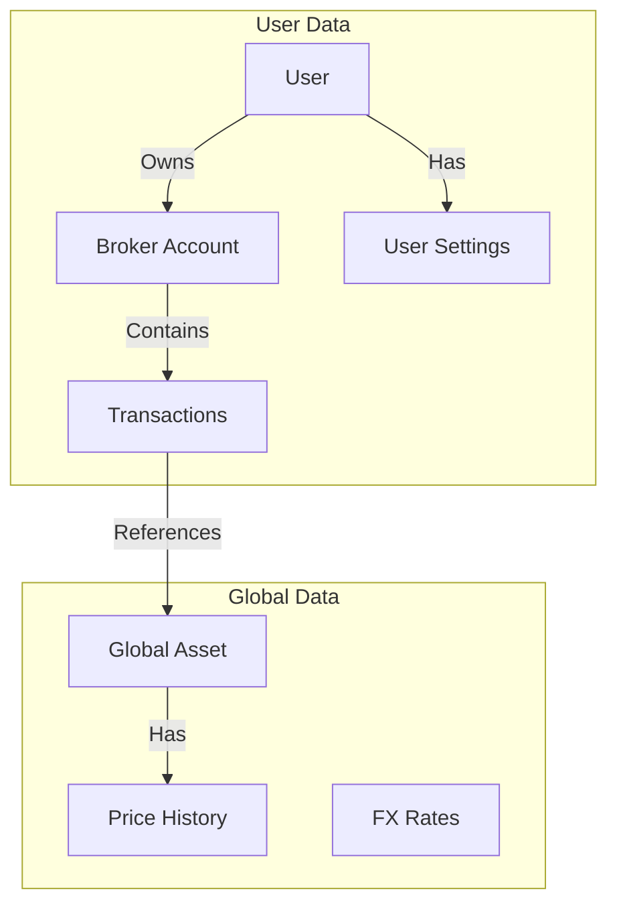

# 🗄️ Database Schema

The LibreFolio database is designed using SQLAlchemy with SQLModel. The schema is stored in a single SQLite file (`app.db`).

> 💡 **Tip**: To explore the live database schema interactively (including all constraints and indexes), we recommend using a tool like **DBeaver** or **DB Browser for SQLite**
> connected to your local `backend/data/sqlite/app.db` file.

## 🔄 Logical Data Flow

This diagram illustrates how data flows from the User down to the financial records.

## 📂 Subsystems

The database is organized into four logical subsystems. Each has its own detailed page:

- 👤 **[Users & Access](users_access.md)** — Authentication, user settings, and broker sharing (RBAC)
- 🏦 **[Brokers & Transactions](brokers_transactions.md)** — The core financial data structure
- 📊 **[Assets & Pricing](assets_pricing.md)** — Global financial instruments and provider assignments
- 💱 **[FX Rates & Routes](fx_rates.md)** — Currency exchange rates and routing configuration

## 🏛️ Design Philosophy

1. 📐 **Normalization**: Assets are global; Transactions are broker-specific.
2. ✅ **Strict Constraints**:
    - `CHECK` constraints ensure logical consistency.
    - Foreign Keys are enforced (`PRAGMA foreign_keys=ON`).
3. 📦 **JSON for Flexibility**: Used for `classification_params` and `provider_params` to allow schema-less extension.
