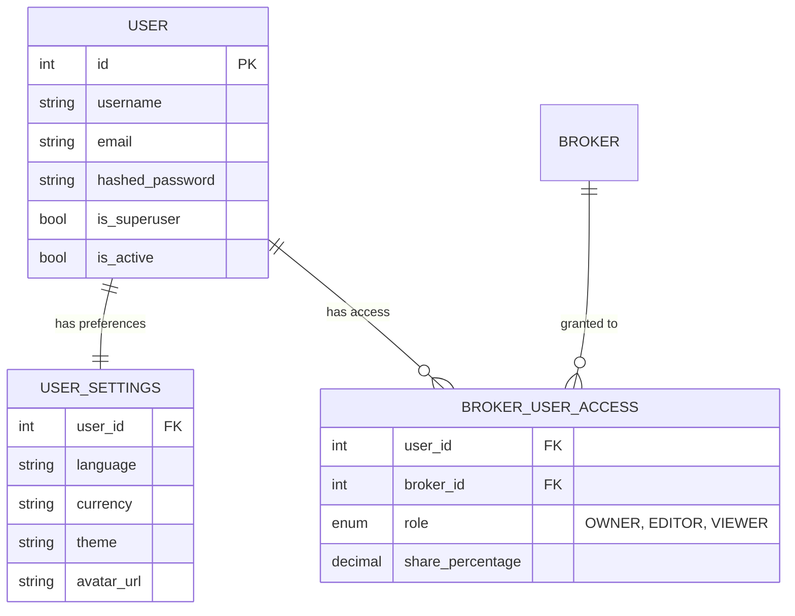

# 👤 Users & Access Control

Manages authentication, user preferences, and the sharing of brokers between users.

## 📐 ER Diagram

## 📋 Tables

### 👤 `USER`

The core identity table. Each user has a unique `username` and `email`. The `hashed_password` is stored using `bcrypt`. The first user created automatically becomes the superuser (`is_superuser = true`).

### ⚙️ `USER_SETTINGS`

One-to-one with `USER`. Stores user-specific preferences: display language, default currency, theme (light/dark), and avatar URL. When a setting is not defined here, the system falls back to the corresponding `GLOBAL_SETTING`.

### 🌍 `GLOBAL_SETTING`

System-wide configuration managed by the admin. Includes settings like `session_ttl_hours`, `max_upload_size_mb`, and default values for user preferences.

### 🔑 `BROKER_USER_ACCESS`

The pivot table for the Many-to-Many relationship between Users and Brokers. It stores:

- 🛡️ **`role`**: One of `OWNER`, `EDITOR`, or `VIEWER` — see [Access Control (RBAC)](../access_control.md) for the full permission matrix.
- 📊 **`share_percentage`**: The ownership percentage (0-100) used for aggregated portfolio calculations (e.g., joint accounts at 50%).

## 🔗 Related Documentation

- 👥 [Users & Roles (Architecture)](../users_and_brokers.md) — Authentication flow, session management, user roles
- 🔐 [Access Control (RBAC)](../access_control.md) — Permission matrix for Owner/Editor/Viewer
- ⚙️ [Settings System](../settings.md) — Global vs user settings, fallback logic
