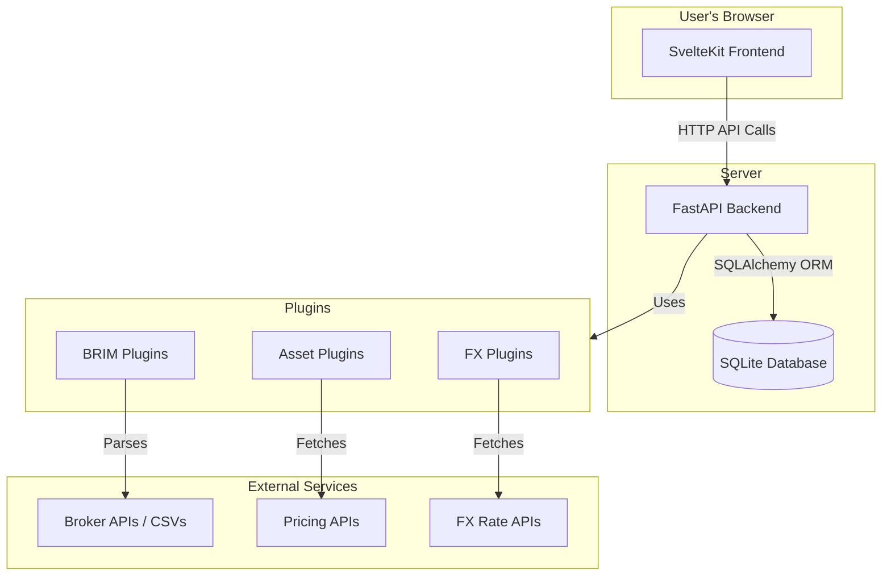

# 🏗️ System Architecture Overview

LibreFolio is designed as a modern web application with a clear separation between the backend API and the frontend user interface.

## 🗺️ High-Level Diagram

The architecture can be visualized as three main components:

### 🧱 Components

1. 🖥️ **Frontend (SvelteKit)**: A single-page application (SPA) that runs in the user's browser. It communicates with the backend via a RESTful API to fetch and display data.

2. ⚙️ **Backend (FastAPI)**: A Python-based API server that handles all business logic, including:
    - 🔐 User authentication and authorization.
    - 🗃️ Database operations (CRUD).
    - 📥 Data import from brokers (BRIM).
    - 📈 Fetching asset prices and FX rates from external sources.

3. 🗄️ **Database (SQLite)**: A single-file database that stores all user data, including transactions, assets, user settings, and cached data.

4. 🔌 **Provider Plugins**: A system of pluggable modules that abstract the interaction with external data sources. This makes it easy to add support for new brokers, pricing APIs, or FX rate providers without modifying the core application logic.

## 🔑 Key Subsystems

For detailed architectural documentation of specific subsystems, see:

- 🗃️ **[Database Schema](database/index.md)**: Data models and relationships.
- 👤 **[Users & Brokers](users_and_brokers.md)**: Authentication and multi-user access control.
- 🔐 **[Access Control (RBAC)](access_control.md)**: Role-based broker access (Owner/Editor/Viewer).
- ⚙️ **[Settings System](settings.md)**: User preferences and global settings.
- 📥 **[BRIM Architecture](../backend/brim/architecture.md)**: Broker Report Import Manager.
- 📈 **[Asset Pricing](../backend/assets/architecture.md)**: Asset data fetching and metadata.
- 💱 **[FX Architecture](../backend/fx/architecture.md)**: Foreign Exchange system.
    - 🔀 See also: **[FX Configuration & Routing](../backend/fx/configuration.md)** for multi-provider setup.
- 📁 **File Upload System**: Static file uploads with image preview cache (50MB, TTL 1h), avatar seeding, and BRIM file management. See `backend/app/services/static_uploads.py`.

## 🔄 Request Flow Example: Displaying Portfolio

1. User logs in and navigates to the dashboard.
2. The **Frontend** makes an API request to `GET /api/v1/portfolio`.
3. The **Backend** receives the request, authenticates the user, and queries the **Database** for the user's transactions.
4. For each asset, the backend may need to fetch the latest price. It calls the appropriate **Asset Provider Plugin** (e.g., Yahoo Finance).
5. If currency conversion is needed, the backend calls the **FX Provider Plugin** to get the latest exchange rate.
6. The backend processes the data, calculates portfolio metrics, and returns a JSON response to the frontend.
7. The **Frontend** receives the JSON data and renders the portfolio dashboard.

---

## 🧰 Tech Stack

### ⚙️ Backend

- 🚀 **[FastAPI](https://fastapi.tiangolo.com/)**: A high-performance web framework for building APIs with Python 3.11+, based on standard Python type hints. It provides automatic interactive documentation (Swagger UI and ReDoc).
- 🗃️ **[SQLAlchemy](https://www.sqlalchemy.org/)**: The SQL toolkit and Object-Relational Mapper (ORM) used for all database interactions. LibreFolio uses SQLAlchemy's **asyncio support** for non-blocking database queries.
- 📋 **[Pydantic](https://docs.pydantic.dev/)**: A data validation and settings management library. Used extensively for defining data schemas, validating API requests, and managing application settings.
- 🔄 **[Alembic](https://alembic.sqlalchemy.org/)**: A lightweight database migration tool for SQLAlchemy. See [Database Migrations](patterns/alembic.md).
- 🗄️ **[SQLite](https://www.sqlite.org/)**: The default database engine. Simple, serverless, and perfect for a self-hosted application. Configured in WAL (Write-Ahead Logging) mode for better concurrency.

### 🎨 Frontend

- 🖥️ **[SvelteKit](https://kit.svelte.dev/)**: A web application framework for building fast, modern user interfaces with server-side rendering, routing, and great developer experience.
- 📝 **[TypeScript](https://www.typescriptlang.org/)**: A statically typed superset of JavaScript that adds type safety to the frontend codebase.
- 🎨 **[TailwindCSS](https://tailwindcss.com/)**: A utility-first CSS framework for rapidly building custom designs.
- ⚡ **[Vite](https://vitejs.dev/)**: The build tool and development server. Provides extremely fast Hot Module Replacement (HMR).

### 🧪 Testing

- 🐍 **[Pytest](https://docs.pytest.org/)**: The framework used for writing and running backend tests.
- 🎭 **[Playwright](https://playwright.dev/)**: A framework for end-to-end testing of the web application.
- 📊 **[Coverage.py](https://coverage.readthedocs.io/)**: A tool for measuring code coverage of Python programs.
