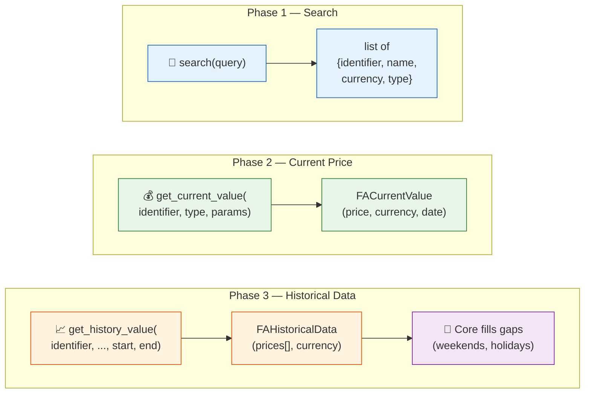

# 📈 Asset Plugin Guide

How to create a new **Asset Source Provider** to fetch prices from a new data source.

**Base class**: `AssetSourceProvider` (in `backend/app/services/asset_source.py`)
**Plugin folder**: `backend/app/services/asset_source_providers/`
**Registry**: `AssetProviderRegistry`

---

## 🤖 Tip: Let an LLM scaffold the provider

Paste this entire page into an LLM with the data source's API documentation and use this prompt:

!!! tip "Suggested prompt"

    ```
    Here is the LibreFolio Asset Source Provider specification: [paste this page]

    I want to add a provider for [DATA_SOURCE_NAME]. Their API works like this:
    [brief description, or paste their API docs]

    Write a complete Python AssetSourceProvider implementation. Follow all conventions:
    @register_provider, FACurrentValue, FAHistoricalData, FAPricePoint, asyncio.to_thread
    for sync HTTP calls, test_cases, test_search_query if applicable.
    ```

    After scaffolding, implement `get_current_value()` and `get_history_value()`, add test
    cases, then place the file in `asset_source_providers/` and restart.

---

## 🔄 Flow

The system calls provider methods in three distinct phases:



**Phase 1** is optional but **strongly recommended** — enables users to discover and link assets without knowing the exact identifier. See [Asset Search](#asset-search) below.

**Phase 2** fetches the latest price for the dashboard or manual refresh.

**Phase 3** fetches historical OHLCV data. The plugin returns only actual trading days — core fills gaps (weekends, holidays) with last known value.

**Plugin responsibility**: Fetch raw price data from external source. Return only actual data points (trading days).
**Core responsibility**: Gap filling (weekends/holidays → `backward_filled=True`), caching, database storage, currency conversion.

---

## 📋 ABC Methods

### ✅ Required (Abstract)

| Method | Signature | Description |
|--------|-----------|-------------|
| `provider_code` | `@property → str` | Unique identifier (e.g., `"yfinance"`) |
| `provider_name` | `@property → str` | Display name (e.g., `"Yahoo Finance"`) |
| `test_cases` | `@property → list[dict]` | Test cases for automated testing (`identifier`, `identifier_type`, `provider_params`) |
| `test_search_query` | `@property → str \| None` | Search query for automated tests. `None` if search not supported. |
| `get_current_value(identifier, type, params)` | `async → FACurrentValue` | Fetch latest price. Returns `value`, `currency`, `as_of_date`, `source`. |
| `get_history_value(identifier, type, params, start, end)` | `async → FAHistoricalData` | Fetch historical OHLCV data for date range. Return raw data only — no gap filling. |
| `validate_params(params)` | `→ None` | Validate provider-specific `provider_params`. Raise `AssetSourceError` if invalid. Use `pass` if no params needed. |

### 💪 Strongly Recommended (Override)

!!! tip "Implementing `search()` is strongly recommended"

    Without search, users must know the exact asset identifier (ticker, ISIN, URL) upfront. With search, they can type a name like "Apple" and pick from results.

| Method | Default | Description |
|--------|---------|-------------|
| `search(query)` | Raises `NOT_SUPPORTED` | Search for assets by name, ticker, or ISIN. Returns `[{identifier, identifier_type, display_name, currency, type}]`. |

### 🔧 Optional (Override)

| Method | Default | Description |
|--------|---------|-------------|
| `get_icon` | `None` | Provider icon URL for the UI |
| `supports_history` | `True` | Set `False` for providers that only support current prices (e.g., web scrapers) |
| `params_schema` | `[]` | List of field definitions for `provider_params`. Used by frontend to generate dynamic forms. |
| `get_asset_url(identifier, type, params)` | `None` | Generate URL to the provider's page for this asset (e.g., Yahoo Finance quote page) |
| `accepted_identifier_types` | `[TICKER, ISIN]` | Input types accepted by this provider (shown in frontend dropdown) |
| `fetch_asset_metadata(identifier, type, params)` | `None` | Fetch asset metadata (type, sector, identifiers) from the provider |
| `provider_help_url` | `None` | URL to the provider's documentation page (served by the running instance) |
| `shutdown()` | no-op | Called at app teardown to clean up resources (close sessions, stop threads). Override if your provider holds persistent connections. |
| `generate_static_url(path)` | — | Helper to build `/api/v1/uploads/plugin/asset/{path}` |

---

## 🔎 Asset Search

The `search(query)` method allows users to **discover assets** by name, ticker, or ISIN across all providers simultaneously.

### ⚙️ How It Works

1. User types a query in the UI (e.g., "Apple", "MSCI World", "IE00B4L5Y983")
2. Frontend calls `GET /api/v1/assets/provider/search?q=Apple`
3. Backend queries **all providers in parallel** via `AssetSearchService.search()` (`asyncio.gather`)
4. Providers that don't implement search (default raises `NOT_SUPPORTED`) are silently skipped
5. Results are aggregated and returned to the user

### 🔌 Provider Support

| Provider | `search()` | `test_search_query` | `get_asset_url` | Notes |
|----------|-----------|---------------------|:---:|-------|
| **Yahoo Finance** | ✅ | `"Apple"` | ✅ | Full ticker search with caching (10 min TTL) |
| **JustETF** | ✅ | `"iShares Core S&P 500"` | ✅ | ISIN-based search across cached ETF list |
| **CSS Scraper** | ❌ | `None` | ✅ | No search — URL must be provided manually |
| **Scheduled Investment** | ❌ | `None` | — | Synthetic provider, no external search |
| **Borsa Italiana** | ✅ | `"ENEL"` | ✅ | Full search on borsaitaliana.it (stocks, bonds, ETFs) |

!!! info "`supports_search` detection"

    The `list_providers` endpoint checks `instance.test_search_query is not None` (a local property) to determine search support. This avoids cold-start HTTP calls.

### 🌐 API Endpoints

**Standard search** (returns all results at once):

```
GET /api/v1/assets/provider/search?q=Apple&providers=yfinance,justetf
```

**Streaming search** (Server-Sent Events — results arrive as providers respond):

```
GET /api/v1/assets/provider/search/stream?q=Apple&providers=yfinance,justetf
```

**Query parameters** (both endpoints):

- `q` (required): Search query, min 1 character
- `providers` (optional): Comma-separated provider codes. Default: all providers with search support.

**Response** (standard):

```json
{
  "query": "Apple",
  "total_results": 5,
  "results": [
    {
      "identifier": "AAPL",
      "display_name": "Apple Inc.",
      "provider_code": "yfinance",
      "currency": "USD",
      "asset_type": "stock",
      "provider_url": "https://finance.yahoo.com/quote/AAPL"
    }
  ],
  "providers_queried": ["yfinance", "justetf"],
  "providers_with_errors": []
}
```

- Searches are executed **in parallel** — one slow provider won't block others
- Provider-specific errors are logged but don't fail the entire request
- Errors are reported in `providers_with_errors` for debugging
- `provider_url` is generated by the provider's `get_asset_url()` method (if implemented)

### 🧪 Probe Endpoint

After a provider is configured, use the **probe** endpoint to dry-run test it:

```
POST /api/v1/assets/provider/probe
```

This runs selectable operations (`current_price`, `history`, `metadata`) without persisting anything. See [Asset Architecture](../../backend/assets/architecture.md#provider-probe) for details.

---

## 💻 Implementation Example

```python
# backend/app/services/asset_source_providers/my_provider.py

from datetime import date
from decimal import Decimal
from backend.app.db import IdentifierType
from backend.app.db.models import ProviderInputType
from backend.app.services.asset_source import AssetSourceProvider, AssetSourceError
from backend.app.services.provider_registry import register_provider, AssetProviderRegistry
from backend.app.schemas.assets import FACurrentValue, FAHistoricalData, FAPricePoint

@register_provider(AssetProviderRegistry)
class MyProvider(AssetSourceProvider):

    @property
    def provider_code(self) -> str:
        return "my_provider"

    @property
    def provider_name(self) -> str:
        return "My Data Provider"

    @property
    def test_cases(self) -> list[dict]:
        return [
            {"identifier": "AAPL", "identifier_type": IdentifierType.TICKER, "provider_params": None}
        ]

    @property
    def test_search_query(self) -> str | None:
        return "Apple"  # Return None if search not supported

    @property
    def params_schema(self) -> list[dict]:
        """Optional: define fields for frontend dynamic form."""
        return [
            {"key": "api_key", "type": "string", "required": True, "description": "API key for authentication"},
        ]

    def get_asset_url(self, identifier, identifier_type, provider_params=None) -> str | None:
        """Optional: URL to the provider's page for this asset."""
        return f"https://myprovider.com/asset/{identifier}"

    async def get_current_value(
        self, identifier: str, identifier_type: IdentifierType, provider_params: dict
    ) -> FACurrentValue:
        # Fetch latest price from your API
        price = await self._fetch_price(identifier)
        return FACurrentValue(
            value=Decimal(str(price)),
            currency="USD",
            as_of_date=date.today(),
            source=self.provider_name,
        )

    async def get_history_value(
        self, identifier: str, identifier_type: IdentifierType,
        provider_params: dict | None, start_date: date, end_date: date
    ) -> FAHistoricalData:
        # Fetch historical data — return ONLY actual trading days
        raw_data = await self._fetch_history(identifier, start_date, end_date)
        prices = [
            FAPricePoint(date=d, close=Decimal(str(p)), open=None, high=None, low=None, volume=None, currency="USD")
            for d, p in raw_data
        ]
        return FAHistoricalData(prices=prices, currency="USD", source=self.provider_name)

    def validate_params(self, params: dict | None) -> None:
        # No params required — accept anything
        pass
```

---

## 🔗 Related Documentation

- 🏗️ [Asset Architecture](../../backend/assets/architecture.md) — Provider interface, caching, refresh logic
- 🔌 [Asset Providers](../../backend/assets/system_providers.md) — All providers (Yahoo Finance, JustETF, CSS Scraper, Scheduled Investment)
- 📦 [Providers Overview](../../backend/assets/system_providers.md) — Summary table of all providers
- 🔄 [Registry Pattern Overview](registry_pattern.md) — How the plugin system works

