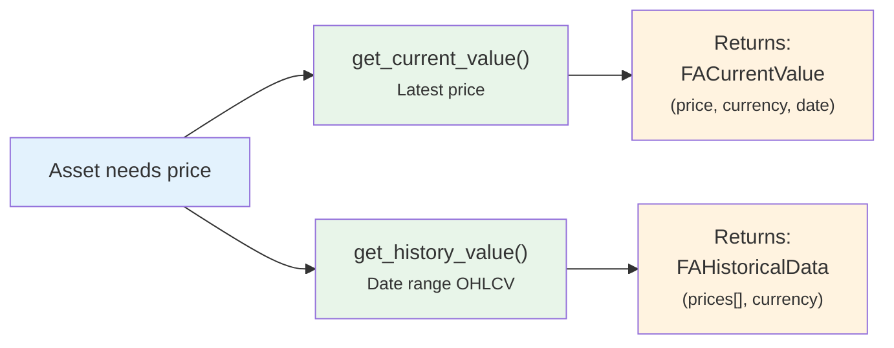

# 📈 Asset Plugin Guide

How to create a new **Asset Source Provider** to fetch prices from a new data source.

**Base class**: `AssetSourceProvider` (in `backend/app/services/asset_source.py`)
**Plugin folder**: `backend/app/services/asset_source_providers/`
**Registry**: `AssetProviderRegistry`

---

## Flow



**Plugin responsibility**: Fetch raw price data from external source. Return only actual data points (trading days).
**Core responsibility**: Gap filling (weekends/holidays → `backward_filled=True`), caching, database storage, currency conversion.

---

## ABC Methods

### Required (Abstract)

| Method | Signature | Description |
|--------|-----------|-------------|
| `provider_code` | `@property → str` | Unique identifier (e.g., `"yfinance"`) |
| `provider_name` | `@property → str` | Display name (e.g., `"Yahoo Finance"`) |
| `test_cases` | `@property → list[dict]` | Test cases for automated testing (`identifier`, `identifier_type`, `provider_params`) |
| `get_current_value(identifier, type, params)` | `async → FACurrentValue` | Fetch latest price. Returns `value`, `currency`, `as_of_date`, `source`. |
| `get_history_value(identifier, type, params, start, end)` | `async → FAHistoricalData` | Fetch historical OHLCV data for date range. Return raw data only — no gap filling. |

### Optional (Override)

| Method | Default | Description |
|--------|---------|-------------|
| `get_icon` | `None` | Provider icon URL for the UI |
| `supports_history` | `True` | Set `False` for providers that only support current prices (e.g., web scrapers) |
| `validate_params(params)` | — | Validate provider-specific configuration (raise on invalid) |
| `generate_static_url(path)` | — | Helper to build `/api/v1/uploads/plugin/asset/{path}` |

---

## Implementation Example

```python
# backend/app/services/asset_source_providers/my_provider.py

from datetime import date
from decimal import Decimal
from backend.app.services.asset_source import AssetSourceProvider, IdentifierType
from backend.app.services.provider_registry import register_provider, AssetProviderRegistry
from backend.app.schemas.assets import FACurrentValue, FAHistoricalData, FAPricePoint

@register_provider(AssetProviderRegistry)
class MyProvider(AssetSourceProvider):

    @property
    def provider_code(self) -> str:
        return "my_provider"

    @property
    def provider_name(self) -> str:
        return "My Data Provider"

    @property
    def test_cases(self) -> list[dict]:
        return [
            {"identifier": "AAPL", "identifier_type": IdentifierType.TICKER, "provider_params": None}
        ]

    async def get_current_value(
        self, identifier: str, identifier_type: IdentifierType, provider_params: dict
    ) -> FACurrentValue:
        # Fetch latest price from your API
        price = await self._fetch_price(identifier)
        return FACurrentValue(
            value=Decimal(str(price)),
            currency="USD",
            as_of_date=date.today(),
            source=self.provider_name,
        )

    async def get_history_value(
        self, identifier: str, identifier_type: IdentifierType,
        provider_params: dict | None, start_date: date, end_date: date
    ) -> FAHistoricalData:
        # Fetch historical data — return ONLY actual trading days
        raw_data = await self._fetch_history(identifier, start_date, end_date)
        prices = [
            FAPricePoint(date=d, close=Decimal(str(p)), open=None, high=None, low=None, volume=None)
            for d, p in raw_data
        ]
        return FAHistoricalData(prices=prices, currency="USD", source=self.provider_name)
```

---

## Related Documentation

- [Asset Architecture](../../backend/assets/architecture.md) — Provider interface, caching, refresh logic
- [System Providers](../../backend/assets/system_providers.md) — Built-in providers (Scheduled Investment, Manual)
- [Providers List](../../backend/assets/providers_list.md) — All available providers
- [Registry Pattern Overview](registry_pattern.md) — How the plugin system works

