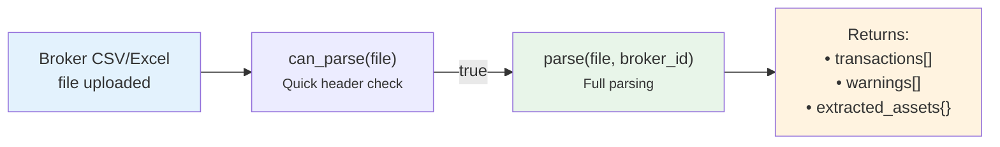

# 📦 BRIM Plugin Guide

How to create a new **Broker Report Import Manager** plugin to support a new broker's CSV/Excel export format.

**Base class**: `BRIMProvider` (in `backend/app/services/brim_provider.py`)
**Plugin folder**: `backend/app/services/brim_providers/`
**Registry**: `BRIMProviderRegistry`

---

## Flow



**Plugin responsibility**: Read the broker-specific file format and convert to standard `TXCreateItem` DTOs.
**Core responsibility**: File storage, asset matching, duplicate detection, database persistence.

---

## ABC Methods

### Required (Abstract)

| Method | Signature | Description |
|--------|-----------|-------------|
| `provider_code` | `@property → str` | Unique identifier (e.g., `"directa_csv"`) |
| `provider_name` | `@property → str` | Display name (e.g., `"Directa CSV"`) |
| `description` | `@property → str` | Brief description for the UI |
| `can_parse(file_path)` | `→ bool` | Quick check if this plugin can parse the file (check extension, header row) |
| `parse(file_path, broker_id)` | `→ Tuple[List[TXCreateItem], List[str], Dict[int, BRIMExtractedAssetInfo]]` | Full parsing — returns transactions, warnings, and extracted asset info |

### Optional (Override)

| Method | Default | Description |
|--------|---------|-------------|
| `supported_extensions` | `['.csv']` | Accepted file extensions |
| `detection_priority` | `100` | Auto-detection priority (higher = checked first). Use 0-49 for generic plugins. |
| `icon_url` | `None` | Plugin icon URL for the UI |
| `generate_static_url(path)` | — | Helper to build `/api/v1/uploads/plugin/brim/{path}` |

---

## Implementation Example

```python
# backend/app/services/brim_providers/my_broker.py

from pathlib import Path
from typing import List, Tuple, Dict
from backend.app.services.brim_provider import BRIMProvider, BRIMExtractedAssetInfo
from backend.app.services.provider_registry import register_provider, BRIMProviderRegistry
from backend.app.schemas.transactions import TXCreateItem

@register_provider(BRIMProviderRegistry)
class MyBrokerProvider(BRIMProvider):

    @property
    def provider_code(self) -> str:
        return "my_broker_csv"

    @property
    def provider_name(self) -> str:
        return "My Broker (CSV)"

    @property
    def description(self) -> str:
        return "Import transactions from My Broker CSV exports"

    def can_parse(self, file_path: Path) -> bool:
        """Quick check: read first lines and look for known header."""
        content = self._read_file_head(file_path, num_lines=5)
        return "Date;Operation;ISIN;Amount" in content

    def parse(
        self, file_path: Path, broker_id: int
    ) -> Tuple[List[TXCreateItem], List[str], Dict[int, BRIMExtractedAssetInfo]]:
        """Parse the CSV and return transactions."""
        transactions = []
        warnings = []
        extracted_assets = {}

        # ... your parsing logic ...

        return transactions, warnings, extracted_assets
```

### Auto-Discovery

Place the file in `brim_providers/` and restart the app. The `BRIMProviderRegistry` will automatically discover and register it. The plugin will appear in the [ImportPluginSelect](../../frontend/components/select.md#importpluginselect) dropdown.

---

## Related Documentation

- [BRIM Architecture](../../backend/brim/architecture.md) — Full pipeline design
- [Generic CSV Provider](../../backend/brim/generic_csv.md) — User-configurable CSV mapper (reference implementation)
- [Providers List](../../backend/brim/providers_list.md) — All supported brokers
- [Registry Pattern Overview](registry_pattern.md) — How the plugin system works

