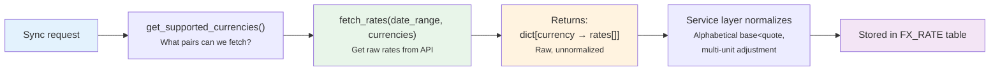

# 💱 FX Plugin Guide

How to create a new **FX Rate Provider** to fetch exchange rates from a new central bank or data source.

**Base class**: `FXRateProvider` (in `backend/app/services/fx.py`)
**Plugin folder**: `backend/app/services/fx_providers/`
**Registry**: `FXProviderRegistry`

---

## Flow



**Plugin responsibility**: Fetch raw rates from the provider's API. Apply multi-unit adjustment (e.g., JPY ÷ 100). Return data in the provider's native format (no inversion, no alphabetical ordering).
**Core responsibility**: Normalize for storage (alphabetical `base < quote`), skip duplicates, handle fallback chains.

---

## ABC Methods

### Required (Abstract)

| Method | Signature | Description |
|--------|-----------|-------------|
| `code` | `@property → str` | Provider code (e.g., `"ECB"`, `"FED"`) |
| `name` | `@property → str` | Display name (e.g., `"European Central Bank"`) |
| `base_currency` | `@property → str` | Primary base currency (e.g., `"EUR"` for ECB) |
| `get_supported_currencies()` | `async → list[str]` | List of available quote currencies (can be static or dynamic) |
| `fetch_rates(date_range, currencies, base_currency)` | `async → dict[str, list[tuple]]` | Fetch rates for date range. Returns `{currency: [(date, base, quote, rate), ...]}` |

### Optional (Override)

| Method | Default | Description |
|--------|---------|-------------|
| `icon` | `None` | Provider icon URL |
| `base_currencies` | `[base_currency]` | List of supported bases (single-base for now) |
| `description` | Auto-generated | Provider description |
| `description_i18n` | `{"en": description}` | Multilingual descriptions |
| `warning_i18n` | `{}` | Data-quality warnings shown in UI (⚠️ triangle on routes) |
| `docs_url` | Generic providers list | URL to documentation page |
| `test_currencies` | `["USD","EUR","GBP","JPY","CHF"]` | Currencies that must be available for tests |
| `multi_unit_currencies` | `set()` | Currencies quoted per 100 units (e.g., JPY, SEK). Plugin must normalize ÷100. |
| `generate_static_url(path)` | — | Helper to build `/api/v1/uploads/plugin/fx/{path}` |

---

## Implementation Example

```python
# backend/app/services/fx_providers/my_central_bank.py

from datetime import date
from decimal import Decimal
from backend.app.services.fx import FXRateProvider
from backend.app.services.provider_registry import register_provider, FXProviderRegistry

@register_provider(FXProviderRegistry)
class MyCentralBankProvider(FXRateProvider):

    @property
    def code(self) -> str:
        return "MCB"

    @property
    def name(self) -> str:
        return "My Central Bank"

    @property
    def base_currency(self) -> str:
        return "MYC"  # This bank quotes all rates as 1 MYC = X foreign

    @property
    def icon(self) -> str:
        return self.generate_static_url("mcb/logo.svg")

    @property
    def multi_unit_currencies(self) -> set[str]:
        return {"JPY"}  # JPY quoted per 100 units by this bank

    async def get_supported_currencies(self) -> list[str]:
        # Return list of currencies this provider can fetch
        return ["USD", "EUR", "GBP", "JPY", "CHF"]

    async def fetch_rates(
        self,
        date_range: tuple[date, date],
        currencies: list[str],
        base_currency: str | None = None,
    ) -> dict[str, list[tuple[date, str, str, Decimal]]]:
        # Fetch from your API
        start, end = date_range
        result = {}
        for cur in currencies:
            raw_data = await self._call_api(cur, start, end)
            rates = []
            for row in raw_data:
                rate = Decimal(str(row["rate"]))
                # Multi-unit adjustment (plugin responsibility)
                if cur in self.multi_unit_currencies:
                    rate = rate / 100
                rates.append((row["date"], self.base_currency, cur, rate))
            result[cur] = rates
        return result
```

### Static Assets (Icons)

Place provider icons in `backend/app/services/fx_providers/static/mcb/`:

```
fx_providers/
├── static/
│   └── mcb/
│       └── logo.svg    ← served at /api/v1/uploads/plugin/fx/mcb/logo.svg
└── my_central_bank.py
```

---

## Related Documentation

- [FX Architecture](../../backend/fx/architecture.md) — Multi-provider design, sync process
- [FX Configuration & Routing](../../backend/fx/configuration.md) — Chain routing algorithm, fallback
- [FX Providers List](../../backend/fx/providers_list.md) — ECB, FED, BOE, SNB details
- [Registry Pattern Overview](registry_pattern.md) — How the plugin system works

