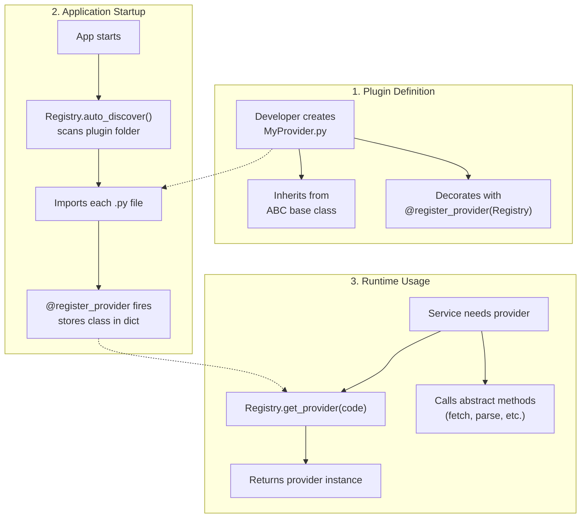

# 🧩 Registry Pattern and Plugin System

LibreFolio uses a **Registry Pattern** to create a flexible and extensible plugin system. This allows new functionality—such as support for new brokers, asset pricing sources, or FX providers—to be added without modifying the core application code.

## ⚙️ How it Works

The system is based on three key components:

1. **Abstract Base Class (ABC)**: A template class that defines the interface a plugin must implement (e.g., `AssetSourceProvider`, `BRIMProvider`, `FXRateProvider`).
2. **Provider Registry**: A central class that discovers and stores all available plugins (e.g., `AssetProviderRegistry`).
3. **`@register_provider` Decorator**: A simple decorator that automatically registers a plugin with its corresponding registry.

### 🗺️ High-Level Flow



### 🔍 Discovery Process

1. **Scan**: On first access, `auto_discover()` scans the designated plugin folder (e.g., `backend/app/services/fx_providers/`).
2. **Import**: Each `.py` file (except `__init__.py`) is loaded with `importlib`.
3. **Register**: The `@register_provider` decorator fires on import, calling `Registry.register(class)` which reads `provider_code` and stores the class in `_providers[code] = class`.
4. **Lazy**: Discovery happens once, on first `get_provider()` call. Subsequent calls use the cached dictionary.

## 🧱 Core Components

### 📋 `AbstractProviderRegistry`

The base class for all registries. Provides:

| Method | Description |
|--------|-------------|
| `register(cls, provider_class)` | Store a provider class, keyed by its `provider_code` |
| `get_provider(cls, code)` | Get provider class by code (triggers auto-discovery if needed) |
| `get_provider_instance(cls, code)` | Returns an **instantiated** provider object |
| `list_providers(cls)` | List all registered providers with `code` and `name` |
| `auto_discover(cls)` | Scan plugin folder and import all modules |
| `shutdown_all_providers(cls)` | Call `shutdown()` on every registered provider instance (graceful teardown) |

### 🛑 Provider Lifecycle — Shutdown

Each ABC base class (`AssetSourceProvider`, `FXRateProvider`, `BRIMProvider`) declares a no-op `shutdown()` method. Providers that hold persistent resources (e.g., background threads, WebSocket connections) override it to release them.

At application shutdown, `main.py`'s lifespan calls:

```python
AssetProviderRegistry.shutdown_all_providers()
FXProviderRegistry.shutdown_all_providers()
BRIMProviderRegistry.shutdown_all_providers()
```

`shutdown_all_providers()` iterates every registered provider, instantiates it (via `get_provider_instance`), and calls `shutdown()`. No `hasattr` check is needed because the method is defined in the ABC.

**Example**: The JustETF provider overrides `shutdown()` to stop its live-quote WebSocket daemon threads via `shutdown_live_feeds()`.

### 🏷️ Registry Specializations

| Registry | Plugin Folder | Base Class | Purpose |
|----------|--------------|------------|---------|
| `BRIMProviderRegistry` | `brim_providers/` | `BRIMProvider` | Parse broker CSV/Excel files |
| `AssetProviderRegistry` | `asset_source_providers/` | `AssetSourceProvider` | Fetch asset prices |
| `FXProviderRegistry` | `fx_providers/` | `FXRateProvider` | Fetch exchange rates |

### 🎯 `@register_provider` Decorator

```python
@register_provider(AssetProviderRegistry)
class MyProvider(AssetSourceProvider):
    ...
```

The decorator is a factory that calls `registry_class.register(provider_class)` at import time.

---

## 📖 Plugin Development Guides

Each subsystem has its own detailed guide with ABC method tables, flow diagrams, and implementation examples:

| Subsystem | Guide | Base Class | What It Does |
|-----------|-------|------------|-------------|
| **BRIM** | [BRIM Plugin Guide](brim_plugin_guide.md) | `BRIMProvider` | Parse broker export files (CSV, Excel) into transactions |
| **Assets** | [Asset Plugin Guide](asset_plugin_guide.md) | `AssetSourceProvider` | Fetch current and historical asset prices |
| **FX** | [FX Plugin Guide](fx_plugin_guide.md) | `FXRateProvider` | Fetch exchange rates from central banks |

---

## 📚 Subsystem Documentation

Each plugin subsystem also has architecture docs, provider lists, and configuration pages:

### 📥 BRIM (Broker Report Import Manager)

- [Architecture](../../backend/brim/architecture.md) — Pipeline design, parsing flow
- [Generic CSV Provider](../../backend/brim/generic_csv.md) — User-configurable CSV mapper
- [Providers List](../../backend/brim/providers_list.md) — All supported brokers (Directa, Degiro, IBKR, etc.)

### 📈 Assets (Pricing & Metadata)

- [Architecture](../../backend/assets/architecture.md) — Provider interface, caching, refresh logic
- [System Providers](../../backend/assets/system_providers.md) — Built-in providers (Scheduled Investment, Manual)
- [Providers List](../../backend/assets/system_providers.md) — All available providers (Yahoo Finance, etc.)

### 💱 FX (Foreign Exchange)

- [Architecture](../../backend/fx/architecture.md) — Multi-provider design, sync process
- [Configuration & Routing](../../backend/fx/configuration.md) — Chain routing algorithm, priority fallback
- [Providers](../../backend/fx/providers/index.md) — ECB, FED, BOE, SNB technical details

