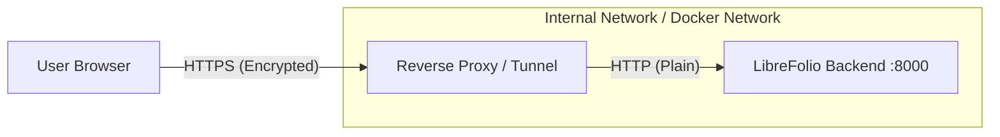

# 🔒 Security Architecture

This document outlines the security model, authentication system, and deployment recommendations for LibreFolio.

## 🎯 Threat Model and Scope

LibreFolio is a **self-hosted** application. The primary security assumption is that the **host system is secure**.

### ✅ In Scope

- **🔐 Authentication**: Stateless JWT-based authentication via HTTP-only session cookies with configurable expiration.
- **🛡️ Data Segregation**: Strict isolation between users via Role-Based Access Control (RBAC).
- **✏️ Input Validation**: Preventing injection attacks via strict Pydantic schemas.
- **📁 File Upload Security**: MIME type validation, executable blocking, size limits.
- **🚫 Endpoint Protection**: **All** data and file endpoints require a valid session cookie — including uploaded files and plugin assets.

### ⚠️ Out of Scope

- **💻 Host System Compromise**: If an attacker gains shell access to the server, the database file is accessible. Encryption at rest is currently not implemented.
- **🔗 SSL/TLS Termination**: The application server (Uvicorn) speaks HTTP. HTTPS is the responsibility of the deployment environment (Reverse Proxy).

## 🔑 Authentication — JWT Cookies

LibreFolio uses **stateless JWT (JSON Web Token)** authentication stored in **HTTP-only session cookies**.

### 🔄 How Login Works

1. User sends credentials to `POST /api/v1/auth/login`
2. Server validates credentials and sets an **HTTP-only cookie** containing the JWT
3. The browser **automatically includes** this cookie on all subsequent requests
4. `` tags, `fetch()` calls, and page navigations all send the cookie seamlessly

!!! success "Why cookies over Bearer headers?"

    HTTP-only cookies are **automatically sent** by the browser for all same-origin requests — including ``, `<link href>`, and AJAX calls. This means uploaded files and plugin assets are served securely without any special frontend handling.

### 🗝️ JWT Secret

The JWT signing key (`JWT_SECRET`) is:

- **🛠️ Development/`dev.py`**: Generated randomly at server start and passed to all Uvicorn workers via environment variable. This means all tokens are invalidated on server restart.
- **🐳 Production/Docker**: Can be set as a fixed environment variable (`JWT_SECRET=your-secret-here`) for persistence across restarts.

!!! warning "⚙️ Multi-worker support"

    On macOS, Uvicorn uses `spawn` (not `fork`) for worker processes. Each worker re-imports all modules, so the JWT secret **must** be shared via environment variable. `dev.py` handles this automatically by generating the secret before launching Uvicorn.

### ⏰ Token Expiration

- Configurable via [Global Settings](../../admin/settings.md): `session_ttl_hours` (default: 24 hours)
- After expiration, the user must log in again
- There is no token refresh mechanism — a new login is required

### 🚪 Logout

- Frontend calls `POST /auth/logout` which clears the session cookie
- **No server-side blacklist** — the token remains technically valid until expiration
- This is acceptable for a self-hosted application with short TTL

### 💻 Using curl

```bash
# Login and save cookie
curl -s -c cookies.txt -X POST http://localhost:8000/api/v1/auth/login \
  -H "Content-Type: application/json" \
  -d '{"username": "admin", "password": "yourpassword"}'

# Use cookie for authenticated requests
curl -b cookies.txt http://localhost:8000/api/v1/auth/me

# List brokers
curl -b cookies.txt http://localhost:8000/api/v1/brokers

# Sync FX rates
curl -b cookies.txt -X POST \
  -H "Content-Type: application/json" \
  http://localhost:8000/api/v1/fx/currencies/sync
```

## 🛡️ Endpoint Protection

All endpoints that access or modify user data require a valid session cookie (`Depends(get_current_user)` in FastAPI).

### 🌐 Public Endpoints (no auth required)

| Endpoint | Method | Purpose |
|----------|--------|---------|
| `/auth/login` | POST | User login |
| `/auth/logout` | POST | Clear session cookie |
| `/auth/register` | POST | New user registration |
| `/system/health` | GET | Health check |
| `/system/info` | GET | System information |
| `/utilities/*` | GET | Reference data (countries, currencies, sectors) |

### 🔒 Private Endpoints (auth required)

All other endpoints — including Auth (profile, password), Settings, Brokers, BRIM (files and plugins), Transactions, **Uploads** (CRUD + file serving + plugin assets), FX, Assets, Backup, and Users — require a valid session cookie.

!!! info "📁 Files are protected too"

    Uploaded files (`/uploads/file/{id}`) and plugin assets (`/uploads/plugin/{type}/{path}`) **require authentication**. Since auth uses HTTP-only cookies, the browser includes the session automatically for `` tags — no special handling needed.

For a complete endpoint reference, see the [API Overview](../api/overview.md).

## 🌐 HTTPS & Deployment Architecture

**LibreFolio does not handle HTTPS directly.**

In a modern containerized environment, SSL/TLS termination is the responsibility of a **Reverse Proxy** or a **Tunneling Service**.

### 🔀 The "Termination Proxy" Pattern



1. **The Client** connects securely to the Proxy (e.g., Nginx, Caddy, Traefik, Tailscale).
2. **The Proxy** handles the certificate handshake (Let's Encrypt) and decryption.
3. **The Proxy** forwards the request to LibreFolio over a private, internal network (Docker bridge).
4. **LibreFolio** processes the request and assumes the connection is secure.

### ❓ Why this approach?

- **📜 Certificate Management**: Proxies like Caddy or Traefik handle automatic certificate renewal.
- **⚡ Performance**: Offloads encryption overhead from the application.
- **🧹 Simplicity**: Python code doesn't need to know about certificates or keys.

### ⚙️ Configuration

To ensure the application behaves correctly behind a proxy (e.g., generating correct redirect URLs), you must ensure the proxy sets the standard headers:

- `X-Forwarded-For`
- `X-Forwarded-Proto` (should be `https`)

## 🐛 Reporting a Vulnerability

If you discover a security vulnerability, please report it by opening a **GitHub Issue** on the project repository.

Please provide a detailed description of the vulnerability, including:

- The steps to reproduce it.
- The potential impact.
- Any suggested mitigation.
