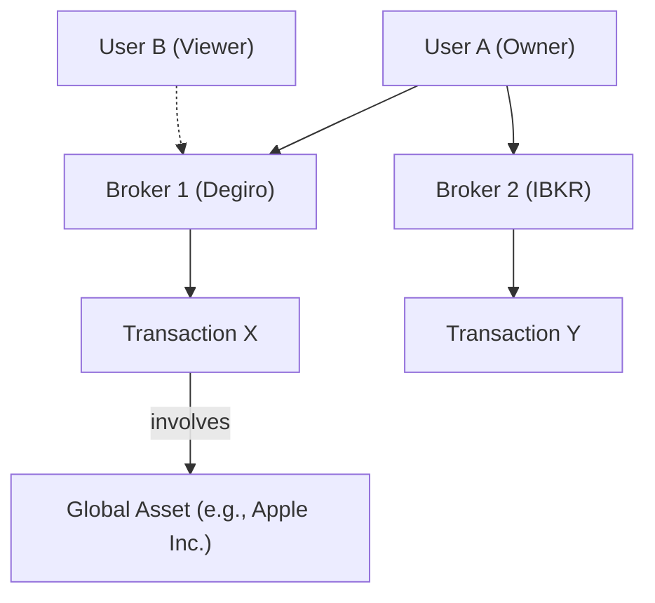

# 👥 Users, Authentication, and Brokers

This section explains the authentication model, user roles, and how data is segregated between users and brokers.

## 🔐 Authentication Model (Session-Based)

LibreFolio uses a secure, **Session-Based Authentication** mechanism using HTTP-only cookies.

### 🔄 How it Works

1. **Login**: The user sends their `username` and `password` to the `/api/v1/auth/login` endpoint.
2. **Session Creation**:
    - The server verifies the credentials (using `bcrypt` hashing).
    - If valid, the server generates a cryptographically strong, random **Session ID** (64 chars).
    - The session data (User ID, creation time, expiration time) is stored **In-Memory** on the server.
3. **Cookie Issuance**: The server responds with a `Set-Cookie` header containing the Session ID.
    - **`HttpOnly`**: The cookie cannot be accessed by JavaScript (prevents XSS token theft).
    - **`SameSite=Lax`**: Provides protection against CSRF attacks.
    - **`Secure`**: (Production only) Ensures the cookie is only sent over HTTPS.
4. **Authenticated Requests**: The browser automatically includes the session cookie in subsequent requests.
5. **Validation**: On every request, the backend checks if the Session ID exists in memory and hasn't expired.

### 💾 Session Storage & TTL

- 🧠 **Storage**: Sessions are currently stored **In-Memory**.
    - ⚠️ *Implication*: Restarting the backend server invalidates all active sessions (users must log in again).
- ⏱️ **TTL (Time To Live)**: The session duration is configurable via the `session_ttl_hours` Global Setting (default: 24 hours).

## 👤 User Roles

There are two system-level user roles in LibreFolio:

1. 👤 **Normal User**:
    - 📝 Can manage their own profile and settings.
    - 🏦 Can create and manage their own brokers.
    - 🤝 Can be granted access to other users' brokers.

2. 👑 **Superuser (Admin)**:
    - ✅ Has all permissions of a normal user.
    - ⚙️ Can manage system-wide **Global Settings**.
    - 🔧 Can manage other users (reset passwords, deactivate accounts) via CLI or API.
    - 🔍 Can access *any* broker and transaction in the system for support purposes.

## 🏗️ User-Broker Mapping and Data Segregation

Data in LibreFolio is segregated based on a clear ownership hierarchy, but allows for flexible sharing via the **Broker Access Control (RBAC)** system.

- 👑 **Ownership**: A **Broker** is created by a **User** (the Owner).
- 🤝 **Sharing**: The Owner can grant access to other users (e.g., User B) with specific roles (Viewer, Editor).
- 💰 **Transactions**: A **Transaction** belongs exclusively to one **Broker**.

### 🛡️ Broker Access Control (RBAC)

Access to brokers is granularly controlled via the `BrokerUserAccess` table.

> 🔗 **Deep Dive**: For a detailed explanation of roles (OWNER, EDITOR, VIEWER) and permissions, see the **[Access Control (RBAC)](access_control.md)** documentation.

### 🌐 Global vs. User-Specific Data

- 👤 **User-Specific**: `User`, `UserSettings`.
- 🏦 **Broker-Specific**: `Broker`, `Transaction`, `BrokerUserAccess`.
- 🌍 **Global**: `Asset`, `PriceHistory`, `FxRate`, `GlobalSettings`.

**Assets** are global because the information about a financial instrument (like Apple stock) is the same for everyone. However, a user's *transactions* involving that asset are
private (scoped to their Broker).
