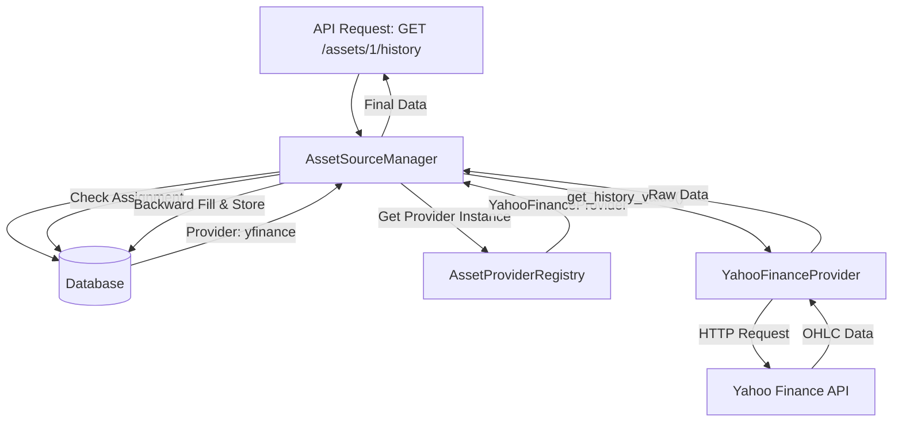

# 💰 Asset Pricing & Metadata Architecture

The Asset system in LibreFolio is responsible for managing financial instruments (Stocks, ETFs, Crypto, etc.), fetching their prices, and maintaining their metadata.

## 🧱 Core Components

### 1️⃣ `AssetSourceManager`

This is the central service that coordinates all asset-related operations. It handles:

- **Provider Assignment**: Linking an asset to a specific provider (e.g., "AAPL" -> "yfinance").
- **Price Fetching**: Delegating price requests to the assigned provider.
- **Backward Filling**: Filling gaps in historical data (e.g., weekends/holidays) with the last known price.
- **Caching**: Storing fetched prices in the `price_history` table to minimize external API calls.

### 2️⃣ `AssetMetadataService`

This service manages the descriptive information about assets.

- **Classification**: Handles `sector_area` and `geographic_area` distributions.
- **Merging**: Merges metadata fetched from providers with existing user-defined data.
- **Patching**: Supports partial updates to asset metadata.

### 3️⃣ `AssetProviderRegistry`

Uses the [Registry Pattern](../../architecture/patterns/registry_pattern.md) to manage available asset providers.

## 🔄 Data Flow: Fetching Prices

## 📊 Backward Fill Logic

Financial markets are closed on weekends and holidays. To provide a continuous price series for charts and calculations, LibreFolio uses a **backward-fill** strategy.

If a price is requested for a date where no data exists (e.g., Sunday), the system looks back to find the most recent available price (e.g., Friday's close) and uses that.

This logic is implemented in `AssetSourceManager._build_backward_filled_series`.
