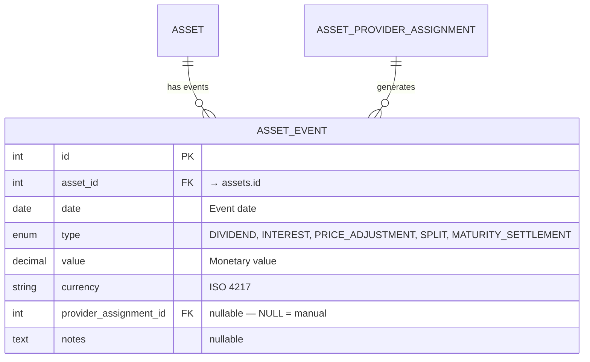

# 📅 Asset Events

Asset events represent significant occurrences that affect an asset's price or generate distributions. They live in the **asset domain**, not the portfolio/transaction domain.

## 📋 Event Types

| &nbsp; | Event Type                    | Effect on Price                    | Who Generates                                        | Description                                    |
|:------:|:------------------------------|:-----------------------------------|:-----------------------------------------------------|:-----------------------------------------------|
| 💰     | **DIVIDEND**                  | Price drops by event value (ex-date) | Provider (yfinance, justetf) or manual              | Cash distribution from equity/ETF              |
| 💵     | **INTEREST**                  | Price drops by event value         | Scheduled Investment (`generate_interest`) or manual | Interest payment from debt/loan. Resets accrued interest |
| 📊     | **PRICE_ADJUSTMENT**          | Algebraic change (+/−)             | Provider or manual                                   | Non-cash value change (write-down, haircut)    |
| ✂️     | **SPLIT**                     | Changes quantity, not total value  | Provider or manual                                   | Stock/unit split                               |
| 🏁     | **MATURITY_SETTLEMENT**       | Final capital return               | Scheduled Investment (`generate_interest`)           | Asset reaches maturity — no further calculations |

---

## 🗃️ Database Model



**No UniqueConstraint** on `(asset_id, date, type)` — auto-generated and manual events can coexist on the same date and type.

**Indexes**: `(asset_id, date)`, `(asset_id, type, date)`, `(provider_assignment_id)`.

---

## 🔄 Dedup Strategy

The sync layer uses `_upsert_asset_events()` to persist events from providers. The dedup logic differentiates between auto-generated and manual events:

### 🤖 Auto-Generated Events (`provider_assignment_id IS NOT NULL`)

During sync, all existing events with the **same `provider_assignment_id`** are deleted, then the new events are inserted. This ensures:

- Re-syncing replaces stale events with fresh ones
- Events from **different** providers for the same asset are independent
- Events from **different** sync runs of the same provider are cleanly replaced

```python
# Simplified logic in _upsert_asset_events()
DELETE FROM asset_events
WHERE asset_id = :asset_id
  AND provider_assignment_id = :provider_assignment_id

INSERT INTO asset_events (...)
VALUES (...new_events...)
```

### ✋ Manual Events (`provider_assignment_id IS NULL`)

Manual events are **never deleted** by the sync process. They survive provider re-syncs, provider changes, and bulk refreshes. Only explicit user deletion removes them.

---

## 🔧 Auto-Generated Events

### 📊 Scheduled Investment: `generate_interest`

When a schedule period has `generate_interest = True`, the Scheduled Investment provider auto-generates:

1. **`INTEREST` events** at each maturation date within the period
2. After each INTEREST event, accrued interest resets: `total_interest = 0`, `event_adjustment = 0` → value returns to `initial_value`

The maturation frequency is controlled by `maturation_frequency` on each interest rate period (DAILY, WEEKLY, MONTHLY, QUARTERLY, SEMIANNUAL, ANNUAL).

### 🏁 `MATURITY_SETTLEMENT`

Auto-generated when:

- The schedule ends **and** `generate_interest = True` on the last period
- **Or** late interest is configured with `generate_interest = True`

After settlement, the engine is "off" — `get_current_value()` returns the settlement value for all future dates.

---

## 📐 Event Impact on Pricing

The Scheduled Investment engine's pricing formula incorporates events:

```
price(d) = initial_value + accrued_interest - Σ(INTEREST events) + Σ(PRICE_ADJUSTMENT events)
```

- Interest is always calculated on `initial_value` (not running value)
- INTEREST events **subtract** from the running price (coupon paid out)
- PRICE_ADJUSTMENT events are **algebraic** (can add or subtract)
- After `MATURITY_SETTLEMENT`, no further calculations occur

---

## 🔗 Related Documentation

- 📊 [Assets & Pricing ER Diagram](../../architecture/database/assets_pricing.md) — Database schema
- 💰 [Asset Architecture](architecture.md) — Sync pipeline and price queries
- 📅 [Scheduled Investment Provider](provider_scheduled_investment.md) — Interest schedule and auto-events
- 📐 [Day Count Conventions](../../../financial-theory/day-count.md) — ACT/365, ACT/360, 30/360

