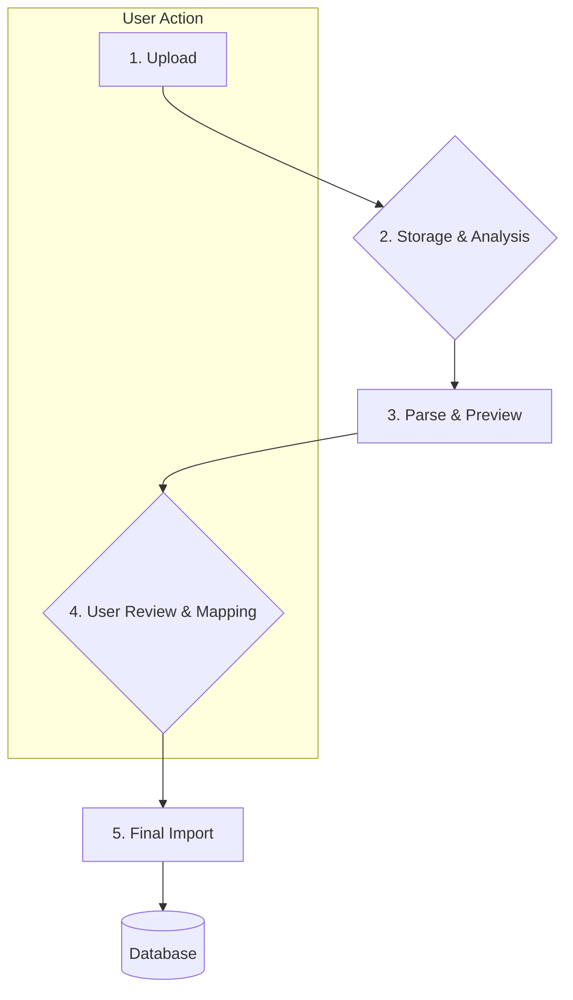

# 📥 BRIM Architecture

**BRIM (Broker Report Import Manager)** is the system responsible for importing transaction data from CSV files exported by various brokers. It is designed to be robust,
user-friendly, and extensible.

## 🔄 The BRIM Workflow

The import process follows a clear, multi-step workflow designed to give the user full control and visibility.

1. **Upload**: The user uploads a CSV file through the frontend.

2. **Storage & Analysis**:
    - The backend saves the file with a unique **UUID** to prevent filename conflicts and path traversal attacks. The original filename is stored in a `.json` metadata sidecar
      file.
    - The file is placed in the `backend/data/broker_reports/uploaded/` directory.
    - BRIM automatically analyzes the file to detect which plugins (`BRIMProvider`) can parse it.

3. **Parse & Preview**:
    - The user selects a compatible plugin from the list.
    - The backend calls the plugin's `parse()` method, which reads the file and converts it into a standardized list of `TXCreateItem` objects.
    - **Crucially, nothing is saved to the database at this stage.**

4. **User Review & Mapping**:
    - The frontend displays the parsed transactions to the user for review.
    - **Asset Mapping**: If the CSV contains new or unrecognized assets, the user is prompted to map them to existing assets in the database or create new ones.
    - **Duplicate Detection**: The system flags potential duplicate transactions, allowing the user to choose whether to skip or import them.

5. **Final Import**:
    - Once the user confirms, the frontend sends the final, validated list of transactions to the backend.
    - The backend uses the standard `TransactionService` to save the transactions to the database.
    - The imported file is moved from the `uploaded/` directory to `parsed/` or `failed/` depending on the outcome.

## 📂 File Lifecycle

BRIM manages imported files by moving them between three directories, ensuring a clear record of the import status.

- `backend/data/broker_reports/`
    - `uploaded/`: New files awaiting processing.
    - `parsed/`: Files that have been successfully imported.
    - `failed/`: Files that failed to parse or were rejected by the user.

Each file is stored with a corresponding `.json` metadata file that tracks its status, original filename, and any errors.

## 🔍 Deduplication Logic

Before final import, BRIM checks for potential duplicates by comparing each parsed transaction against existing transactions in the database based on:

- `broker_id`
- `date`
- `type`
- `quantity`
- `amount`

The system assigns a **match confidence level** to help the user make an informed decision:

- `POSSIBLE`: Key fields match.
- `LIKELY`: Key fields and the description match.
- `POSSIBLE_WITH_ASSET`: Key fields match, and the asset was automatically resolved.
- `LIKELY_WITH_ASSET`: Key fields, description, and the resolved asset all match.
