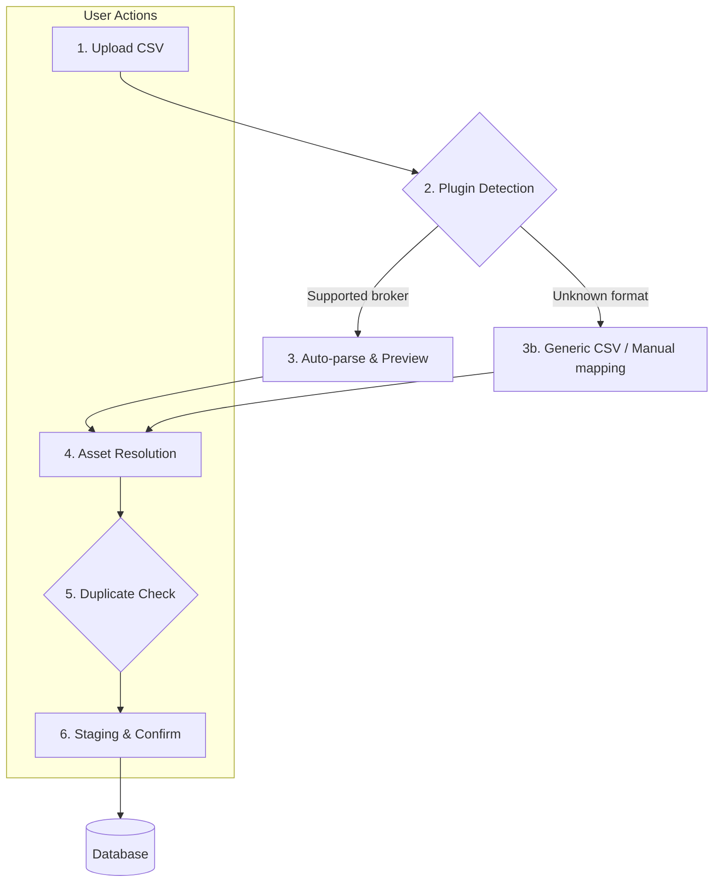

# 📥 BRIM Architecture

**BRIM (Broker Report Import Manager)** is the system responsible for importing transaction data from CSV files exported by various brokers. It is designed to be robust, user-friendly, and extensible.

## 🔄 The BRIM Workflow

The import process follows a clear, multi-step wizard designed to give the user full control and visibility.



### Step-by-step

1. **Upload** — The user uploads a CSV file. It can be dragged into the broker page or accessed from the Files tab.

2. **Plugin Detection** — BRIM scans all installed `BRIMProvider` plugins in priority order. The plugin with the highest confidence match is selected, and alternatives are shown in a dropdown. If no specific plugin matches, the Generic CSV provider is used as fallback.

3. **Parse & Preview** — The selected plugin's `parse()` method converts the file into standardized `TXCreateItem` objects. **Nothing is saved yet.** The user sees a table of parsed transactions before proceeding.

4. **Asset Resolution** — New or unrecognized assets are shown with a resolution dialog. The user can:
   - Map to an existing asset in the database
   - Create a new asset (choosing type: Stock, ETF, Bond, **OTHER**, Crypto, etc.)
   - Skip rows with unresolved assets

5. **Duplicate Detection** — Each parsed transaction is compared against existing rows by `(broker_id, date, type, amount, quantity)`. Matches are flagged with a confidence level so the user can skip or force-import them.

6. **Staging & Confirm** — The user reviews a final staging list. On confirm, the standard `TransactionService` saves the transactions.

---

## 📂 File Lifecycle

```
backend/data/{prod|test}/broker_reports/
├── uploaded/    ← new files awaiting processing
├── parsed/      ← successfully imported files
└── failed/      ← files that failed parsing or were rejected
```

Each file is stored with a companion `.json` metadata sidecar recording status, original filename, and any errors encountered.

---

## 🔍 Deduplication Logic

Before final import, BRIM compares each parsed transaction against the database on:

| Field | Used in match |
|-------|--------------|
| `broker_id` | ✅ |
| `date` | ✅ |
| `type` | ✅ |
| `quantity` | ✅ |
| `amount` | ✅ |
| `description` | Used for confidence upgrade |
| `asset_id` | Used for confidence upgrade |

Confidence levels:

| Level | Meaning |
|-------|---------|
| `POSSIBLE` | Key fields match |
| `LIKELY` | Key fields + description match |
| `POSSIBLE_WITH_ASSET` | Key fields + asset resolved |
| `LIKELY_WITH_ASSET` | Key fields + description + asset all match |

---

## 🧩 Plugin System

Every BRIM plugin is a `BRIMProvider` subclass registered via the provider registry. Key contract:

```python
class MyBrokerProvider(BRIMProvider):
    name = "broker_mybroker"
    detection_priority = 100          # Higher = tried first

    def can_parse(self, file_path) -> float:
        """Return 0.0–1.0 confidence that this file belongs to this broker."""
        ...

    def parse(self, file_path, broker_id) -> list[TXCreateItem]:
        """Convert broker CSV rows into standard TXCreateItem objects."""
        ...
```

Plugins are auto-discovered at startup. See the [BRIM Plugin Guide](../../architecture/patterns/brim_plugin_guide.md) for a complete walkthrough of creating a new plugin.

---

## 🔗 Related

- **[Generic CSV Provider](generic_csv.md)** — Format reference + sign conventions + LLM tip
- **[Providers List](providers_list.md)** — All currently supported brokers
- **[BRIM Plugin Guide](../../architecture/patterns/brim_plugin_guide.md)** — How to write a new broker plugin

