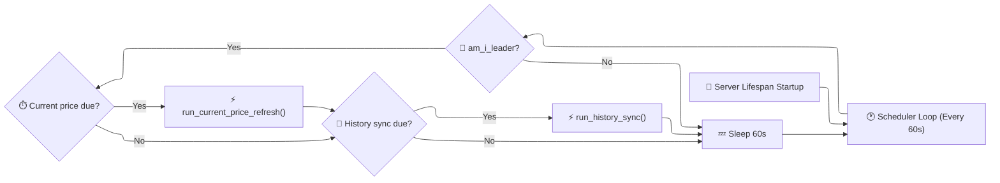

# 🕐 Market Data Scheduler

LibreFolio embeds an automatic background daemon to fetch current prices, historical pricing, and exchange rates without requiring external scheduler systems (like crontab or Celery).

---

## 🏗️ Overview

The scheduler runs as an independent `asyncio.Task` inside the FastAPI lifespan loop. It periodically evaluates whether configured data sync jobs are due.



---

## 🔄 Async Loop Daemon (`scheduler.py`)

The main entry point is `scheduler_loop()` located in `backend/app/services/scheduler/scheduler.py`.

* **Lifespan Task:** It is spawned during FastAPI startup in `backend/app/main.py` using `asyncio.create_task()`.
* **Shutdown Event:** The loop listens to `shutdown_event: asyncio.Event`. When the event is set, it gracefully breaks the loop and completes.
* **Environment Bypass:** The loop will not start if the environment variable `LIBREFOLIO_NO_SCHEDULER=1` is set (e.g. during database migrations or command-line utility operations).

---

## 👑 Leader Election (`leader.py`)

To prevent multiple processes from running duplicate sync jobs in multi-worker environments (e.g. when Gunicorn spawns multiple Uvicorn workers), the scheduler uses a file-lock leader election algorithm:

!!! note "File-Lock Leader Election"

    Only the process holding the lock file `scheduler.lock` in the data directory is allowed to execute job runs.

```python
# Rationale in backend/app/services/scheduler/leader.py
# am_i_leader() checks if the current PID matches the PID saved inside the lock file.
# If the lock file is old or empty, the current process claims it.
```

---

## 💼 Job Definitions (`jobs.py`)

The scheduler runs two types of background synchronization jobs defined in `backend/app/services/scheduler/jobs.py`:

### ⏱️ 1. Current Price Refresh

* **Purpose:** Keeps the current prices of all active portfolio assets up-to-date. This updates the local pricing cache, feeding the frontend `LiveTicker` component.
* **Frequency:** Defined by `scheduler_current_price_frequency_minutes` (default: every 10 minutes).
* **Execution:** Calls `bulk_refresh_prices()` on all assets linked to active portfolios.

### 📅 2. History Sync

* **Purpose:** Synchronizes historical price series (closing prices) for assets and FX rates.
* **Frequency:** Configured for specific days of the week (e.g., `mon,tue,wed,thu,fri,sat`) and times of the day (e.g., `06:00` and `23:00`).
* **Execution:** Queries historical provider feeds (e.g. Yahoo Finance, justETF) over the configured lookback horizon (default: 14 days) to fill missing entries in the database.

---

## 📜 Execution Logs (`joblog.py`)

All executions are written to `logs/scheduler_jobs.jsonl` in the data directory.

* **Format:** Line-delimited JSON objects containing:
  * `timestamp`: ISO timestamp of execution.
  * `job_name`: The executed job name.
  * `status`: `"success"` or `"error"`.
  * `duration`: Execution time in seconds.
  * `details`: Structured payload reporting assets updated, errors encountered, or skipped items.
* **Rotation:** `joblog.py` automatically trims the file when it exceeds 10,000 log lines to prevent disk bloat.

---

## ⚙️ Configuration Integration

Scheduler options are fully integrated into LibreFolio's database-backed Global Settings system. When an administrator modifies settings in the UI:

1. Settings are saved to the `GlobalSetting` table.
2. The frontend triggers a settings reload.
3. The backend scheduler loop loads the settings dynamically on the next loop iteration (every 60 seconds), adapting the polling frequency and execution times instantly without requiring a server restart.

---

## 🔗 Related

* 📡 **[LiveTicker Component Overview](../../frontend/components/features/live-ticker.md)** — Frontend polling component
* 💰 **[Asset Architecture](../assets/architecture.md)** — Pricing provider pipelines and sync steps
* ⚙️ **[Settings System](../settings.md)** — Dynamic global configuration variables
