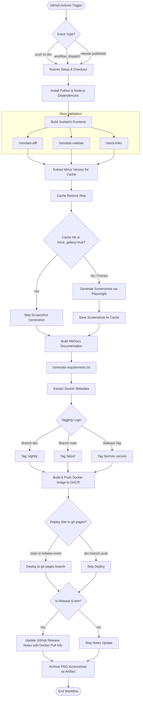

# 🚀 Release & CI/CD Pipeline

This document describes the design, execution flow, files, and automation logic of the LibreFolio Release and CI/CD Pipeline, configured in [.github/workflows/release.yml](file:///Users/ea_enel/Documents/00_My/LibreFolio/.github/workflows/release.yml).

The pipeline is built using GitHub Actions and automates code verification, frontend compilation, documentation builds (including dynamic browser screenshot capture), multi-platform Docker container packaging, and public deployment to GitHub Pages.

---

## 🛠️ Triggers & Workflow Events

The workflow is configured with three distinct triggers:

1. **`release` (published)**: Runs automatically when a new release tag (e.g. `v0.10.0`) is published on GitHub. This is the official production release path.
2. **`push` (dev branch)**: Runs automatically on every push to the `dev` branch. Used for continuous integration and integration testing.
3. **`workflow_dispatch` (manual)**: Allows running the pipeline manually from the GitHub Actions tab. It includes a `force_gallery` input to manually trigger Playwright screenshot updates.

---

## 🔄 Execution Flow Diagram

The following diagram illustrates the complete execution path, branch conditions, caching mechanisms, and release publishing steps:



---

## 📂 Core Commands & Implementation Details

### 1. Verification and Setup
The pipeline prepares the environment by setting up Python 3.13 and Node.js 24, installing dependencies using `pipenv install --dev`, and compiling the SvelteKit frontend:
```bash
pipenv run ./dev.py install
pipenv run ./dev.py front build
```

The documentation files undergo translation consistency checks and cross-reference link verification to ensure no broken relative URLs are published:
```bash
pipenv run ./dev.py mkdocs translate-diff --issues-only
pipenv run ./dev.py mkdocs translate-validate --hide-localized
pipenv run ./dev.py mkdocs check-links
```

### 2. Gallery Screenshot Caching & Generation
Playwright screenshot generation can take a significant amount of time (15–20+ minutes). To optimize this, the pipeline caches images using the **minor version** (e.g. `v0.10`) or the branch name (`dev`) as part of the key.

- **Extraction**: The minor version is computed from the tag or ref:
  ```bash
  TAG_NAME="${{ github.event.release.tag_name }}"
  if [ -z "$TAG_NAME" ]; then TAG_NAME="${{ github.ref_name }}"; fi
  if [[ "$TAG_NAME" =~ ^v[0-9]+\.[0-9]+ ]]; then
    MINOR=$(echo "$TAG_NAME" | cut -d'.' -f1,2)
  else
    MINOR="$TAG_NAME"
  fi
  ```
- **Caching**: The cached screenshots are restored or saved at:
  ```yaml
  uses: actions/cache@v4
  with:
    path: |
      mkdocs_src/docs/gallery/**/*.png
    key: screenshots-${{ steps.minor-version.outputs.val }}-${{ github.run_id }}-${{ github.run_attempt }}
    restore-keys: |
      screenshots-${{ steps.minor-version.outputs.val }}-
  ```
- **Conditional Generation**: The screenshot step runs only if there is a cache miss or if `force_gallery` was selected manually:
  ```yaml
  if: steps.cache-screenshots.outputs.cache-hit != 'true' || github.event.inputs.force_gallery == 'true'
  run: pipenv run ./dev.py mkdocs gallery --workers 8
  ```

### 3. Docker Compilation and Tagging
An image is built from the local [Dockerfile](file:///Users/ea_enel/Documents/00_My/LibreFolio/Dockerfile) containing the FastAPI backend and built SvelteKit client. The image tags are assigned conditionally using `docker/metadata-action` to protect production builds:

- **Tag `latest`**: Enabled only when running on the `main` branch.
- **Tag `nightly`**: Enabled only when running on the `dev` branch.
- **Tag SemVer (e.g. `v0.10.2`)**: Generated automatically from release tags.

These images are pushed to the GitHub Container Registry (`ghcr.io/librefolio/librefolio`).

### 4. Conditional Documentation Deployment
The built static site is pushed to the `gh-pages` branch using the `mkdocs gh-deploy` wrapper in `dev.py`. 
To prevent development changes from polluting the public website, this step runs **only** on `main` branch updates or `release` events:
```yaml
if: github.ref_name == 'main' || github.event_name == 'release'
run: pipenv run ./dev.py mkdocs deploy
```

### 5. Post-Release Automation
If triggered by a release, the pipeline edits the GitHub release notes to append the exact Docker pull instructions:
```bash
gh release edit "$TAG_NAME" --notes-append "$DOCKER_CMD"
```

Finally, generated PNG screenshots (excluding markdown sources) are archived as a workflow run artifact for easy retrieval:
```yaml
uses: actions/upload-artifact@v4
with:
  name: playwright-screenshots
  path: |
    mkdocs_src/docs/gallery/**/*.png
  retention-days: 1
```
