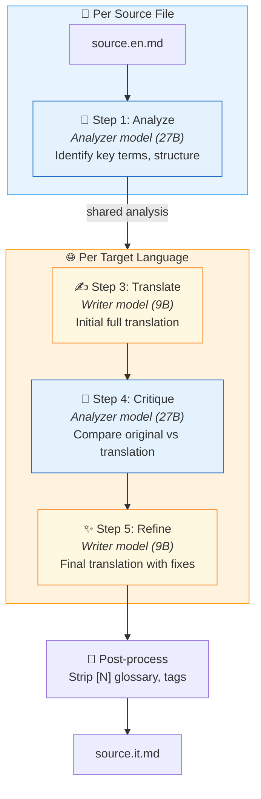
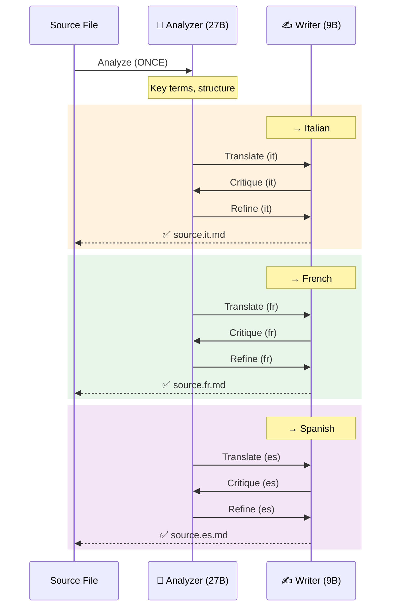
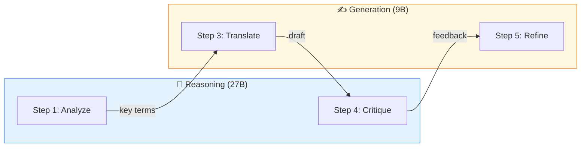

# 🌐 Translation Pipeline

Automated translation of LibreFolio MkDocs documentation into multiple languages using [Aphra](https://github.com/DavidLMS/aphra) — an LLM-based agentic translation workflow. Supports both **cloud** (OpenRouter) and **local** (Ollama) LLM backends.

---

## Overview

The pipeline translates `*.en.md` source files into `it`, `fr`, `es`. The translated files (`*.it.md`, `*.fr.md`, `*.es.md`) are picked up by `mkdocs-static-i18n` (suffix strategy) to build a multilingual documentation site.

| Scope | Files | Translated? |
|-------|-------|:-----------:|
| User Manual | 17 files | ✅ |
| Admin Manual | 6 files | ✅ |
| Financial Theory | 7 files (LaTeX) | ✅ |
| Gallery | 3 files | ✅ |
| Root (Home, FAQ, Credits) | 3 files | ✅ |
| Developer Manual | ~45 files | ❌ EN-only |
| POC UX | 1 file | ❌ EN-only |

**Total**: ~36 source files → ~108 translated files (3 languages)

---

## Architecture

```
mkdocs_src/aphra-pipeline/
├── .env                    # API key + model config (gitignored)
├── .env.example            # Template for contributors
├── .gitignore              # Ignores .env, config.toml, cache
├── README.md               # Quick-start guide
└── translate_docs.py       # Orchestration script (integrated with dev.py)
```

The script integrates with `dev.py` via `register_subparser()`, adding:

- `./dev.py mkdocs translate` — run translations
- `./dev.py mkdocs translate-check` — verify setup

---

## Workflow: Shared Analysis

The key optimization over vanilla Aphra: **Step 1 (Analyze) runs once per source file** and its result is shared across all target languages. This saves ~25% of LLM calls when translating to 3 languages.



!!! note "Step 2 (Search) skipped by default"
    Aphra's optional web search step adds cost ($4/1000 queries via OpenRouter `:online` plugin) and latency. It's disabled by default for technical documentation where terms are well-known.

### Multi-language flow

When translating to 3 languages, the full flow for one file is:



**Savings**: 1 Analyze call instead of 3 = **−67% analyze calls** across 3 languages.

---

## Model Roles

The pipeline splits LLM work into two categories, allowing different models for different tasks:

| Category | Steps | Env Variable | Recommended |
|----------|-------|-------------|-------------|
| **Reasoning** | Analyze + Critique | `APHRA_ANALYZER` | Larger model (27B) |
| **Generation** | Translate + Refine | `APHRA_MODEL` / `APHRA_WRITER` | Faster model (9B) |



### Priority hierarchy

```
APHRA_ANALYZER  → defaults to APHRA_WRITER → APHRA_MODEL → hardcoded default
APHRA_WRITER    → defaults to APHRA_MODEL → hardcoded default
APHRA_CRITIQUER → defaults to APHRA_ANALYZER (reasoning task)
APHRA_SEARCHER  → defaults to APHRA_MODEL → hardcoded default
```

---

## How We Customized Aphra

Aphra is used as a library, not via its CLI. We bypass `aphra.translate()` to gain control over several aspects:

### 1. Config path injection

Aphra's `translate()` passes `config.toml` to `LLMModelClient` (API key) but **not** to `workflow.load_config()`. Without our fix, the workflow loads its internal `default.toml` with expensive defaults (Claude Sonnet 4 + Perplexity Sonar).

**Fix**: Call `workflow.load_config(global_config_path=config_path)` directly.

### 2. Base URL override (Ollama support)

`LLMModelClient.__init__` hardcodes `base_url="https://openrouter.ai/api/v1"`. We patch `model_client.client.base_url` after construction to point to Ollama or any OpenAI-compatible endpoint.

### 3. Shared analysis across languages

Vanilla Aphra analyzes the source text once per translation call. We extract the Analyze step and reuse its result across all target languages for the same file.

### 4. Per-step model swapping

We modify `workflow_config['writer']` at runtime between steps:

- Before **Analyze**: set to `models['analyzer']` (27B reasoning)
- Before **Translate/Refine**: set to `models['writer']` (9B generation)
- **Critique** uses `models['critiquer']` (defaults to analyzer)

### 5. Web search bypass

Step 2 (Search) uses OpenRouter's `:online` plugin which costs $4/1000 results. We skip it entirely for technical docs via `APHRA_WEB_SEARCH=false`.

### 6. Post-processing cleanup

Aphra's output contains artifacts we strip automatically:

- `<translation>` / `</translation>` wrapper tags
- Inline glossary markers `[N]` (preserving markdown links)
- Glossary definition blocks at the end of the file

---

## Configuration

### Local mode (Ollama)

```env
APHRA_BASE_URL=http://localhost:11434/v1
APHRA_ANALYZER=kwangsuklee/Qwen3.5-27B-Claude-4.6-Opus-Reasoning-Distilled-GGUF
APHRA_MODEL=kwangsuklee/Qwen3.5-9B-Claude-4.6-Opus-Reasoning-Distilled-GGUF
APHRA_WEB_SEARCH=false
```

Install Ollama and pull models:

```bash
brew install ollama   # macOS
ollama pull kwangsuklee/Qwen3.5-27B-Claude-4.6-Opus-Reasoning-Distilled-GGUF
ollama pull kwangsuklee/Qwen3.5-9B-Claude-4.6-Opus-Reasoning-Distilled-GGUF
```

### Cloud mode (OpenRouter)

```env
# APHRA_BASE_URL=        ← commented out = cloud mode
OPENROUTER_API_KEY=sk-or-v1-your-key-here
APHRA_MODEL=google/gemini-2.5-flash
```

### Usage

```bash
# Check setup
./dev.py mkdocs translate-check

# Dry run (shows plan + estimated tokens)
./dev.py mkdocs translate --dry-run

# Translate specific files
./dev.py mkdocs translate --file faq.en.md --lang it

# Translate entire folder (glob)
./dev.py mkdocs translate --file 'user/**/*.en.md' --lang it fr es

# Translate all (skips cached)
./dev.py mkdocs translate
```

---

## Caching

The pipeline caches **source file MD5 hashes** in `.translate-hashes.json` to skip unchanged files between runs. If a source `.en.md` hasn't changed, all its translations are skipped.

Use `--force` to ignore the cache and re-translate everything.

