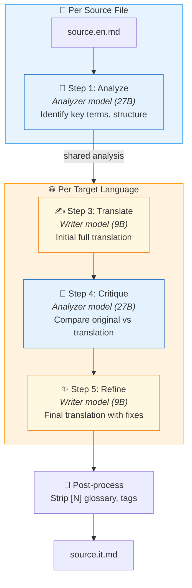
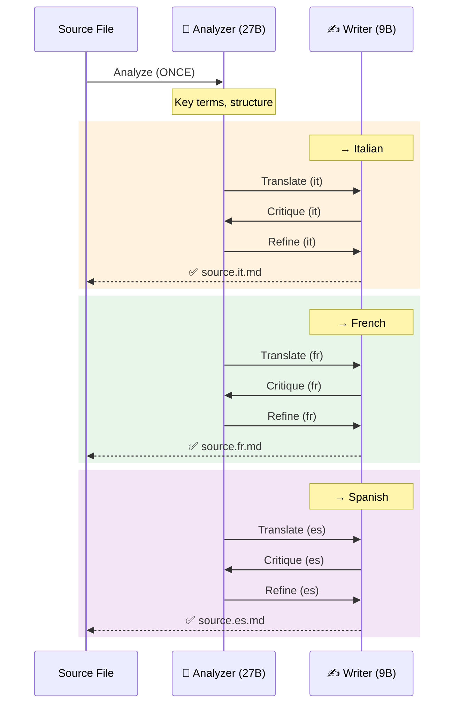
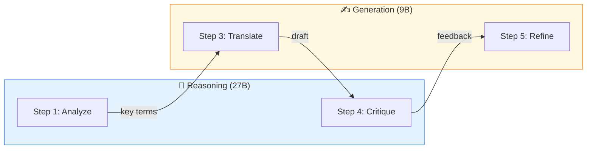
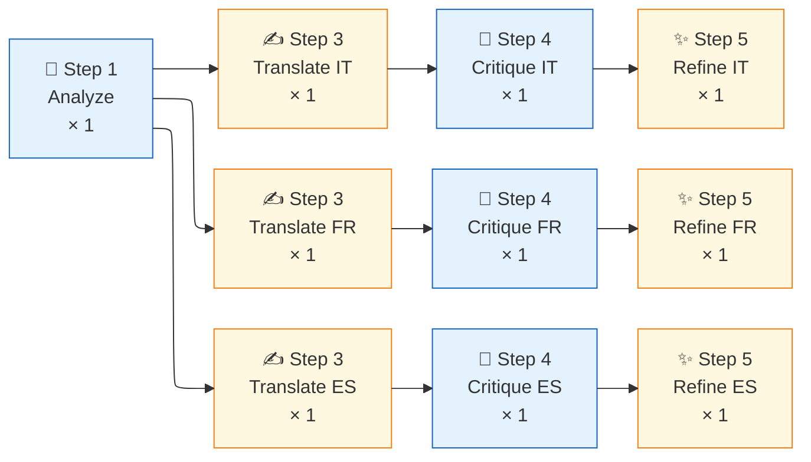

 # 🌐 Translation Pipeline

Automated translation of LibreFolio MkDocs documentation into multiple languages using [Aphra](https://github.com/DavidLMS/aphra) — an LLM-based agentic translation workflow. Supports both **cloud** (OpenRouter) and **local** (Ollama) LLM backends.

---

## Overview

The pipeline translates `*.en.md` source files into `it`, `fr`, `es`. The translated files (`*.it.md`, `*.fr.md`, `*.es.md`) are picked up by `mkdocs-static-i18n` (suffix strategy) to build a multilingual documentation site.

| Scope | Files | Translated? |
|-------|-------|:-----------:|
| User Manual | 17 files | ✅ |
| Admin Manual | 6 files | ✅ |
| Financial Theory | 7 files (LaTeX) | ✅ |
| Gallery | 3 files | ✅ |
| Root (Home, FAQ, Credits) | 3 files | ✅ |
| Developer Manual | ~45 files | ❌ EN-only |
| POC UX | 1 file | ❌ EN-only |

**Total**: ~36 source files → ~108 translated files (3 languages)

---

## Architecture

```
mkdocs_src/aphra-pipeline/
├── .env                    # API key + model config (gitignored)
├── .env.example            # Template for contributors
├── .gitignore              # Ignores .env, config.toml, cache
├── README.md               # Quick-start guide
└── translate_docs.py       # Orchestration script (integrated with dev.py)
```

The script integrates with `dev.py` via `register_subparser()`, adding:

- `./dev.py mkdocs translate` — run translations
- `./dev.py mkdocs translate-check` — verify setup

---

## Workflow: Shared Analysis

The key optimization over vanilla Aphra: **Step 1 (Analyze) runs once per source file** and its result is shared across all target languages. This saves ~25% of LLM calls when translating to 3 languages.



!!! note "Step 2 (Search) skipped by default"

    Aphra's optional web search step adds cost ($4/1000 queries via OpenRouter `:online` plugin) and latency. It's disabled by default for technical documentation where terms are well-known.

### Multi-language flow

When translating to 3 languages, the full flow for one file is:



**Savings**: 1 Analyze call instead of 3 = **−67% analyze calls** across 3 languages.

---

## Model Roles

The pipeline splits LLM work into two categories, allowing different models for different tasks:

| Category | Steps | Env Variable | Recommended |
|----------|-------|-------------|-------------|
| **Reasoning** | Analyze + Critique | `APHRA_ANALYZER` | Larger model (27B) |
| **Generation** | Translate + Refine | `APHRA_MODEL` / `APHRA_WRITER` | Faster model (9B) |



### Priority hierarchy

```
APHRA_ANALYZER  → defaults to APHRA_WRITER → APHRA_MODEL → hardcoded default
APHRA_WRITER    → defaults to APHRA_MODEL → hardcoded default
APHRA_CRITIQUER → defaults to APHRA_ANALYZER (reasoning task)
APHRA_SEARCHER  → defaults to APHRA_MODEL → hardcoded default
```

---

## How We Customized Aphra

Aphra is used as a library, not via its CLI. We bypass `aphra.translate()` to gain control over several aspects:

### 1. Config path injection

Aphra's `translate()` passes `config.toml` to `LLMModelClient` (API key) but **not** to `workflow.load_config()`. Without our fix, the workflow loads its internal `default.toml` with expensive defaults (Claude Sonnet 4 + Perplexity Sonar).

**Fix**: Call `workflow.load_config(global_config_path=config_path)` directly.

### 2. Base URL override (Ollama support)

`LLMModelClient.__init__` hardcodes `base_url="https://openrouter.ai/api/v1"`. We patch `model_client.client.base_url` after construction to point to Ollama or any OpenAI-compatible endpoint.

### 3. Shared analysis across languages

Vanilla Aphra analyzes the source text once per translation call. We extract the Analyze step and reuse its result across all target languages for the same file.

### 4. Per-step model swapping

We modify `workflow_config['writer']` at runtime between steps:

- Before **Analyze**: set to `models['analyzer']` (27B reasoning)
- Before **Translate/Refine**: set to `models['writer']` (9B generation)
- **Critique** uses `models['critiquer']` (defaults to analyzer)

### 5. Web search bypass

Step 2 (Search) uses OpenRouter's `:online` plugin which costs $4/1000 results. We skip it entirely for technical docs via `APHRA_WEB_SEARCH=false`.

### 6. Post-processing cleanup

Aphra's output contains artifacts we strip automatically:

- `<translation>` / `</translation>` wrapper tags
- Inline glossary markers `[N]` (preserving markdown links)
- Glossary definition blocks at the end of the file

---

## Configuration

### Local mode (Ollama)

```env
APHRA_BASE_URL=http://localhost:11434/v1
APHRA_ANALYZER=kwangsuklee/Qwen3.5-27B-Claude-4.6-Opus-Reasoning-Distilled-GGUF
APHRA_MODEL=kwangsuklee/Qwen3.5-9B-Claude-4.6-Opus-Reasoning-Distilled-GGUF
APHRA_WEB_SEARCH=false
```

Install Ollama and pull models:

```bash
brew install ollama   # macOS
ollama pull kwangsuklee/Qwen3.5-27B-Claude-4.6-Opus-Reasoning-Distilled-GGUF
ollama pull kwangsuklee/Qwen3.5-9B-Claude-4.6-Opus-Reasoning-Distilled-GGUF
```

### Cloud mode (OpenRouter)

```env
# APHRA_BASE_URL=        ← commented out = cloud mode
OPENROUTER_API_KEY=sk-or-v1-your-key-here
APHRA_MODEL=google/gemini-2.5-flash
```

### Usage

```bash
# Check setup
./dev.py mkdocs translate-check

# Dry run (shows plan + estimated tokens)
./dev.py mkdocs translate --dry-run

# Translate specific files
./dev.py mkdocs translate --file faq.en.md --lang it

# Translate entire folder (glob)
./dev.py mkdocs translate --file 'user/**/*.en.md' --lang it fr es

# Translate all (skips cached)
./dev.py mkdocs translate
```

### 🦋 Cloud mode — Doubleword.ai (Autobatcher / Flex Queue)

[Doubleword.ai](https://app.doubleword.ai) provides an OpenAI-compatible API with a
**flex queue** pricing model: requests are batched and processed at reduced rates during
off-peak periods, making it significantly cheaper than synchronous cloud inference.

Configure `.env`:

```env
APHRA_BASE_URL=https://api.doubleword.ai/v1
DOUBLEWORD_API_KEY=dw-your-key-here
APHRA_MODEL=google/gemma-4-31B-it

# Optional: lower from 4h default if you prefer faster failure + retry
# DOUBLEWORD_QUEUE_TIMEOUT=14400
```

Run with parallel language branches for maximum throughput:

```bash
./dev.py mkdocs translate --workers 3
```

!!! info "Model recommendation"

    `google/gemma-4-31B-it` is the recommended model for Doubleword — it balances
    translation quality and cost. Because Doubleword uses flex pricing, you can use a
    single model for all 4 roles without worrying about per-step cost differences.

#### How queue scheduling works with the 4-step pipeline

Aphra's workflow makes **one LLM call per step**. Each call to `DoublewordClient.call_model()`
becomes one independent request submitted to Doubleword's flex queue via `autobatcher`.

For a single file translated into 3 languages, the pipeline submits **10 requests total**:



!!! tip "Greedy parallel execution with `--workers`"

    Use `--workers 3` to translate IT, FR, ES **in parallel** via independent threads.
    Each language branch advances to its next step as soon as it finishes the current
    one — without waiting for the other languages:

    ```
    Thread IT: [Translate]──→[Critique]──→[Refine]     ← finishes first
    Thread FR:    [Translate]────→[Critique]──→[Refine]
    Thread ES:       [Translate]──────→[Critique]──→[Refine]
    ```

    Each step is a **new, independent conversation** — Doubleword has no context window
    continuity between steps. This is by design: Aphra's prompts are self-contained and
    include all necessary context (source text, analysis, prior translation) in each
    individual request.

#### Technical: sync shim over async autobatcher (thread-safe)

Aphra's `call_model()` interface is fully synchronous. `autobatcher.AsyncOpenAI` is async.
`DoublewordClient` bridges both while remaining thread-safe for `--workers`:

```python
# In translate_docs.py — DoublewordClient.call_model()
# A new AsyncOpenAI client is created per call so each thread
# gets its own event loop + client (httpx.AsyncClient is not
# safe to share across asyncio.run() boundaries).
async def _call() -> str:
    client = AsyncOpenAI(api_key=api_key, base_url=base_url)  # per-call
    response = await client.chat.completions.create(
        model=writer_model,
        messages=[{"role": "user", "content": prompt}],
    )
    return response.choices[0].message.content or ""

# asyncio.wait_for enforces DOUBLEWORD_QUEUE_TIMEOUT (default 4h)
result = asyncio.run(asyncio.wait_for(_call(), timeout=timeout_s))

```

`asyncio.run()` creates a fresh event loop per call, which is safe in Python 3.10+.
The `autobatcher` library handles queue submission and polling transparently.

---

## Caching

The pipeline caches **source file MD5 hashes** in `.translate-hashes.json` to skip unchanged files between runs. If a source `.en.md` hasn't changed, all its translations are skipped.

Use `--force` to ignore the cache and re-translate everything.

---

## Prettier Compatibility

### The Problem

Prettier uses the **remark** parser (CommonMark). In CommonMark, `!!! info "title"` is an unknown construct — admonitions don't exist. Prettier treats the 4-space indented body as "continuation text" and **strips the indentation**, breaking the admonition box:

```markdown
<!-- BEFORE Prettier -->
!!! note "Title"
    Content inside the box.     ← 4 spaces (INSIDE the box)

<!-- AFTER Prettier — BROKEN -->
!!! note "Title"
Content inside the box.         ← 0 spaces (OUTSIDE the box)
```

`tabWidth: 4` does NOT fix this — it only controls tab→space conversion, not paragraph indentation preservation.

### The Solution

Add an **empty line** between the directive and the indented body. With the empty line, Prettier leaves the block completely untouched, and MkDocs renders identically:

```markdown
<!-- ✅ CORRECT — survives Prettier unchanged -->
!!! note "Title"

    Content inside the box.
    Second line.

<!-- ❌ WRONG — Prettier will strip indentation -->
!!! note "Title"
    Content inside the box.
    Second line.
```

This applies to both `!!!` (admonitions) and `???` (collapsible details).

### Automated Checks

The empty-line rule is enforced at three levels:

| Check | Where | Severity | Description |
|-------|-------|----------|-------------|
| **Pre-build warning** | `dev.py` → `_check_admonition_empty_lines()` | ⚠️ Warning | Runs before every `./dev.py mkdocs build`. Scans all `.md` files and warns if any admonition is missing the empty line. |
| **Translation validation** | `validate_translations.py` → `admonition-empty-line` | ⚠️ WARN | Checks translated files during `./dev.py mkdocs translate-validate`. |
| **Structural diff (critic)** | `translate_docs.py` → `_structural_diff()` → `ADMONITION_EMPTY_LINE` | Info to LLM | Injected into the Step 4 (Critique) context so the critic LLM can flag and fix the issue during refinement. |

