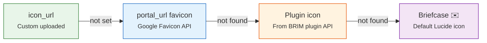

# 📝 Broker Forms

Form and input components for broker creation and editing.

---

## BrokerForm

The create/edit form for a broker. Used inside `BrokerModal`.

    

### Fields

| Field | Component | Required | Description |
|-------|-----------|----------|-------------|
| **Name** | Text input | ✅ | Broker display name |
| **Description** | Textarea | ❌ | Optional description |
| **Base Currency** | [CurrencySearchSelect](../select.md#currencysearchselect) | ✅ | Default currency for cash tracking |
| **Portal URL** | Text input | ❌ | Broker website (used for favicon fallback) |
| **Icon** | [ImagePickerWrapper](../file-upload.md) | ❌ | Custom broker icon |
| **Default Plugin** | [ImportPluginSelect](../select.md#importpluginselect) | ❌ | Default BRIM parser for this broker |
| **Allow Overdraft** | Toggle | ❌ | Allow negative cash balance |

### Validation

- **Name**: Required, minimum 1 character
- **Currency**: Required, must be a valid ISO 4217 code

---

## BrokerIcon

A smart icon component with a **4-step fallback chain**:

### Sizes

| Size | Dimensions | Used in |
|------|-----------|---------|
| `sm` | 24×24 px | Inline references, select options |
| `md` | 32×32 px | BrokerCard, list items |
| `lg` | 48×48 px | Broker detail page header |

### Key Props

| Prop | Type | Description |
|------|------|-------------|
| `iconUrl` | `string \| null` | Custom icon URL (step 1) |
| `portalUrl` | `string \| null` | Broker website for favicon (step 2) |
| `pluginCode` | `string \| null` | BRIM plugin code for icon (step 3) |
| `size` | `'sm' \| 'md' \| 'lg'` | Icon size |
| `altText` | `string` | Accessible alt text |

**Used by**: [BrokerCard](cards.md), [BrokerSearchSelect](../select.md#brokersearchselect), broker detail page.

