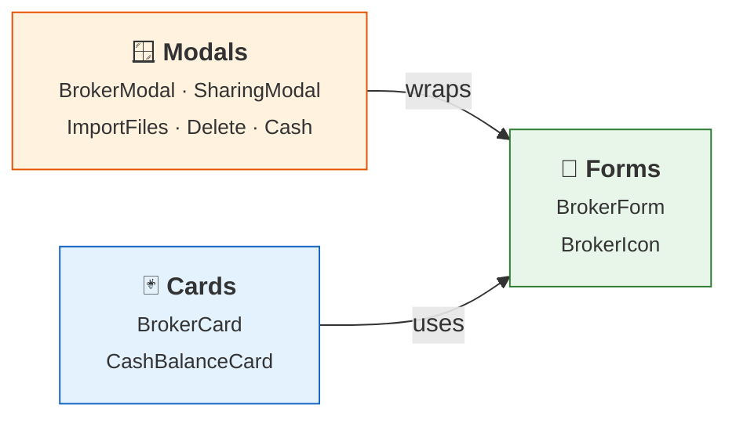

# 🏦 Broker Components

Components in `lib/components/brokers/` that power the broker management UI.

## 📖 Overview

Each sub-section has its own detailed composition diagram. See the pages below.

## 📑 Sub-sections

| Section | Components | Description |
|---------|-----------|-------------|
| **[Cards](cards.md)** | BrokerCard, CashBalanceCard | Display components for broker list and detail |
| **[Forms](forms.md)** | BrokerForm, BrokerIcon | Create/edit form and smart icon with fallback |
| **[Modals](modals.md)** | BrokerModal, BrokerSharingModal, BrokerImportFilesModal, DeleteBrokerDialog, CashTransactionModal | All broker-related modal dialogs |

All modals extend [ModalBase](../ui-base/modals.md) from the UI Base components.
