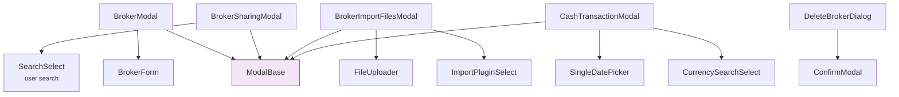

# 🪟 Broker Modals

All broker-related modal dialogs. Each extends [ModalBase](../ui-base/modals.md).

---

## ✏️ BrokerModal

Modal wrapper for creating or editing a broker.

- **Create mode**: Empty form, calls `POST /brokers` on save
- **Edit mode**: Pre-fills [BrokerForm](forms.md) with existing data, calls `PATCH /brokers/{id}`
- Shows [InfoBanner](../ui-base/feedback.md#infobanner) for validation errors
- Closes on successful save and emits `created` or `updated` event

### 📋 Props

| Prop | Type | Description |
|------|------|-------------|
| `broker` | `BrokerRead \| null` | `null` = create mode, object = edit mode |
| `isOpen` | `boolean` | Modal visibility |

---

## 🤝 BrokerSharingModal

Modal for managing broker sharing with RBAC permissions.

    

### ⚡ Features

- **User search** via [SearchSelect](../select.md#searchselect) — find users to share with
- **Role assignment**: dropdown to select Owner, Editor, or Viewer
- **Share percentage** — ownership percentage (0-100%) for portfolio aggregation calculations (e.g., 50% for joint accounts)
- **Access list** — shows all users with access, with inline role editing and removal
- **Role badges** with color coding

### 🌐 API Calls

- `GET /brokers/{id}/access` — load current access list
- `PUT /brokers/{id}/access` — save updated access list

See [Broker Sharing (User Guide)](../../../../user/brokers/sharing.md) and [Access Control (RBAC)](../../../architecture/access_control.md) for details.

---

## 📥 BrokerImportFilesModal

Modal for importing broker report files via the BRIM system.

### ⚡ Features

- **Plugin selection** via [ImportPluginSelect](../select.md#importpluginselect) — choose the parser for this broker's CSV/Excel format
- **File upload** with drag & drop via [FileUploader](../file-upload.md)
- Preview of uploaded files with status indicators
- Triggers BRIM parsing pipeline on submit

### 🌐 API Calls

- `POST /brim/upload` — upload file
- `POST /brim/files/{id}/parse` — trigger parsing

For details on the BRIM plugin system, see [Registry & Plugin System](../../../architecture/patterns/registry_pattern.md).

---

## 🗑️ DeleteBrokerDialog

A [ConfirmModal](../ui-base/modals.md#confirmmodal) for broker deletion.

- Shows broker name in the warning message
- Warns about irreversible data loss (transactions, reports, access)
- Requires explicit click on "Delete" to confirm
- Calls `DELETE /brokers` with broker ID

---

## 💰 CashTransactionModal

Modal for recording cash operations.

### Fields

| Field | Type | Description |
|-------|------|-------------|
| **Type** | Radio | Deposit or Withdrawal |
| **Amount** | Number input | Transaction amount |
| **Currency** | [CurrencySearchSelect](../select.md#currencysearchselect) | Transaction currency |
| **Date** | [SingleDatePicker](../ui-base/datePickers.md#singledatepicker) | Transaction date |
| **Notes** | Textarea | Optional description |

### API Call

- `POST /transactions` — creates a DEPOSIT or WITHDRAWAL transaction linked to this broker.
