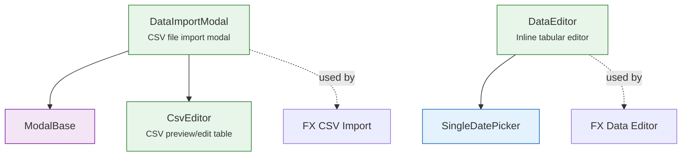

# ✏️ Datapoint Editor Components

Inline editing and CSV import components for financial datapoints. Located in `lib/components/ui/data-editor/`.

---

## ✏️ DataEditor

An **inline tabular editor** for structured data (add, edit, delete rows).

- Editable cells with type-aware inputs (text, number, date)
- Add row button with empty row template
- Delete row with confirmation
- Validation per cell with error highlighting

**Used by**: FX Data Editor section (editing individual rates on the FX detail page).

---

## 📄 CsvEditor

A **CSV preview and editor** with column detection and per-row validation.

- Parses CSV content and displays as table
- Detects separator (`;`, `,`, `\t`) and header row
- Highlights rows with errors (red) or warnings (yellow)
- Editable cells for manual correction

**Used by**: `DataImportModal` (FX CSV import preview).

---

## 📥 DataImportModal

A **modal for importing data from CSV files**. Extends [ModalBase](modals.md).

- Drag & drop file upload zone
- Direction bar for FX pair direction (with swap button)
- Uses `CsvEditor` for preview
- Validation summary before import

**Used by**: FX detail page — "Import CSV" action. See [FX CSV Import](../../../../user/fx/detail/data-editor.md) for user documentation.
