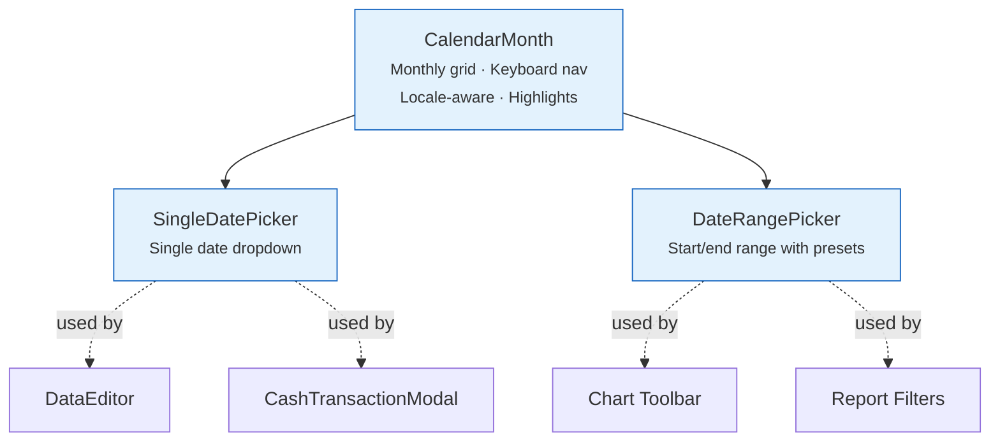

# 📅 Date Picker Components

Date selection components built on a shared `CalendarMonth` grid.

---

## 📅 CalendarMonth

A **monthly calendar grid** component — the visual building block for date pickers.

- Displays a single month with day cells
- Highlights today, selected date, and date range
- Keyboard navigation within the grid
- Locale-aware (week starts on Monday for most locales)

**Used by**: `SingleDatePicker`, `DateRangePicker`.

---

## 📆 SingleDatePicker { #singledatepicker }

A **single-date picker** dropdown with calendar.

- Opens a `CalendarMonth` in a dropdown
- Manual text input with date parsing
- Month/year navigation with arrows
- Formats date according to locale

**Used by**: [DataEditor](data-editor.md) (FX rate date), [CashTransactionModal](../brokers/modals.md), transaction forms.

---

## 📅 DateRangePicker

A **date range picker** with start and end dates.

- Two `CalendarMonth` grids side by side (current + next month)
- Visual highlight of selected range
- Preset ranges: Last 7 days, Last 30 days, Last year, All time
- Start and end date text inputs

**Used by**: Chart toolbar (FX detail page), report filters.

